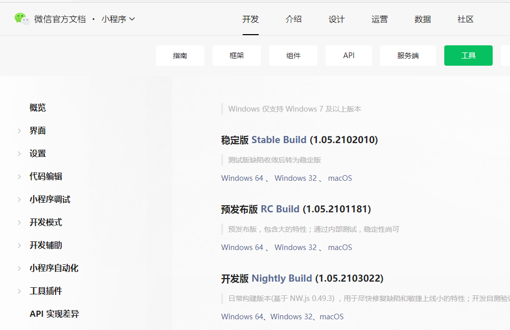
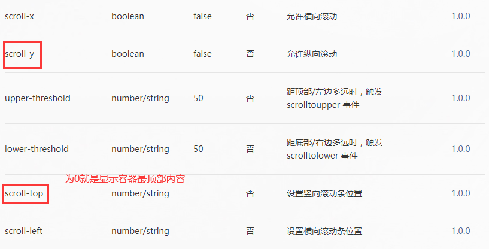

https://mp.weixin.qq.com/ 小程序页面
https://mp.weixin.qq.com/wxopen/waregister?action=step1  小程序注册页面

## 1、环境准备

### 1.1注册账号

建议使用全新的邮箱，没有注册过其他小程序或者公众号的。

### 1.2获取APPID

由于后期调⽤微信⼩程序的接⼝等功能，需要索取开发者的⼩程序中的 APPID ，所以在注册成功后， 可登录，然后获取APPID。


### 1.3开发者工具

在小程序文档里面下载



微信⼩程序⾃带开发者⼯具，集 开发 预览 调试 发布 于⼀⾝的 完整环境。 但是由于编码的体验不算好，因此 建议使⽤ vs code + 微信小程序编辑工具 来实现编码 **vs code 负责敲代码， 微信编辑工具 负责预览**

### 1.4vscode小程序开发插件


## 2、小程序结构目录


 

页面文件夹pages，json文件是配置项，其他是结构、样式、逻辑。utils文件夹存放的是工具js

app.js是入口文件

app.json全局配置文件

app.wxss全局样式文件

project.config.json相当于package.json文件

sitemap.json配置小程序及其页面能否被微信索引（是否能在微信中搜索到，发布的时候使用）

### 2.1配置文件.json

HexColor:#454545

#### 2.1.1全局配置文件app.json

```json

{ 
"pages":[
    "pages/index/index",//都使用绝对路径
    "pages/logs/logs"
 ],
  "window":{
    "navigationBarBackgroundColor": "#fff",//导航栏背景颜色
    "navigationBarTitleText": "WeChat",//导航栏上面的标题
    "navigationBarTextStyle":"black",//导航栏文字颜色，只能black/white
    "enablePullDownRefresh":true,//全局下拉刷新，默认false
    "backgroundTextStyle":"light",//下拉刷新时loading的文字颜色，仅支持 dark / light
    "backgroundColor":"#454545"//下拉窗口背景色，必须是hexcolor
 },
  "tabBar": {
      //底部导航栏设置
    "list": [
      {
        "pagePath": "pages/index/index",//点击就跳转到这个页面
        "text": "首页",//名字
        "iconPath": "icon/_home.png",//未选中时的图标样式
        "selectedIconPath": "icon/home.png"//选中时的图标样式
      },
      {
        "pagePath": "pages/img/img",
        "text": "图片",
        "iconPath": "icon/_img.png",//绝对路径
        "selectedIconPath": "icon/img.png"
      }
    ],
  "color": "#0094ff",
  "selectedColor":"#554584"
  }
}
```

1.pages 字段⸺⽤于描述当前⼩程序所有⻚⾯路径，这是为了让微信客⼾端知道当前你的⼩程序 ⻚⾯定义在哪个⽬录。

​	在微信小程序开发者工具里面对这里进行添加新页面可以直接在pages文件夹下添加页面文件夹，注意：最后面的index没有后缀名，**想默认显示哪一个页面，就把那个页面放在pages数组的最前面**，当前默认显示index页面

2.window 字段⸺定义⼩程序所有⻚⾯的顶部背景颜⾊，⽂字颜⾊定义等。

3.tabbar字段，底部导航栏设置

​	其中 list 接受一个数组，**只能配置最少 2 个、最多 5 个 tab**。tab 按数组的顺序排序，每个项都是一个对象

​	position属性设置tabBar 的位置，仅支持 `bottom` / `top`，如果在top，则不显示图标，

#### 2.1.2页面.json配置文件

可以配置每个页面导航的样式，还可以使用自定义组件usingComponents属性，

```json
{
  "usingComponents": {},
  "navigationBarBackgroundColor": "#949494",
  "navigationBarTitleText": "img页面",
  "navigationBarTextStyle":"white"
}
```

## 3、语法

### 数据类型

- `number` ： 数值
- `string` ：字符串
- `boolean`：布尔值
- `object`：对象
- `function`：函数
- `array` : 数组
- `date`：日期
- `regexp`：正则

### 运算

在花括号中可以进行表达式运算，指的是简单的加减乘除、拼接、逻辑运算、三元运算，但是不能使用复杂的代码片段例如if else，for等

```wxml
<view>
    {{100%5===0?'是的':'不是'}}
</view>
```

### 列表渲染  wx:for

```html
<!--列表渲染-->
<!--wx:for 循环
数组循环：
wx:for-item="item" wx:for-index="index" 值和索引，如果不写小程序也会自动值和索引设置为item和index，所以只有一层嵌套循环的话可以不写
wx:key属性是字符串是一定要是元素中唯一的属性（该属性不相同），例item.id
否则你就要使用wx:key="*this"

对象循环：
item代表属性值和index代表属性名
wx:for-item="value" wx:for-index="key"这样写最好
-->
<view wx:for="{{list}}" wx:for-item="item" wx:for-index="index" wx:key="id"><!-- 这里key使用的id属性，是自动在item里面寻找的id属性-->
    <view>
        值：{{item.name}},索引：{{index}}
    </view>
</view>
<view wx:for="{{obj}}" wx:for-item="value" wx:for-index="key" wx:key="*this">
    <view>
        属性值：{{value}},属性名：{{key}}
    </view>
</view>
```

### 条件渲染  wx:if 和 hidden属性

```js
  <view wx:if="{{false}}">1</view>
  <view wx:elif="{{true}}">2</view>
  <view wx:else>3</view>
```

hidden属性

1.直接加上hidden就可以隐藏

2.hidden="{{true}}"


wx:if是直接把元素删掉来隐藏元素，而hidden属性是通过加上display：none属性来隐藏，所以如果频繁切换现实和隐藏就是用hidden属性，不频繁可以使用wx:if

另外，使用了hidden属性，就不可以在指定display属性，不然会使diaplay：none属性失效，无法达到隐藏效果

## 4、标签-布局组件

```html
<!--text标签相当于span标签，view标签相当于div标签-->
<!--checkbox复选框，checked属性选中-->
<text>{{name}}</text>
<view>div</view>
<checkbox checked="{{ischecked}}"></checkbox>

block标签  占位符标签，页面渲染的时候，微信会移除该标签
当渲染某些数据的时候（wx:for）不想额外加上标签可以使用block标签代替view

```

### **view**标签  div

 


### **text**标签  span

1. ⽂本标签 
2. 只能嵌套text （内部只能放text标签）
3. ⻓按⽂字可以复制（只有该标签有这个功能）
4. 可以对空格 回⻋ 进⾏编码   &nbsp；

 

```html
 <text user-select="true" decode="true">
   普&nbsp;通
  </text>
```

### **image**标签

image标签默认宽320px高240px

小程序上线时项目代码大小不能超过2mb，所以尽量使用网络上的图片

 

mode模式：

 

### **swiper**标签  

 定义在swiper标签上

*轮播图组件swiper的宽度默认是100%，高度150px，如果设置宽度100%（750rpx/100vw），那么高度的计算需要根据图片大小决定*

*swiper宽/swiper高=image宽/image高*

*则 swiper高=swiper宽/（image宽/image高）*

*而图片宽高默认320px和240px，只需设置宽度100%和mode模式为widthFix即可实现简单布局*

> 如何获取一张网络图片的宽高
>
> * 1、请求轮播图图片的数据
> * 2、使用image标签将图片展示
> * 3、图片加载完成之后才可以获取图片宽高(使用image组件中bindload事件) //`如果是多张图片，还需要使用防抖函数`

### `wx.createSelectorQuery()`获取节点信息

```js
const query = wx.createSelectorQuery()
query.select('#the-id').boundingClientRect()  //选择节点，获取节点信息查询请求
query.selectViewport().scrollOffset()  //获取页面滚动位置的查询请求
query.exec(function(res){  //res数组：第一个是#the-id节点的信息，第二个是页面滚动相关信息
  res[0].top       // #the-id节点的上边界坐标
  res[1].scrollTop // 显示区域的竖直滚动位置
})
```

获取到了真实显示的图片高度之后，将高度设置给轮播图组件swiper，这时就完成了轮播图和图片的宽高自适应


### **scroll-view**标签

可滚动视图区域。使用竖向滚动时，需要给[scroll-view](https://developers.weixin.qq.com/miniprogram/dev/component/scroll-view.html)一个固定高度，通过 WXSS 设置 height。组件属性的长度单位默认为px，[2.4.0](https://developers.weixin.qq.com/miniprogram/dev/framework/compatibility.html)起支持传入单位(rpx/px)。

 

### **navigator**标签   a

块级元素

url："../demo01/demo01"  绝对路径相对路径都可以，不要加.wxml文件后缀名

 

url属性携带参数，就相当于web中路由跳转并且携带参数

```js
url="../goods_detail/goods_detail?goods_id=item.goods_id" 

//参数在goods_detail页面的onload事件的参数options中可以拿到
onLoad: function(options) {
    console.log(options);//{goods_id：12121}
}
```

但是只有onLoad事件里面可以拿到options，如果在其他事件，就需要使用`getCurrentPages`获取小程序当前页面栈数组（最大是10页面），

数组的最后一个元素的页面就是当前跳转到的页面，可以从options中拿到参数

```js
onShow: function() {
    let pages = getCurrentPages();
    const type = pages[pages.length - 1].options
    console.log(type);//参数
},
```

navigator内部元素的点击事件，使用bindtap会冒泡到超链接元素，触发事件同时会发生页面跳转，所以要使用`catchtap`事件

```html
<navigator url="../auth/auth">
    <view catchtap = "aaa" >点击</view>
</navigator>
```

使用js进行跳转

```js
//跳转到指定页面
wx.navigateTo({
	url:''
})
//回到上1层页面
wx.navigateBack({
    delta:1
})
```


### **rich-text**标签   富文本

相当于vue中的v-html功能

通过nodes属性加载

​	1、值为html字符串    这种方式用的最多

```html
<rich-text class="" nodes="{{html}}"></rich-text>
```

```js
 data: {
        html: `<div class="member-bd" data-spm-ab="1" data-spm-anchor-id="a21bo.2017.201864.i0.5af911d9auRzs0">
        <div class="avatar-wrapper">
          <a class="J_MemberHome member-home" href="javascript:;" target="_self">
            
          </a>
        </div>
        <span class="member-nick-info">
          Hi! <strong class="J_MemberNick member-nick">你好</strong>
        </span>
      </div>`
    },
```

受信任的html元素都可以使用

​	2、标签节点数组

 

 


 

### **button**标签

按钮的外观样式属性

> 样式不生效：删除app.json文件中的`"style":"v2"`配置

 


 

**open-type**信开放能力

`contact `直接打开客服对话，需要在微信小程序后台配置，只能通过真机调试来打开

`share`  转发当前微信小程序到到朋友，不能转发到朋友圈

`getPhoneNumber` 获取当前用户手机号码信息，需要结合`bindphonenumber`事件来获取，信息在事件源`event`中，获取的信息已经被加密，如果想解密需要搭建小程序后台服务器，在那里进行解析，返回到小程序中

`getUserInfo ` 获取当前用户信息，结合`bindgetuserinfo`事件获取用户信息，事件源`event`

`launchApp ` 在小程序中打开app，需要先在app中通过某个链接打开小程序，再在小程序中通过这个功能打开app，

`openSetting` 打开小程序内置的授权页面，授权页面中只会出现以前点击过的权限

`feedback ` 打开小程序的意见反馈页面，只能通过真机调试打开


### **icon**标签

 


### **radio**标签  单选框

有color属性，可以指定颜色

如果选中时想要触发事件需要结合`radio-group`标签使用

```html
<radio-group bindchange="radioChange">
    <radio color="red" value="male">男</radio>
    <radio color="red" value="female">女</radio>
</radio-group>


    radioChange(e) {
        //单选框的value在事件源中
        console.log(e.detail.value);
    },
```

### **checkbox**标签  复选框

color属性，

结合checkbox-group标签使用

```html
<checkbox-group bindchange="checkboxChange">
    <checkbox value="{{item.value}}" wx:for="{{checkboxList}}" wx:key="*this">{{item.name}}</checkbox>
</checkbox-group>


    checkboxChange(e) {
        // ["boluo", "xigua", "apple"]
        console.log(e.detail.value);
    },
```

### **video**原生组件

[video](https://developers.weixin.qq.com/miniprogram/dev/component/video.html)

支持控件、弹幕等多种操作

 视频无法播放或者播放报错可尝试使用此属性

### 音频上下文对象`wx.createInnerAudioContext`

返回[InnerAudioContext](https://developers.weixin.qq.com/miniprogram/dev/api/media/audio/InnerAudioContext.html)实例

#### 播放资源地址

`src` 属性：音频资源的地址。

> MP3资源保存在服务器中，设置此属性后，第一件事就是获取`音频流`，将资源从服务器传递到客户端，之后进行`解码`（服务器保存的数据是编码之后的数据），再进行播放，
>
> 所以，当设置完src属性后实际上有一个准备时间，你可以使用 :
>
> 1、`autoplay`属性为true（准备好后）自动播放，
>
> 2、也可以监听`onCanplay`事件（可以播放的时候），调用`play()`方法来进行播放，
>
> 保险起见，你可以两个都使用

先调用`stop()`方法意味不管之前在播放什么，都一律停止

```js
const audioContext = wx.createInnerAudioContext()
```

 

#### 播放进度

`currentTime` 当前音频的播放位置（单位 s）。只有在当前有合法的 src 时返回，时间保留小数点后 6 位（只读），单位秒

`InnerAudioContext.onTimeUpdate(function callback) ` 监听音频播放进度更新事件

```js
    // 监听时间改变
    audioContext.onTimeUpdate(() => {
      // 1.获取当前时间
      const currentTime = audioContext.currentTime * 1000
      // 2.音频时间改变则进度条进度也需要变
      if (!this.data.isSliderChanging) {
        const sliderValue = currentTime / this.data.durationTime * 100
        this.setData({ sliderValue, currentTime })
      }
      
    }
```

#### 进度条事件（点击&拖动）

* 点击事件

先获取进度条进度，计算需要播放的位置，再进行设置，还要将进度设置到进度条上

`InnerAudioContext.seek(number) `  跳转到指定位置   number跳转的时间，单位 s。精确到小数点后 3 位，即支持 ms 级别精确度

> 调用此方法之前先调用一下`InnerAudioContext.pause()`方法 暂停播放
>
>  
>
> 如果你点击的是红色的位置，没有先暂停播放，但是这时歌曲还没有缓存到这里，那么还是会以之前的进度进行播放，就会出现这种bug

```js
  handleSliderChange: function(event) {
    // 1.获取slider变化的值
    const value = event.detail.value

    // 2.计算需要播放的currentTIme
    const currentTime = this.data.durationTime * value / 100 //durationTime音频总时长

    // 3.设置context播放currentTime位置的音乐
    //audioContext.pause()
    audioContext.seek(currentTime / 1000) //单位秒

    // 4.记录最新的sliderValue, 并且需要将isSliderChaning设置回false
    this.setData({ sliderValue: value, isSliderChanging: false })
  },
```

> 进度条点击事件中，在真机测试特别是在ios真机测试时，对于`onCanplay`事件的监听常常不能监听到⭐⭐
>
> ```js
> audioContext.onCanplay(() => {
>     audioContext.play()
> })
> ```
>
> 这里在点击进度条是我们在第三部操作中将音频暂停`audioContext.pause()`，这是造成bug的主要原因，这里不要执行`pause()`方法                        

* 拖动事件

拖动事件在拖动时是不触发事件的，歌曲还是正常播放，只是在拖动完成之后手离开屏幕的时候触发事件

```html
<slider class="slider" 
        block-size="{{12}}"
        value="{{sliderValue}}"
        bindchanging="handleSliderChanging"
        bindchange="handleSliderChange">
</slider>
```

拖动触发`bindchanging`事件，拖动结束松手触发`bindchange`事件

在这里需要设置一个变量`isSliderChanging`，表示是否正在拖动，默认为false，

拖动事件只需要将`isSliderChanging`设置为true，以及设置`进度条进度`和`下面当前播放的时间`即可（拖动时播放时间和进度条都联动）

但是在`audioContext.onTimeUpdate`需要在变量为否的时候才进行进度设置`进度条进度`和`下面当前播放的时间`

```js
  //进度条拖动
  handleSliderChanging: function(event){
    const value = event.detail.value
    const currentTime = this.data.durationTime * value / 100
    this.setData({ currentTime, sliderValue: value, isSliderChanging: true})
  },
```

#### 播放暂停

```js
audioContext.play() //播放
audioContext.pause() //暂停
```

### 监听`背景`音频的播放、暂停、停止事件

```js
//播放
audioContext.onPlay(() => {
    ctx.isPlaying = true
})
//暂停
audioContext.onPause(() => {
    ctx.isPlaying = false
})
//停止
audioContext.onStop(() => {
    ctx.isPlaying = false
    //背景音频在后台被关闭了，这时我需要进入程序点击播放重新进行播放，见歌曲控制
    ctx.isStoping = true
})

//⭐⭐后台将音频停的操作，会将audioContext对象的src属性及title属性都清楚，这时如果想再次播放需要重新设置
//歌曲控制
changeMusicPlayStatusAction(ctx, isPlaying) {
    // ctx.isPlaying ? audioContext.pause() : audioContext.play()
    ctx.isPlaying = isPlaying
    //歌曲在后台被停止了，这里点击再次播放
    if (ctx.isPlaying && ctx.isStoping) {
        audioContext.src = `https://music.163.com/song/media/outer/url?id=${ctx.id}.mp3`
        audioContext.title = currentSong.name
    }
    //先将播放状态改变，在进行相应的播放暂停，这是判断逻辑要反过来
    ctx.isPlaying ? audioContext.play() : audioContext.pause()
},
```


## 5、事件绑定

**bind**关键字

事件名：tap点击事件，input文本框输入事件，

 


绑定输入事件input：

 bindinput，或者是bind:input   //冒号可以省略

```html
<input type="text"  bindinput="handleInput"></input>
<view>{{inputNum}}</view>
```

小程序中阻止冒泡传递：使用`catchtap`代替bindtap即可⭐

在js文件里面Page（{}）对象里面定义事件

```js
    handleInput(e) {
        // input输入框的值需要通过事件源e拿到
        // console.log(e);
        // console.log(e.detail.value);
        //data数据赋值使用setData
        this.setData({
            inputNum: e.detail.value
        })
    },
```

> 获取data里面的数据num：	this.data.num	
>
> 设置data里面的数据num：	this.setData({
>
> ​													num:新的值
>
> ​												})


不能在事件当中直接传参，会把参数连同括号全部当中事件名，错误写法：handtap(1),

需要使用**自定义属性**来传递参数， **bindtap=“handtap”，data-shuxing=“{{参数}}”**

参数需要在事件源e中获取，具体存在`e.currentTarget.dataset`中

```html
  <button bindtap="handleTap" data-shuxing="{{1}}">+</button>
  <button bindtap="handleTap" data-shuxing="{{-1}}">-</button>
```

```js
    handleTap(e) {
        // console.log(e);
        const shuxing = e.currentTarget.dataset.shuxing
        this.setData({
            inputNum: this.data.inputNum + shuxing
        })
    },
```

## 6、样式wxss

### 尺寸单位rpx

rpx （responsive pixel）: 可以根据屏幕宽度进⾏⾃适应。规定屏幕宽为 750rpx 。如在 iPhone6 上，屏幕宽度为 375px ，共有750个物理像素，则 750rpx = 375px = 750物理像素 ， 1rpx = 0.5px = 1物理像素 。

计算公式：750rpx/375*100 

**calc（750rpx / 设计稿屏幕宽 * 元素尺寸）**      //中间不要留空格

```css
.aaa {
    width: calc(750rpx/375*100);
    height: calc(750rpx/375*100);
    background-color: #f5b6b;
}
```

### wxss样式文件导入

```css
/* 引入外部样式文件，使用@import关键字，并且只支持相对路径 */
@import '../../styles/common.wxss';
```

### 选择器

小程序中没有通配符 * 选择器，

如果想实现*选择器的功能，可以把每一个标签的名字都写一遍

```css
view,text,button.....{
    margin:0;
    padding:0;
    boxsizing:border-box;
}
```

目前支持的有


`hover-class`：点击时的样式

### 小程序中的less使用

9.4. ⼩程序中使⽤less 原⽣⼩程序不⽀持 less ，其他基于⼩程序的框架⼤体都⽀持，如 wepy ， mpvue ， taro 等。 但是仅仅因为⼀个less功能，⽽去引⼊⼀个框架，肯定是不可取的。因此可以⽤以下⽅式来实现

1. 编辑器是 vscode

2. 安装插件 easy less

3. 在vs code的settings.json设置中加⼊如下配置 

    

   

4. 在要编写样式的地⽅，新建 less ⽂件，如 index.less ,然后正常编辑即可。

### 小程序中的sass使用


## 7、组件

### 组件的基本使用

1、新建文件夹，新建组件 （根目录下）

 

2、配置a页面的.json文件 

```json
{
    "usingComponents": {
        "Tabs": "../../components/Tabs/Tabs"//组件的引入要使用相对路径
    }
}
```

3、在a页面中使用

```html
<Tabs></Tabs>
```

### data中数据的细节

对于data中复杂数据结构的数据，尽量不要直接修改其内部数据，最严谨的做法是拷贝一份，对备份的数据进行修改，再把数据重新设置

```js
            const { index } = e.currentTarget.dataset
            //把nav数据深拷贝
            const navList = JSON.parse(JSON.stringify(this.data.nav))
            navList.forEach(element => {
                element.id === index ? element.isActive = true : element.isActive = false
            });
            //重新设置数据
            this.setData({
                nav: navList
            })
```

data中数据的push操作

保留原先的元素，再push上另外的元素，可以使用扩展运算符

```js
imageData: [...this.data.imageData, ...result.tempFilePaths]
```

插值语法只能显示data内的数据

> 使用`this.setData({})`设置数据是同步的，但是将新的数据渲染到页面上的过程是异步的

### **父向子**组件传值   properties

使用properties

//父组件中使用自定义属性传递数据

```html
<Tabs nav="{{nav}}"></Tabs>
```

//子组件中使用properties对象接收数据

```js
    properties: {
        nav: {
            type: String,
      	    value: ''，
            observer:'valueChange'//属性值改变时发生的回调函数
        }
    },
```

//子组件使用数据

获取数据可以和获取data数据一样：this.data.nav  

但是设置数据不一样，在子组件使用this.setData({[]})方式是设置在子组件中的，但是数据本身是从父组件传递过来的，所以需要在父组件中进行设置

### **子向父**组件传值   triggerEvent事件

1、子组件传递自定义事件

```js
this.triggerEvent('tapselect', index)
```

2、父组件接收事件(使用bind关键字)

```html
<Tabs nav="{{nav}}" bindtapselect='itemChange'></Tabs>
```

3、父组件定义事件  (在事件源中拿到传递的数据)

```js
itemChange(e) {
    // console.log(e.detail);
    //把数据深拷贝
    const navList = JSON.parse(JSON.stringify(this.data.nav))
    navList.forEach(element => {
        element.id === e.detail ? element.isActive = true : element.isActive = false
    });
    //重新设置数据
    this.setData({
        nav: navList
    })
},
```

### 插槽slot、小程序中的插槽默认值、具名插槽⭐

和vue一样的使用，但是小程序里面不支持`插槽默认值`

#### 插槽默认值

在小程序中使用插槽默认值的方式：

* 使用传入js变量来操控元素的显示和隐藏
* 使用`伪类选择器 + 选择相邻兄弟`

```html
<style>
    /* 如果.slot元素内部的内容为空，则.default元素就设置为display：flex;（或block，让default显示） */
    .right .slot:empty + .default {
      display: flex;
    }

    /* .default元素的样式默认为display: none; */
    .right .default {
      display: none;
      align-items: center;
      font-size: 28rpx;
      color: #777;
    }
</style>  

<view class="right" wx:if="{{showRight}}">
    <!-- 插槽 -->
    <view class="slot"><slot></slot></view>
    <!-- 插槽默认值，注意：默认内容放在下面，相邻兄弟选择器才会生效⭐-->
    <view class="default">
      <text>{{rightText}}</text>
      <image class="icon" src="/assets/images/icons/arrow-right.png"></image>
    </view>
</view>
```

#### 具名插槽

默认情况下，一个组件的 wxml 中只能有一个 slot 。需要使用多 slot 时，可以在组件 js 中声明启用。

```js
Component({
  options: {
    multipleSlots: true // 在组件定义时的选项中启用多slot支持
  },
  properties: { /* ... */ },
  methods: { /* ... */ }
})
```

此时，可以在这个组件的 wxml 中使用多个 slot ，以不同的 `name` 来区分。

```html
<!-- 组件模板 -->
<view class="wrapper">
  <slot name="before"></slot>
  <view>这里是组件的内部细节</view>
  <slot name="after"></slot>
</view>
```

使用时，用 `slot` 属性来将节点插入到不同的 slot 上。

```html
<!-- 引用组件的页面模板 -->
<view>
  <component-tag-name>
    <!-- 这部分内容将被放置在组件 <slot name="before"> 的位置上 -->
    <view slot="before">这里是插入到组件slot name="before"中的内容</view>
    <!-- 这部分内容将被放置在组件 <slot name="after"> 的位置上 -->
    <view slot="after">这里是插入到组件slot name="after"中的内容</view>
  </component-tag-name>
</view>
```

## 组件样式

### 侦听器observers

监听properties和data中数据的变化，**只存在组件中，页面中不存在侦听器**


### 组件的生命周期

 

- **created**：组件实例刚刚被创建好时， `created` 生命周期被触发。此时，组件数据 `this.data` 就是在 `Component` 构造器中定义的数据 `data` 。 **此时还不能调用 `setData` 。** 通常情况下，这个生命周期只应该用于**给组件 `this` 添加一些自定义属性字段**。
- **attached**：在组件完全初始化完毕、进入页面节点树后， `attached` 生命周期被触发。此时， `this.data` 已被初始化为组件的当前值。这个生命周期很有用，绝大多数**初始化工作**可以在这个时机进行。
- **detached**：在组件离开页面节点树后， `detached` 生命周期被触发。退出一个页面时，如果组件还在页面节点树中，则 `detached` 会被触发。


自小程序基础库版本 [2.2.3](https://developers.weixin.qq.com/miniprogram/dev/framework/compatibility.html) 起，组件的的生命周期也可以在 `lifetimes` 字段内进行声明（这是推荐的方式，其优先级最高）。

```js
Component({
  lifetimes: {
    attached: function() {
      // 在组件实例进入页面节点树时执行
    },
    detached: function() {
      // 在组件实例被从页面节点树移除时执行
    },
  },
  // 以下是旧式的定义方式，可以保持对 <2.2.3 版本基础库的兼容
  attached: function() {
    // 在组件实例进入页面节点树时执行
  },
  detached: function() {
    // 在组件实例被从页面节点树移除时执行
  },
  // ...
})
```

 

## 8、小程序生命周期

### 应用生命周期 app.js中

 


```js
// app.js
App({
    //1、应用第一次启动的时候触发的事件
    onLaunch() {
    },
    //2、小程序应用被用户看到的时候触发的事件（先切到微信钱包，再切回小程序，这就叫被用户看到）
    onShow() {
        console.log('onShow');
    },
    //3、小程序应用被隐藏的时候触发的事件
    onHide() {
        console.log('onHide');
    },
    //4、应用的代码发生报错的时候触发的事件
    onError(err) {
        console.log(err); //收集错误信息，通过异步请求发送给后台
    },
    //5、应用启动时入口页面找不到时触发的事件
    onPageNotFound() {
        // 如果入口页面找不到可以使用js的方式跳转到另一个入口页面
        //wx.navigateTo方式不能跳转到tabbar页面
        wx.navigateTo({
            url: './pages/demo01/demo01',
            success: (result) => {},
            fail: () => {},
            complete: () => {}
        });
    },
})
```

window属性里面可以设置"pageOrientation": "auto"，屏幕横向展示

### 页面生命周期  page.js中

 

```js
// pages/my/my.js
Page({
    /**
     * 生命周期函数--监听页面加载
     */
    onLoad: function(options) {
        //发送异步请求初始化数据
        console.log('onload最先执行');
    },

    /**
     * 生命周期函数--监听页面显示
     */
    onShow: function() {
        console.log('onshow第二执行');
    },

    /**
     * 生命周期函数--监听页面初次渲染完成
     */
    onReady: function() {
        console.log('onReady第三执行,甚至在onTabItemTap后面执行');
    },

    /**
     * 生命周期函数--监听页面隐藏(页面隐藏不是应用隐藏哦)
     * 超链接标签open-type为navigate时为隐藏
     * 页面并没有销毁，只是隐藏
     */
    onHide: function() {

    },

    /**
     * 生命周期函数--监听页面卸载
     * 超链接标签open-type为redirect时为关闭当前页面跳转另一个页面，其实也就是卸载
     * 相当于页面销毁
     */
    onUnload: function() {
        console.log('onUnload');
    },

    /**
     * 页面相关事件处理函数--监听用户下拉动作
     */
    onPullDownRefresh: function() {
        //执行数据的请求等
        console.log('onPullDownRefresh');
    },

    /**
     * 页面上拉触底事件的处理函数
     * 只有在页面高度大于一屏的时候才有用
     */
    onReachBottom: function() {
        //可以执行请求下一页数据
        console.log('onReachBottom');
    },

    /**
     * 用户点击右上角分享
     */
    onShareAppMessage: function() {
        console.log('onShareAppMessage');
    },
    /**
     * 页面滚动时的事件
     */
    onPageScroll() {
        console.log('onPageScroll');
    },
    /**
     * 屏幕尺寸改变时
     * 可以在app.json全局配置文件中的window属性中设置"pageOrientation": "auto"，设置横屏展示
     */
    onResize() {
        console.log('onResize');
    },
    /**
     * 点击tabbar触发的事件，前提是这个页面是tabbar页面才有用
     */
    onTabItemTap() {
        console.log('onTabItemTap:my.wxml');
    }
})
```

## 9、微信小程序中的本地存储


```js
wx.setStorageSync("key","value)
wx.getStorageSync("key")
```

小程序中本地存储在存入的时候，没有做`类型的转化`，存储的是什么类型的数据，得到的就是什么类型的数据。

而在web中，存入数据时会先调用toString()方法，将数据转化成字符串再存入。

## 10、微信小程序中吐司框  `交互api`

https://developers.weixin.qq.com/miniprogram/dev/api/

```js
wx.showToast()
wx.showModal()
wx.showLoading()//等待框
wx.hideLoading()//等待框关闭
```

## 11、微信小程序中关闭操作

```js
wx.stopPullDownRefresh() //关闭下拉刷新
```

## 12、获取收货地址

https://developers.weixin.qq.com/miniprogram/dev/api/open-api/address/wx.chooseAddress.html

```js
wx.chooseAddress()
wx.getSetting()
wx.openSetting()
```

 wx.chooseAddress 拒绝之后，想重新获取地址就不会弹出地址信息，可以使用`wx.getSetting()`获取权限状态scope解决

​		 wx.chooseAddress 用户点击确定，则authSetting中`scope.address` 为true

​		 wx.chooseAddress 用户点击取消，则`scope.address` 为false，**这时就不能再次调用chooseAddress，所以不会有弹窗**，需要先诱导用户打开授权页面自己添加获取收货地址授权（wx.openSetting()）

​		 用户没有调用过wx.chooseAddress这个api，则`scope.address` 为undefined

**当scope的值为undefined或true时都可以调用chooseAddress**，

```js
//获取地址
    getAddress() {
        // 获取权限状态
        wx.getSetting({
            success: (result1) => {
                if (result1.authSetting["scope.address"] === true || result1.authSetting["scope.address"] === undefined) {
                    //如果状态为true或undefined则可以直接获取地址信息
                    wx.chooseAddress({
                        success: (res1) => {
                            console.log('res1', res1);
                        },
                    });
                } else {
                    //状态为false则需要打开授权页面
                    wx.openSetting({
                        success: (result2) => {
                            //授权成功之后可以获取地址信息
                            wx.chooseAddress({
                                success: (res2) => {
                                    wx.setStorageSync('address', res2);
                                },
                            });
                        },
                    });
                }
            },
        });
    }


//简单写法   
//获取地址
    getAddress() {
        // 获取权限状态
        wx.getSetting({
            success: (result1) => {
                if (result1.authSetting["scope.address"] === false) {
                    //状态为false打开授权页面
                    wx.openSetting({});
                }
                //获取地址
                wx.chooseAddress({
                    success: (res2) => {
                        wx.setStorageSync('address', res2);
                    },
                });
            },
        });
    }
```

不过现在的版本好像不需要用户授权，可以直接使用wx.chooseAddress()

## 13、上传图片

### 选择本地图片

https://developers.weixin.qq.com/miniprogram/dev/api/media/image/wx.chooseImage.html

```js
wx.chooseImage({
  count: 1,//同时选中最大数
  sizeType: ['original', 'compressed'],//原图还是压缩
  sourceType: ['album', 'camera'],
  success (res) {
    // tempFilePath可以作为img标签的src属性显示图片
    const tempFilePaths = res.tempFilePaths
  }
})
```

### 上传到指定服务器成为外网图片

注意：该方法filePath只能是字符串，不能是数组，所以`一次只能上传一个图片`，需要上传多个就对数组进行遍历，在里面上传

```js
wx.uploadFile({
    // 图片要上传到哪里
      url: 'https://example.weixin.qq.com/upload', 
     // 被上传的文件的路径
      filePath: tempFilePaths[0],
    // 上传的文件的名称 后台来获取文件  file
      name: 'file',
    // 顺带的文本信息
      formData: {
        'user': 'test'
      },
      success (res){
        const data = res.data
        //do something
      }
    })
```

## 14、`wxs`语法⭐

WXS（WeiXin Script）是小程序的一套脚本语言，结合 `WXML`，可以构建出页面的结构。  [wxs官方文档](https://developers.weixin.qq.com/miniprogram/dev/reference/wxs/)

构建页面结构，意思就是说数据在页面展示出来，但是效果不是我们所想的那样，我们需要在对数据进行转化，在vue中我们可以使用过滤器、方法以及计算属性，但是小程序中不支持这种方式，所以衍生了wxs这种语法专门用于对wxml中数据进行处理

> wxs中基本和js语法相同
>
> 不支持es6及以上的语法⭐
>
> 定义`.wxs`文件，一个.wxs文件就是一个模块，文件内部使用commonjs导出方式
>
> wxml中导入：使用wxs标签，src属性：文件地址；module属性：定义模块的名字
>
> 另一wxs模块中导入：`tools = require("./tools.wxs");`commonjs

 定义

 使用

## 15、api合集

```js
//获取设备信息
const info = wx.getSystemInfoSync()
wx.getSystemInfoSync({
    success:(res)=>{}
})
```

## 16、动态绑定class

微信小程序里面动态属性前面不需要加冒号，而是使用插值语法的形式，将动态属性包裹在`双花括号`内部

```html
<view class="{{currentPage === 0 ? 'active': ''}}">歌曲</view>
<!--动态class和静态class一起使用-->
<view class="view_class {{currentPage === 1 ? 'active': ''}}">歌词</view>
```


## 音乐项目

### sitemap(索引检测)

 当前一页面被索引

设置方式 `project.config.json`中默认为true

 


### 调试基础库

sdk （softWare development kit），软件开发工具包

小程序依赖于微信app使用，不同版本的sdk对应的功能也是不一样的，如果发布的小程序使用的调试基础库版本过高，而微信app版本里面对应的过低则无法正常使用小程序

 

### 图片的使用

小程序中代码最大不允许超过2MB，所以需要使用网络上的图片，同时也可以使用base64格式的图片

 

### **使用npm**

 1、勾选上使用npm模块

 2、新建终端

3、`npm init -y` 初始化package.json，之后安装依赖包

安装vant weapp（轻量、可靠的小程序 UI 组件库）

```shell
npm i @vant/weapp -S
```

4、构建npm

>小程序不是直接使用node_modules里面的依赖包，而是先做构建再使用，你每次安装新的依赖包之后都需要进行一次构建，才可以正常使用

 

### 使用第三方库报警告及github issues

 

使用vant weapp之后控制台出现了警告，这是因为 小程序调试基础库更新之后，对原来组件里面一些东西的验证变得越来越严格，而原来组件库（以vant举例）中对某些属性验证并没有

这么严格，所以会报警告

如果你不想看到这些警告，可以切换调试基础库到低一点的版本

> 使用技巧：可以去到第三方库的github里面，进入issues里面搜索这些问题，看看有没有相应的解答

 

### 关于某些手机系统上border-radius无效bug

有些手机系统中webview的bug导致border-radius失效，可以使用transform解决

```css
.swiper {
  border-radius: 10rpx;
  overflow: hidden;
  transform: translateY(0);
}
```

### 小程序中的统一状态管理（app.js&hy-event-store）⭐

* 小程序中默认的状态管理是使用app.js，但是缺点也是致命的：`数据不是响应式的`

```js
App({
  globalData: {
      data1:'aaa'
  }
})


//通过getApp 方法获取到全局唯一的 App 实例
const appInstance = getApp()
console.log(appInstance.globalData.data1)//aaa
```

* [`hy-event-store`]([hy-event-store - npm (npmjs.com)](https://www.npmjs.com/package/hy-event-store))

```js
const { HYEventStore } = require("hy-event-store")
const axios = require('axios')

const eventStore = new HYEventStore({
  state: {
    name: "why",
    friends: ["abc", "cba", "nba"],
    banners: [],
    recommends: []
  },
  actions: {
    getHomeMultidata(ctx) {
      console.log(ctx)
      axios.get("http://123.207.32.32:8000/home/multidata").then(res => {
        const banner = res.data.data.banner
        const recommend = res.data.data.recommend
        // 赋值
        ctx.banners = banner
        ctx.recommends = recommend
      })
    }
  }
})

// 数据监听
eventStore.onState("name", (value) => {//此方法相当于watch的immediate立即监听，所以hotRanking为(初始值)[]时也会执行⭐
  console.log("监听name:", value)
})

eventStore.onState("friends", (value) => {
  console.log("监听friends:", value)
})

eventStore.onState("banners", (value) => {
  console.log("监听banners:", value)
})

eventStore.onStates(["recommends","banners"], ({recommends,banners}) => {//同时监听多个数据⭐
  console.log("监听", recommends,banners)
})

//监听，之后在页面销毁时解除监听
playerStore.onStates(["currentSong", "durationTime", "lyricInfos"], this.handleCurrentMusicListener)
handleCurrentMusicListener: function({ currentSong, durationTime, lyricInfos }) {
    if (currentSong) this.setData({ currentSong })
    if (durationTime) this.setData({ durationTime })
    if (lyricInfos) this.setData({ lyricInfos })
},
onUnload: function () {//取消监听
    playerStore.offStates(["currentSong", "durationTime", "lyricInfos"], this.handleCurrentMusicListener)//offState  offStates
},


// 数据变化
setTimeout(() => {
  eventStore.setState("name", "lilei")
  eventStore.setState("friends", ["kobe", "james"])
}, 1000);

eventStore.dispatch("getHomeMultidata")
```

### 横向scroll-view不使用页面padding解决方案

 如图，红色的scroll-view宽度是设备的宽度，两边页面的内边距padding对它没有作用

* 方式一：不给整个页面设置padding，给每个view设置padding， :shit:
* 方式二：

```js
//获取设备宽度，将设备宽度设置给scroll-view，在使用相对定位，将scrooll-view的位置向左移padding的距离，最后一个item设置右边距

// app.js
App({
  onLaunch: function() {
    const info = wx.getSystemInfoSync()//获取设备
    this.globalData.screenWidth = info.screenWidth
    this.globalData.screenHeight = info.screenHeight
  },
  globalData: {
    screenWidth: 0,
    screenHeight: 0
  }
})


<!-- <scroll-view scroll-x class="menu-list" style="width: {{screenWidth}}px;"> -->
<scroll-view scroll-x class="menu-list">
  <block wx:for="{{songMenu}}" wx:key="id">
    <view class="menu-item">
      <song-menu-item item="{{item}}"></song-menu-item>
    </view>
  </block>
</scroll-view>


.menu-list {
  white-space: nowrap;
  position: relative;
  left: -20rpx;
}

.menu-item {
  margin-left: 20rpx;
}

.menu-item:last-of-type {
  margin-right: 20rpx;
}
```

* 方式三：在方式二的基础上，使用`100vw`来作为scroll-view的宽度，这也是设备的宽度

### 搜索页面输入关键字的高亮匹配

使用富文本标签[rich-text](https://developers.weixin.qq.com/miniprogram/dev/component/rich-text.html)，富文本标签可以使用字符串或者是数组形式

```js
<rich-text nodes="{{suggestSongsNodes[index]}}"></rich-text>


//将文字转化成富文本数据
const suggestKeywords = suggestSongs.map((item) => item.keyword)
const suggestSongsNodes = []
suggestKeywords.forEach((keyword) => {
    const nodes = stringToNodes(keyword, searchValue)
    suggestSongsNodes.push(nodes)
})
this.setData({
    suggestSongsNodes,
})


export default function(keyword, value) {
  const nodes = []
  // startsWith匹配字符串开头字符是否相同，toUpperCase将字符转化成大写（兼容大写字母）
  if (keyword.toUpperCase().startsWith(value.toUpperCase())) {
    const key1 = keyword.slice(0, value.length)
    const node1 = {
      name: "span",
      attrs: { style: "color: #26ce8a; font-size: 14px;" },
      children: [ { type: "text", text: key1 } ]
    }
    nodes.push(node1)

    const key2 = keyword.slice(value.length)
    const node2 = {
      name: "span",
      attrs: { style: "color: #000000; font-size: 14px;" },
      children: [ { type: "text", text: key2 } ]
    }
    nodes.push(node2)
  } else {
    const node = {
      name: "span",
      attrs: { style: "color: #000000; font-size: 14px;" },
      children: [ { type: "text", text: keyword } ]
    } 
    nodes.push(node)
  }
  return nodes
}
```

>将汉字转化成拼音的库`pinyin`/`pinyin-pro`，如果高亮匹配想兼容中文，可以先将汉字转化成拼音，再使用富文本标签
>
> 

### 搜索页面输入框快速退格的bug⭐

 

> 造成该bug的原因：在输入框中我们使用了防抖函数，防抖函数是是函数往后执行，当我们快速退格后，输入框为空就不继续往下执行，也就是不会执行请求，但是防抖函数延迟时间结束后会执行一次，也就是说会执行参数为`f`的数据请求，所以出现了上图二的结果，实际上是请求了上图三的结果

 

解决：

* 方式一

在请求`内部中`判断输入框的值是不是空，是空就不保存结果了

 

* 方式二

调用防抖函数中的取消执行函数

 

### 小程序自定义导航及注意事项

微信小程序头部分为`状态栏`和`导航栏`，在页面的`index.json`里面执行一个选项就可以不使用默认的导航栏

```json
"navigationStyle": "custom"
```

这时页面内容是从手机最上方也就是状态栏开始排列，所以自定义导航栏时需要去除设备上方的状态栏的高度

 

> 不同设备状态栏高度可能不同，所以需要动态获取，使用`wx.getSystemInfoSync()`获取设备信息，`statusBarHeight`状态栏高度
>
> 一般，导航栏的高度约定俗成是在`44px`
>
> 页面的高度就是：`设备屏幕高度screenHeight-导航栏高度navBarHeight-状态栏高度statusBarHeight`（或者使用flex布局⭐，设置为`flex:1`，前提是父元素的`flex-direction: column;设置纵向为主轴`）
>
> 像这些不会变的常量是可以直接保存在`app.js`里面

```js
// app.js
App({
  onLaunch: function() {
    const info = wx.getSystemInfoSync()
    this.globalData.screenWidth = info.screenWidth
    this.globalData.screenHeight = info.screenHeight
    this.globalData.statusBarHeight = info.statusBarHeight
  },
  globalData: {
    screenWidth: 0,
    screenHeight: 0,
    statusBarHeight: 0,
    navBarHeight: 44
  }
})
```

### 歌词页面内容的不同机型适配

这种没有滚动条的页面，内容全部在一页显示，如果想在不同机型的屏幕适配，可以使用`rpx+flex`的布局方式

有固定内容的模块`使用rpx将高度撑起`（不是高度给死），页面上下可以给padding增加舒适度，剩下的部分（海报和歌词）`使用flex布局将剩余的高度填充`

```css
div{
    display:flex;
    /**这里要改纵向为主轴子元素才能使用flex填充**/
    flex-direction:column;
    /**海报**/
    .pic{
        flex:5;
    }
    /**歌词**/
    .lyric{
        flex:1;
    }
}
```


 

#### 小机型不显示歌词

如上右图，小机型中海报是正方形，看起来不好，如果在小机型中不显示歌词看起来会好一点，我们可以根据`设备的屏幕宽高比`来判断是不是小机型

现在的手机屏幕比例大概都是在2（750/375）以上，如果`info.screenHeight / info. screenWidth`小于2就识别为小机型，不显示歌词

### 歌词展示

歌词页面需要使用`scroll-view`组件才可以实现滚动（给固定高度），但是我们想让歌词上下都有一定的空白区间，直接在`scroll-view`组件加`padding`属性是不可以的

这样歌词内容会被padding属性遮盖，解决方式：

`不要给scroll-view内间距，把内间距放在第一句歌词和最后一句歌词上面`

利用`currentLyricIndex（正在播放的歌词的index）`来设置正在播放的歌词样式，并且设置实时滚动

```html
  <swiper-item class="lyric">
    <scroll-view class="lyric-list"
                 scroll-y
                 scroll-top="{{lyricScrollTop}}"
                 scroll-with-animation>
      <block wx:for="{{lyricInfos}}" wx:key="index">
        <view class="item {{currentLyricIndex === index ? 'active': ''}}"
              style="padding-top: {{index === 0 ? (contentHeight/2-80): 0}}px; padding-bottom: {{index === lyricInfos.length - 1 ? (contentHeight/2+80): 0}}px;">
          {{item.text}}
        </view>
      </block>
    </scroll-view>
  </swiper-item>
```

`scroll-top="{{lyricScrollTop}}"` ：scroll-view滚动距离

```js
// 监听时间改变
audioContext.onTimeUpdate(() => {
    // 3.根据当前时间去查找播放的歌词
    let i = 0
    for (; i < this.data.lyricInfos.length; i++) {
        const lyricInfo = this.data.lyricInfos[i]
        if( currentTime < lyricInfo.time ){
            break
        }
    }
    // 设置当前歌词的索引、内容、实时滚动scroll-top⭐
    const currentIndex = i - 1
    if (this.data.currentLyricIndex !== currentIndex) {//防止重复执行
        const currentLyricInfo = this.data.lyricInfos[currentIndex]
        this.setData({ currentLyricText: currentLyricInfo.text,
                      currentLyricIndex: currentIndex,
                      lyricScrollTop: currentIndex * 35 })// 每行歌词35px
    }
})
```


 

### 上一首、下一首逻辑

要想实现上一首下一首的功能，首先需要拿到一个`播放列表`，其次需要获取这首歌在这个播放列表中的`索引`，才能做到上下歌曲的切换

从哪里点击的歌曲，就获取那首歌曲所在的播放列表，将`列表和索引存入store进行共享`

```js
//歌曲切换
/**
 * playListSongs 正在播放的歌所在歌曲列表
 * playListIndex 正在播放的歌在列表中的索引
 */
changeNewMusicAction(ctx, isNext) {
    let index = ctx.playListIndex
    switch (ctx.playModeIndex) {
        case 0: //顺序播放
            index = isNext ? index + 1 : index - 1 //上还是下
            if (index == ctx.playListSongs.length) index = 0
            if (index == -1) index = ctx.playListSongs.length - 1
            break
        case 1: //单曲循环
            break
        case 2: //随机播放
            index = Math.floor(Math.random() * ctx.playListSongs.length)
            break
    }
    let currentSong = ctx.playListSongs[index]
    if (!currentSong) {
        // 歌曲没有找到，可能这个歌曲列表就只有这一首歌曲
        currentSong = ctx.currentSong
    } else {
        // 记录最新的索引
        ctx.playListIndex = index
    }
    this.dispatch("playMusicWithSongIdAction", {
        id: currentSong.id,
        isRefresh: true,
    }) //isRefresh如果歌曲列表只有一首歌，点击切换也是从头开始放
},
```

### 小程序后台播放音乐[wx.getBackgroundAudioManager](https://developers.weixin.qq.com/miniprogram/dev/api/media/background-audio/wx.getBackgroundAudioManager.html)

在小程序中使用`wx.createInnerAudioContext()`播放音乐，但是如果小程序进入后台的，音乐会停止

如果想让后台正常播放音乐，可以使用`wx.getBackgroundAudioManager`api，但是不是前后台来回切换

这时，我们不管在前台还是在后台，都使用`wx.getBackgroundAudioManager`来播放音乐，后者的api和前者基本是相同的

```js
// const audioContext = wx.createInnerAudioContext()
const audioContext = wx.getBackgroundAudioManager()
```

仅仅切换api还不行，`wx.getBackgroundAudioManager()`还需要一些设置才能正常使用

* app.json中配置`requiredBackgroundModes`属性

 

```json
"requiredBackgroundModes": ["audio"],
```

* 此api必须设置`title`属性

 

该属性和`src`属性同时设置⭐，之后获取信息再次修改

```js
audioContext.src = `https://music.163.com/song/media/outer/url?id=${id}.mp3`
audioContext.title = id
```

### 登录

#### 小程序登录流程⭐（临时code、openid）

前端直接调用`wx.login()`获取临时`code`即可


[服务端网络请求](https://developers.weixin.qq.com/miniprogram/dev/api-backend/open-api/login/auth.code2Session.html)

 

#### token验证 和 session_key验证

1、进入程序，查看是否有token，没有token直接发请求登录

有token，对于token过期的解决处理方式

* 发送请求，如果响应拦截返回信息是`token过期`，则发请求重新登录
* 专门验证token是否过期的接口（程序启动时调用），如果返回状态为过期，则发请求重新登录

2、调用`wx.checkSession()`就可以验证session_key是否过期

api

```js
import { loginRequest } from "./index"
// 获取code
export function getLoginCode() {
  return new Promise((resolve, reject) => {
    wx.login({
      timeout: 1000,
      success: (res) => {
        const code = res.code
        resolve(code)
      },
      fail: (err) => {
        console.log(err)
        reject(err)
      },
    })
  })
}
//登录，获取token
export function codeToToken(code) {
  return loginRequest.post("/login", { code })
}

//验证token是否过期
export function checkToken(token) {
  return loginRequest.post("/auth", {}, {
    token
  })
}
// session_key验证
export function checkSession() {
  return new Promise((resolve) => {
    wx.checkSession({
      success: () => {
        resolve(true)
      },
      fail: () => {
        resolve(false)
      }
    })
  })
}
```

app.js

```js
  onLaunch: async function() {
    // 获取token
    const token = wx.getStorageSync(TOKEN_KEY)
    // token有没有过期,checkResult.errorCode存在就说明过期了
    const checkResult = await checkToken(token)
    // 判断session是否过期
    const isSessionExpire = await checkSession()

    //三者有一个不满足，都需要重新登录
    if (!token || checkResult.errorCode || !isSessionExpire) {
      this.loginAction()
    }
  },
  loginAction: async function() {
    // 1.获取code
    const code = await getLoginCode()

    // 2.将code发送给服务器
    const result = await codeToToken(code)
    const token = result.token
    wx.setStorageSync(TOKEN_KEY, token)
  }
```

#### 获取用户信息

https://developers.weixin.qq.com/community/develop/doc/000cacfa20ce88df04cb468bc52801?idescene=6

使用`wx.getUserProfile()`即可获取用户的真实信息，可供展示使用

但是此接口必须是人为事件触发，比如说按钮点击事件中调用此接口，直接在`app.js的onLaunch函数中是不可以的`

 

 

#### unionid

unionid：在微信的多个平台授权时的相同id，也是一个唯一标识

#### 手机号获取

[链接](https://developers.weixin.qq.com/miniprogram/dev/framework/open-ability/getPhoneNumber.html)

需要将 [button](https://developers.weixin.qq.com/miniprogram/dev/component/button.html) 组件 `open-type` 的值设置为 `getPhoneNumber`，当用户点击并同意之后，可以通过 `bindgetphonenumber` 事件回调获取到动态令牌`code`，然后把`code`传到开发者后台，并在开发者后台调用微信后台提供的 [phonenumber.getPhoneNumber](https://developers.weixin.qq.com/miniprogram/dev/api-backend/open-api/phonenumber/phonenumber.getPhoneNumber.html) 接口，消费`code`来换取用户手机号。每个`code`有效期为5分钟，且只能消费一次。

> 注：`getPhoneNumber` 返回的 `code` 与 `wx.login` 返回的 `code` 作用是不一样的，不能混用。	

从基础库 2.21.2 开始，对获取手机号的接口进行了安全升级，旧版本会获取加密数据，新版本觉得加密数据也是不靠谱的，会获取一个`code`，发送到开发者服务器，之后开发者服务器再发送请求获取手机号

```js
//旧
console.log(e.detail.errMsg)
console.log(e.detail.iv)
console.log(e.detail.encryptedData)
//新
console.log(e.detail.code)
```

### [代码分包](https://developers.weixin.qq.com/miniprogram/dev/framework/subpackages/basic.html)

* `tabbar`所在页面不能进行分包（小程序一打开就需要展示给用户），tabbar也就是主包
* 每个分包/主包的大小最大不能超过2M，所有包加起来不能超过20M
* 将需要分出的包提出来，放到自定义文件夹，并且代码中`文件路径`随之改变

 自定义需要分包的文件夹，里面可以装`pages，assets文件夹等`

 在`app.json`中定义`subpackages`配置，

 之后就可以在右侧看见基本信息中的主包和分包

### 依赖包体积减小

项目中使用了`vant-weapp`，但是只用了`search`组件，其余组件并未使用，而打包时所有的组件都被打包，这是不合理的，

可以手动查看`miniprogram_npm`中`search`组件有没有依赖别的包，之后将没有用到的包删除，以减小总包体积

### 小程序发布

 点击上传按钮上传至开发版本

 

微信公众平台可以将其设置为体验版本，加入体验成员即可体验

提交审核成为线上版本，微信会对你项目中请求的服务器域名进行审核，审核通过之后才会成为线上版本   [服务器域名配置](https://developers.weixin.qq.com/miniprogram/dev/framework/ability/network.html#1.%20%E6%9C%8D%E5%8A%A1%E5%99%A8%E5%9F%9F%E5%90%8D%E9%85%8D%E7%BD%AE)


## 电商项目

### 服务器域名配置

方法一：不校验合法域名

  

方法二：将发请求的域名配置在你的小程序设置里面

 


### import导入问题

```js
import { request } from '../../request/index.js'
```

在微信小程序项目中使用es6导入某文件夹中index.js时，不能省略index.js

### 与data同级的数据设置

```js
    data: {
        leftCates: [],
        rightContent: []
    },
    cates: [],
```

获取和设置

```js
this.cates=...
```

### 请求过来的数据使用缓存技术（本地存储）

当请求的数据数量过多时，可以采用缓存技术，在规定时间内使用缓存中的数据，不会再次发请求，当缓存时间过期才使用发请求

 发情求时保存数据

```js
onLoad: function(options) {
    this.getCates()
}
//改成下面的代码


onLoad: function(options) {
    //获取本地存储里面保存的数据
    const Cates = wx.getStorageSync("storageCates");
    if (!Cates) {
        //本地存储没有数据就说明没有请求过,发请求
        this.getCates()
    } else {
        if (Date.now() - Cates.time > 1000 * 10) {
            //本地存储中数据过期（10秒钟），发请求
            this.getCates()
        } else {
            // 使用本地存储中的数据
            this.cates = Cates.data
            let leftCates = this.cates.map(item => item.cat_name)
            let rightContent = this.cates[0].children
            this.setData({
                leftCates,
                rightContent
            })
        }
    }
},
```

### 封装全局的请求loading吐司

在request文件中封装

原理就是：请求开始的时候弹出，请求结束关闭

并且一个页面同时进行多个请求时，等最后一个请求结束在关闭加载框

```js
let requestNum = 0
export const request = (params) => {
    //请求一次，请求数就加一
    requestNum++
    //显示请求中loading
    wx.showLoading({
        title: '正在加载',
        mask: true, //mask表示请求过程中不允许点击屏幕做其他事情
    });
    const baseUrl = 'https://api-hmugo-web.itheima.net/api/public/v1'
    return new Promise((resolve, reject) => {
        wx.request({
            ...params, //params就是上面的那些配置
            url: baseUrl + params.url,
            success: (res) => {
                resolve(res)
            },
            fail: (err) => {
                reject(err)
            },
            //complete指无论成功失败都执行的事件
            complete() {
                //一个请求完成了就-1
                requestNum--
                //同时执行多个请求时当最后一个请求完成才关闭加载loading
                if (requestNum === 0) {
                    wx.hideLoading();
                }
            }
        });
    })
}
```

### 优化页面data数据

1、小程序中页面的数据data所存储的尽量是页面都要用到的数据，不要存储多余的数据

​	再保存数据的时候数据

2、并且ios系统不支持webp格式的文件，如果页面使用了webp格式，则无法预览

​	最好的方式就是让后台修改数据格式，前端这边可以进行字符串替换webp->jpg，（这样后台需要存放一张jpg格式的图片）

###  图片全屏显示

https://developers.weixin.qq.com/miniprogram/dev/api/media/image/wx.previewImage.html

```js
wx.previewImage({
  current: '', // 当前显示图片的http链接,如果是url2，点进去就直接显示url2
  urls: [] // 需要预览的图片http链接列表[url1,url2,url3,url4]
})
```

需要先在图片上面添加点击事件


### 需要加入到本地存储的数据

1、分类页面的所有数据

2、购物车商品数据

3、购物车购买地址数据

4、token

5、userInfo用户信息

6、收藏的商品数据

### 支付权限

只有企业账号才可以实现这一过程，（不能获取用户token）

企业开发时：企业账号的小程序后台必须给开发者添加`白名单`,一个appid可以同时添加多个开发者，这些开发者就可以共用这个appid和他的开发权限

所以个人如果没有企业微信账号的话是没有办法实现支付开发的


想要实现支付还需要有自己的`小程序后台`

### 小程序中前端支付流程


#### 1、创建订单

创建订单需要有专门`创建订单接口`

示例：

 

参数包括上面这些


**获取token**方法：

获取token也有咋专门的`获取token接口`

示例：

 

**encryptedData, iv, rawData, signature**四个参数从执行小程序获取用户信息之后能拿到，就是button按钮的open-type值为getUserInfo,再通过bindgetuserinfo事件中拿到（在e.detail里面）

```html
<button open-type="getUserInfo" bindgetuserinfo = "handleGetUserInfo">获取授权</button>
```

新版本小程序将不能使用button和wx.getUserInfo获取用户身份信息，不能使用button获取用户身份标识符（上面四个），`获取用户信息使用新增的wx.getUserProfile，获取用户身份标识符直接使用wx.login()`，详细信息见该文档： 小程序登录、用户信息接口说明


**code**在执行小程序内部登录之后获取，执行wx.login方法

```js
wx.login({
    timeout: 10000,
    success: (result) => {
       console.log(result)//{code:...}
    },
    fail: () => {
        reject()
    },
});
```

**所以点击支付先跳转到授权页面，点击授权页面的授权按钮得到以上参数及执行wx.login方法得到code参数，这样就有了token，再跳回到支付页面**

授权页面逻辑代码

```js
  // 获取用户信息(点击授权button)
  async handleGetUserInfo(e) {
    try {
    // 1 获取用户信息
    const { encryptedData, rawData, iv, signature } = e.detail;
    // 2 获取小程序登录成功后的code
    const { code } = await login();
    const loginParams={ encryptedData, rawData, iv, signature ,code};
    //  3 发送请求 获取用户的token 
        
    //非企业账号没有添加到白名单获取不到token

    const {token}=await request({url:"/users/wxlogin",data:loginParams,method:"post"});
    // 4 把token存入缓存中 同时跳转回上一个页面
    wx.setStorageSync("token", token);
    wx.navigateBack({
      delta: 1
    });
    } catch (error) {
      console.log(error);
    }
  }
```

这样就可以发送创建订单请求，获取订单编号

#### 2、准备预支付

`预支付接口`

示例：

 

 使用订单编号order_number和token发送预支付请求，获取调用微信支付所必须的参数pay（pay里面的这些字段都是所需要的）

```js
pay={
    timeStamp: '',
    nonceStr: '',
    package: '',
    signType: '',
    paySign: '',
}
```

#### 3、发起微信支付

##### 小程序中调用微信支付wx.requestPayment

```js
wx.requestPayment({
    timeStamp: '',
    nonceStr: '',
    package: '',
    signType: '',
    paySign: '',
    success: (result) => {

    },
    fail: () => {},
    complete: () => {}
});
```

#### 4、查询订单

支付成功之后还需要查询订单以确定订单存在

`订单查询接口`

示例：

 

订单状态没错就可以跳转到订单页面了

#### 5、支付成功之后删除购物车中的支付商品

```js
let newCart = wx.getStorageSync('cart');
newCart = newCart.filter(item => !item.checked)
wx.setStorageSync("cart", newCart);
```

#### 6、支付整体流程代码

```js
// 点击 支付 
  async handleOrderPay() {
    try {

      // 1 判断缓存中有没有token 
      const token = wx.getStorageSync("token");
      // 2 判断
      if (!token) {
        wx.navigateTo({
          url: '/pages/auth/index'
        });
        return;
      }
      // 3 创建订单
      // 3.1 准备 请求头参数  请求头信息在request文件中配置
      // const header = { Authorization: token };
      // 3.2 准备 请求体参数
      const order_price = this.data.totalPrice;
      const consignee_addr = this.data.address.all;
      const cart = this.data.cart;
      let goods = [];
      cart.forEach(v => goods.push({
        goods_id: v.goods_id,
        goods_number: v.num,
        goods_price: v.goods_price
      }))
      const orderParams = { order_price, consignee_addr, goods };
      // 4 准备发送请求 创建订单 获取订单编号
      const { order_number } = await request({ url: "/my/orders/create", method: "POST", data: orderParams });
      // 5 发起 预支付接口  获取调用微信支付方法的所需参数
      const { pay } = await request({ url: "/my/orders/req_unifiedorder", method: "POST", data: { order_number } });
      // 6 发起微信支付 
      await requestPayment(pay);
      // 7 查询后台 订单状态
      const res = await request({ url: "/my/orders/chkOrder", method: "POST", data: { order_number } });
      await showToast({ title: "支付成功" });
      // 8 手动删除缓存中 已经支付了的商品
      let newCart=wx.getStorageSync("cart");
      newCart=newCart.filter(v=>!v.checked);
      wx.setStorageSync("cart", newCart);
        
      // 9 支付成功了 跳转到订单页面
      wx.navigateTo({
        url: '/pages/order/index'
      });
        
    } catch (error) {
      await showToast({ title: "支付失败" })
      console.log(error);
    }
  }
 
```

### 商品收藏流程

先判断缓存中是否有改收藏的商品，没有图标就显示空白，点击图标按钮进行收藏，个人中心页面的数量显示的就是缓存中的收藏商品个数

### 意见反馈页面

小程序中有自己的意见反馈页面，button的open-type值为feedback，就可以打开意见反馈页面

### 项目发布

发布之前，会有专门测试人员进行测试

取消勾选：不校验合法域名选项

appid改成企业id或者个人id

项目总大小不超过2Mb


检查好之后右上角上传，上传之后只是体验版，还要进入微信小程序页面，点击版本管理提交审核，通过之后才可以被人搜索到