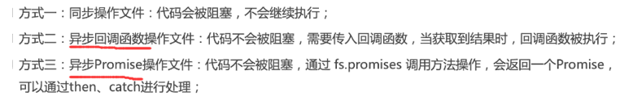
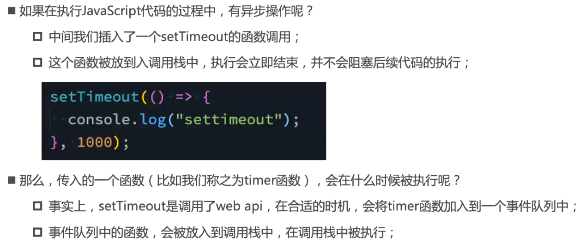
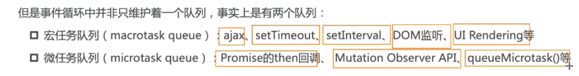
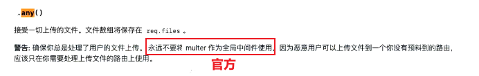
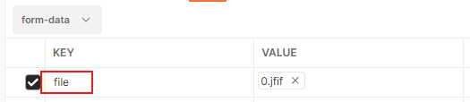

## 引入

源码：4- 44分

### 浏览器内核

 

事实上,我们经常说的浏览器内核指的是浏览器的排版引擎:

**排版引擎**( layout engine ) , 也称为**浏览器引擎**( browser engine )、**页面渲染引擎**( rendering engine )或**样版引擎**。

### 渲染引擎工作的过程

 

### JavaScript引擎

#### 以webkit内核为例

 

#### 以v8引擎为例


#### v8引擎的原理

 

### nodejs是什么

> 官方：node.js是一个**基于V8JavaScript引擎**的JavaScript运行时环境

node.js不是一门语言，不是库，不是框架，是一个JavaScript运行时环境，

简单点就是nodejs可以**解析和执行**JavaScript代码，以前只有浏览器可以解析和执行JavaScript代码，就是说现在JavaScript可以完全摆脱浏览器来运行，一切都归功于：nodejs

**Node.js里面没有BOM DOM，需要学习服务器级别的操作API**

### 浏览器和Node.js架构区别

 

 

### nodejs应用场景

 

### nodeJS版本选择及安装及安装多版本（nvm 和 n）

公司开发就使用LTS版本（稳定），学习就用current版本（支持的js新特性更多）

安装：

安装过程中会**配置环境变量**(让我们**可以在命令行使用**) ; 并且会安装`npm(Node Package Manager)`工具;

安装多版本node：

​    需要使用版本管理工具`n(Interactively Manage Your Node.js Versions交互式管理你的node版本)`或`nvm(Node Version Manager)`两个都不支持windows系统，n更简单好用

#### mac系统中[n](https://github.com/tj/n)的使用

直接使用npm全局安装`n`工具

```shell
npm i n -g
```

安装 Node.js 版本

只需执行`n <version>`下载并安装一个版本的 Node.js。如果`<version>`已经下载，`n`将从其缓存中安装。

```shell
# 安装10.16.0版本的node
n 10.16.0
# 安装最新lts版本的node
n lts
# 安装最新current版本的node
n latest

# 删除8.0.0版本的node
n rm 8.0.0
```

> mac系统如果安装需要权限，在前面加上`sudo`
>
> ```shell
> sudo n lts
> ```

`n` 执行n以查看您下载的版本，并切换安装选定的版本。

```shell
$ n

  node/4.9.1
ο node/8.11.3
  node/10.15.0

Use up/down arrow keys to select a version, return key to install, d to delete, q to quit
```

#### [nvm-windows](https://github.com/coreybutler/nvm-windows)的使用

nvm是不支持windows系统的，但是也有人开发出在windows系统中使用nvm切换node版本的工具`nvm-windows`

[github下载](https://github.com/coreybutler/nvm-windows/releases)

 

相关命令

```shell
# 查看nvm是否安装完成
nvm

# 查看已经安装的node版本列表
nvm list
# 查看可用的node版本列表
nvm list available


# 直接使用nvm安装指定版本的node开会很慢，可以添加淘宝镜像
# 这里你需要设置两个镜像，node的镜像和npm的镜像（安装node会顺带安装npm包管理工具）
# node镜像 
nvm node_mirror https://npm.taobao.org/mirrors/node/
# npm镜像
nvm npm_mirror https://npm.taobao.org/mirrors/npm/


# 注意：建议使用管理员身份运行终端来执行以下命令，跟mac系统使用sudo道理相同⭐

# 安装最新lts版本的node
nvm install lts
# 安装最新current版本的node
nvm install latest

# 卸载指定版本的node
nvm  uninstall <version>

# 指定版本：进行node版本切换
nvm use <version>
```

```shell
Microsoft Windows [版本 10.0.19044.1586]
(c) Microsoft Corporation。保留所有权利。

C:\Windows\system32>nvm list

    16.13.1

C:\Windows\system32>nvm use 16.13.1
Now using node v16.13.1 (64-bit)

C:\Windows\system32>nvm list

  * 16.13.1 (Currently using 64-bit executable)

C:\Windows\system32>nvm install latest
Downloading node.js version 17.7.2 (64-bit)...
Extracting...
Complete


Installation complete. If you want to use this version, type

nvm use 17.7.2

C:\Windows\system32>nvm list

    17.7.2
  * 16.13.1 (Currently using 64-bit executable)

C:\Windows\system32>nvm use 17.7.2
Now using node v17.7.2 (64-bit)

C:\Windows\system32>nvm list

  * 17.7.2 (Currently using 64-bit executable)
    16.13.1

C:\Windows\system32>nvm use 16.13.1
Now using node v16.13.1 (64-bit)

C:\Windows\system32>nvm list

    17.7.2
  * 16.13.1 (Currently using 64-bit executable)
```

### REPL的使用：交互式编程环境

REPL是Read-Eval-print Loop的简称，翻译为**读取-求值-输出 的循环**

浏览器中console输出界面可以`输入js代码然后执行`，这就是REPL

node中也可以像浏览器一样使用repl：输入命令 **node** 即可

 

## 基础

### 给node传递参数

```shell
# 执行node.js文件
node fileName
# 传递参数
node fileName aaa sasa

```

`process.argv`中获取传递的参数

```shell
PS C:\Users\leopai\Desktop\leopai_web_notes\nodejs> node .\00process.js aaa sasa
[
  'D:\\Program Files\\nodejs\\node.exe',
  'C:\\Users\\leopai\\Desktop\\leopai_web_notes\\nodejs\\00process.js',
  'aaa',
  'sasa'
]
```

### node程序输出（了解）

```js
// console.log(process)
console.log(process.argv)

//清除控制台
console.clear()

//输出警告
const names = 'Will Robinson'
console.warn(`Danger ${names}! Danger!`)

//输出错误
console.error(new Error('Whoops, something bad happened'))

//输出函数调用栈
function aaa() {
  console.trace()
}
aaa()

```

```shell
# console.trace()方法跟踪aaa函数的执行栈，可以查看aaa函数在某某文件中调用过
Trace
    at aaa (C:\Users\leopai\Desktop\leopai_web_notes\nodejs\00process.js:9:11)
    at Object.<anonymous> (C:\Users\leopai\Desktop\leopai_web_notes\nodejs\00process.js:11:1)
    at Module._compile (node:internal/modules/cjs/loader:1101:14)
    at Object.Module._extensions..js (node:internal/modules/cjs/loader:1153:10)
    at Module.load (node:internal/modules/cjs/loader:981:32)
    at Function.Module._load (node:internal/modules/cjs/loader:822:12)
    at Function.executeUserEntryPoint [as runMain] (node:internal/modules/run_main:81:12)
    at node:internal/main/run_main_module:17:47
    
Danger Will Robinson! Danger!

Error: Whoops, something bad happened
    at Object.<anonymous> (C:\Users\leopai\Desktop\leopai_web_notes\nodejs\00process.js:16:15)
    at Module._compile (node:internal/modules/cjs/loader:1101:14)
    at Object.Module._extensions..js (node:internal/modules/cjs/loader:1153:10)
    at Module.load (node:internal/modules/cjs/loader:981:32)
    at Function.Module._load (node:internal/modules/cjs/loader:822:12)
    at Function.executeUserEntryPoint [as runMain] (node:internal/modules/run_main:81:12)
    at node:internal/main/run_main_module:17:47
```

### 特殊的全局对象

这些对象其实是模块中的变量，只是每个模块里面都有，看起来是全局变量

包括：`__dirname、__filename、exports、module、require()`

`__dirname`当前文件所在的绝对路径

`__filename` 当前文件所在的绝对路径文件名

```js
console.log(__dirname)//C:\Users\leopai\Desktop\leopai_web_notes\nodejs
console.log(__filename)//C:\Users\leopai\Desktop\leopai_web_notes\nodejs\process.js
```

在命令行交互(REPL)中不可以使用

```shell
PS C:\Users\leopai\Desktop\leopai_web_notes\nodejs> node
Welcome to Node.js v16.13.1.      
Type ".help" for more information.
> __dirname
Uncaught ReferenceError: __dirname is not defined
> __filename
Uncaught ReferenceError: __filename is not defined
>
```

### [常见全局变量](https://nodejs.org/dist/latest-v16.x/docs/api/globals.html)

- [Class: `Buffer`](https://nodejs.org/dist/latest-v16.x/docs/api/globals.html#class-buffer)
- [`console`](https://nodejs.org/dist/latest-v16.x/docs/api/globals.html#console)
- [`Event`](https://nodejs.org/dist/latest-v16.x/docs/api/globals.html#event)
- [`exports`](https://nodejs.org/dist/latest-v16.x/docs/api/globals.html#exports)
- [`global`](https://nodejs.org/dist/latest-v16.x/docs/api/globals.html#global)
- [`module`](https://nodejs.org/dist/latest-v16.x/docs/api/globals.html#module)
- [`process`](https://nodejs.org/dist/latest-v16.x/docs/api/globals.html#process)
- [`require()`](https://nodejs.org/dist/latest-v16.x/docs/api/globals.html#require)
- [`setImmediate(callback[, ...args\])`](https://nodejs.org/dist/latest-v16.x/docs/api/globals.html#setimmediatecallback-args)
- [`setInterval(callback, delay[, ...args\])`](https://nodejs.org/dist/latest-v16.x/docs/api/globals.html#setintervalcallback-delay-args)
- [`setTimeout(callback, delay[, ...args\])`](https://nodejs.org/dist/latest-v16.x/docs/api/globals.html#settimeoutcallback-delay-args)
- [`URL`](https://nodejs.org/dist/latest-v16.x/docs/api/globals.html#url)

以上仅为部分

#### process

process提供了Node进程中相关信息

比如`Node运行环境、参数信息`

在项目中，可以将一些环境变量读取到`process的env中`

#### console

#### 计时器对象

```js
//计时器相关对象
setTimeout(() => {
  console.log('setTimeout')
}, 0)
setInterval(() => {
  console.log('setInterval')
}, 5000)
//setTimeout时间设置为0和setImmediate是有区别的
setImmediate(() => {
  console.log('setImmediate')
})
//下一帧执行
process.nextTick(() => {
  console.log('process.nextTick')
})

//还有与之对应的取消定时器的对象
```

#### global

global对象与浏览器中的window对象类似，如果一个属性不方便获取，可以使用`global.属性名`来获取

区别：浏览器中定义变量会直接成为window的属性，node中不会成为global的属性，因为浏览器中没有模块的概念，所以会直接吧变量放到window对象中，但是node中每一个js文件都是一个单独的模块，定义的变量只属于这个模块但是不属于全局

```js
const name = 'aaaaaa'
console.log(name) //aaaaaa
console.log(global.name) //undefined
```

> 控制台输出来查看global全局对象的属性是不全的，可以在node的repl交互中敲**`global. `再按两次tab键查看** 
>
> ```shell
> PS C:\Users\leopai\Desktop\leopai_web_notes\nodejs> node
> Welcome to Node.js v16.13.1.
> Type ".help" for more information.
> > global.
> global.__proto__             global.hasOwnProperty        global.isPrototypeOf         global.propertyIsEnumerable  global.toLocaleString
> global.toString              global.valueOf
> 
> global.constructor
> 
> global.AbortController       global.AbortSignal           global.AggregateError        global.Array                 global.ArrayBuffer
> global.Atomics               global.BigInt                global.BigInt64Array         global.BigUint64Array        global.Boolean
> global.Buffer                global.DataView              global.Date                  global.Error                 global.EvalError
> global.Event                 global.EventTarget           global.FinalizationRegistry  global.Float32Array          global.Float64Array
> global.Function              global.Infinity              global.Int16Array            global.Int32Array            global.Int8Array
> global.Intl                  global.JSON                  global.Map                   global.Math                  global.MessageChannel
> global.MessageEvent          global.MessagePort           global.NaN                   global.Number                global.Object
> global.Promise               global.Proxy                 global.RangeError            global.ReferenceError        global.Reflect
> global.RegExp                global.Set                   global.SharedArrayBuffer     global.String                global.Symbol
> global.SyntaxError           global.TextDecoder           global.TextEncoder           global.TypeError             global.URIError
> global.URL                   global.URLSearchParams       global.Uint16Array           global.Uint32Array           global.Uint8Array
> global.Uint8ClampedArray     global.WeakMap               global.WeakRef               global.WeakSet               global.WebAssembly
> global._                     global._error                global.assert                global.async_hooks           global.atob
> global.btoa                  global.buffer                global.child_process         global.clearImmediate        global.clearInterval
> global.clearTimeout          global.cluster               global.console               global.constants             global.crypto
> global.decodeURI             global.decodeURIComponent    global.dgram                 global.diagnostics_channel   global.dns
> global.domain                global.encodeURI             global.encodeURIComponent    global.escape                global.eval
> global.events                global.fs                    global.global                global.globalThis            global.http
> global.http2                 global.https                 global.inspector             global.isFinite              global.isNaN
> global.module                global.net                   global.os                    global.parseFloat            global.parseInt
> global.path                  global.perf_hooks            global.performance           global.process               global.punycode
> global.querystring           global.queueMicrotask        global.readline              global.repl                  global.require
> global.setImmediate          global.setInterval           global.setTimeout            global.stream                global.string_decoder
> global.sys                   global.timers                global.tls                   global.trace_events          global.tty
> global.undefined             global.unescape              global.url                   global.util                  global.v8
> global.vm                    global.wasi                  global.worker_threads        global.zlib
> ```

### JavaScript模块化

 

node中的js有重要的概念：`模块系统`

`require`加载模块     `exports`导出模块

#### commonjs和node

 

```js
//没有模块化的时候实现模块化可以使用IIFE
const moduleAAA = (function () {
  var name = 'wang'
  var age = 18
  return {
    name: name,
    age: age,
  }
})()
//这样把文件嵌入到html文件当中，其他的js文件就可以使用moduleAAA.name来使用了
```

#### exports和module.exports

每个模块里面原本都有一个`exports空对象`，通过添加（导出）属性供别的模块使用

`moo = require('./导出的文件名')`对象是exports对象的浅拷贝（浅拷贝就是引用赋值）

 

> `exports是commonjs里面要求exports作为导出，而node中增加了module.exports`
>
> 每个模块中都有一个module对象，真正导出的是module对象里面的exports

```js
// module.exports === exports      node内部语句（在顶层）
console.log(module.exports === exports) //true

exports.aa = 'aa'
exports.fn = function (x, y) {
  return x + y
}

/*
不要写 exports = {}这种语句，不管用，因为commonjs模块化内部默认语句是在文件最底部最终导出的是 ：return module.exports，如果那样写是将exports指向另一个对象，导出的不是我们想要的，所以一般导出多个是使用
module.exports={...}

记住最终导出的是module.exports即可⭐，如果module.exports重新赋值（指向一个新对象），则exports方法导出就无效
一般不会混合使用
*/
//导出多个接口成员
exports.xx1 = xxx
exports.xx2 = xxx
exports.xx3 = xxx
//或
module.exports = { xx1, xx2, xx3 }

//导出单个接口成员
module.exports.xx = xxx

/**
 * 导入：const moo = require(‘./导出的文件名’)
 * require(‘./导出的文件名’) 返回的就是导出的那个对象
 * 所以可以直接使用moo.xxx来使用导出的属性
 */
```

#### require细节

require是一个函数，导入格式：require（X）

* 1、X是一个`核心模块`，比如path、http会直接返回核心模块，并停止查找

* 2、X是以**./**或 **../**或 **/**（根目录）开头的     //自定义模块，前两个是相对路径，从自身文件的相对文件查找，后面一个是绝对路径，会从整个计算机查找

  * 将X作为一个文件在对应目录下查找
    * 文件有后缀名，会根据后缀名格式来查找
    * 没有后缀名，会按照`文件X > X.js > X.json > X.node`这个顺序来查找
  * 没有找到对应文件，将X作为一个目录来查找
    * 查找目录下的`index文件`，按照`X/index.js > X/index.json > X/index.node`这个顺序来查找
  * 没有找到就报错：Not Found

* 3、直接是一个X（没有路径），并且X不是一个核心模块

  * 会先看X是不是核心模块，如果不是，`会从当前文件所在目录下的node_modules文件夹开始查找，在逐层往上查找，直到根目录下的node_modules文件夹，没有找到则报错：Not Found`

    > node中每个js文件都是一个module对象，当前在`commonjs/require.js`中写了`require('X')`，会遍历paths数组，逐层往上查找模块X

    ```shell
    console.log(module)👇👇
    
    Module {
      id: '.',
      path: 'C:\\Users\\leopai\\Desktop\\leopai_web_notes\\nodejs\\commonjs',
      exports: {},
      filename: 'C:\\Users\\leopai\\Desktop\\leopai_web_notes\\nodejs\\commonjs\\require.js',
      loaded: false,# 模块是否被加载了，被加载过，变成true，之后再次require('该模块')会直接从缓存中取
      children: [],
      paths: [
        'C:\\Users\\leopai\\Desktop\\leopai_web_notes\\nodejs\\commonjs\\node_modules',
        'C:\\Users\\leopai\\Desktop\\leopai_web_notes\\nodejs\\node_modules',
        'C:\\Users\\leopai\\Desktop\\leopai_web_notes\\node_modules',
        'C:\\Users\\leopai\\Desktop\\node_modules',
        'C:\\Users\\leopai\\node_modules',
        'C:\\Users\\node_modules',
        'C:\\node_modules'
      ]
    }
    ```

#### commonjs规范缺点

 

#### commonjs模块加载过程

commonjs加载过程是同步的，es module加载是异步的

* 结论一：模块在被加载第一次时，模块中的代码会被运行一次

```js
require('./index') //先运行里面的代码

console.log(module) //后执行
```

* 结论二：模块在被引入多次时，会缓存，最终只加载一次，优先从缓存加载

`module.loaded = true`	

 

* 结论三：循环引入，那么加载顺序是什么

 

此数据结构为`图结构`，执行main.js：

* 先执行`require('./aaa')`,则`main > aaa > ccc > ddd > eee > bbb`
* 先执行`require('./bbb')`,则`main > bbb > ccc > ddd > eee > aaa`

跟`模块引入顺序`和`模块是否已被加载`有关，并非深度优先算法

### ES Module

ES Module采用export和import关键字实现模块化

ES Module采用了`严格模式 use strict`

ES Module采用编译期的静态分析，并且也加入看了动态引用的方式 

#### 模块化导出导入方式

导出：

 ```js
 //方式一
 export const name = 'yang'
 export const age = '22'
 export function outPut() {
   console.log('hahaha')
 }
 //方式二  注意：export后面的`花括号不是对象`⭐
 export { name, age, outPut }
 
 //方式三  起别名
 export { name as Aname, age as Aage, outPut as AoutPut }
 
 //方式四: 可以跟上面同时存在，但是只能有一个export default⭐
 //默认导出，导入时可以自定义名字来使用它
 export default function () {
   console.log(111)
 }
 ```

导入：

```js
//方式一
import { name, age, outPut } from './aaa.js'

//方式二  起别名： 导出时起别名这里还可以起，
import {
  Aname as AAAname,
  Aage as AAAage,
  AoutPut as AAAoutPut,
} from './aaa.js'

//方式三  * 统一导入放入对象中
import * as obj from './aaa.js'
```

导入并直接导出

当自己封装或开发功能库时，通常将暴露的接口放在一个文件中，这样方便统一接口规范，也方便阅读

```js
export { Aname, Aage, AoutPut } from './aaa.js'
```

#### html文件中使用模块化

 

在HTML文件中使用模块化要在`script`标签中加上`type="module"`，并且开启一个`服务`来运行这个html文件，否则无效（跨域问题）

#### 函数 import()

通过import加载一个模块`不可以放到逻辑代码中`，可以使用**import()函数**

> 不能把import关键字放在运行代码当中，因为ES Module在被js**解析的时候，就必须知道它的依赖关系**，由于这个时候js文件`没有任何的运行`，所以无法进行类似于if判断中代码的执行情况，，但是有些情况我们希望`动态`的来加载某一个模块，这时可以使用import()函数

js引擎解析和执行：`parsing（解析）=>AST => 字节码=>二进制=>代码执行`

import函数返回的是一个`promise`，后面接上then拿到导入的接口数据

```js
const mark = false
if(mark){
    // console.log(111);
}else{
    import('./index.js').then(res=>{
        console.log(res);//./index.js文件中所有导出的模块
    })
}
```

**require（''）可以在if语句中使用是因为require本身就是一个函数，是在`执行（运行）`阶段**

#### es module模块加载过程

 

使用export导出name=‘aaa’，1秒钟之后把name赋值为”bbb”，则2秒钟之后import得到的name是bbb    //export后面导出的花括号不是对象，与commonjs不一样

```js
let name = 'aaa'
setTimeout(() => {
    name = 'dddddd'
}, 1000)
//es modules
export {
    name //这里两秒钟之后改成了dddddd，那2秒钟后另一个模块引用的name值也会变成dddddd
}
//commonjs
moudle.exports = {
    name //这里导出的是一个对象，并且对象里面的属性叫name，相当于name:name,只是把变量name改掉了，而不是改掉了name属性，所以2秒中后还是aaa
}

```

```js
let name = "aaa";

//模块一导出name
export {
  name,
};
//模块二引入name
// import {name} from ...

//如果name是基本数据类型，不允许修改，语法错误
// 如果name是引用数据类型，可以修改里面的属性，并且修改过后，模块一中拿到的是模块二修改后的数据（指向同一个地址）⭐
```

#### Node对ES Module的支持

 

### Commonjs和ES Module交互

> node中的模块化使用的是commonjs，如果在node中使用es module，那么文件扩展名要使用 **.mjs**才能够正确运行

不是绝对的，看平台

 

### 常见内置模块path、fs、events

#### path


文件路径拼接：

​	**path.resolve('路径'，'文件名')**

​	**path.join('路径'，'文件名')**

获取文件路径信息：

​    **path.dirname('文件完整路径')**

​	**path.basename('文件完整路径')**

​	**path.extname('文件完整路径')**  

```js
const path = require('path')

const basePath = '../fea1/node'
const fileName = 'aaa.js'
// 1、路径的拼接path.resolve()和path.join()    //resolve用的多
//path.resolve()会判断路径拼接的字符串中是否有/或./或../开头的路径，获取的是该路径所在的绝对路径，更加灵活，但是path.join()会直接拼接
const filePath1 = path.resolve(basePath, fileName)
console.log(filePath1) //D:\node\node练习\fea1\node\aaa.js
const filePath2 = path.join(basePath, fileName)
console.log(filePath2) //..\fea1\node\aaa.js

//1
const basePath = '../fea1/node'
const fileName = '/aaa.js' // /开头
const filePath1 = path.resolve(basePath, fileName)//D:\aaa.js

//2
const basePath = '../fea1/node'
const fileName = './aaa.js' // ./开头
const filePath1 = path.resolve(basePath, fileName)//D:\node\node练习\fea1\node\aaa.js

//3
const basePath = '../fea1/node'
const fileName = '../aaa.js' // ../开头,会找到上一层
const filePath1 = path.resolve(basePath, fileName)//D:\node\node练习\fea1\aaa.js


//2、获取路径相关信息
const filePath3 = 'node/aaa/haha.txt'
console.log(path.dirname(filePath3)) //获取路径前面的文件夹信息 node/aaa
console.log(path.basename(filePath3)) //获取后面的文件信息 haha.txt
console.log(path.extname(filePath3)) //获取文件扩展名信息 .txt
```

#### fs

`__dirname` 总是指向被执行 js 文件的`绝对路径`，所以当你在 `/d1/d2/myscript.js` 文件中写了 `__dirname`， 它的值就是 `/d1/d2` 。

 

文件系统的API大多提供三种操作方式

 

* 获取文件信息

  ```js
  const fs = require('fs')
  //案例：读取文件信息
  const filePath = './fs文件读取.txt' //文件路径
  
  //方式一：同步操作
  const info = fs.statSync(filePath)
  console.log('info',info)
  console.log('阻塞')
  
  
  //方式二：异步操作
  fs.stat(filePath, (err, stats) => {
    if (err) {
      console.log(err)
      return
    }
    console.log('stats',stats)
  })
  console.log('异步，不会被阻塞')
  
  
  //方式3：peomise操作
  fs.promises
    .stat(filePath)
    .then((data) => {
      console.log(data)
    })
    .catch((err) => {
      console.log(err)
    })
  console.log('promise异步操作，不会阻塞')
  ```

  文件描述符fd⭐

   

  ```js
  // 方式四：先获取文件描述符，再根据文件描述符来操作某一个文件
  fs.open(filePath, (err, fd) => {
    if (err) return
    console.log(fd) //文件描述符
    fs.fstat(fd, (err, info) => {
      console.log(info) //文件信息
    })
  }) 
  ```

* 文件的读写 

  ```js
  const fs = require('fs')
  
  //文件写入
  const content = '你好啊利益和'
  fs.writeFile('./fs文件读取.txt', content, { flag: 'a' }, (err) => {
    //第三个参数可选，flag选项
    console.log(err) //为null就写入成功
  })
  
  // 文件读取
  fs.readFile('./fs文件读取.txt', { encoding: 'utf-8' }, (err, data) => {
    //可选参数encoding指定字符编码，默认utf-8
    console.log(data)
    console.log('文件读取成功')
  })
  ```

  常见flag选项

   

  [字符编码详解](https://www.jianshu.com/p/899e749be47c)

* 文件夹操作

  ```js
  const fs = require('fs')
  const path = require('path')
  
  
  //1.创建文件夹
  const dirName = './创建的文件夹'
  //先判断这个文件夹存不存在
  if (!fs.existsSync(dirName)) { //fs.existsSync()判断文件夹存不存在（同步）
      fs.mkdir(dirName, err => { //fs.mkdir()创建文件夹
          console.log('文件夹创建成功');
      })
  }
  
  //2.读取文件夹中的所有文件
  //withFileTypes可选参数，默认为false，使读取的文件名或文件夹名为对象方式存在，以对象方式存在就可以调用isFile()和isDirectory()
  fs.readdir(dirName, { withFileTypes: true }, (err, files) => {
      console.log(files);
  })
  
  //读取文件夹中的所有文件，如果文件夹中还有文件夹，也都读取
  //fs.readdirSync() 同步读取
  function getFiles(dirName) {
      fs.readdir(dirName, { withFileTypes: true }, (err, files) => {
          files.forEach(item => {
              if (item.isDirectory()) { //item.isDirectory()是文件夹返回true
                  const filePath = path.resolve(dirName, item.name)
                  getFiles(filePath) //如果是文件夹，递归调用
              } else {
                  console.log(item.name)
              }
          })
      })
  }
  getFiles(dirName)
  
  // 3.重命名
  fs.rename('./创建的文件夹','./新名字',(err,info)=>{
      if(err) return
      console.log(info);
      console.log(info.isDirectory());
      console.log(info.isFile());
  })
  ```

#### events

```js
const EventEmitter = require('events')
//创建发射器
const emitter = new EventEmitter()
//监听发出的click事件
// on是addListener的alias
emitter.on('click', (arg1, arg2) => {
    console.log("监听1", arg1, arg2);
})
const listener = arg1 => {
    console.log("监听2", arg1);
}
emitter.on('click', listener)
setTimeout(() => {
    emitter.off('click', listener) //取消对指定事件的监听
    //发出click事件
    emitter.emit('click', '信息1', '信息2')
}, 2000)
```

### [Buffer](https://nodejs.org/dist/latest-v16.x/docs/api/buffer.html)

#### 数据的二进制

 

#### Buffer和二进制

 

#### Buffer和字符串

```js
//英文字符串
const message1 = 'hello'

//1、由于安全性和可用性问题，不推荐使用 Buffer(),Please use the Buffer.alloc(), Buffer.allocUnsafe(), or Buffer.from() methods instead.
// const buffer = new Buffer(message1)

//2、方式二 Buffer.from()
const buffer1 = Buffer.from(message1)
const buffer2 = Buffer.from(message1, 'utf8') //第二个参数选项，指定字符编码，默认utf8，
console.log('buffer1:', buffer1); //<Buffer 68 65 6c 6c 6f>   一个英文一个字节⭐

//中文字符串
const message2 = '你好'
const buffer3 = Buffer.from(message2) //默认是utf8进行编码
const buffer4 = Buffer.from(message2, 'utf16le')
console.log('buffer3:', buffer3); // <Buffer e4 bd a0 e5 a5 bd> 生僻字外，一个汉字utf8编码成为三个字节⭐
console.log('buffer4:', buffer4); // <Buffer 60 4f 7d 59>   不同编码方式字节不同

//toString()默认是使用utf8进行解码
console.log('buffer3使用utf8解码:', buffer3.toString());//你好 
console.log('buffer4使用utf16解码:', buffer4.toString('utf16le'));//你好 
//如果编码传递了编码方式，解码也要传递相应的方式⭐

//方式三：alloc方式
const buffer5 = Buffer.alloc(8)//size
console.log('buffer5', buffer5); //<Buffer 00 00 00 00 00 00 00 00>
buffer5[0] = 88 //10进制88=0x58
buffer5[1] = 0x88 
console.log('buffer5', buffer5); //<Buffer 58 88 00 00 00 00 00 00>
```

#### Buffer和文件操作

```js
const fs = require('fs')

//不指定字符编码，默认读取到的就是二进制Buffer数据
fs.readFile('./aaa.txt', (err, data) => {
  if (err) return
  console.log(data);//<Buffer e5 b0 8f e7 b3 96 e7 b3 96 e5 b0 8f e6 b4 8b e6 b4 8b>
  console.log(data.toString());//小糖糖小洋洋
})
fs.readFile('./aaa.txt', { encoding: 'utf-8' }, (err, data) => {
  if (err) return
  console.log(data);//小糖糖小洋洋
})


// 读取图片
fs.readFile('./pai.jpg', (err, data)=>{
  if(err) return
  console.log(data);//<Buffer 52 49 46 46 a6 19 00 00 57 45 42 50 56 50 38 ... 6524 more bytes>
  fs.writeFile('./newPar.jpg', data, err=> console.log(err))
})

//对图片进行处理，使用sharp库 https://www.npmjs.com/package/sharp
const sharp = require('sharp')
fs.readFile('./pai.jpg', (err, data)=>{
  if(err) return
  sharp(data)
  .resize(100, 100)
  .toFile('./output.jpg', (err, info) => { 
    console.log(err);
    console.log(info);//图片信息
   })
})
```

### 事件循环与异步IO

#### 事件循环是什么

 

#### 进程和线程

进程和线程是操作系统中的两个概念：        （维基百科）

* 进程（process）：`计算机已经运行的程序`
* 线程（thread）：操作系统能够运行`运算调度`的最小单位

解释：

* 进程：可以认为是启动一个应用程序，就会默认开启一个进程（也可能是多进程）
* 线程：每一个进程中，都会启动一个线程用来执行程序中的代码，这个线程被称之为主线程，
* 所以也可以说：进程是线程的容器

##### 多进程多线程开发

 

##### 浏览器和JavaScript

 

#### `浏览器`中的事件循环

 

##### 事件处理流程

代码分类：

* 初始化代码（同步代码）：dom事件监听、ajax请求、定时器
* 回调代码（异步代码）：处理回调逻辑

js引擎执行代码的基本流程

​	`先执行初始化代码，再执行回调代码`

⭐⭐执行流程：

* 执行初始化代码，将事件回调函数交给对应的管理模块
* 当事件发生时，`事件管理模块`会将回调函数及其数据添加到`回调队列`中
* 只有当初始化代码执行完后，才会遍历读取回到队列中的回调函数执行

 

##### 宏任务(macrotask)、微任务(microtask)

 

⭐⭐在队列里面既有宏任务也有微任务的情况下：

* 会`先执行微任务`，当微任务执行完后，会`再执行宏任务队列里面的第一个函数`
* 第一个函数执行完后不会立马执行下一个函数。而是会判断一下执行宏任务第一个函数的时候`有没有添加新的微任务`
* 有就先把微任务执行了再执行下一个宏任务  

> 执行宏任务之前，保证微任务队列是空的

##### 面试题*2

```html
<!DOCTYPE html>
<html lang="en">
  <head>
    <meta charset="UTF-8" />
    <meta name="viewport" content="width=device-width, initial-scale=1.0" />
  </head>
  <body>
    <script>
      setTimeout(() => {
        console.log('set1')
        new Promise((resolve) => {
          resolve()
        }).then(() => {
          new Promise((resolve) => {
            resolve()
          }).then(() => {
            console.log('then4')
          })
          console.log('then2')
        })
      })

      new Promise((resolve) => {
        console.log('pr1')
        resolve()
      }).then(() => {
        console.log('then1')
      })

      setTimeout(() => {
        console.log('set2')
      })

      console.log(2)

      queueMicrotask(() => {
        console.log('queueMicrotask1')
      })

      new Promise((resolve) => {
        resolve()
      }).then(() => {
        console.log('then3')
      })
    </script>
  </body>
</html>
```

 

```html
<!DOCTYPE html>
<html lang="en">
  <head>
    <meta charset="UTF-8" />
    <meta name="viewport" content="width=device-width, initial-scale=1.0" />
  </head>
  <body>
    <script>
      async function async1() {
        console.log('async1 start')
        await async2()
        console.log('async1 end')
      }

      async function async2() {
        console.log('async2')
      }

      console.log('script start')

      setTimeout(function () {
        console.log('setTimeout')
      }, 0)

      async1()

      new Promise((resolve, reject) => {
        console.log('promise1')
        resolve()
      }).then((res) => {
        console.log('promise2')
      })

      console.log('script end')
    </script>
  </body>
</html>
```

 

> **async、await是Promise的一个语法糖: **
>
> * 我们可以将**await关键字后面执行的代码**，看做是包裹在`(resolve，reject) = { ... }`中的代码
> * **await的下面一条语句**，可以看做是`then(res => { ... })`中的代码
>
>  

#### `node`中的事件循环

##### Node的架构分析

 

##### 阻塞IO和非阻塞IO（了解）

 

##### 非阻塞IO的问题

 

##### 阻塞和非阻塞、同步和异步的区别

阻塞和非阻塞一般说的是`系统调用`

 

##### Node事件循环

 

##### Node中的微任务和宏任务

 

⭐⭐事件循环处理流程：

* 先执行`初始化代码（main script）`
* 再执行`微任务队列中的process.nextTick`(它是单独队列)，再执行`别的微任务（promise.then、queueMicrotask...）`
* 最后执行`宏任务队列：timer定时器> 回调函数> IO事件> 检测setImmediate> close事件`

> 第一个宏任务执行完之后检查有没有产生新的微任务，和浏览器事件循环相同

##### 面试题*2

> 面试题中很少会出现IO事件，IO事件是`系统调用`，系统执行完后告诉你，执行时间不确定

1

```js
async function async1() {
    console.log('async1 start');
    await async2()
    console.log('async1 end');
}

async function async2() {
    console.log('async2');
}

console.log('script start');

setTimeout(function() { console.log('setTimeout0'); }, 0)

setTimeout(() => { console.log('setTimeout2'); }, 300);

setImmediate(() => { console.log('setImmediate'); })

process.nextTick(() => { console.log('nextTick1'); })

async1()

process.nextTick(() => { console.log('nextTick2'); })

new Promise(resolve => {
    console.log('promise1');
    resolve()
    console.log('promise2');
}).then(res => {
    console.log('promise3');
})

console.log('script end');
```

 

2：setTimeout时间设置为0和setImmediate谁先执行

```js
setTimeout(() => {
    console.log('setTimeout')
}, 0)
setImmediate(() => {
    console.log('setImmediate');
})
```

二者执行顺序不一定

宏任务队列执行顺序：`timer定时器> 回调函数> IO事件> 检测setImmediate> close事件`

搞清楚两点：`事件循环有一个初始化时间，timer定时器加入到事件队列也需要一个时间`

* 事件循环初始化的时间假如是20ms，初始化过后开始执行队列中的事件，假如定时器加入队列所需时间是10ms，这时就会先执行setTimeout，后执行回调函数，再执行check（setImmediate）
* 但是，假如初始化时间只需要5ms，定时器加入到队列花了10ms，这时会先执行setImmediate，在执行setTimeout  

出现这种情况不是两个队列调换了顺序，而是`加入到队列的时间先后`

### Stream(流)

 

**文件读写的Stream**

可以看作是：需要读取的数据放在管道（缓冲区）中

 

流的方式读取 

```js
const fs = require("fs")

//传统方式
fs.readFile("./aaa.txt", (err, data) => {
  console.log(data) //<Buffer e4 bd a0 e5 9c a8 e5 b9 b2 e4 bb 80 e4 b9 88>
})

//流的方式读取
const reader = fs.createReadStream("./aaa.txt", {
  start: 3,
  end: 6,
  highWaterMark: 2,
})

//数据读取过程
// reader.on("data", (data) => {
//   console.log(data)
//   //第三个字节到第六个字节（0开始），每次两个字节
//   //<Buffer e5 9c>
//   //<Buffer a8 e5>
// })

//还可以先暂停再继续读取
reader.on("data", (data) => {
  console.log(data)
  reader.pause()

  setTimeout(() => {
    reader.resume()
  }, 1500)
})
reader.on("open", () => {
  console.log("文件被打开")
})
reader.on("end", () => {
  console.log("文件读取结束")
})
reader.on("close", () => {
  console.log("文件关闭") //读取操作完成之后关闭
})

```

流的方式写入

```js
const fs = require("fs")

// fs.writeFile("./test.txt", "leopaidaxing", { flag: "a" }, (err) => {
//   console.log(err)
// })

//流的方式写入
const writer = fs.createWriteStream("./textStream.txt", {
  flags: "a",
  start: 4,
})
//写入内容
writer.write("文件内容", (err) => {
  if (err) return
  console.log("写入成功")
})
writer.write("第二次写入", (err) => {
  if (err) return
  console.log("第二次写入成功")
})

// writer.close() //很少调用，多调用end()
//end()方法可以传参；文件内容，写入之后会调用close()将文件关闭
writer.end('helloworld') 

writer.on("close", () => {
  console.log("文件已经关闭")
})
```

`pipe()`

```js
const fs = require("fs")
//文件读取并直接写入到另一个文件中

//传统方法
// fs.readFile("./aaa.txt", (err, data) => {
//   if (err) return
//   fs.writeFile("./writeA.txt", data, (err) => {
//     console.log(err)
//   })
// })

//pipe()
const reader = fs.createReadStream("./aaa.txt")
const writer = fs.createWriteStream("./writeB.txt")
reader.pipe(writer) //将读取到的流直接输出
writer.close()

```

## node开发web服务器

### web服务器

服务器：提供资源的一台电脑

 

> 全局安装`nodemon`，使用nodemon代替node执行js文件：监听文件改变自动重新执行

### http模块

初体验

```js
const http = require("http")

const server1 = http.createServer((request, response) => {
  response.end("server1")
})
server1.listen(4000, "0.0.0.0", () => {
  //主机地址默认0.0.0.0
  console.log("server1已经启动")
})
//第一个参数端口号和第二个参数主机都是可选的
// server1.listen(() => {
//     console.log('server1已经启动');
//     console.log(server1.address().port); //可以使用address().port查看端口号
// })

//方式2
const server2 = new http.Server((request, response) => {
  //new http.Server  两种方式并无本质区别
  response.end("server2")
})
server2.listen(4001, () => {
  console.log("server2已经启动")
})
```

两种方式底层实现都是一样的，没有区别，都是`new Server`

#### 主机、端口号

 

主机地址写`0.0.0.0`，可以通过localhost、127.0.0.1、电脑的IP地址 三种方式来访问

#### request对象

response继承自`stream.Readable`

url、method、headers

##### method

 

```js
const http = require("http")
const url = require("url")
const qs = require("querystring")

const server1 = http.createServer((request, response) => {
  console.log(request.url) //接口及参数信息  /users
  console.log(request.method) //请求方式，默认GET请求
  console.log(request.headers) //请求头

  /**
   * url相关
   */

  // console.log(url.parse(request.url)) //url模块有个parse方法可以拿到url对象
  // const { pathname, query } = url.parse(request.url) //对象解构
  // console.log(pathname) //例如/login
  // console.log(query) //例如user=wy&password=123123151

  // console.log(qs.parse(query)) //query对象
  // const { user, password } = qs.parse(query)
  // console.log(user) //用户信息内容
  // console.log(password) //密码信息内容

  /**
   * method相关
   * POST:post方式参数是在body里面传入，postman里面点击body，点row，text选为json，即可写json格式的参数
   */
  const { pathname } = url.parse(request.url)
  if (pathname === "/login") {
    if (request.method === "POST") {
      //拿到body中的数据
      // request.setEncoding('utf-8')//文字，视频音频要指定binary，这里指定了编码方式以后下面就可以不用写data.toString()，直接打印data
      request.on("data", (data) => {
        //body中写入的时候使用流的方式进行写入的，所以要调用data事件
        console.log(data) //这里拿到的body数据是Buffer
        const { username, password } = JSON.parse(data.toString())
        console.log(username) //用户信息内容
        console.log(password) //密码信息内容
      })
      request.on('end', () => {
        response.end('server1响应')
      })
    }
  }
})
server1.listen(4000, "0.0.0.0", () => {
  console.log("server1已经启动")
})
```

##### headers

 

#### response对象

##### 响应结果

response是继承自`stream.Writable`的，所以可以使用`.end(),.write(),没有提供.close()`，而且res返回结果是通过`流`的方式返回

调用`.end('aaa')`，相当于先调用`.write('aaa')`，再调用`.end()`

 

##### [响应状态码](https://tool.oschina.net/commons?type=5)

 

```js
const http = require("http")
const url = require("url")
const qs = require("querystring")

const server1 = http.createServer((request, response) => {
  //设置状态码
  //方式一：
  // response.statusCode = 400
  //方式二
  // response.writeHead(503)

  //响应头
  //方式一
  // response.setHeader('Content-Type', 'text/plain;charset=utf8')
  //响应什么文件资源，Content-Type就指定什么类型
  // response.setHeader('Content-Type', 'image/jpeg')
  //方式二
  response.writeHead(200, {
    "Content-Type": "text/html;charset=utf8",
  })

  //响应结果
  // response对象有一个write方法，可以给客户端发送响应数据，可以发送多次，但是最后一定要
  // 用end方法结束响应，不然服务器会一直等待⭐
  // response.write('null')
  // response.end()
  // 很少用write，可以直接在请求结束end里面跟上请求数据
  response.end("<h1>hello</h1>")
})
server1.listen(4000, "0.0.0.0", () => {
  console.log("server1已经启动")
})

```

##### [Content-type](https://tool.oschina.net/commons)

#### http模块发送网络请求

```js
//向其他服务器发送网络请求
//axios既支持前端（使用的是封装xmlhttprequest），也支持node（使用的是http模块）

const { resolveAny } = require('dns')
const http = require('http')
http.get('http://127.0.0.1:4000', (res) => {
  //res不是结果
  res.on('data', (data) => {
    console.log('get请求的结果“', data)
    console.log(data.toString())
  })
  res.on('end', () => {
    console.log('获取到了get所有结果')
  })
})

//POST请求
//POST请求没有直接的post方法
const req = http.request(
  {
    method: 'POST',
    hostname: '127.0.0.1',
    port: 4000,
  },
  (res) => {
    res.on('data', (data) => {
      console.log('POST请求')
      console.log(data.toString())
    })
    res.on('end', () => {
      console.log('POST请求已获取所有结果')
    })
  }
)
req.end() //post请求必须以end方法结束请求
```

### node中文件上传并存入服务器

文件上传本质就是表单提交，使用post请求

* `raw`方式一般就是传json格式的数据
* `form-data`方式现在多数都是进行文件上传，但是服务器解析起来也很麻烦，一般是用框架，比如说`express中的multer库`

http原生文件上传写入

> 错误方式❌
>
> ```js
> const http = require('http')
> const fs = require('fs')
> 
> const server = http.createServer((req, res) => {
>   if (req.url === '/upload') {
>     if (req.method === 'POST') {
>       const fileWriter = fs.createWriteStream('./foo.png', { flags: 'a+' })
>       req.on('data', (data) => {
>         fileWriter.write(data) //直接将字节流写入,但是字节流是有问题的⭐，其中包含的不只是文件的内容信息，还包含其他信息（写入时不是纯图片数据）
>       })
>       req.on('end', () => {
>         res.end('文件上传成功')
>       })
>     }
>   }
> })
> server.listen('4000', () => {
>   console.log('server start!')
> })
> ```
>
>  
>
>  

```js
const http = require('http')
const qs = require('querystring')
const fs = require('fs')

const server = http.createServer((req, res) => {
  if (req.url === '/upload') {
    if (req.method === 'POST') {
      //⭐图片文件必须设置成二进制的编码，默认是utf-8
      req.setEncoding('binary')

      let body = '' //用于储存文件信息
      //获取boundary
      const totalBoundary = req.headers['content-type'].split(';')[1]
      const boundary = totalBoundary.split('=')[1]
    //   console.log(boundary);

      req.on('data', (data) => {
        //data:拿到的文件数据
        body += data //body是字符串，data文件数据事buffer，会默认将其转化为字符型
      })
      req.on('end', () => {
        // console.log(body)
        //处理body,获取中间真正的文件信息才能正确写入
        //1、获取 Content-Type: image/png (不同文件Content-Type是不同的)
        const payload = qs.parse(body, '\r\n', ': ')
        // console.log(payload)
        const type = payload['Content-Type'] //image/png
        //在image/png的位置进行截取
        const typeIndex = body.indexOf(type)
        const typeLength = type.length
        let imageData = body.substring(typeIndex + typeLength) //Content-Type: image/png后面的所有数据
        //3、将中间的两空格去掉
        imageData = imageData.replace(/^\s\s*/, '') // \r\n\r\n
        //4、将最后的boundary去掉
        imageData = imageData.substring(0, imageData.indexOf(`--${boundary}--`))//前后会有--

        fs.writeFile('./foo.png', imageData, 'binary', (err) => {
          res.end('文件上传成功')
        })
      })
    }
  }
})
server.listen('4000', () => {
  console.log('server start!')
})
```

## express

### 认识web框架

 

### 初始化项目

#### 安装express

* 方式一：通过`express脚手架`创建应用骨架

安装`express-generator`脚手架

```shell
# 全局安装脚手架
npm i -g express-generator
# 创建项目
express express-server-demo
# 安装依赖
npm i
# 启动项目
node[nodemon] bin/www
```

* 方式二：从零搭建一个express应用结构

```shell
npm init -y
npm i express
```

```js
//1、导入
const express = require('express')
//2、创建app  express是一个函数
const app = express()

// 默认路径请求做操作
app.get('/', (req, res, next) => {
  res.end('hello这是默认请求')
})
//想发什么请求，就怎么配置
app.post('/login', (req, res, next) => {
  res.end('这是post请求~')
})

//3、监听
app.listen(8000, () => {
  console.log('8000端口已经启动')
})
```

### 中间件

* express应用程序本质上是`一系列中间件函数的调用`
* 中间件本质是传递给express一个回调函数
* 回调函数有三个参数，`请求对象request`，`响应对象response`，`用于执行下一个中间件的next函数`

#### 普通中间件

普通中间件，什么请求、什么url都会匹配上，没有任何限制

> next()不跟参数，跟上参数表示报错⭐

* 这种普通中间件写了多个也是没问题的，`默认会执行第一个`，如果想向下执行，必须执行`next()`
* next()和res.end()没有必然关系，但是请求-响应周期（res.end）结束，下面的中间件再执行res.end就会报错（结束一次就行了啊）
* 一般想通过next执行下一个中间件的话，是在最后一个中间件里面执行res.end()结束响应
* 中间件执行完了依然没有`res.end()`返回结果就会返回`not found`⭐

```js
const express = require('express')
const app = express()

//普通中间件
app.use((req, res, next) => {
  console.log('注册了第1个普通的中间件')
  //   res.end('middleware')//这里响应之后还是可以执行next()，执行下一个中间件，但是下面再有end()就会报错
  next()
})
app.use((req, res, next) => {
  console.log('注册了第2个普通的中间件')
  next()
})
app.use((req, res, next) => {
  console.log('注册了第3个普通的中间件')
  res.end('hello middleware')
})

app.listen(8000, () => {
  console.log('8000端口已启动')
})
```

#### path路径匹配的中间件

只有匹配的url才会匹配上，无论什么请求都可以

```js
const express = require('express')
const app = express()

//不管什么中间件只要匹配上就会先执行，如果想执行下一个需要执行next函数
app.use((req, res, next) => {
  console.log('注册了第1个普通的中间件')
  next()
})
app.use('/home', (req, res, next) => {
  console.log('注册了第1个path中间件')
  next()
})
//中间穿插普通中间件，也都是依次执行
app.use((req, res, next) => {
  console.log('注册了第2个普通的中间件')
  next()
})
app.use('/home', (req, res, next) => {
  console.log('注册了第2个path中间件')
  res.end('path middleware')
})

app.listen(4000, () => {
  console.log('4000端口已启动')
})
```

#### path路径和method方法匹配的中间件

> 一般没有单独匹配方法的中间件

```js
const express = require('express')
const app = express()

//path和method都匹配中间件
app.use((req, res, next) => {
  console.log('注册了第1个普通的中间件')
  next()
})
app.get('/home', (req, res, next) => {
  console.log('注册了第1个path,method中间件')
  res.end('path home and method middleware')
})
app.post('/home', (req, res, next) => {
  console.log('注册了第2个path,method中间件')
  res.end('path home and method middleware')
})

app.listen(4000, () => {
  console.log('4000端口已启动')
})
```

#### 连续注册中间件

```js
const express = require('express')
const app = express()

//连续注册中间件 ,连续多个回调函数注册多个中间件
//只要匹配的上，相同的path和method写多个也没有问题
app.get('/home', (req, res, next) => {
  console.log('注册了第1个path,method中间件')
  next()
})
app.get(
  '/home',
  (req, res, next) => {
    console.log('注册了第2个path,method中间件')
    next()
  },
  (req, res, next) => {
    console.log('注册了第3个path,method中间件')
    next()
  },
  (req, res, next) => {
    console.log('注册了第4个path,method中间件')
    res.end('path home and method middleware')
  }
)

app.listen(4000, () => {
  console.log('4000端口已启动')
})
```

### 中间件应用-解析请求数据

text格式内容可以直接获取，但是json格式或者其他格式则需要解析

```js
const express = require('express')
const app = express()

//json方式
//这样判断，就会先把json方式请求的数据放在req.body里面，看path和method是什么再在下面的中间件中拿到数据
app.use((req, res, next) => {
  if (req.headers['content-type'] === 'application/json') {
    req.on('data', (data) => {
      const info = JSON.parse(data.toString())
      req.body = info //保存在req.body里面⭐
    })
    req.on('end', () => {
      next()
    })
  } else {
    next()
  }
})

app.post('/home', (req, res, next) => {
  console.log(req.body)
  res.end('home path')
})
app.post('/login', (req, res, next) => {
  console.log(req.body)
  res.end('login path')
})

app.listen(8000, () => {
  console.log('8000端口')
})
```

#### `body-parser`解析json和x-www-form-urlencoded格式数据

* `app.use(express.json())`
* `app.use(express.urlencoded({ extended: true }))`

也是在`请求对象request`的`body`属性中拿到

```js
const express = require('express')
const app = express()

//上面这种封装使用一个库实现body-parser，这个库的类似功能(不是这个库)在express的4.16.x版本内置成了函数
app.use(express.json()) //json格式数据上传⭐

// extended:
// true:那么对urlencoded进行解析时，它使用的是第三方库:qs √
// false:那么对urlencoded进行解析时，它使用的是Node内置块:querystring
app.use(express.urlencoded({ extended: true })) //x-www-form-urlencoded格式数据上传⭐

app.post('/home', (req, res, next) => {
  console.log(req.body)
  res.end('home path')
})
app.post('/login', (req, res, next) => {
  console.log(req.body)
  res.end('login path')
})

app.listen(8000, () => {
  console.log('8000端口')
})

```

#### form-data格式数据解析

一般我们使用form-data会看作是`向服务器上传文件（信息）`

解析form-data格式的数据使用`multer`

```shell
npm i multer
```

也是在`请求对象request`的`body`属性中拿到

```js
const express = require('express')
const multer = require('multer') //安装、导入multer

const app = express()

const upload = multer() //一般命名为upload
app.use(upload.any()) //form-data格式上传信息解析方式，any()的作用是可以解析文件类型以外的信息

app.post('/login', (req, res, next) => {
  console.log(req.body)
  res.end('用户登录成功')
})

app.listen(4000, () => {
  console.log('form-data解析上传服务器开启成功')
})
```

```js
//⭐永远不要将upload.any()作为全局中间件使用
//连续注册中间件的方式使用，单独给login接口做解析
app.post('/login', upload.any(), (req, res, next) => {
  console.log(req.body)
  res.end('用户登录成功')
})
```

 

#### form-data文件上传解析

`upload.single(key)`  单文件上传

`upload.array(key, 4)`  多文件上传，最多4个

`upload.fields([
   { name: 'file', maxCount: 2 },
   { name: 'haha', maxCount: 2 },
])`  多文件多字段上传

```js
const express = require('express')
const multer = require('multer') //导入multer

const app = express()

const upload = multer({
  dest: './uploads/', //保存上传的文件在哪个文件夹
})

//form-data格式文件上传接口
// file为调用接口传递文件信息的key
app.post('/upload', upload.single('file'), (req, res, next) => {
  //中间还要插入一个中间件，用于获取上传的文件并且保存
  console.log(req.body) //拿到文本域信息
  console.log(req.file) //拿到文件信息，只上传一个文件
  res.end('文件上传成功')
})

// 上传多个文件key都要叫file
app.post('/uploads', upload.array('file'), (req, res, next) => {
  //中间还要插入一个中间件，用于获取上传的文件并且保存
  console.log(req.body) //拿到文本域信息
  console.log(req.files) //文件信息数组，多个文件
  res.end('文件上传成功')
})

app.listen(4000, () => {
  console.log('form-data解析上传服务器开启成功')
})
```

 

>  
>
> 如果使用了普通中间件`any()`解析，只能在`files数组`中获取文件信息，可以将`any()`定义为连续中间件
>
>  

这样上传的文件没有`扩展名`可以使用自定义存储信息来设置：`upload.diskStorage()`

```js
// const { json } = require('express');
const path = require('path')
const express = require('express')
const multer = require('multer') //导入multer

const app = express()

app.use(express.json())
app.use(express.urlencoded({ extended: true }))

const storage = multer.diskStorage({
  //文件保存位置
  destination: (req, file, cb) => {
    cb(null, './uploads/') //cb是回调函数，第一个参数是错误信息
  },
  //定义上传的文件名字
  filename: (req, file, cb) => {
    //名字用时间戳来命名，避免同名覆盖，path.extname是获取文件扩展名，file.originalname就是上传的文件原始名字，原始名字一般不会保存，避免重复
    cb(null, Date.now() + path.extname(file.originalname))
  },
})
const upload = multer({
  // dest: './uploads/' //保存上传的文件在哪个文件夹
  storage, //自定义存储信息：上传的文件保存并定义文件名字
})

// form-data格式上传文本域信息接口
//form-data格式上传信息解析方式，any()的作用是可以解析文件类型以外的信息(文本域信息)
app.post('/login', upload.any(), (req, res, next) => {
  console.log(req.body)
  res.end('用户登录成功')
})

// app.post('/upload', upload.single('file'), (req, res, next) => {
//   //中间还要插入一个中间件，用于获取上传的文件并且保存
//   console.log(req.body) //拿到文本域信息
//   console.log(req.file) //拿到文件信息，只上传一个文件
//   console.log(req.files) //文件信息数组，多个文件
//   res.end('文件上传成功')
// })

//多个key字段上传
app.post(
  '/upload',
  upload.fields([
    { name: 'file', maxCount: 2 },
    { name: 'haha', maxCount: 2 },
  ]),
  (req, res, next) => {
    //中间还要插入一个中间件，用于获取上传的文件并且保存
    console.log(req.body) //拿到文本域信息
    console.log(req.file) //拿到文件信息，只上传一个文件
    console.log(req.files) //文件信息数组，多个文件
    res.end('文件上传成功')
  }
)

app.listen(4000, () => {
  console.log('form-data解析上传服务器开启成功')
})

```

### 中间件应用-日志信息morgan

```shell
npm i morgan
```

```js
const express = require('express')
const morgan = require('morgan') //第三方模块
const fs = require('fs')

const app = express()

const writerStream = fs.createWriteStream('./logs/access.log', {
  //每次日志信息都会保存到这里
  flags: 'a+', //日志信息追加
})
//普通中间件，所有请求都会打印日志信息，可以使用连续中间件打印某个请求的信息
app.use(morgan('combined', { stream: writerStream }))

app.get('/', (req, res, next) => {
  res.end('保存日志信息')
})

app.listen(4000, () => {
  console.log('4000')
})

```

### 客户端发送请求的方式

 

```js
const express = require('express')
const app = express()

//params
app.get('/products/:id/:name', (req, res, next) => {
  console.log(req.params) //params对象  { id: '001', name: 'wangyang' }
  res.end('params参数~')
})

//query
app.get('/login', (req, res, next) => {
  console.log(req.query) //query对象  { username: 'wangyang', password: '121654' }
  res.end('用户登陆成功~')
})

app.listen(4000, () => {
  console.log('4000端口已启动')
})
```

### [request](https://www.expressjs.com.cn/5x/api.html#req.body)请求对象

 

### [response](https://www.expressjs.com.cn/5x/api.html#res)对象

`res.json()`

```js
const express = require('express')
const app = express()

app.get('/', (req, res, next) => {
    res.status(200) //设置响应状态码
  //响应结果为string类型
  //   res.end('hello~')

  //响应结果为json类型
  //方式一：设置type
  //   res.type('application/json')
  //   res.end(JSON.stringify({ name: 'aaa', age: '18' }))

  // 方式二：express中响应结果为对象时：可以使用.json方式，这种方式开发时用的多
  res.json({ name: 'hahah', age: 18 }) //会直接把对象转化为json
  //   res.json(['name', 'age']) //数组、字符串...都没有问题
})

app.listen(4000, () => {
  console.log('4000端口已启动')
})
```

 

### express路由

 

基本使用

 

### 静态资源服务器

```js
const express = require('express')
const app = express()

app.use(express.static('./dist'))

//本地ip
app.listen(3000, '192.168.31.172', () => {
    console.log('3000端口已启动');
})
```

### express错误处理

```js
const express = require('express')
const app = express()

app.get('/login', (req, res, next) => {
  const isLogin = false //模拟错误
  if (isLogin) {
    res.json('login message~')
  } else {
    next(new Error('USERS_NAME_DOES_NOT_EXISTS')) //next函数中抛出错误并带上参数，这样就会执行下面的四个参数的专门执行错误的中间件
  }
})

app.get('/register', (req, res, next) => {
  const isRegister = true
  if (!isRegister) {
    res.json('register success~')
  } else {
    next(new Error('USERS_NAME_ALREADY_EXISTS'))
  }
})

//执行错误的中间件（当参数为四个的时候，执行错误）⭐
app.use((err, req, res, next) => {
  let status = 400
  let errMessage = ''

  switch (err.message) {
    case 'USERS_NAME_DOES_NOT_EXISTS':
      status = 400
      errMessage = 'users name does not exists'
      break
    case 'USERS_NAME_ALREADY_EXISTS':
      status = 401
      errMessage = 'users name already exists'
      break
    default:
      status = 404
      errMessage = 'NOT FOUND~'
  }
  res.status(status)
  res.json({
    errCode: status,
    errMessage: errMessage,
  })
})
app.listen(4000, () => {
  console.log('4000端口已启动')
})
```

## koa

 

### 初始化

中间件执行完了依然没有`res.end()`返回结果就会返回`not found`⭐

```shell
npm init -y
npm i koa
```

```js
const Koa = require("koa") //返回的是一个类Application
const app = new Koa()

app.use((ctx, next) => {
  console.log(ctx.response)
  console.log(ctx.request)
  //ctx上下文对象
  ctx.response.body = "hello world" //相当于原生的res.end('hello world')
  // ctx.body = 'Hello World';
})
app.listen(4000, () => {
  console.log("koa4000端口已启动")
})
```

### 中间件注册

与express不同，koa`没有`以下三种方式⭐

* 1、没有methods方式：

​		app.get()或者app.post()...

* 2、没有path方式:

​		app.use('/home',()=>{})

* 3、没有连续注册方式：

​		app.use('/home',(req,res)=>{},(req,res)=>{},(req,res)=>{},)

```js
//通过这种方式
app.use((ctx, next) => {
  //只能手动判断path和method
  if (ctx.request.url === "/home") {
    if (ctx.request.method === "GET") {
      console.log("haha")
      ctx.response.body = "hello world"
    }
  }
  //koa里面，响应两次不会报错
  ctx.response.body = "hello world"
})
//想要连续注册就只能多写几个app.use()
app.listen(3000, () => {
  console.log("koa3000端口已启动")
})
```

### koa路由

`koa-router`: 社区提供的第三方路由插件

```shell
npm i koa-router
```

koa路由中可以使用path匹配方式、method匹配方式、连续注册方式⭐

 

### request参数解析

#### params、query

```js
const Koa = require("koa")
const app = new Koa()

const Router = require("koa-router")
const userRrouter = new Router({ prefix: "/user" })

userRrouter.get("/:id", (ctx, next) => {
  //user/1321?username=wangyang&password=11561
  console.log(ctx.request.query) //{ username: 'wangyang', password: '11561' }
  console.log(ctx.request.params) //{ id: '1321' }
  ctx.response.body = "hahhahhahha"
})

app.use(userRrouter.routes())

// app.use((ctx, next) => {
//     console.log(ctx.request.url); // /1321?username=wangyang&password=11561
//     console.log(ctx.request.path); // /1321
//     console.log(ctx.request.query); //{ username: 'wangyang', password: '11561' }
//     console.log(ctx.request.params); //undefined 这样拿不到，想要拿到需手动解析ctx.request.url,要使用路由才能拿到
//     ctx.response.body = 'hello world'
// })

app.listen(4000, () => {
  console.log("koa4000端口已启动")
})
```

#### json、x-www-form-urlencoded

`json`、`x-www-form-urlencoded`使用第三方库`koa-bodyparser`

从`ctx.request.body`中获取数据

`form-data`使用第三方库`koa-multer`

从`ctx.req.body`中获取数据⭐

> koa-multer库获取信息都是在`req`对象里面

```shell
npm i koa-bodyparser
npm i koa-multer
```

```js
const Koa = require("koa")
const app = new Koa()

const bodyParser = require("koa-bodyparser")
app.use(bodyParser()) //导入koa-bodyparser并使用

const multer = require("koa-multer")
const upload = multer()

app.use(upload.any()) //导入koa-multer注册并使用

app.use((ctx, next) => {
  console.log(ctx.request.body) //json和urlencoded格式

  console.log(ctx.req.body) //form-data格式获取是通过req对象⭐
  ctx.response.body = "hahhahhahha"
})

app.listen(4000, () => {
  console.log("koa4000端口已启动")
})
```

> 尽量不要使用全局中间件`upload.any()`，需要时在单独请求中使用连续注册中间件

#### form-data文件上传解析

使用`koa-multer`

```js
const Koa = require("koa")
const multer = require("koa-multer")
const Router = require("koa-router")
const path = require("path")

const app = new Koa()
const uploadRouter = new Router({ prefix: "/upload" })

const storage = multer.diskStorage({
  //文件保存位置
  destination: (req, file, cb) => {
    cb(null, "./uploads/") //cb是回调函数，第一个参数是错误信息
  },
  //定义上传的文件名字
  filename: (req, file, cb) => {
    cb(null, Date.now() + path.extname(file.originalname))
  },
})
const upload = multer({
  // dest:'./uploads',
  storage,
})
uploadRouter.post("/avatar", upload.array("file"), (ctx, next) => {
  console.log(ctx.req.file) //上传单个文件可以直接用file拿到
  console.log(ctx.req.files) //multer库信息都放在req对象里面
  ctx.response.body = "图片上传成功"
})
app.use(uploadRouter.routes())

app.listen(4000, () => {
  console.log("koa4000端口已启动")
})

```

### response响应

 

```js
const Koa = require("koa")
const app = new Koa()

app.use((ctx, next) => {
  //响应状态码
  // ctx.response.status = 404
  //响应数据
  // ctx.response.body='haha'

  // ctx.response.body = {
  //     name: 'haha',
  //     age: 15
  // }

  // ctx.response.body = ['age', 'name']

  ctx.status = 404
  ctx.body = "haha" //实际上就是在执行ctx.response.body⭐
})

app.listen(4000, () => {
  console.log("koa4000端口已启动")
})
```

### 静态资源服务器

使用第三方库`koa-static`

```shell
npm i koa-static
```

```js
const Koa = require("koa")
const app = new Koa()

const koaStatic = require("koa-static")
app.use(koaStatic("./dist"))

app.listen(3000, "192.168.0.108", () => {
  console.log("koa3000端口已启动")
})
```

### koa错误处理

koa中错误处理使用`事件发出`与`事件接受`的形式

```js
const Koa = require("koa")
const app = new Koa()

app.use((ctx, next) => {
  const isLogin = false
  if (!isLogin) {
    // ctx里面存在app对象，可以直接使用⭐
    ctx.app.emit("error", new Error("您还没有登录~"), ctx)
    // ctx.app.emit('error', new Error('您还没有登录~'), ctx)
  }
})
app.on("error", (err, ctx) => {
  //根据错误信息做相应的逻辑判断
  ctx.status = 401
  ctx.body = err.message //错误信息
})

app.listen(3000, () => {
  console.log("koa3000端口已启动")
})
```

## express和koa对比

 

 

express和koa中间件都是是同步执行，执行next()会执行下一个中间件，而不是执行下面的代码

express

```js
const express = require("express")
const app = express()
const axios = require("axios")
const middleware1 = (req, res, next) => {
  req.message = "aa"
  next()
  res.end(req.message)
}
const middleware2 = (req, res, next) => {
  req.message += "bb"
  next()
}
const middleware3 = (req, res, next) => {
  // req.message += 'cc' //cc是同步数据，可以拿到aabbcc

  //这时候在第一个middleware中就得不到数据，只能得到aabb，当然你可以将该异步请求封装成函数使用async，但是在中间件中处理显的乏力
  axios.get("http://152.136.185.210:8000/api/w6/recommend").then((data) => {
    req.message += data.data.data.context.currentTime
  })
}

app.use(middleware1, middleware2, middleware3)
app.listen(3000, () => {
  console.log("3000端口已启动")
})
```

> `express 中next()返回的不是promise对象`，express框架在处理异步的时候就有点乏力

koa

```js
const Koa = require("koa")
const app = new Koa()
const axios = require("axios")
const middleware1 = async (ctx, next) => {
  ctx.message = "aa"
  await next()
  ctx.body = ctx.message // aabb1540114164
}
const middleware2 = async (ctx, next) => {
  ctx.message += "bb"
  await next()
}
const middleware3 = async (ctx, next) => {
  const data = await axios.get("http://152.136.185.210:8000/api/w6/recommend")
  ctx.message += data.data.data.context.currentTime
}
app.use(middleware1)
app.use(middleware2)
app.use(middleware3)

app.listen(3000, () => {
  console.log("3000端口已启动")
})
```

> `koa中next()函数返回的是一个promise`
>
> koa中同步数据和express一样能达到需求
>
> 异步请求的数据也可以通过`async函数`同步执行，就是因为next函数返回的是peomise，所以可以使用await
>
> express中使用await是无效的

  

dispatch就是next函数，只是习惯写成next

## MySQL


