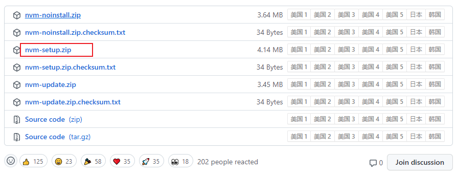
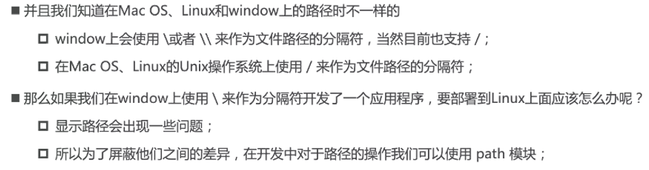

## 引入

源码：4- 44分

### 浏览器内核

 

事实上,我们经常说的浏览器内核指的是浏览器的排版引擎:

**排版引擎**( layout engine ) , 也称为**浏览器引擎**( browser engine )、**页面渲染引擎**( rendering engine )或**样版引擎**。

### 渲染引擎工作的过程

 

### JavaScript引擎

#### 以webkit内核为例

 

#### 以v8引擎为例


#### v8引擎的原理

 

### nodejs是什么

> 官方：node.js是一个**基于V8JavaScript引擎**的JavaScript运行时环境

node.js不是一门语言，不是库，不是框架，是一个JavaScript运行时环境，

简单点就是nodejs可以**解析和执行**JavaScript代码，以前只有浏览器可以解析和执行JavaScript代码，就是说现在JavaScript可以完全摆脱浏览器来运行，一切都归功于：nodejs

**Node.js里面没有BOM DOM，需要学习服务器级别的操作API**

### 浏览器和Node.js架构区别

 

 

### nodejs应用场景

 

### nodeJS版本选择及安装及安装多版本（nvm 和 n）

公司开发就使用LTS版本（稳定），学习就用current版本（支持的js新特性更多）

安装：

安装过程中会**配置环境变量**(让我们**可以在命令行使用**) ; 并且会安装`npm(Node Package Manager)`工具;

安装多版本node：

​    需要使用版本管理工具`n(Interactively Manage Your Node.js Versions交互式管理你的node版本)`或`nvm(Node Version Manager)`两个都不支持windows系统，n更简单好用

#### mac系统中[n](https://github.com/tj/n)的使用

直接使用npm全局安装`n`工具

```shell
npm i n -g
```

安装 Node.js 版本

只需执行`n <version>`下载并安装一个版本的 Node.js。如果`<version>`已经下载，`n`将从其缓存中安装。

```shell
# 安装10.16.0版本的node
n 10.16.0
# 安装最新lts版本的node
n lts
# 安装最新current版本的node
n latest

# 删除8.0.0版本的node
n rm 8.0.0
```

> mac系统如果安装需要权限，在前面加上`sudo`
>
> ```shell
> sudo n lts
> ```

`n` 执行n以查看您下载的版本，并切换安装选定的版本。

```shell
$ n

  node/4.9.1
ο node/8.11.3
  node/10.15.0

Use up/down arrow keys to select a version, return key to install, d to delete, q to quit
```

#### [nvm-windows](https://github.com/coreybutler/nvm-windows)的使用

nvm是不支持windows系统的，但是也有人开发出在windows系统中使用nvm切换node版本的工具`nvm-windows`

[github下载](https://github.com/coreybutler/nvm-windows/releases)

 

相关命令

```shell
# 查看nvm是否安装完成
nvm

# 查看已经安装的node版本列表
nvm list
# 查看可用的node版本列表
nvm list available


# 直接使用nvm安装指定版本的node开会很慢，可以添加淘宝镜像
# 这里你需要设置两个镜像，node的镜像和npm的镜像（安装node会顺带安装npm包管理工具）
# node镜像 
nvm node_mirror https://npm.taobao.org/mirrors/node/
# npm镜像
nvm npm_mirror https://npm.taobao.org/mirrors/npm/


# 注意：建议使用管理员身份运行终端来执行以下命令，跟mac系统使用sudo道理相同⭐

# 安装最新lts版本的node
nvm install lts
# 安装最新current版本的node
nvm install latest

# 卸载指定版本的node
nvm  uninstall <version>

# 指定版本：进行node版本切换
nvm use <version>
```

```shell
Microsoft Windows [版本 10.0.19044.1586]
(c) Microsoft Corporation。保留所有权利。

C:\Windows\system32>nvm list

    16.13.1

C:\Windows\system32>nvm use 16.13.1
Now using node v16.13.1 (64-bit)

C:\Windows\system32>nvm list

  * 16.13.1 (Currently using 64-bit executable)

C:\Windows\system32>nvm install latest
Downloading node.js version 17.7.2 (64-bit)...
Extracting...
Complete


Installation complete. If you want to use this version, type

nvm use 17.7.2

C:\Windows\system32>nvm list

    17.7.2
  * 16.13.1 (Currently using 64-bit executable)

C:\Windows\system32>nvm use 17.7.2
Now using node v17.7.2 (64-bit)

C:\Windows\system32>nvm list

  * 17.7.2 (Currently using 64-bit executable)
    16.13.1

C:\Windows\system32>nvm use 16.13.1
Now using node v16.13.1 (64-bit)

C:\Windows\system32>nvm list

    17.7.2
  * 16.13.1 (Currently using 64-bit executable)
```

### REPL的使用：交互式编程环境

REPL是Read-Eval-print Loop的简称，翻译为**读取-求值-输出 的循环**

浏览器中console输出界面可以`输入js代码然后执行`，这就是REPL

node中也可以像浏览器一样使用repl：输入命令 **node** 即可

 

## 基础

### 给node传递参数

```shell
# 执行node.js文件
node fileName
# 传递参数
node fileName aaa sasa

```

`process.argv`中获取传递的参数

```shell
PS C:\Users\leopai\Desktop\leopai_web_notes\nodejs> node .\00process.js aaa sasa
[
  'D:\\Program Files\\nodejs\\node.exe',
  'C:\\Users\\leopai\\Desktop\\leopai_web_notes\\nodejs\\00process.js',
  'aaa',
  'sasa'
]
```

### node程序输出（了解）

```js
// console.log(process)
console.log(process.argv)

//清除控制台
console.clear()

//输出警告
const names = 'Will Robinson'
console.warn(`Danger ${names}! Danger!`)

//输出错误
console.error(new Error('Whoops, something bad happened'))

//输出函数调用栈
function aaa() {
  console.trace()
}
aaa()

```

```shell
# console.trace()方法跟踪aaa函数的执行栈，可以查看aaa函数在某某文件中调用过
Trace
    at aaa (C:\Users\leopai\Desktop\leopai_web_notes\nodejs\00process.js:9:11)
    at Object.<anonymous> (C:\Users\leopai\Desktop\leopai_web_notes\nodejs\00process.js:11:1)
    at Module._compile (node:internal/modules/cjs/loader:1101:14)
    at Object.Module._extensions..js (node:internal/modules/cjs/loader:1153:10)
    at Module.load (node:internal/modules/cjs/loader:981:32)
    at Function.Module._load (node:internal/modules/cjs/loader:822:12)
    at Function.executeUserEntryPoint [as runMain] (node:internal/modules/run_main:81:12)
    at node:internal/main/run_main_module:17:47
    
Danger Will Robinson! Danger!

Error: Whoops, something bad happened
    at Object.<anonymous> (C:\Users\leopai\Desktop\leopai_web_notes\nodejs\00process.js:16:15)
    at Module._compile (node:internal/modules/cjs/loader:1101:14)
    at Object.Module._extensions..js (node:internal/modules/cjs/loader:1153:10)
    at Module.load (node:internal/modules/cjs/loader:981:32)
    at Function.Module._load (node:internal/modules/cjs/loader:822:12)
    at Function.executeUserEntryPoint [as runMain] (node:internal/modules/run_main:81:12)
    at node:internal/main/run_main_module:17:47
```

### 特殊的全局对象

这些对象其实是模块中的变量，只是每个模块里面都有，看起来是全局变量

包括：`__dirname、__filename、exports、module、require()`

`__dirname`当前文件所在的绝对路径

`__filename` 当前文件所在的绝对路径文件名

```js
console.log(__dirname)//C:\Users\leopai\Desktop\leopai_web_notes\nodejs
console.log(__filename)//C:\Users\leopai\Desktop\leopai_web_notes\nodejs\process.js
```

在命令行交互(REPL)中不可以使用

```shell
PS C:\Users\leopai\Desktop\leopai_web_notes\nodejs> node
Welcome to Node.js v16.13.1.      
Type ".help" for more information.
> __dirname
Uncaught ReferenceError: __dirname is not defined
> __filename
Uncaught ReferenceError: __filename is not defined
>
```

### [常见全局变量](https://nodejs.org/dist/latest-v16.x/docs/api/globals.html)

- [Class: `Buffer`](https://nodejs.org/dist/latest-v16.x/docs/api/globals.html#class-buffer)
- [`console`](https://nodejs.org/dist/latest-v16.x/docs/api/globals.html#console)
- [`Event`](https://nodejs.org/dist/latest-v16.x/docs/api/globals.html#event)
- [`exports`](https://nodejs.org/dist/latest-v16.x/docs/api/globals.html#exports)
- [`global`](https://nodejs.org/dist/latest-v16.x/docs/api/globals.html#global)
- [`module`](https://nodejs.org/dist/latest-v16.x/docs/api/globals.html#module)
- [`process`](https://nodejs.org/dist/latest-v16.x/docs/api/globals.html#process)
- [`require()`](https://nodejs.org/dist/latest-v16.x/docs/api/globals.html#require)
- [`setImmediate(callback[, ...args\])`](https://nodejs.org/dist/latest-v16.x/docs/api/globals.html#setimmediatecallback-args)
- [`setInterval(callback, delay[, ...args\])`](https://nodejs.org/dist/latest-v16.x/docs/api/globals.html#setintervalcallback-delay-args)
- [`setTimeout(callback, delay[, ...args\])`](https://nodejs.org/dist/latest-v16.x/docs/api/globals.html#settimeoutcallback-delay-args)
- [`URL`](https://nodejs.org/dist/latest-v16.x/docs/api/globals.html#url)

以上仅为部分

#### process

process提供了Node进程中相关信息

比如`Node运行环境、参数信息`

在项目中，可以将一些环境变量读取到`process的env中`

#### console

#### 计时器对象

```js
//计时器相关对象
setTimeout(() => {
  console.log('setTimeout')
}, 0)
setInterval(() => {
  console.log('setInterval')
}, 5000)
//setTimeout时间设置为0和setImmediate是有区别的
setImmediate(() => {
  console.log('setImmediate')
})
//下一帧执行
process.nextTick(() => {
  console.log('process.nextTick')
})

//还有与之对应的取消定时器的对象
```

#### global

global对象与浏览器中的window对象类似，如果一个属性不方便获取，可以使用`global.属性名`来获取

区别：浏览器中定义变量会直接成为window的属性，node中不会成为global的属性，因为浏览器中没有模块的概念，所以会直接吧变量放到window对象中，但是node中每一个js文件都是一个单独的模块，定义的变量只属于这个模块但是不属于全局

```js
const name = 'aaaaaa'
console.log(name) //aaaaaa
console.log(global.name) //undefined
```

> 控制台输出来查看global全局对象的属性是不全的，可以在node的repl交互中敲**`global. `再按两次tab键查看** 
>
> ```shell
> PS C:\Users\leopai\Desktop\leopai_web_notes\nodejs> node
> Welcome to Node.js v16.13.1.
> Type ".help" for more information.
> > global.
> global.__proto__             global.hasOwnProperty        global.isPrototypeOf         global.propertyIsEnumerable  global.toLocaleString
> global.toString              global.valueOf
> 
> global.constructor
> 
> global.AbortController       global.AbortSignal           global.AggregateError        global.Array                 global.ArrayBuffer
> global.Atomics               global.BigInt                global.BigInt64Array         global.BigUint64Array        global.Boolean
> global.Buffer                global.DataView              global.Date                  global.Error                 global.EvalError
> global.Event                 global.EventTarget           global.FinalizationRegistry  global.Float32Array          global.Float64Array
> global.Function              global.Infinity              global.Int16Array            global.Int32Array            global.Int8Array
> global.Intl                  global.JSON                  global.Map                   global.Math                  global.MessageChannel
> global.MessageEvent          global.MessagePort           global.NaN                   global.Number                global.Object
> global.Promise               global.Proxy                 global.RangeError            global.ReferenceError        global.Reflect
> global.RegExp                global.Set                   global.SharedArrayBuffer     global.String                global.Symbol
> global.SyntaxError           global.TextDecoder           global.TextEncoder           global.TypeError             global.URIError
> global.URL                   global.URLSearchParams       global.Uint16Array           global.Uint32Array           global.Uint8Array
> global.Uint8ClampedArray     global.WeakMap               global.WeakRef               global.WeakSet               global.WebAssembly
> global._                     global._error                global.assert                global.async_hooks           global.atob
> global.btoa                  global.buffer                global.child_process         global.clearImmediate        global.clearInterval
> global.clearTimeout          global.cluster               global.console               global.constants             global.crypto
> global.decodeURI             global.decodeURIComponent    global.dgram                 global.diagnostics_channel   global.dns
> global.domain                global.encodeURI             global.encodeURIComponent    global.escape                global.eval
> global.events                global.fs                    global.global                global.globalThis            global.http
> global.http2                 global.https                 global.inspector             global.isFinite              global.isNaN
> global.module                global.net                   global.os                    global.parseFloat            global.parseInt
> global.path                  global.perf_hooks            global.performance           global.process               global.punycode
> global.querystring           global.queueMicrotask        global.readline              global.repl                  global.require
> global.setImmediate          global.setInterval           global.setTimeout            global.stream                global.string_decoder
> global.sys                   global.timers                global.tls                   global.trace_events          global.tty
> global.undefined             global.unescape              global.url                   global.util                  global.v8
> global.vm                    global.wasi                  global.worker_threads        global.zlib
> ```

### JavaScript模块化

 

node中的js有重要的概念：`模块系统`

`require`加载模块     `exports`导出模块

#### commonjs和node

 

```js
//没有模块化的时候实现模块化可以使用IIFE
const moduleAAA = (function () {
  var name = 'wang'
  var age = 18
  return {
    name: name,
    age: age,
  }
})()
//这样把文件嵌入到html文件当中，其他的js文件就可以使用moduleAAA.name来使用了
```

#### exports和module.exports

每个模块里面原本都有一个`exports空对象`，通过添加（导出）属性供别的模块使用

`moo = require('./导出的文件名')`对象是exports对象的浅拷贝（浅拷贝就是引用赋值）

 

> `exports是commonjs里面要求exports作为导出，而node中增加了module.exports`
>
> 每个模块中都有一个module对象，真正导出的是module对象里面的exports

```js
// module.exports === exports      node内部语句（在顶层）
console.log(module.exports === exports) //true

exports.aa = 'aa'
exports.fn = function (x, y) {
  return x + y
}

/*
不要写 exports = {}这种语句，不管用，因为commonjs模块化内部默认语句是在文件最底部最终导出的是 ：return module.exports，如果那样写是将exports指向另一个对象，导出的不是我们想要的，所以一般导出多个是使用
module.exports={...}

记住最终导出的是module.exports即可⭐，如果module.exports重新赋值（指向一个新对象），则exports方法导出就无效
一般不会混合使用
*/
//导出多个接口成员
exports.xx1 = xxx
exports.xx2 = xxx
exports.xx3 = xxx
//或
module.exports = { xx1, xx2, xx3 }

//导出单个接口成员
module.exports.xx = xxx

/**
 * 导入：const moo = require(‘./导出的文件名’)
 * require(‘./导出的文件名’) 返回的就是导出的那个对象
 * 所以可以直接使用moo.xxx来使用导出的属性
 */
```

#### require细节

require是一个函数，导入格式：require（X）

* 1、X是一个`核心模块`，比如path、http会直接返回核心模块，并停止查找

* 2、X是以**./**或 **../**或 **/**（根目录）开头的     //自定义模块，前两个是相对路径，从自身文件的相对文件查找，后面一个是绝对路径，会从整个计算机查找

  * 将X作为一个文件在对应目录下查找
    * 文件有后缀名，会根据后缀名格式来查找
    * 没有后缀名，会按照`文件X > X.js > X.json > X.node`这个顺序来查找
  * 没有找到对应文件，将X作为一个目录来查找
    * 查找目录下的`index文件`，按照`X/index.js > X/index.json > X/index.node`这个顺序来查找
  * 没有找到就报错：Not Found

* 3、直接是一个X（没有路径），并且X不是一个核心模块

  * 会先看X是不是核心模块，如果不是，`会从当前文件所在目录下的node_modules文件夹开始查找，在逐层往上查找，直到根目录下的node_modules文件夹，没有找到则报错：Not Found`

    > node中每个js文件都是一个module对象，当前在`commonjs/require.js`中写了`require('X')`，会遍历paths数组，逐层往上查找模块X

    ```shell
    console.log(module)👇👇
    
    Module {
      id: '.',
      path: 'C:\\Users\\leopai\\Desktop\\leopai_web_notes\\nodejs\\commonjs',
      exports: {},
      filename: 'C:\\Users\\leopai\\Desktop\\leopai_web_notes\\nodejs\\commonjs\\require.js',
      loaded: false,# 模块是否被加载了，被加载过，变成true，之后再次require('该模块')会直接从缓存中取
      children: [],
      paths: [
        'C:\\Users\\leopai\\Desktop\\leopai_web_notes\\nodejs\\commonjs\\node_modules',
        'C:\\Users\\leopai\\Desktop\\leopai_web_notes\\nodejs\\node_modules',
        'C:\\Users\\leopai\\Desktop\\leopai_web_notes\\node_modules',
        'C:\\Users\\leopai\\Desktop\\node_modules',
        'C:\\Users\\leopai\\node_modules',
        'C:\\Users\\node_modules',
        'C:\\node_modules'
      ]
    }
    ```

#### commonjs规范缺点

 

#### commonjs模块加载过程

commonjs加载过程是同步的，es module加载是异步的

* 结论一：模块在被加载第一次时，模块中的代码会被运行一次

```js
require('./index') //先运行里面的代码

console.log(module) //后执行
```

* 结论二：模块在被引入多次时，会缓存，最终只加载一次，优先从缓存加载

`module.loaded = true`	

 

* 结论三：循环引入，那么加载顺序是什么

 

此数据结构为`图结构`，执行main.js：

* 先执行`require('./aaa')`,则`main > aaa > ccc > ddd > eee > bbb`
* 先执行`require('./bbb')`,则`main > bbb > ccc > ddd > eee > aaa`

跟`模块引入顺序`和`模块是否已被加载`有关，并非深度优先算法

### ES Module

ES Module采用export和import关键字实现模块化

ES Module采用了`严格模式 use strict`

ES Module采用编译期的静态分析，并且也加入看了动态引用的方式 

#### 模块化导出导入方式

导出：

 ```js
 //方式一
 export const name = 'yang'
 export const age = '22'
 export function outPut() {
   console.log('hahaha')
 }
 //方式二  注意：export后面的`花括号不是对象`⭐
 export { name, age, outPut }
 
 //方式三  起别名
 export { name as Aname, age as Aage, outPut as AoutPut }
 
 //方式四: 可以跟上面同时存在，但是只能有一个export default⭐
 //默认导出，导入时可以自定义名字来使用它
 export default function () {
   console.log(111)
 }
 ```

导入：

```js
//方式一
import { name, age, outPut } from './aaa.js'

//方式二  起别名： 导出时起别名这里还可以起，
import {
  Aname as AAAname,
  Aage as AAAage,
  AoutPut as AAAoutPut,
} from './aaa.js'

//方式三  * 统一导入放入对象中
import * as obj from './aaa.js'
```

导入并直接导出

当自己封装或开发功能库时，通常将暴露的接口放在一个文件中，这样方便统一接口规范，也方便阅读

```js
export { Aname, Aage, AoutPut } from './aaa.js'
```

#### html文件中使用模块化

 

在HTML文件中使用模块化要在`script`标签中加上`type="module"`，并且开启一个`服务`来运行这个html文件，否则无效（跨域问题）

#### 函数 import()

通过import加载一个模块`不可以放到逻辑代码中`，可以使用**import()函数**

> 不能把import关键字放在运行代码当中，因为ES Module在被js**解析的时候，就必须知道它的依赖关系**，由于这个时候js文件`没有任何的运行`，所以无法进行类似于if判断中代码的执行情况，，但是有些情况我们希望`动态`的来加载某一个模块，这时可以使用import()函数

js引擎解析和执行：`parsing（解析）=>AST => 字节码=>二进制=>代码执行`

import函数返回的是一个`promise`，后面接上then拿到导入的接口数据

```js
const mark = false
if(mark){
    // console.log(111);
}else{
    import('./index.js').then(res=>{
        console.log(res);//./index.js文件中所有导出的模块
    })
}
```

**require（''）可以在if语句中使用是因为require本身就是一个函数，是在`执行（运行）`阶段**

#### es module模块加载过程

 

使用export导出name=‘aaa’，1秒钟之后把name赋值为”bbb”，则2秒钟之后import得到的name是bbb    //export后面导出的花括号不是对象，与commonjs不一样

```js
let name = 'aaa'
setTimeout(() => {
    name = 'dddddd'
}, 1000)
//es modules
export {
    name //这里两秒钟之后改成了dddddd，那2秒钟后另一个模块引用的name值也会变成dddddd
}
//commonjs
moudle.exports = {
    name //这里导出的是一个对象，并且对象里面的属性叫name，相当于name:name,只是把变量name改掉了，而不是改掉了name属性，所以2秒中后还是aaa
}

```

```js
let name = "aaa";

//模块一导出name
export {
  name,
};
//模块二引入name
// import {name} from ...

//如果name是基本数据类型，不允许修改，语法错误
// 如果name是引用数据类型，可以修改里面的属性，并且修改过后，模块一中拿到的是模块二修改后的数据（指向同一个地址）⭐
```

#### Node对ES Module的支持

 

### Commonjs和ES Module交互

> node中的模块化使用的是commonjs，如果在node中使用es module，那么文件扩展名要使用 **.mjs**才能够正确运行

不是绝对的，看平台

 

### 常见内置模块path、fs、events

#### path



文件路径拼接：

​	**path.resolve('路径'，'文件名')**

​	**path.join('路径'，'文件名')**

获取文件路径信息：

​    **path.dirname('文件完整路径')**

​	**path.basename('文件完整路径')**

​	**path.extname('文件完整路径')**  

```js
const path = require('path')

const basePath = '../fea1/node'
const fileName = 'aaa.js'
// 1、路径的拼接path.resolve()和path.join()    //resolve用的多
//path.resolve()会判断路径拼接的字符串中是否有/或./或../开头的路径，获取的是该路径所在的绝对路径，更加灵活，但是path.join()会直接拼接
const filePath1 = path.resolve(basePath, fileName)
console.log(filePath1) //D:\node\node练习\fea1\node\aaa.js
const filePath2 = path.join(basePath, fileName)
console.log(filePath2) //..\fea1\node\aaa.js

//1
const basePath = '../fea1/node'
const fileName = '/aaa.js' // /开头
const filePath1 = path.resolve(basePath, fileName)//D:\aaa.js

//2
const basePath = '../fea1/node'
const fileName = './aaa.js' // ./开头
const filePath1 = path.resolve(basePath, fileName)//D:\node\node练习\fea1\node\aaa.js

//3
const basePath = '../fea1/node'
const fileName = '../aaa.js' // ../开头,会找到上一层
const filePath1 = path.resolve(basePath, fileName)//D:\node\node练习\fea1\aaa.js


//2、获取路径相关信息
const filePath3 = 'node/aaa/haha.txt'
console.log(path.dirname(filePath3)) //获取路径前面的文件夹信息 node/aaa
console.log(path.basename(filePath3)) //获取后面的文件信息 haha.txt
console.log(path.extname(filePath3)) //获取文件扩展名信息 .txt
```

#### fs

`__dirname` 总是指向被执行 js 文件的`绝对路径`，所以当你在 `/d1/d2/myscript.js` 文件中写了 `__dirname`， 它的值就是 `/d1/d2` 。

 

文件系统的API大多提供三种操作方式

 

* 获取文件信息

  ```js
  const fs = require('fs')
  //案例：读取文件信息
  const filePath = './fs文件读取.txt' //文件路径
  
  //方式一：同步操作
  const info = fs.statSync(filePath)
  console.log('info',info)
  console.log('阻塞')
  
  
  //方式二：异步操作
  fs.stat(filePath, (err, stats) => {
    if (err) {
      console.log(err)
      return
    }
    console.log('stats',stats)
  })
  console.log('异步，不会被阻塞')
  
  
  //方式3：peomise操作
  fs.promises
    .stat(filePath)
    .then((data) => {
      console.log(data)
    })
    .catch((err) => {
      console.log(err)
    })
  console.log('promise异步操作，不会阻塞')
  ```

  文件描述符fd⭐

   

  ```js
  // 方式四：先获取文件描述符，再根据文件描述符来操作某一个文件
  fs.open(filePath, (err, fd) => {
    if (err) return
    console.log(fd) //文件描述符
    fs.fstat(fd, (err, info) => {
      console.log(info) //文件信息
    })
  }) 
  ```

* 文件的读写 

  ```js
  const fs = require('fs')
  
  //文件写入
  const content = '你好啊利益和'
  fs.writeFile('./fs文件读取.txt', content, { flag: 'a' }, (err) => {
    //第三个参数可选，flag选项
    console.log(err) //为null就写入成功
  })
  
  // 文件读取
  fs.readFile('./fs文件读取.txt', { encoding: 'utf-8' }, (err, data) => {
    //可选参数encoding指定字符编码，默认utf-8
    console.log(data)
    console.log('文件读取成功')
  })
  ```

  常见flag选项

   

  [字符编码详解](https://www.jianshu.com/p/899e749be47c)

* 文件夹操作

  ```js
  const fs = require('fs')
  const path = require('path')
  
  
  //1.创建文件夹
  const dirName = './创建的文件夹'
  //先判断这个文件夹存不存在
  if (!fs.existsSync(dirName)) { //fs.existsSync()判断文件夹存不存在（同步）
      fs.mkdir(dirName, err => { //fs.mkdir()创建文件夹
          console.log('文件夹创建成功');
      })
  }
  
  //2.读取文件夹中的所有文件
  //withFileTypes可选参数，默认为false，使读取的文件名或文件夹名为对象方式存在，以对象方式存在就可以调用isFile()和isDirectory()
  fs.readdir(dirName, { withFileTypes: true }, (err, files) => {
      console.log(files);
  })
  
  //读取文件夹中的所有文件，如果文件夹中还有文件夹，也都读取
  //fs.readdirSync() 同步读取
  function getFiles(dirName) {
      fs.readdir(dirName, { withFileTypes: true }, (err, files) => {
          files.forEach(item => {
              if (item.isDirectory()) { //item.isDirectory()是文件夹返回true
                  const filePath = path.resolve(dirName, item.name)
                  getFiles(filePath) //如果是文件夹，递归调用
              } else {
                  console.log(item.name)
              }
          })
      })
  }
  getFiles(dirName)
  
  // 3.重命名
  fs.rename('./创建的文件夹','./新名字',(err,info)=>{
      if(err) return
      console.log(info);
      console.log(info.isDirectory());
      console.log(info.isFile());
  })
  ```

#### events

```js
const EventEmitter = require('events')
//创建发射器
const emitter = new EventEmitter()
//监听发出的click事件
// on是addListener的alias
emitter.on('click', (arg1, arg2) => {
    console.log("监听1", arg1, arg2);
})
const listener = arg1 => {
    console.log("监听2", arg1);
}
emitter.on('click', listener)
setTimeout(() => {
    emitter.off('click', listener) //取消对指定事件的监听
    //发出click事件
    emitter.emit('click', '信息1', '信息2')
}, 2000)
```


## express

## koa

## express和koa对比


 