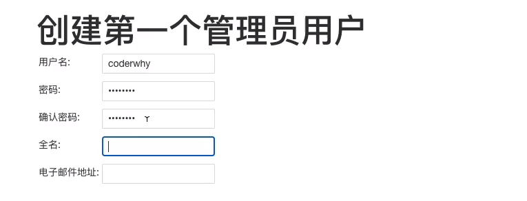

# 项目打包和自动化部署

## 一. 项目部署和DevOps

### 1.1. 传统的开发模式

在传统的开发模式中，开发的整个过程是按部就班就行：


但是这种模式存在很大的弊端：

* 工作的不协调：开发人员在开发阶段，测试和运维人员其实是处于等待的状态。等到测试阶段，开发人员等待测试反馈bug，也会处于等待状态。
* 线上bug的隐患：项目准备交付时，突然出现了bug，所有人员需要加班、等待问题的处理；


### 1.2. DevOps开发模式

DevOps是Development和Operations两个词的结合，将开发和运维结合起来的模式：


### 1.3. 持续集成和持续交付

伴随着DevOps一起出现的两个词就是持续集成和持续交付(部署)：

* CI是Continuous Integration（持续集成）；
* CD是两种翻译：Continuous Delivery（持续交付）或Continuous Deployment（持续部署）；

持续集成CI：


持续交付和持续部署：


### 1.4. 自动化部署流程


## 二. 购买云服务器

### 2.1. 注册阿里云的账号

云服务器我们可以有很多的选择：阿里云、腾讯云、华为云。

* 目前在公司使用比较多的是阿里云；
* 我自己之前也一直使用阿里云，也在使用腾讯云；
* 之前华为云也有找我帮忙推广他们的活动；

但是在我们的课程中，我选择目前使用更加广泛的阿里云来讲解：

我们需要注册阿里云账号

* https://aliyun.com/

* 注册即可，非常简单


### 2.2. 购买云服务器

购买云服务器其实是购买一个实例。

#### 1.来到控制台：


#### 2.创建实例，选择类型和配置


>服务器即相当于一台电脑，电脑需要安装操作系统，一般，服务器安装的操作系统是`Linux`操作系统（更稳定），你可以安装`乌班图Ubuntu`，但是现在用`centos`的比较多，版本选择8.x的版本（稳定），
>
>8.x的centos版本自带`dnf工具（管理操作系统中包的一个工具）`，安装软件的时候更好用，
>
>7.x的centos版本使用的是`yum`工具，但是你也可以使用这个工具去安装一下dnf工具，进而使用

#### 3.配置网络安全组


> 安全组：安全组是一种虚拟防火墙，具备有状态的数据包过滤功能，用于设置云服务器、负载均衡、云数据库等实例的网络访问控制，控制实例级别的出入流量，是重要的网络安全隔离手段。您可以通过配置安全组规则，允许或禁止安全组内的实例的出流量和入流量。就是控制哪些端口可以访问

#### 4.系统配置

配置登录远程服务器使用的登陆凭证


#### 5.创建实例


### 2.3远程连接云服务器⭐

远程服务器centos操作系统没有图形化界面

mac中使用终端，windows中建议使用`git bash`，因为在cmd中无法直接使用`ssh`，

```shell
ssh root@公网IP地址
# 生成key
yes
# 输入密码（登陆凭证）
...
```


 这样即表示来到了服务器`root目录`，在这里搭建环境

## 三. 搭建服务器环境

远程连接云服务器之后，我们需要搭建服务器环境

服务器安装环境我们需要使用dnf工具，centos8.x版本自带dnf工具，你可以输入命令查看此工具详情

```shell
dnf
```

### 3.1. jenkins自动化部署

#### 3.1.1. 安装Java环境

Jenkins本身是依赖Java的，所以我们需要先安装Java环境：

* 这里我安装了Java1.8的环境

```shell
# dnf仓库里面有对应的java包，先搜索java-1.8版本看看
dnf search java-1.8
# 安装
dnf install java-1.8.0-openjdk.x86_64
# 查看安装结果
java
```


#### 3.1.2. 安装Jenkins

因为Jenkins本身是没有在dnf的软件仓库包中的，所以我们需要连接Jenkins仓库：

* wget是Linux中下载文件的一个工具，-O表示输出到某个文件夹并且命名为什么文件；
* rpm：全称为**The RPM Package Manage**，是Linux下一个软件包管理器；

```shell
# 必须下载到/etc/yum.repos.d/，后面是名字
wget –O /etc/yum.repos.d/jenkins.repo http://pkg.jenkins-ci.org/redhat-stable/jenkins.repo
# 使用ls查看目录下的所有内容，如果你发现位置不对，需要使用mv命令移动到/etc/yum.repos.d/，因为必须下载到这里
mv jenkins.repo /etc/yum.repos.d/

# 安装之前验证合法性：导入GPG密钥以确保您的软件合法
rpm --import https://pkg.jenkins.io/redhat/jenkins.io.key
# 或者
rpm --import http://pkg.jenkins-ci.org/redhat/jenkins-ci.org.key
```

验证合法性之后直接安装依然不能安装的话可能这个文件有问题，编辑一下文件/etc/yum.repos.d/jenkins.repo（进入到这个文件夹使用`vi`命令编辑文件）

 

* 可以通过vim编辑（进入该文件，点击`i`键之后即可编辑）

```
[jenkins]

name=Jenkins-stable

baseurl=http://pkg.jenkins.io/redhat

gpgcheck=1
```

> vim基本操作：编辑完成之后，点击`esc`，点击`shift`+`:`，输入wq，回车，意思是保存并退出文件

安装Jenkins

```shell
dnf install jenkins # --nogpgcheck(可以不加)
```

启动Jenkins的服务：

```shell
# 启动
systemctl start jenkins
# 查看是否启动
systemctl status jenkins
# 使用此命令让jenkins随着我的操作系统的启动而启动
systemctl enable jenkins
```

Jenkins是有图形化界面供使用的，浏览器访问`公网IP地址+8080`(Jenkins默认使用8080端口提供服务，所以需要将8080端口加入到安全组中)


> 安装完之后建议跳到`3.2`先看nginx

#### 3.1.3. Jenkins用户

我们后面会访问centos中的某些文件夹，默认Jenkins使用的用户是 `jenkins`，可能会没有访问权限，所以我们需要修改一下它的用户：

修改文件的路径：`/etc/sysconfig/jenkins`


之后需要重启一下Jenkins：

```shell
systemctl restart jenkins
```


#### 3.1.4. Jenkins配置

打开浏览器，输入：http://8.134.60.235:8080/

* 注意：你输入自己的IP地址

获取输入管理员密码：

* 在下面的地址中 `cat /var/lib/jenkins/secrets/initialAdminPassword`


可以安装推荐的插件：


刚刚我们使用的事admin用户，密码很长，可以自己创建一个管理员用户



#### 3.1.5. Jenkins任务

**新建任务：**


**配置项目和保留策略：**


**源码管理：**注意：这里我们使用git进行代码管理，连接仓库，但是`远程服务器没有安装git`

```shell
dnf install git
```

> credentials是添加认证，这里我们可以选择认证方式，如果你选择用户名的话，需要搭配`token`来认证（github>settings>developer settings>personal assess tokens），好像在2021.08.10几号的时候密码认证在多处已经无效了，使用token代替密码即可


**构建触发器：**

这里的触发器规则是这样的：

* 定时字符串从左往右分别是：分 时 日 月 周

```js
#每半小时构建一次OR每半小时检查一次远程代码分支，有更新则构建
H/30 * * * *

#每两小时构建一次OR每两小时检查一次远程代码分支，有更新则构建
H H/2 * * *

#每天凌晨两点定时构建
H 2 * * *

#每月15号执行构建
H H 15 * *

#工作日，上午9点整执行
H 9 * * 1-5

#每周1,3,5，从8:30开始，截止19:30，每4小时30分构建一次
H/30 8-20/4 * * 1,3,5
```


**构建环境：**

注意：我们需要搭建Node的环境

* 第一步：配置Node的环境；
* 第二步：安装Node的插件； 这里第一步和第二步写反了


第一步：配置Node的环境


第二步：安装Node的插件

* 这里因为我已经安装过了，所以没有搜索到；


构建执行的任务：

* 查看Node的版本等是否有问题；
* 执行 `npm install` 安装项目的依赖；
* 移除原来mall_cms文件的所有内容；
* 将打包的dist文件夹内容移动到mall_cms文件夹；

```shell
#查看当前所在位置
pwd
node -v
npm -v

# github中没有node_modules
npm install 
npm run build

pwd

echo '构建成功'

ls

# 删除/root/mall_cms文件夹里所有的内容
rm -rf /root/mall_cms/* 
# 拷贝
cp -rf ./dist/* /root/mall_cms/
```


配置完之后可以点击立即构建测试一下

### 3.2. nginx安装和配置

#### 3.2.1. 安装nginx

后续我们部署会使用nginx，所以需要先安装一下nginx：

```shell
dnf install nginx
```

启动nginx：

```shell
systemctl start nginx
systemctl status nginx
systemctl enable nginx
```

你可以使用`systemctl status nginx`来验证nginx是否启动成功，也可以在浏览器中访问`你的公网IP:80`来验证是否成功⭐


你访问其实就是这个html页面，`/usr/share/nginx/html/index.html`

#### 3.2.2. 配置nginx

终端中使用vim配置不方便，我们在vsc编辑器中进行配置

#### 1.在vsc中连接远程服务器，使用插件


插件安装完成之后左侧会多出一个tab，点击`+`新建连接，输入命令进行连接


右击，在当前窗口连接远程主机


输入密码之后左下角出现这个即连接成功，连接成功之后vsc中打开的终端也是远程的

#### 2.配置nginx

打开nginx配置文件

Open Folder，`/etc/nginx/nginx.cinf`

我们这里主要配置nginx的用户和默认访问目录：

配置用户：


通过Linux命令创建文件夹和文件：

```shell
mkdir /root/mall_cms
cd /root/mall_cms
touch index.html

vi index.html
```


配置访问目录：


配置完成之后必定要重启nginx

```shell
systemctl restart nginx
```

### 3.3持续部署

我们使用jenkins来连接远程的github项目地址，之后我们每次打包上传完就会自动部署，见`3.1.5jenkins任务 `
