## React邂逅

### 起源

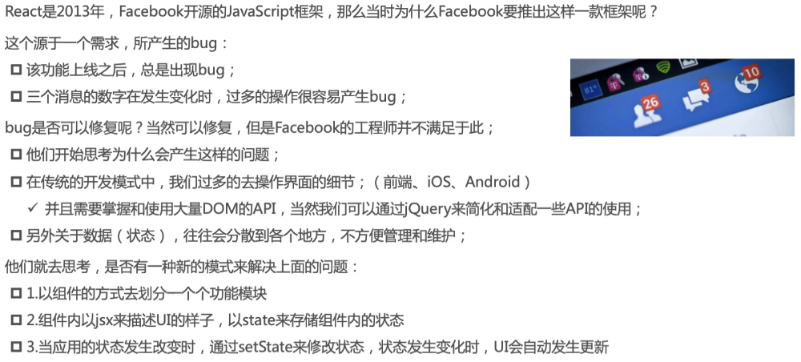 

### 特点

#### 声明式编程

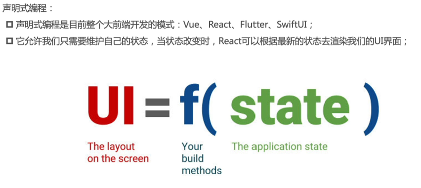 

#### 组件化开发

#### 多平台适配

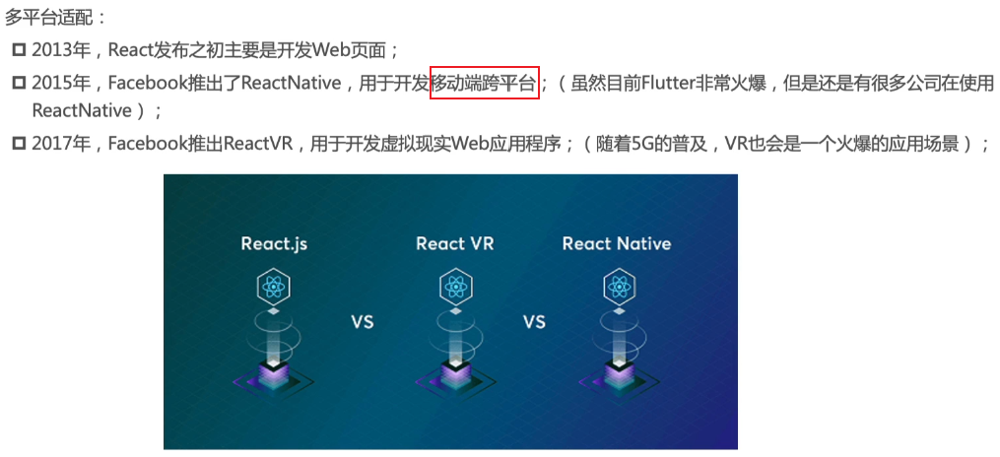 

## Hello Eeact

### react开发依赖

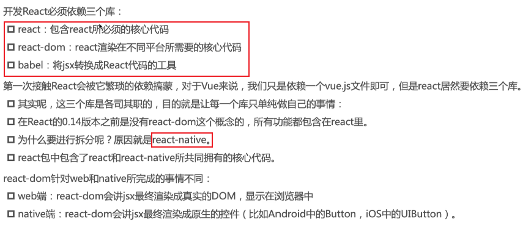 

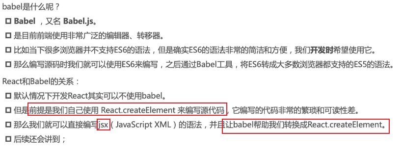 

### 第一个react案例

```js
  <body>
    <div id="app">内容被覆盖</div>
    <!-- crossorigin：本地显示远程js包的错误信息 -->
    <script
      src="https://unpkg.com/react@18/umd/react.development.js"
      crossorigin
    ></script>
    <script
      src="https://unpkg.com/react-dom@18/umd/react-dom.development.js"
      crossorigin
    ></script>
    <script src="https://unpkg.com/babel-standalone@6/babel.min.js"></script>

    <!-- 默认不能在script中使用jsx，如果想使用，并且希望代码被解析，必须在script标签上加上 type="text/babel" ⭐ -->
    <!-- jsx特点：根元素只能有一个标签 -->
    <!-- 点击执行handleClick方法，会将message改变，但视图不会立即更新，需要重新渲染jsx⭐ -->
    <script type="text/babel">
      //<h2>hello react</h2>就是jsx
      let message = 'hello world'
      function handleClick() {
        message = 'hello react'
        render()
      }
      function render() {
          
      const root = ReactDOM.createRoot(document.getElementById("app"))
      root.render(
          <div>
            <h2>{message}</h2>
            <button onClick={handleClick}>改变文本</button>   
          </div>,
          document.getElementById('app')
        )
      }
      render()
    </script>
  </body>
```

```js
  <body>
    <div id="app"></div>
    <script
      src="https://unpkg.com/react@18/umd/react.development.js"
      crossorigin
    ></script>
    <script
      src="https://unpkg.com/react-dom@18/umd/react-dom.development.js"
      crossorigin
    ></script>
    <script src="https://unpkg.com/babel-standalone@6/babel.min.js"></script>
    <script type="text/babel">
      // 子组件
      class App extends React.Component {
        constructor() {
          super()
          //想要数据被修改的同时视图更新，要将数据放在state对象中⭐
          this.state = {
            message: 'hello world',
          }
        }
        // render函数永远不会手动调用
        render() {
          // 括号无特殊作用，将内部内容看成一个整体
          return (
            <div>
              <h2>{this.state.message}</h2>
              <button onClick={this.handleClick.bind(this)}>改变文本</button>
            </div>
          )
        }
        handleClick() {
          //修改state数据
          this.setState({
            message: 'hello react',
          })
        }
      }
      //React中组件名称必须以大写字母开头。⭐ React 会将以小写字母开头的组件视为原生 DOM 标签。
      const root = ReactDOM.createRoot(document.getElementById("app"))
      root.render(<App />)
    </script>
  </body>
```

> React18之前:
>
> ​	`ReactDOM.render(<App />, document.getElementById("app"))`
>
> React18:
>
> ​	 `const root = ReactDOM.createRoot(document.getElementById("app"))
>       root.render(<App />)`

## react核心概念

### JSX

jsx语法只有在`引入babel`和script标签上有`type="text/babel"`属性的时候才可以使用，直接在script中使用就是错误的语法

```jsx
const com = <h4>hello world</h4>
```

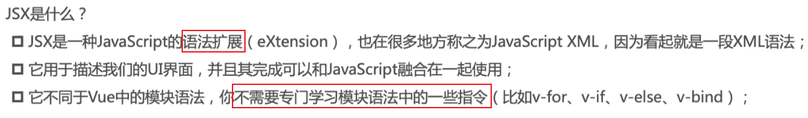 

为什么react选择jsx：`all in js`设计哲学

jsx书写规范：

* 顶层只能有一个根标签
* 通常在jsx外层包裹一个小括号，便于阅读、换行书写
* jsx中标签可以是单标签，也可以是双标签，但是单标签一定要以`/>`结尾

 #### jsx注释

```jsx
{/*这是jsx的注释*/}
```

#### jsx嵌入数据

* 可以展示的Number、String、Array
* 不能正常展示null，undefined、布尔值，要转化成`字符串`
* 对象类型不能作为jsx子元素

```js
    <script type="text/babel">
      class App extends React.Component {
        constructor() {
          super()
          this.state = {
            //{}中可以展示的Number、String、Array
            num: 1,
            str: 'haha',
            arr: ['das', 'fgsd', 'gd'],

            //{}中不能正常展示的（忽略）
            nu: null,
            unde: undefined,
            boo: true,

            //对象类型不能作为jsx子元素
            obj: {
              aaa: 'fasfs',
            },
          }
        }
        render() {
          return (
            <div>
              <h4>{this.state.num}</h4>
              <h4>{this.state.str}</h4>
              <h4>{this.state.arr}</h4>

              <h4>{String(this.state.nu)}</h4>
              <h4>{String(this.state.unde)}</h4>
              <h4>{this.state.boo.toString()}</h4>
              <h4>{this.state.boo + ''}</h4>

              {/*<h4>{this.state.obj}</h4>*/}
            </div>
          )
        }
      }
      const root = ReactDOM.createRoot(document.getElementById("app"))
      root.render(<App />)
    </script>
```

#### jsx嵌入表达式

```jsx
{/*表达式*/}
<h4>{this.state.num + this.state.str}</h4>
<h4>{20 * 90}</h4>
<h4>{this.state.num === 1 ? '发射' : '哈哈'}</h4>
<h4>{this.add()}</h4>
```

#### jsx绑定元素的属性

* `className={'box wrap ' + (isActive ? 'active' : '')}`
* `style={{key: value,}}`

> jsx里面不能存在js关键字，像class属性，for属性都是关键字⭐，class用className代替，for用htmlFor代替

```jsx
    <script type="text/babel">
      class App extends React.Component {
        constructor() {
          super()
          this.state = {
            title: 'hahah',
            src: 'http://p4.music.126.net/sjyk0uNtgH9-ZCM6djXR5g==/109951167039788611.jpg?param=200y200',
            hrefs: 'http://www.baidu.com',
            isActive: true,
            fontSize: '14px',
          }
        }
        render() {
          const { title, src, hrefs, isActive, fontSize } = this.state
          function formatSrc(e) {
            return e
          }
          return (
            <div>
              {/*绑定普通属性*/}
              <h4 title={title}>标题</h4>
              
              
              <a href={hrefs} target="_blank">
                百度
              </a>
              {/*动态绑定class属性*/}
              {/*jsx里面不能存在js关键字，像class属性，for属性都是关键字⭐，class用className代替，for用htmlFor代替*/}
              <div className={'box wrap ' + (isActive ? 'active' : '')}>
                动态绑定class
              </div>
              <label htmlFor="aaa"></label>

              {/*动态绑定style属性⭐*/}
              {/*里面的{}是对象，style属性以键值对的形式存在*/}
              <div style={{ color: 'red', fontSize: fontSize }}>
                动态绑定style
              </div>
            </div>
          )
        }
      }
      const root = ReactDOM.createRoot(document.getElementById("app"))
      root.render(<App />)
    </script>
```

#### jsx绑定事件

事件使用`小驼峰式`，而不是原生的`小写方式`

this绑定有三种方式

```jsx
    <script type="text/babel">
      class App extends React.Component {
        constructor() {
          super()
          this.state = {
            title: 'hahah',
          }
          this.handleClick1 = this.handleClick1.bind(this) //方式一：this显示绑定
        }
        render() {
          return (
            <div>
              <button onClick={this.handleClick1}>提交</button>
              <button onClick={this.handleClick2}>提交</button>
              {/*方式三：箭头函数中调用需要执行的函数⭐(推荐使用)*/}
              <button
                onClick={() => {
                  this.handleClick3()
                }}
              >
                提交
              </button>
            </div>
          )
        }
        handleClick1() {
          console.log('handleClick1')
        }
        //ES6中给对象增加属性的语法，class fields⭐
        handleClick2 = () => {
          console.log('handleClick2')
        } //方式二：箭头函数
        handleClick3() {
          console.log('handleClick3')
        }
      }
      const root = ReactDOM.createRoot(document.getElementById("app"))
      root.render(<App />)
    </script>
```

事件绑定传递参数

```jsx
    <script type="text/babel">
      class App extends React.Component {
        constructor() {
          super()
          this.state = {
            title: 'hahah',
          }
          this.handleClick1 = this.handleClick1.bind(this)
        }
        render() {
          return (
            <div>
              <button onClick={this.handleClick1}>提交</button>
              <button onClick={this.handleClick2}>提交</button>
              {/*event事件对象是在箭头函数上的，搞清楚⭐ */}
              <button
                onClick={(event) => {
                  this.handleClick3('参数一', event)
                }}
              >
                提交
              </button>
            </div>
          )
        }
        handleClick1(event) {
          console.log(event) //这个事件对象是react内部合成的事件对象，而不是浏览器的那个事件对象⭐
        }
        handleClick2 = () => {
          console.log('handleClick2')
        } //方式二：箭头函数
        handleClick3(aaa, event) {
          console.log(aaa, event)
        }
      }
      const root = ReactDOM.createRoot(document.getElementById("app"))
      root.render(<App />)
    </script>
```

#### jsx本质

实际上，jsx仅仅是`React.createElement(component,props,...children)`函数的语法糖

①所有的jsx最终都会被转换成`React.createElement`函数调用

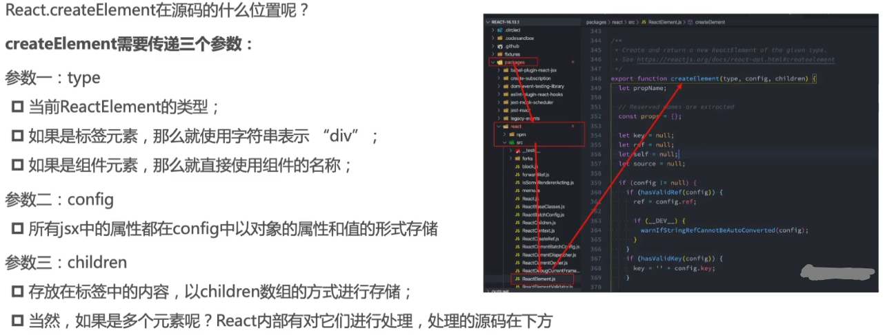 

```js
  <body>
    <div id="app"></div>
    <script src="https://unpkg.com/react@18/umd/react.development.js" crossorigin></script>
    <script src="https://unpkg.com/react-dom@18/umd/react-dom.development.js" crossorigin></script>
    <script src="https://unpkg.com/babel-standalone@6/babel.min.js"></script>
    <script type="text/babel">
      // const msg1 = <h4>jsxxx</h4>
      const msg1 = (
        <div className="wrap">
          <div className="top">
            <h4>554454</h4>
          </div>
          <div className="middle">
            <div>zhongjian</div>
          </div>
          <div className="footer">jiao</div>
        </div>
      )
      const msg2 = React.createElement("h4", null, "jsxxx") //不使用jsx也就不需要babel，①jsx其实就是转成React.createElement函数调用
      console.log(msg1) //②返回ReactElement对象
      console.log(msg2) //②返回ReactElement对象

      const root = ReactDOM.createRoot(document.getElementById("app"))
      root.render(msg1)//③虚拟DOM转化成真实的DOM并塞进根元素
    </script>
  </body>
```

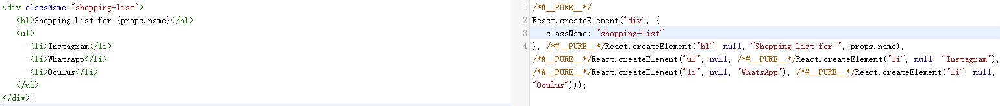 

[jsx -> React.createElement](https://babeljs.io/repl)

②执行React.createElement()会返回一个`ReactElement`对象（其实是一个对象树，就是大名鼎鼎的`虚拟DOM`）

可以打印这个对象看结构

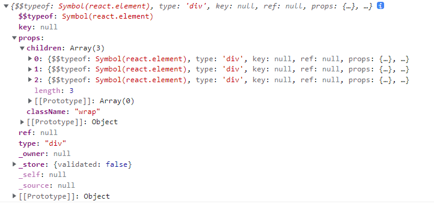 

③`ReactDOM.render(<App/>,document.getElementById("app"))`方法将虚拟DOM与真实的DOM同步（映射）起来，这个过程叫做`协调（Reconciliation）`

> WEB开发中的流程：jsx -> React.createElement() -> ReactElement对象 -> 经过ReactDOM.render -> 真实的DOM
>
> react-navite中的流程：jsx -> React.createElement() -> ReactElement对象 -> 经过ReactDOM.render -> 原生的（移动端）控件

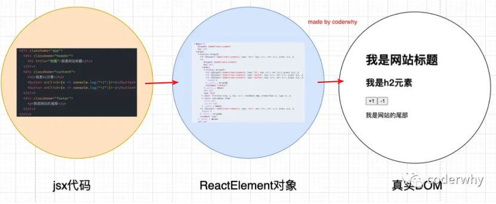 

##### 疑问：为什么使用虚拟DOM

* 原有的开发模式很难跟踪`状态(数据)`发生的改变，我们可以直接调式虚拟DOM里面的数据，使用react调式工具
* 操作真实的DOM`性能较低`：传统开发模式会进行频繁的DOM操作，而这一做法性能较低，DOM操作会引起`浏览器的重绘和回流`，所以在开发中应避免频繁的DOM操作

##### 声明式编程

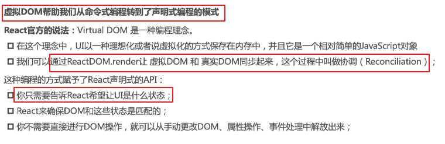 

### 元素(条件)渲染

v-if的效果：

* if条件语句
* 三元运算符
* 逻辑与 `&&`

> 注意：jsx中 布尔值 不显示，所以 逻辑与 前面为否的话就返回前面的，也就是什么都不显示，但是`0`也表示否，如果前面的值是0的话，显示的内容就是数字`0`

```jsx
    <script type="text/babel">
      class App extends React.Component {
        constructor() {
          super()
          this.state = {
            isLogin: true,
            zero: 0,
          }
        }
        render() {
          //方式一：if条件判断语句
          let welcome = null
          if (this.state.isLogin) {
            welcome = <h4>欢迎回来</h4>
          } else {
            welcome = <h4>滚</h4>
          }
          return (
            <div>
              {welcome}
              <button
                onClick={() => {
                  this.setState({ isLogin: !this.state.isLogin })
                }}
              >
                {/*方式二：三元运算符*/}
                {!this.state.isLogin ? '登录' : '退出'}
              </button>
              {/*方式三：逻辑与：数字0表示否，但是会显示0⭐*/}
              <h4>{this.state.isLogin && '你终于登陆了'}</h4>
              <h4>{this.state.zero && 'zzz'}</h4>
            </div>
          )
        }
      }
      const root = ReactDOM.createRoot(document.getElementById("app"))
      root.render(<App />)
    </script>
```

v-show的效果（元素一直存在，不显示就修改display为none）：

```jsx
<div style={{ display: this.state.isLogin ? 'block' : 'none' }}>
    你终于登陆了
</div>
```

### 列表渲染 

* 数组高阶函数`map、filter...`
* `key`值设定

```jsx
  <body>
    <div id="app"></div>
    <script src="https://unpkg.com/react@18/umd/react.development.js" crossorigin></script>
    <script src="https://unpkg.com/react-dom@18/umd/react-dom.development.js" crossorigin></script>
    <script src="https://unpkg.com/babel-standalone@6/babel.min.js"></script>
    <script type="text/babel">
      class App extends React.Component {
        constructor() {
          super()
          this.state = {
            movies: ['黄飞鸿', '狼牙', '摔跤吧爸爸', '变形金刚', '大话西游'],
            numbers: [100, 209, 20, 1209, 342, 3, 50, 2, 321, 212],
          }
        }
        render() {
          return (
            <div>
              <h4>名字列表</h4>
              <ul>
                {this.state.movies.map((e) => (
                  <li key={e}>{e}</li>
                ))}
              </ul>
              <h4>大于等于50的列表</h4>
              <ul>
                {this.state.numbers
                  .filter((e) => e >= 50)
                  .map((e) => (
                    <li key={e.toString()}>{e}</li>
                  ))}
              </ul>

              <h4>前4个元素的列表</h4>
              <ul>
                {this.state.numbers.slice(0, 4).map((e) => (
                  <li key={e.toString()}>{e}</li>
                ))}
              </ul>
            </div>
          )
        }
      }
      const root = ReactDOM.createRoot(document.getElementById("app"))
      root.render(<App />)
    </script>
  </body>
```

* key 帮助 React 识别哪些元素改变了，比如被添加或删除。因此你应当给数组中的每一个元素赋予一个确定的标识。

* 一个元素的 key 最好是这个元素在列表中拥有的一个`独一无二的字符串`。

* 当元素没有确定 id 的时候，`万不得已你可以使用元素索引 index 作为 key`
* 如果你选择`不指定显式的 key 值`，那么 React 将`默认使用索引`用作为列表项目的 key 值。
* key 值在兄弟节点之间必须唯一，当我们生成两个不同的数组时，我们可以使用相同的 key 值，见上面的例子

* 用 key 提取组件

元素的 key 只有放在就近的数组上下文中才有意义。一个好的经验法则是：在 `map()` 方法中的元素需要设置 key 属性。

```jsx
function ListItem(props) {
  // 正确！这里不需要指定 key：
  return <li>{props.value}</li>;
}

function NumberList(props) {
  const numbers = props.numbers;
  const listItems = numbers.map((number) =>
    // 正确！key 应该在数组的上下文中被指定
    <ListItem key={number.toString()} value={number} />
  );
  return (
    <ul>
      {listItems}
    </ul>
  );
}
```


## React脚手架`create-react-app`

前端三大脚手架都是使用node编写的，并且都是基于webpack，所以电脑上需要安装`node环境`

```shell
# 安装react脚手架工具
npm i -g create-react-app

# 创建项目
# 项目名字不允许使用大写字母⭐
create-react-app name
```

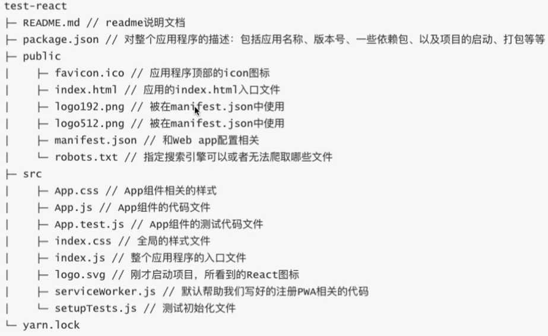 

`reportWebVitals.js`

这个webVital是Google提出的、检测用户体验的标准，这些指标包含三个关键指标（CLS、FID、LCP）和两个辅助指标（FCP、TTFB）。具体含义如下（参考链接）：

* **LCP** (Largest Contentful Paint)：最大内容渲染时间。指的是从用户请求网址到窗口中渲染最大可见内容所需要的时间（最大可见内容通常是图片或者视频，或者大块的文本）。

* **FID** (First Input Delay):首次输入延迟。指的是从用户首次与网页互动（点击链接、按钮等）到浏览器响应此次互动直接的时间。用于判断网页进入互动状态的时间。

* **CLS** (Cumulative Layout Shift) :累计布局偏移，得分范围0-1，指的是网页布局在加载期间的偏移量，0表示没有偏移，1表示最大偏移，这个指标指示用户与网站的交互体验，如果网址在加载过程布局一直跳动，用户体验会很差。比如加载一张图片，但没有大小空白占位，导致图片显示时页面高度跳动。

* **FCP**(First Contentful Paint)首次内容绘制。标记浏览器渲染来自 DOM 第一位内容的时间点，内容可能是文本、图像等元素。
* **TTFB** (Time to First Byte) 首字节到达的时间点。

通过把`index.js`文件的最后一行改为：

```js
reportWebVitals(console.warn);
```

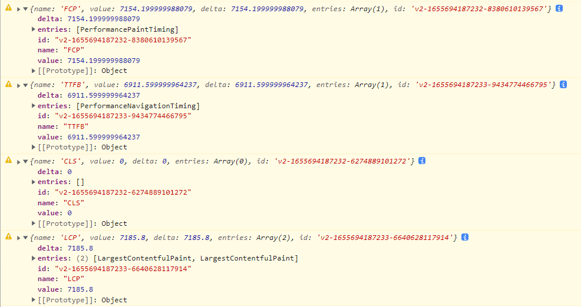 

FCP值表示，当前页面中元素最早出现时间是在页面开始加载后的7154ms。

LCP值表示元素最晚出现的时间是加载开始后7185.8ms。

CLS值表示我的页面中元素的没有偏移，在缩放变换后该值还是0，那么说明这个页面还是比较稳定流畅的。

### PWA-渐进式WEB应用

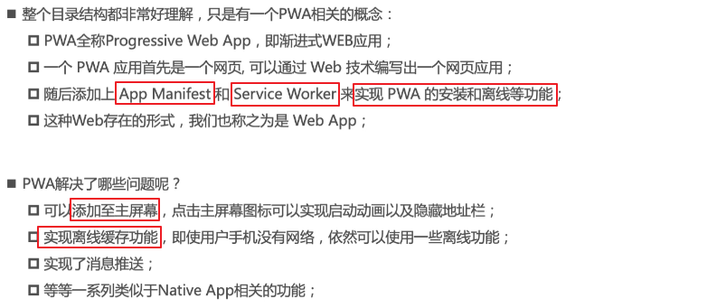 

> 如果你的应用程序没有PWA功能，那么可以将相关文件全部删除

### 脚手架中的webpack

和`vue-cli3`脚手架一样，react脚手架将有关webpack的配置信息都隐藏起来了

如果想查看webpack相关配置信息，运行`npm run eject`命令，前提是你的本地代码需要全部提交（本地无修改）

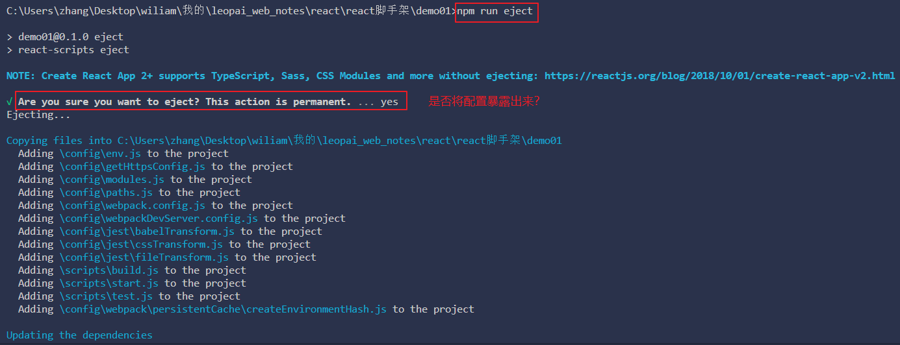 

`permanent`：永恒的，不可逆的；暴露之后无法再隐藏起来

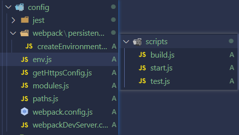 

多出的两个文件夹就是配置信息，并且`package.json`文件中之前隐藏的依赖增加了很多

### react组件化

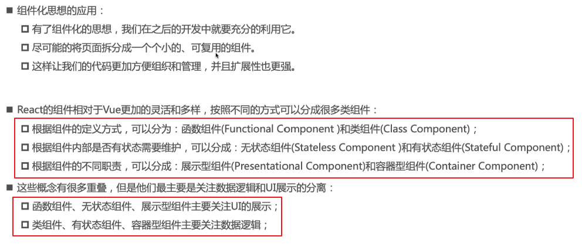 

#### 类组件和函数组件

类组件

* 组件名是`大写字符`开头（无论是类组件还是函数组件）
* 类组件需要继承自`React.Component`
* 类组件必须实现`render`函数

> ES6之前，可以通过`create-react-class`模块定义类组件，但是目前官网建议使用ES6的class类定义

使用class来定义一个组件

* constructor是可选的，通常在其中初始化一些数据
* this.state中维护的就是我们组件内部的数据
* render()方法是class中唯一必须实现的方法

函数组件

* 没有this对象

* 没有内部的变量

#### render返回值

```js
  render() {
    返回React元素，通常通过JSX创建
    // return (
    //   <div>
    //     <h4>哈哈哈</h4>
    //   </div>
    // )

    返回一个数组或fragments，使render方法可以返回多个元素
    // return [<div>sasasas</div>, <div>shahahah</div>]

    返回Portals，可以渲染子节点到不同的DOM子树中

    返回字符串或数值类型，会在DOM中渲染成文本节点

    返回布尔值或null，什么都不渲染
  }
```

#### 组件生命周期

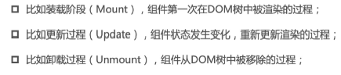 

再说生命周期时，都是类的生命周期，`函数式组件没有生命周期函数`，后面再hoos中模拟一些生命周期回调

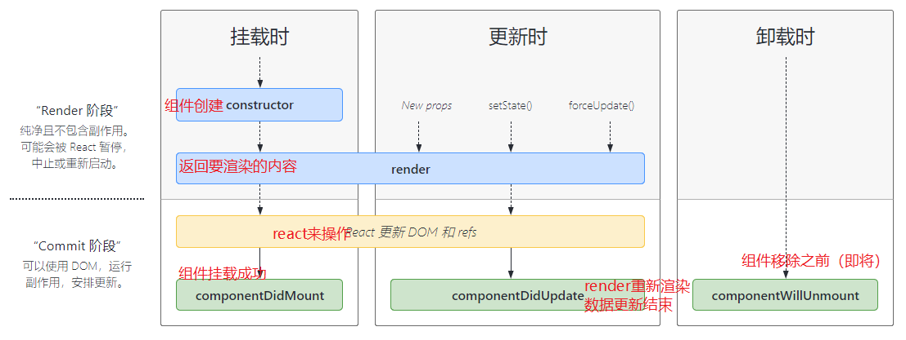 

各个生命周期做什么事情⭐

* constructor

 

* componentDidMount

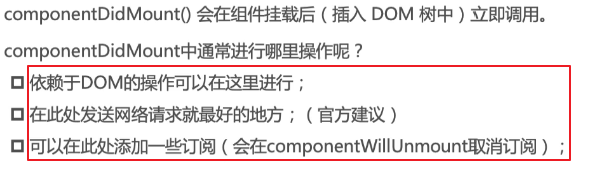 

* componentDidUpdate

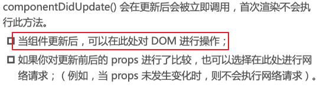 

componentDidUpdate有三个参数

```js
componentDidUpdate(prevProps, prevState, snapshot) {
    console.log(prevProps, prevState, snapshot)//更新之前的props和state数据，第三个参数是getSnapshotBeforeUpdate() 生命周期的返回值，没有即为undefined
    console.log('componentDidUpdate')
  }
```

* componentWillUnmount

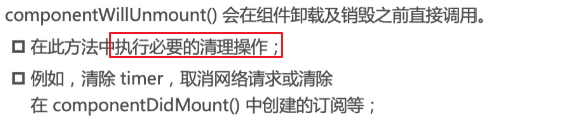 


[不常用的生命周期函数](https://zh-hans.reactjs.org/docs/react-component.html)：

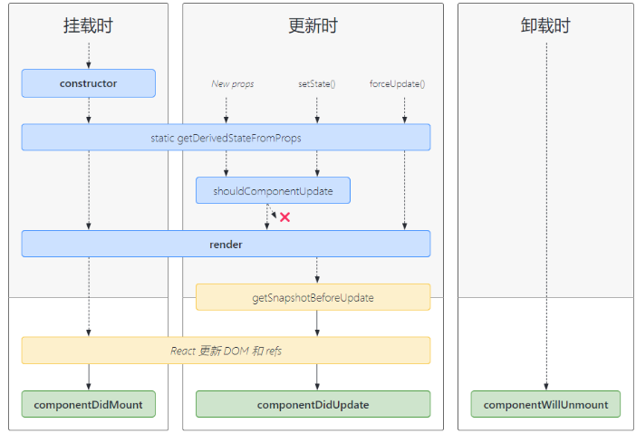 

* shouldComponentUpdate

根据 `shouldComponentUpdate()` 的返回值，判断 React 组件的输出是否受当前 state 或 props 更改的影响。默认行为是 state 每次发生变化组件都会重新渲染(就是发生改变就会执行一下`render()`)。

当 props 或 state 发生变化时，`shouldComponentUpdate()` 会在渲染执行之前被调用。`返回值默认为 true`。首次渲染或使用 `forceUpdate()` 时不会调用该方法。

* getSnapshotBeforeUpdate

`getSnapshotBeforeUpdate()` 在最近一次渲染输出（提交到 DOM 节点）之前调用（数据更新之前调用）。

#### 组件的嵌套

#### 组件通信

##### 父传子

* 传入的属性保存在props对象中
* propTypes定义验证
* defaultProps定义默认值

* 使用`prop-types库`对props属性进行验证，[查看所有验证器](https://zh-hans.reactjs.org/docs/typechecking-with-proptypes.html)

```js
import React, { Component } from 'react'
import PropTypes from 'prop-types' //自React15起抽出为单独库

//类子组件
class Child extends Component {
  //属性验证
  static propTypes = {
    name: PropTypes.string.isRequired,
    age: PropTypes.number,
    list: PropTypes.array,
  }
  //属性默认值
  static defaultProps = {
    name: 'Child',
    age: 12,
    list: [21, 342, 55],
  }
  render() {
    const { name, age, list } = this.props
    return (
      <div>
        类子组件显示props信息: {name + ' ' + age}
        <ul>
          {list.map((e, i) => {
            return <li key={i}>{e}</li>
          })}
        </ul>
      </div>
    )
  }
}
//对props属性进行验证，(类组件还可以在内部定义static)⭐
// Child.propTypes = {
//   name: PropTypes.string.isRequired,
//   age: PropTypes.number,
//   list: PropTypes.array,
// }
// Child.defaultProps = {
//   name: 'moren',
//   age: 12,
//   list: [21, 342, 55],
// }

//函数子组件
function ChildOther(props) {
  const { name, age } = props
  return <div>函数子组件显示props信息: {name + ' ' + age}</div>
}
ChildOther.propTypes = {
  name: PropTypes.string,
  age: PropTypes.number,
}
ChildOther.defaultProps = {
  name: 'ChildOther',
  age: 45,
}

//父组件
export default class App extends Component {
  constructor() {
    super()
    this.state = {
      num: 1,
      unMount: true,
    }
  }
  render() {
    return (
      <div>
        <Child name="wangyang" age={18} list={[1, 2, 3]} />
        <Child name="kobe" age={19} list={[1, 2, 3, 5]} />
        <Child />
        <hr />
        <ChildOther name="kobe" age={19} />
        <ChildOther />
      </div>
    )
  }
}
```

> 子组件中不手动使用super保存props的话，也是可以的，但是在constructor函数中还拿不到数据
>
> ```js
>   //子组件constructor
>   constructor(props) {
>     //这里子类如果没有保存props，那么constructor函数中拿不到props，但是react内部会帮你做保存，在render生命周期及之后能拿到⭐，源码可看react-test-renderer
>     // super()
>     // console.log(props)//undefined
>       
>     super(props)
>     console.log(props) //super(props)手动做保存可以在constructor中拿到props，正规操作就是自己保存一下
>   }
> ```

```js
import PropTypes from 'prop-types';

MyComponent.propTypes = {
  // 你可以将属性声明为 JS 原生类型，默认情况下
  // 这些属性都是可选的。
  optionalArray: PropTypes.array,
  optionalBool: PropTypes.bool,
  optionalFunc: PropTypes.func,
  optionalNumber: PropTypes.number,
  optionalObject: PropTypes.object,
  optionalString: PropTypes.string,
  optionalSymbol: PropTypes.symbol,

  // 任何可被渲染的元素（包括数字、字符串、元素或数组）
  // (或 Fragment) 也包含这些类型。
  optionalNode: PropTypes.node,

  // 一个 React 元素。(插槽)
  optionalElement: PropTypes.element,

  // 一个 React 元素类型（即，MyComponent）。
  optionalElementType: PropTypes.elementType,

  // 你也可以声明 prop 为类的实例，这里使用
  // JS 的 instanceof 操作符。
  optionalMessage: PropTypes.instanceOf(Message),

  // 你可以让你的 prop 只能是特定的值，指定它为
  // 枚举类型。
  optionalEnum: PropTypes.oneOf(['News', 'Photos']),

  // 一个对象可以是几种类型中的任意一个类型
  optionalUnion: PropTypes.oneOfType([
    PropTypes.string,
    PropTypes.number,
    PropTypes.instanceOf(Message)
  ]),

  // 可以指定一个数组由某一类型的元素组成
  optionalArrayOf: PropTypes.arrayOf(PropTypes.number),

  // 可以指定一个对象由某一类型的值组成
  optionalObjectOf: PropTypes.objectOf(PropTypes.number),

  // 可以指定一个对象由特定的类型值组成
  optionalObjectWithShape: PropTypes.shape({
    color: PropTypes.string,
    fontSize: PropTypes.number
  }),

  // An object with warnings on extra properties
  optionalObjectWithStrictShape: PropTypes.exact({
    name: PropTypes.string,
    quantity: PropTypes.number
  }),

  // 你可以在任何 PropTypes 属性后面加上 `isRequired` ，确保
  // 这个 prop 没有被提供时，会打印警告信息。
  requiredFunc: PropTypes.func.isRequired,

  // 任意类型的必需数据
  requiredAny: PropTypes.any.isRequired,

  // 你可以指定一个自定义验证器。它在验证失败时应返回一个 Error 对象。
  // 请不要使用 `console.warn` 或抛出异常，因为这在 `oneOfType` 中不会起作用。
  customProp: function(props, propName, componentName) {
    if (!/matchme/.test(props[propName])) {
      return new Error(
        'Invalid prop `' + propName + '` supplied to' +
        ' `' + componentName + '`. Validation failed.'
      );
    }
  },

  // 你也可以提供一个自定义的 `arrayOf` 或 `objectOf` 验证器。
  // 它应该在验证失败时返回一个 Error 对象。
  // 验证器将验证数组或对象中的每个值。验证器的前两个参数
  // 第一个是数组或对象本身
  // 第二个是他们当前的键。
  customArrayProp: PropTypes.arrayOf(function(propValue, key, componentName, location, propFullName) {
    if (!/matchme/.test(propValue[key])) {
      return new Error(
        'Invalid prop `' + propFullName + '` supplied to' +
        ' `' + componentName + '`. Validation failed.'
      );
    }
  })
};

```


##### 子传父（状态提升）

```js
import React, { Component } from "react"

//类子组件
class Child extends Component {
  render() {
    return (
      <div>
        类子组件
        <button onClick={(e) => this.incrementClick(e)}>状态提升</button>
      </div>
    )
  }
  incrementClick(e) {
    this.props.btnClick(e, 12, 12512)
  }
}

//父组件
export default class App extends Component {
  constructor() {
    super()
    this.state = {
      num: 1,
      unMount: true,
    }
  }
  render() {
    return (
      <div>
        {/* 注意，下面第一种方式虽然可以进行状态提升，也可以传递数据，但是在handleClick中拿到的this是子组件中的btnClick函数，而第二种中拿到的才是对的this⭐ */}
        <Child btnClick={this.handleClick} />
        <Child btnClick={(e, a, b) => this.handleClick2(e, a, b)} />
      </div>
    )
  }
  handleClick(e, a, b) {
    console.log(this) //btnClick
    console.log("dsafdas", e, a, b)
  }
  handleClick2(e, a, b) {
    console.log(this) //父组件
    console.log("dsafdas", e, a, b)
  }
}
```

##### 跨组件通信`context`上下文

跨组件通信你可以使用自上而下组件传递，但是往往比较繁琐，而且冗余代码较多


类组件

* 1.创建context对象并传入默认数据

* 2.context对象内的Provider组件包裹子组件并传值

* 3.设置contextType

* 4.从`context`对象中获取共享的数据

> 类组件不能实现同时消费多个context

```js
import React, { Component } from "react"

//1.创建context对象并传入默认数据
const UserContext = React.createContext({ name: "", age: 0 })

//孙子组件
class Grandson extends Component {
  //3.设置contextType方式一
  /**
   * 挂载在 class 上的 contextType 属性可以赋值为由 React.createContext() 创建的 Context 对象。
   * 此属性可以让你使用 this.context 来获取最近 Context 上的值。你可以在任何生命周期中访问到它，包括 render 函数中。⭐
   */
  static contextType = UserContext
  render() {
    console.log(this.context)
    return <div>Grandson</div>
  }
}
//3.设置contextType方式二
// Grandson.contextType = UserContext

//子组件
class Child extends Component {
  render() {
    return (
      <div>
        <Grandson />
      </div>
    )
  }
}
//父组件
export default class App extends Component {
  constructor() {
    super()
    this.state = {
      name: "wangyang",
      age: 18,
    }
  }
  render() {
    return (
      <div>
        {/* 2.context对象内的Provider组件包裹子组件并传值，如果子组件没有包裹在Provider当中，使用的就是默认数据*/}
        <UserContext.Provider value={this.state}>
          <Child />
        </UserContext.Provider>
      </div>
    )
  }
}
```

函数式组件

使用方式大致相同，但是子类组件使用不是设置`contextType`，而是使用`上下文对象中的Consumer组件`，并且可以实现消费多个context

```js
import React, { Component } from "react"

//1.创建context对象并传入默认数据
const UserContext = React.createContext({ name: "", age: 0 })
const ThemeContext = React.createContext(null)

//孙子组件,函数式组件
function Grandson() {
  return (
    <div>
      {
        /**
         * 函数式组件使用UserContext.Consumer⭐
         * 这种方法需要一个函数作为子元素（function as a child）。
         * 这个函数接收当前的 context 值，并返回一个 React 节点。
         * 传递给函数的 value 值等价于组件树上方离这个 context 最近的 Provider 提供的 value 值。
         * 如果没有对应的 Provider，value 参数等同于传递给 createContext() 的 defaultValue。
         * ⭐函数式组件使用UserContext.Consumer，则不需要设置contextType属性
         */
        <UserContext.Consumer>
          {(value) => (
            <div>
              <div>名字：{value.name}</div>
              <div>年龄：{value.age}</div>
            </div>
          )}
        </UserContext.Consumer>
      }
      {
        /**
         * 消费多个context
         * 类组件不能同时消费多个context⭐
         */
        <UserContext.Consumer>
          {(user) => (
            <ThemeContext.Consumer>
              {(theme) => (
                <div>
                  <div>名字：{user.name}</div>
                  <div>年龄：{user.age}</div>
                  <div style={{ color: theme.color }}>我是什么颜色</div>
                </div>
              )}
            </ThemeContext.Consumer>
          )}
        </UserContext.Consumer>
      }
    </div>
  )
}

//子组件
class Child extends Component {
  render() {
    return (
      <div>
        <Grandson />
      </div>
    )
  }
}
//父组件
export default class App extends Component {
  constructor() {
    super()
    this.state = {
      name: "wangyang",
      age: 18,
    }
  }
  render() {
    return (
      <div>
        {/* 2.context对象内的Provider组件包裹子组件，并传值，如果子组件没有包裹在Provider当中，使用的就是默认数据*/}
        <UserContext.Provider value={this.state}>
          <ThemeContext.Provider value={{ color: "red" }}>
            <Child />
          </ThemeContext.Provider>
        </UserContext.Provider>
      </div>
    )
  }
}
```

#### react中实现`插槽`

* 子组件标签内部的jsx代码会被保存在子组件中的`props.chaldren`数组（一个元素）或者对象中
* 使用父子传值的方式传入

```js
import React, { Component } from "react"

//子组件
class Child extends Component {
  render() {
    console.log(this.props.children)
    return <div>Child {this.props.children[0]}</div>
  }
}

//子组件
class Child2 extends Component {
  render() {
    return (
      <div>
        Child2 {this.props.leftSlot}
        <div>{this.props.middleSlot}</div>
      </div>
    )
  }
}

//父组件
export default class App extends Component {
  constructor() {
    super()
    this.state = {}
  }
  render() {
    return (
      <div>
        <Child>
          {/* 方式一：直接在标签内部传入，会存在子组件的props.children数组或对象中,使用时使用数组下标获取，但是要注意顺序 */}
          <div>left</div>
          <div>middle</div>
          <div>right</div>
        </Child>
        <hr />
        {/* 方式二：父子传值的方式传入，存放在props对象中*/}
        <Child2
          leftSlot={<div>left</div>}
          middleSlot={<div>middle</div>}
          rightSlot={<div>right</div>}
        />
      </div>
    )
  }
}
```

### 关于`setState`

setState方法继承自`React.Component`类

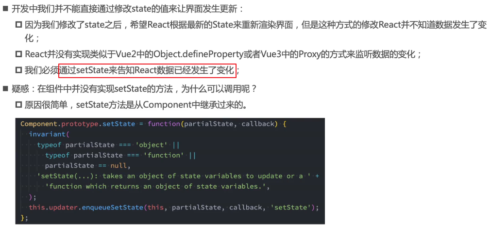 

#### setState异步更新

使用异步更新的原因

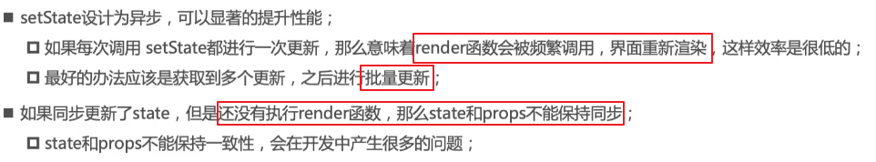 

#### 如何获取异步结果

```js
import React, { Component } from "react"

//获取异步数据
export default class App extends Component {
  constructor() {
    super()
    this.state = {
      name: "wangyang",
      age: 18,
    }
  }
  //方式二
  componentDidUpdate() {
    console.log(this.state.name) //先获取
  }
  render() {
    return (
      <div>
        <button onClick={() => this.handleClick()}>修改数据</button>
      </div>
    )
  }
  handleClick() {
    this.setState(
      {
        name: "kobe",
      },
      () => {
        //方式一
        //第二个参数接收一个函数，这里可以获取异步数据，类似vue $nextTick
        console.log(this.state.name) //后获取
      }
    )
  }
}
```

#### 使setState同步更新

reatc18版本之前，在定时器中和执行原生函数中设置setState是同步的，

```js
  componentDidMount() {
    //方式一：使用原生事件
    document.getElementById('btn').addEventListener('click', () => {
      this.setState({
        name: 'kobe',
      })
      console.log(this.state.name)
    })
  }

  handleClick() {
    // 方式二：在定时器中执行
    setTimeout(() => {
      this.setState({
        name: 'kobe',
      })
      console.log(this.state.name)
    }, 0)
  }
```

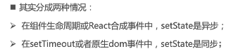 

> 合成事件
>
> ```js
> render() {
>     return (
>       <div>
>         <button onClick={() => this.handleClick()}>修改数据</button>
>       </div>
>     )
>   }
> ```
>
> 这里的`onClick`就是合成事件
>
> react开发的项目，你可以跑在浏览器中，也可以使用react-native跑在移动端中
>
> 所以对于jsx代码：跑在浏览器中，产生的就是浏览器的DOM事件对象，跑在移动端，产生的就是移动端原生控件的对象

#### setState数据的合并操作

当你调用`this.setState({name:'traeyoung'})`设置state中的属性时，是不是担心之前state中别的数据会被覆盖

react的操作是执行此方法时，实际上是调用`Object.assign({},this.state,{name:'kobe'})`，依次将源对象（第二个和第三个）复制到目标对象（第一个）中，此方法返回目标对象

这样其他的属性还在，并且新的name属性覆盖了之前的

#### setState本身的合并

```js
 //age=0 
 handleClick() {
    this.setState({
      age: this.state.age + 1,
    })
    this.setState({
      age: this.state.age + 1,
    })
    this.setState({
      age: this.state.age + 5,
    })
    //age=5
    //内部会把三次执行setState合并成一次，每次做的操作一样，都是设置age的值，使用do while遍历队列，也是使用Object.assign复制源对象到目标对象，只会执行较后一次
  }
```

如果你确实是想连续执行`setState`的操作，可以使用`updater`函数的方式

```js
  //age=0 
  handleClick() {
    //使用updater函数，这种方式也会调用do while遍历队列，但是updater函数中的第一个参数永远是前一次setState更新后的数据
    this.setState((prevState, props) => {
      //props参数用的较少
      return {
        age: prevState.age + 1,
      }
    })
    this.setState((prevState) => {
      return {
        age: prevState.age + 1,
      }
    })
    this.setState((prevState) => {
      return {
        age: prevState.age + 1,
      }
    })
    //age=3
  }
```

### React更新机制

08- 1：20：30


### 语法补充

#### 编码规范

建议在state中只保存会改变的数据，那些`不会改变的数据可以直接放在constructor函数里面`

```js
  constructor() {
    this.list = ["一楼", "二楼", "三楼"]
    this.state = {
      currentIndex: 0,
    }
  }
```

#### 属性展开

传入给子组件的数据可以直接展开写，在子组件中的props对象中拿到

```js
<Child {...this.state} />
<Child {...this.props} />
```

