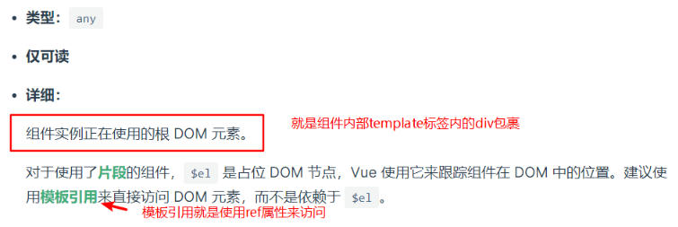
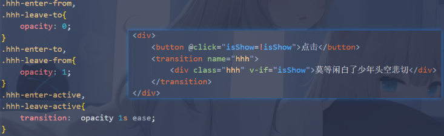
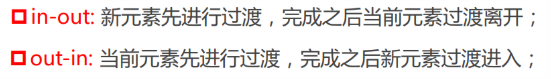
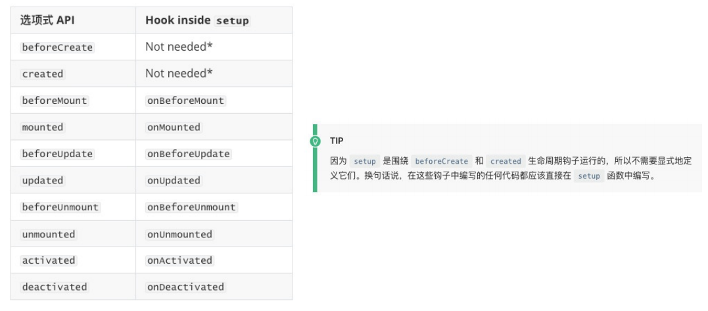
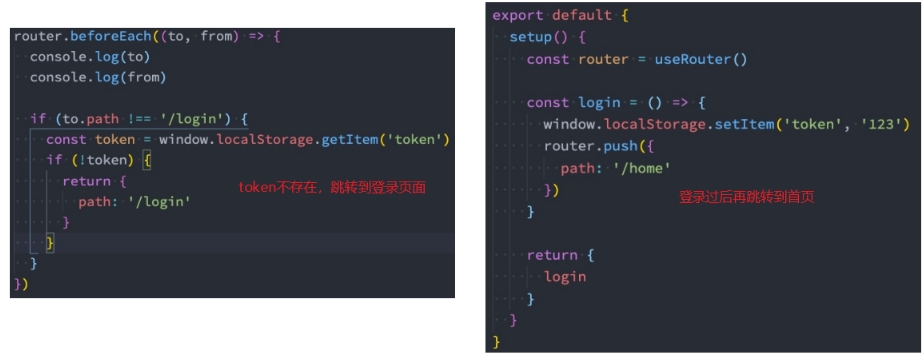
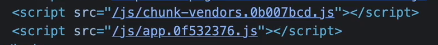
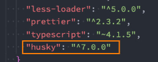
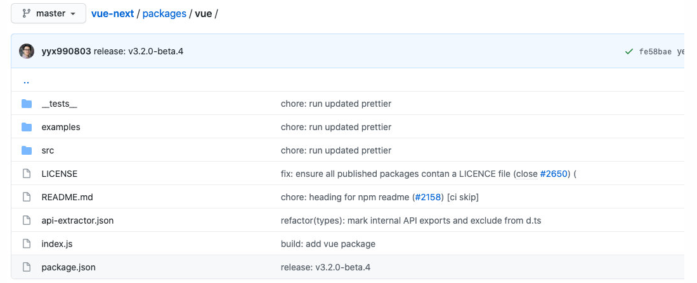
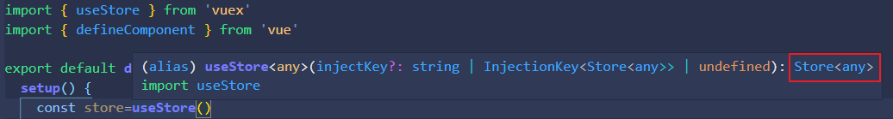

### template 模板分离写法

* 方式一：使用`script标签`，指定`type属性为x-template`，再设置`id属性`

template选项的值以`#`开头，会以`document.querySelector("#why")`的方式获取该元素

```html
<body>
  <div id="app">哈哈哈哈啊</div>
  <script type="x-template" id="why">
    <div>
      <h2>{{message}}</h2>
      <h2>{{counter}}</h2>
      <button @click='increment'>+1</button>
      <button @click='decrement'>-1</button>
    </div>
  </script>

  <script src="../js/vue.js"></script>
  <script>
    //document.querySelector("#why")
    Vue.createApp({
      template: '#why',
    }).mount('#app');
  </script>
</body>
```

* 直接使用`template`属性，设置`id`属性（用的多）

```html
<body>
  <div id="app"></div>
  <template id="why">
    <div>
      <h2>{{message}}</h2>
      <h2>{{counter}}</h2>
      <button @click='increment'>+1</button>
      <button @click='decrement'>-1</button>
      <button @click="btnClick">按钮</button>
    </div>
  </template>

  <script src="../js/vue.js"></script>
  <script>
    Vue.createApp({
      template: '#why'
    }).mount('#app');

  </script>
</body>
```

> 这里如果你直接使用`div`元素代替`template`使用，其实也是可以的，但是这个个div元素也会正常渲染出来，而template元素是`占位符`，不会真正的渲染

### 侦听器watch

#### 监听数组中某一个项的某一个值

如果格式是friends：[{name:111},{name:222}]这样的，这时是不建议直接使用deep：true监听friends的

解决方案：**在子组件中监听每一项**，子组件标签上面使用v-for编译friends，把每一个item传入子组件，在子组件使用deep:true监听item.name

#### newValue和oldValue

 


监听引用类型数据的时候，newValue和oldValue是同一个值（oldValue的值是更改过后的）

### 不支持过滤器filter

vue3中不再支持filter，使用计算属性或者全局方法

### 注册组件

#### 全局组件

```js
const app=Vue.createApp({
    template:`<com-a><com-a>`//使用组件
})
//注册全局组件
app.component('comA',{
    template:`<h1>aa<h1>`,
    dara(){
        return {}
    }
})
app.mount('#app')


//vue3：main.js中
import aDialog from './components/aDialog.vue'
app.component('aDialog',aDialog)

//vue2：main.js中
import aDialog from './components/aDialog.vue'
Vue.component('aDialog',aDialog)
```

#### 局部组件

在做项目时全局组件用的比较少， 

 

使用组件对象中的components属性来注册

```js
const app=Vue.createApp({
    template:`<com-a><com-a>`//使用组件,
    components:{
    	//key:组件名，value：组件对象
    	comA:comA
	}
})
comA:{
    template:``,
        data(){}
}
```

## vue-cli

### 安装及建立项目

安装脚手架

```shell
npm i @vue/cli -g
```

安装过了再执行这个命令就会升级版本

创建项目

```shell
vue create 项目名
```

 

  


### vscode对SFC文件的支持

SFC：single-file components单文件组件

> vscode默认是不认识.vue文件的

插件一：`Vetur`，从Vue2开发就一直在使用的VSCode支持Vue的插件

插件二：`Volar`，官方推荐的vue3插件（后续会基于Volar开发官方的VSCode插件），在vue2中使用会有报错，目前为止（2021/6/6）还是用的不好


vue3代码片段提示插件

`Vue 3 Snippets`和`Vue VSCode Snippets`

敲 **vbase-css** 就可以生成一个vue片段

### 关于scoped样式可能穿透的原因

vue3不要求根元素，所以自定义样式属性会设置在子组件元素上，可能会有波及，解决方案就是还是像vue2一样设置一个根元素

### 组件通信

#### 父传子

```js
props:{
    message:{
        type:String,
        default:'aas',
        require:true//表示这个属性是必传的，和default之间使用一个就行
    }
}
```

type可选值


 

props其他写法

 

##### ⭐非props的属性Attribute（$attrs）

如果在父组件中使用了子组件并且在上面定义了属性，但是子组件没有对应的props或者emits，这时候非props的属性Attribute，常见的包括class、style、id属性等

**Attribute继承**：

​	单个根节点：组件有单个根节点时，非Prop的Attribute将自动添加到根节点的Attribute中：

 

**禁止继承和访问这些非props的Attribute(需要将attribute应用于根元素之外的其他元素；)**

子组件：

```vue
<template>
	<div>
        <h1 :class="$attrs.class"></h1>//根元素之外的其他元素，这样就可以获取到class='why'
        <h1 v-bind="$attrs"></h1>//或者使用v-bind获取所有的$attrs
    </div>
</template>
<script>
	export default {
        inheritAttrs:false,//禁止继承
        data(){
            return {}
        }
    }
</script>
```


​	多个根节点：多个根节点的attribute如果没有明确的绑定，那么会报警告，我们必须手动的指定要绑定到哪一个属性上：

 

#### 子传父

vue3中需要定义emits触发事件的名称

 

#### 非父子组件通信

##### provide/inject

父组件中的provide如果写成对象，是不能使用data中的数据的，因为this指向，可以**写成一个函数，里面返回一个对象**（默认就写成函数吧）

> provide里面的属性不是响应式的，如果想让属性变成响应式的，需要用到computed组合API

 

##### 全局事件总线mitt库

vue3移除了$on、$off、$once这些方法，如果想使用事件总线，可以使用第三方库`mitt`或者`tiny-emitter`

```js
npm i mitt
```

封装eventBus.js

```js
import mitt from 'mitt'

const emitter =mitt()
export default emitter
```

组件A

```js
import emitter from './eventBus'
//方法中使用
aaa(){
    emitter.emit('foo',{aa:'数据'})
}
```

组件B中要在组件创建时就开始监听，因为你不知道A中什么时候发出事件的

```js
import emitter from './eventBus'

//或者在mounted中
created(){
  emitter.on('foo',e=>console(e,'获取传递的数据'))
    
    
  //监听所有事件
  emitter.on('*',(type,e)=>{
      //type是事件，e是对应的数据
  })
}


//销毁
beforeDestory(){
  //销毁所有总线事件
  emitter.all.clear()
}
```

### 动态组件

#### 基本使用

动态组件是使用`component组件`,通过特殊的attribute  `is`来实现

 

is后面的值可以是：

 

#### 动态组件传值

就和父子组件传值一样使用即可，父传子使用props接收，异步数据可以使用watch+deep+immediate监听，子传父使用$emit

### keep-alive

默认情况下，我们在切换组件后，组件会被销毁掉，再次回来时会重新创建组件；如果希望保持状态，不希望组件销毁，可以使用keep-alive组件

 

这时，home组件和about组件就不会被销毁

#### keep-alive属性


**这个a,b就是组件的name属性，匹配首先检查组件自身的 `name` 选项，如果 `name` 选项不可用，则匹配它的局部注册名称 (父组件 `components` 选项的键值)。匿名组件不能被匹配。** 

 

#### activated和deactivated钩子函数

关于缓存组件的生命周期，**缓存的组件是不会执行created或者mounted等生命周期函数的**，因为组件没有被销毁或重新创建，如果希望监听何时重新进入到了组件，何时离开了组件，可以使用`activated `和 `deactivated `这两个生命周期钩子函数来监听

```js
//组件内部使用
activated() {
    console.log("组件活跃触发，进入到组件触发");
},
deactivated() {
    console.log("离开组件时触发");
}
```

### 异步组件

#### webpack中的代码分包

默认情况下，构建组件树过程中，`组件和组件之间时使用模块化直接依赖的`，那么webpack打包时就会把所有模块都打包在一起（比如一个app.js里面），这时随着项目的不断壮大，`app.js文件内容就会过多`，`首屏渲染速度就会变慢`,

**对于一些不需要立马使用的组件，可以对他们进行单独的拆分，拆分成一个个小的chunk.js，这些chunk.js会在需要的时候才会从服务器上下载下来，显示对应的内容**

webpack中的代码分包：

```js
import('./utils/math.js').then(res=>{
    res.sum(20,30)
})
```

使用import当作一个方法来使用，返回的是一个promise

#### ⭐vue中的异步组件

vue3中专门提供了一个函数`defineAsyncComponent`，这个函数接收两种类型的参数，

- 工厂函数：该工厂函数需要返回一个promise对象
- 对象类型：对异步函数进行配置

```js
import Cate from "./childs/cate.vue";
import Loading from './childs/Loading.vue'

import { defineAsyncComponent } from "vue";
//异步组件使用
const Home = defineAsyncComponent(()=>import('./childs/home.vue'))


//异步组件对象方式
const Home = defineAsyncComponent({
  loader: () => import("./home.vue"),//有loader属性就实现了上面一样的功能，下面的是更多的配置，一般就是使用上面的函数方式
  //在home.vue未加载时显示的组件
  loadingComponent: Loading,
  // errorComponent,
  // 在显示loadingComponent组件之前, 等待多长时间
  delay: 2000,
  /**
   * err: 错误信息,
   * retry: 函数, 调用retry尝试重新加载
   * attempts: 记录尝试的次数
   */
  onError: function (err, retry,fail,attempts) {},
});
export default {
  components: {
    Cate,
    Home,
    Loading
  },
};
```

#### ⭐异步组件和Suspense一起使用

Suspense是vue3内置的一个组件（目前还是一个实验性的特性，API随时可能会修改），这个组件里面有两个插槽：

`default`：如果default可以显示，会优先显示default的内容

`fallback`：如果default不能显示，就会显示fallback插槽内部的内容

```html
<!-- 内置的，直接使用即可-->
<suspense>
    <template #default>
        <!-- 异步组件home不能显示，就会显示loading组件 -->
        <home></home>
    </template>
    <template #fallback>
        <loading></loading>
    </template>
</suspense>


<script>
	import { defineAsyncComponent } from "vue";
    const Home = defineAsyncComponent(()=>import('./childs/home.vue'))
</script>
```

### 实例property

#### $refs

绑定到元素身上，就是获取这个元素（vue中不推荐直接进行DOM操作，但是有的时候必须要进行操作可以使用这种方法）

绑定在组件身上，就是获取这个组件实例，可以获取到内部的属性，还可以执行组件的方法

```html
<!-- 绑定到一个元素上 -->
<h2 ref="title">哈哈哈</h2>

<!-- 绑定到一个组件实例上 -->
<nav-bar ref="navBar"></nav-bar>
```

#### $parent，$root

$parent，$root是拿到父组件和根组件（App.vue），一般不用，代码耦合度较高

#### $el

 

#### $options

**在data外面定义的`自定义属性和方法`通过$options可以获取和调用**

```js
export default {
    myName:'data外定义的属性或方法',
    aaa(){
        console.log('执行methods外面的方法使用$options');
    },
    data(){
        return {
            name:111
        }
    },
    methods:{
        handleClick(){
            console.log(this.$options.myName);//data外定义的属性或方法
            this.$options.aaa()//执行methods外面的方法使用$options
        }
    }
}
```

#### $set

`$set、$delete，用于新增、删除响应式对象中属性，并且确保视图更新`

[Vue.set( target, propertyName/index, value )](https://cn.vuejs.org/v2/api/#Vue-set)

- **参数**：

  - `{Object | Array} target`
  - `{string | number} propertyName/index`
  - `{any} value`

- **返回值**：设置的值。

- **用法**：

  向响应式对象中添加一个 property，并确保这个新 property 同样是响应式的，且触发视图更新。它必须用于向响应式对象上添加新 property，因为 Vue 无法探测普通的新增 property (比如 `this.myObject.newProperty = 'hi'`)

  注意对象不能是 Vue 实例，或者 Vue 实例的根数据对象。

#### $delete

[Vue.delete( target, propertyName/index )](https://cn.vuejs.org/v2/api/#Vue-delete)

- **参数**：

  - `{Object | Array} target`
  - `{string | number} propertyName/index`

  > 仅在 2.2.0+ 版本中支持 Array + index 用法。

- **用法**：

  删除对象的 property。如果对象是响应式的，确保删除能触发更新视图。这个方法主要用于避开 Vue 不能检测到 property 被删除的限制，但是你应该很少会使用它。

  > 在 2.2.0+ 中同样支持在数组上工作。

  目标对象不能是一个 Vue 实例或 Vue 实例的根数据对象。

#### ⭐vue3中移除了$children

### 生命周期

vue3中将beforeDestroy和destroyed改成了`beforeUnmount`和`unmounted`

 

### 组件上的v-model

可以封装`表单组件`

以前，在`input`输入框上使用v-model可以实现数据的双向绑定，帮我们做的两件事：v-bind:value的数据绑定和@input的事件监听

```html
<!-- <input type="text" v-model="message"> -->
<input type="text" :value='message' @input="message=$event.target.value">
<h2>{{message}}</h2
```

如果现在封装了一个组件，也可以在组件上使用v-model

`组件上的v-model实际上是动态绑定modelValue属性,并且监听类型为update:modelValue的事件`

父组件:

```vue
<template>
  <div>
    <!-- 组件上的v-model -->
    <child v-model="comMess" />
    <!-- 组件上实际上是动态绑定modelValue属性,并且监听类型为update:modelValue的事件-->
    <!-- <child :modelValue="comMess" @update:modelValue="comMess=$event"/> -->
    <h2>{{comMess}}</h2>
  </div>
</template>
<script>
import child from "./child.vue";
export default {
  components: { child },
  data() {
    return {
      message: "",
      comMess: "",
    };
  },
};
</script>
```

子组件：

```vue
<template>
    <div>
        <input type="text" :value="modelValue" @input="inputClick">
    </div>
</template>
<script>
    export default {
        props:{
            modelValue:{
                type:String,
                default:''
            }
        },
        emits:["update:modelValue"],//子组件需要使用props接收数据,并且使用emits发出事件
        methods:{
            inputClick(e){
                this.$emit('update:modelValue',e.target.value)
            }
        }

        
    }
</script>
```

这样使用子组件中的input还是要写value和input，如果想在这里也是用v-model的话需要**配合计算属性使用**（不是直接绑定modelValue）

并且组件上的v-model可以使用多个，使用**v-model传参**（就是给v-model一个名字）

父组件：

```vue
<template>
  <div>
    <!-- 组件上的v-model ,多个v-model，使用参数（命名）-->
    <child v-model="comMess" v-model:title="ttt"/>
    <h2>{{comMess}}</h2>
    <h2>{{ttt}}</h2>
  </div>
</template>

<script>
import child from "./child.vue";
export default {
  components: { child },
  data() {
    return {
      comMess: "",
      ttt:""
    };
  },
};
</script>

<style scoped>
</style>
```

子组件：

```vue
<template>
    <div>
        <!-- <input type="text" :value="modelValue" @input="inputClick"> -->
        <!-- <input type="text" v-model="modelValue">这样是不行的，不能直接绑定modelValue -->
        
        
        <!-- 绑定计算属性，而不是props中的modelValue -->
        <input type="text" v-model="value">
        <input type="text" v-model="tit">
    </div>
</template>

<script>
    export default {
        props:{
            modelValue:{
                type:String,
                default:''
            },
            title:{
                type:String,
                default:''
            }
        },
        emits:["update:modelValue","update:title"],//子组件需要使用props接收数据,并且使用emits发出事件
        computed:{
            value:{
                set(val){
                    this.$emit('update:modelValue',val)
                },
                get(){
                    return this.modelValue
                }
            },
            tit:{
                set(val){
                    this.$emit('update:title',val)
                },
                get(){
                    return this.title
                }
            }
        },
    }
</script>
```


### 过渡动画

#### 过渡动画class（name属性）

**进场，就是从看不见到看的见**

**出场，就是从看得见到看不见**

 


class命名规则

> 如果我们使用的是一个没有name的transition，那么所有的class是以 v- 作为默认前缀
>
> 如果我们添加了一个name属性为hhh，比如 ，那么所有的class会以 hhh- 开头

#### css过渡

 

#### css动画

 

#### 过渡和动画结合（type属性）

> 这两种方式也可以同时存在,但是同时存在的时候如果过渡和动画的时间是不一样的，很可能存在动画会有跳动的过程

 

一般开发过程中不会同时使用

#### 指定动画过渡的时间（duration属性）

一但指定时间，下面css过渡和css动画的时间无效了

有两种写法，单位是毫秒

```html
<transition name="hhh" :duration="1000">
    <div class="hhh" v-if="isShow">莫等闲白了少年头空悲切</div>
</transition>

<transition name="hhh" :duration="{enter:800,leave:1000}">
    <div class="hhh" v-if="isShow">莫等闲白了少年头空悲切</div>
</transition>
```

#### 过渡的模式（mode属性）

当我们的动画执行是在两个元素之间来回切换时，会发现默认情况下进入动画和离开动画是同时执行的，如果不希望这种效果，那就要设置过渡的模式

 

```html
<transition name="hhh" mode="out-in">
    <div class="hhh" v-if="isShow">莫等闲白了少年头空悲切</div>
    <div class="hhh" v-else>两个之间来回切换</div>
</transition>
```

#### appear初次渲染

当页面刚打开时是没有动画效果的，如果想有可以设置appear属性为true，默认是为false，设置为true时可以只写属性名

```html
<transition name="hhh" appear>
    <div class="hhh" v-if="isShow">莫等闲白了少年头空悲切</div>
</transition>
```

#### 组件和路由的动画

```html
<transition name="why" mode="out-in">
    <component :is="isShow ? 'home': 'about'"></component>
</transition>

<transition name="why" mode="out-in" appear>
    <router-view/>
</transition>
```

#### animate.css（css动画库）

安装

```shell
npm i animate.css
```

入口文件导入

```js
import "animate.css"
```

方式一：设置css过渡

使用动画名，**注意动画时间一定要加**，一般进出场动画之间会做一个反转`reverse`

```css
.hhh-enter-active{
  animation: backInUp .5s ease;
}
.hhh-leave-active{
  animation: backInUp .5s ease reverse;
}
```

方式二：设置class自定义类名

 

需要设置两个类：`animate__animated是设置浏览器前缀、动画时间等特性的，后一个是设置动画具体名称`

```html
<transition name="hhh"
            enter-active-class="animate__animated animate__slideInRight"
            leave-active-class="animate__animated animate__slideOutLeft">
    <div class="hhh" v-if="isShow">莫等闲白了少年头空悲切</div>
</transition>
```

#### gsap（js动画库）

安装

```shell
npm i gsap
```

transition内置组件为我们提供了js钩子函数（注意：这不是gsap库里面的，是内置组件中的）


使用了`:css="false"`，css里面的动画不会对钩子函数中的动画操作有影响

```vue
<template>
  <div class="app">
    <div><button @click="isShow = !isShow">显示/隐藏</button></div>

    <transition @enter="enter"
                @leave="leave"
                :css="false">
      <h2 class="title" v-if="isShow">Hello World</h2>
    </transition>
  </div>
</template>

<script>
  import gsap from 'gsap';

  export default {
    data() {
      return {
        isShow: true,
      }
    },
    methods: {
      //el：执行动画的元素节点，done：回调
      enter(el, done) {
        console.log("enter");
        gsap.from(el, {
          scale: 0,
          x: 200,
          onComplete: done
        })
      },
      leave(el, done) {
        console.log("leave");
        gsap.to(el, {
          scale: 0,
          x: 200,
          onComplete: done
        })
      }
    }
  }
</script>

<style scoped>
  .title {
    display: inline-block;
  }
</style>
```

#### 列表过渡

transition-group组件用来实现列表过渡

注意事项：

- 默认情况下，他不会渲染一个包裹器，如果想实现外包裹元素可以使用`tag`属性，指定元素标签作为外包裹
- 过渡模式mode不可用，因为现在不是实现元素的切换
- 内部元素总是需要有key值来表示唯一
- css过渡的类会应用在内部的元素身上而不是这个容器

```html
<transition-group tag="p" name="why">
    <span v-for="item in numbers" :key="item" class="item">
        {{item}}
    </span>
</transition-group>
```

选择添加的动画是给新增的元素或者删除的元素添加的，但是其他元素的位移是没有动画的，vue对于这些也给出了解决方案，使用`v-move`类

在添加数字的时候，元素17有自己的宽度，所以其他元素会立马移动，但是在删除的时候，需要等17这个元素动画指定完后（彻底删除之后）才会执行其他元素的位移动画，因为没有移除之前都还占据位置，解决方案是`position: absolute;`使其移除时直接拖离文档流

```css
  .why-enter-from,
  .why-leave-to {
    opacity: 0;
    transform: translateY(30px);
  }

  .why-enter-active,
  .why-leave-active {
    transition: all 1s ease;
  }

  .why-leave-active {
    position: absolute;
  }

  .why-move {
    transition: transform 1s ease;
  }
```

 

### mixin混入

定义混入文件mixins.js

```js
import BackTop from "components/content/backtop/BackTop.vue";//有相关依赖需要导入

export const backTop = {
    components: {
        BackTop
    },
    data() {
        return {
            message:'混入中定义',
            isBackTopShow: false

        }
    },
     created: function () {
    	console.log('混入对象的钩子被调用')
  },
    methods: {
        backclick() {
            this.$refs.backScroll.scrollTo(0, 0);
        },
        backTopListener(position) {
            //如果滚动juli大于1000,就显示
            this.isBackTopShow = -position.y > 1000;
        },
        aaa(){
    		console.log('混入中aaa函数')
		}
    }
}
```

在组件中使用混入

```js
import { backTop } from "common/mixin";//导入

export default {
    mixins: [backTop],//使用混入
    name: "Detail",
    data(){
        return {
            message:'组件中定义'
        }
    },
    methods:{
        aaa(){
    		console.log('组件中aaa函数')
		}
    },
    created: function () {
        console.log('组件钩子被调用')
    	console.log(this.$data)//{message:'组件中定义',isBackTopShow: false}
  }
}

// => "混入对象的钩子被调用"
// => "组件钩子被调用"

// => '组件中aaa函数'
```

1、数据对象在内部会进行递归合并，并在发生冲突时`以组件数据优先`。//相当于混入中数据先定义，组件中重新定义

2、`同名钩子函数将合并为一个数组，因此都将被调用`。另外，混入对象的钩子将在组件自身钩子**之前**调用。 //先执行混入中钩子函数

3、值为对象的选项，例如 `methods`、`components` 和 `directives`，将被合并为同一个对象。两个对象键名冲突时（相同方法），取`组件对象`的键值对。

#### 全局混入

main.js入口文件里面定义全局混入

```js
import { createApp } from 'vue'
import App from './App.vue'

import "animate.css"

const app = createApp(App)

app.mixin({
    created() {
        console.log('这是全局混入，全局混入所有组件都会加入mixin里面的逻辑代码');
    }
})
app.mount('#app')
```

### 组件选项extends继承（很少）

另外一个类似于mixin的方式就是extends

page.vue中

```vue
<template>
  <div></div>
</template>

<script>
export default {
    data(){
        return {
            message:'extends,只能继承script中返回的对象中的内容，与mixin类似'
        }
    }
};
</script>

<style scoped>
</style>
```

index.vue中，利用extends使用page.vue中的数据及逻辑代码

```vue
<script>
import page from './page.vue'
export default {
    extends:page
}
</script>
```

## `compositionAPI`

### vue3带来的变化（新的API）

 

### 初识setup函数

Composition API的代码全部写在`setup`函数里面，这其实只是一个选项，但是这个选项强大到可以用来替代之前编写的大部分其他选项,比如methods、computed、watch、data、生命周期等等；

### setup函数参数

两个参数：`props`和`context`

#### props

props就是父组件传递过来的属性会放在props对象里面，**如果想在setup函数里面使用可以通过这个参数获取props里的属性**，

> 注意：子组件内部的props对象依然需要写，注册组件components对象也需要写
>
> 如果是引用数据类型的属性，default值应写成箭头函数返回的形式⭐⭐
>
> `default:()=> []`
>
> 注意：不要使用`const { page } = props`这种方式从setup的props中取值，这样不是响应式的，但是可以使用toRefs Api，具体操作查看文档

#### props传值确定类型`PropType`⭐

当你想给传入子组件的prop属性一个确定的类型是，需要导入`PropType`类型，接受一个泛型，你可以定义类型

```vue
<script>
    import { defineComponent, PropType } from 'vue'
	export default defineComponent({
        props:{
            formItem:{
                types:Array as PropType<IFormItem[]>
            }
        }
    })
</script>
```

#### context

context是一个上下文对象，包含三个属性

* attrs：所有的非props的attribute
* slots；父组件传递过来的插槽（这个在以渲染函数返回时会有作用）
* `emit`：组件内部发出事件时使用

 


### ⭐setup函数内部没有绑定this

 

coderwhy永远嘀神

### setup函数返回值

第一种：返回一个`对象`

返回值对象**里面的属性或方法可以直接在模板中使用**

 

### 定义响应式数据：`reactive API`和`ref API`

#### reactive API

在vue2里面，data函数里面的数据是响应式的，就是因为vue使用了reactive对其做过了处理

**这里，我们使用reactive函数处理数据之后，再次使用就会进行依赖收集，数据改变之后，收集到的数据会进行响应式操作**

 

> reactive API对传入的对象是有限制的，只能传入一个数组或者一个对象，如果传入的是基本数据类型（String、Number、Boolean）那么会报警告，所以vue3提供了ref API

#### ref API

ref 会返回一个`可变的响应式对象`，该对象作为一个`响应式的引用(refrence)`维护着它内部的值，这就是ref名称的来源；它内部的值是在ref的 value 属性中被维护的；

 

 

##### ref自动解包

模板中的解包是一个`浅层的解包`，如果将ref放进一个普通对象中，再返回这个对象就不能进行解包，但是如果放在一个reactive API中的对象内时，模板中使用也是会进行解包的

  

>关于两个响应式在什么时候使用：尤雨溪官方建议多使用refAPI，如果数据之间没有联系，可以使用refAPI，如果两个数据有联系，比如userName和passWord，就可以使用reactiveaAPI， 

##### 获取元素

```js
<div ref="Eldiv"></div>

const Eldiv=ref()
```


### `readonly API`

开发过程中，我们通过reactive API 或ref API获取响应式数据，在某些情况下，我们只希望数据传递到另一个组件被使用，但是不允许被修改，就是可以使用readonly方法，

readonly方法返回**原生数据的只读代理**（也就是依旧是一个Proxy，但是这个Proxy的set方法被劫持，当修改数据的时候，会在set方法中报一个警告）

三种类型的数据传入到readonly中

```vue
<template>
  <div>
    <div>{{state.name}}</div>
    <div>{{state2.name}}</div>
    <div>{{state3}}</div>
    <button @click="handleClick">点击</button>
  </div>
</template>

<script>
import {reactive,ref,readonly} from 'vue'
export default {
    setup(){
      //普通对象
      const state={name:1}
      const readonlyInfo1=readonly(state)

      //响应式对象reactive
      const state2=reactive({
        name:'wnagyang'
      })
      const readonlyInfo2=readonly(state2)

      //响应式对象ref
      const state3=ref('你好')
      const readonlyInfo3=readonly(state3)

      const handleClick=()=>{
        state.name+=1
        console.log(state.name);
        // readonlyInfo1.name='haha'//只读，不可以修改，警告
        state2.name='state2'
        // readonlyInfo2.name='haha'//只读，不可以修改。警告
        state3.value='state3'
        // readonlyInfo3='haha'//只读，不可以修改,直接报错
      }
      return {
        handleClick,
        state,
        state2,
        state3
      }
    }
};
</script>
```

 

### reactive判断的API（部分了解）

#### `isProxy`

判断对象是否由reactive或者readonly创建的proxy代理

#### `isReactive`

检查对象是否是由 reactive创建的响应式代理：

如果该代理是 readonly 建的，但包裹了由 reactive 创建的另一个代理，它也会返回 true

#### `isReadonly`

检查对象是否是由 readonly 创建的只读代理

#### `toRaw`

 返回 reactive 或 readonly 代理的**原始对象**（不建议保留对原始对象的持久引用。请谨慎使用）

#### `shallowReactive`

创建一个响应式代理，它跟踪其自身 property 的响应性，但**不执行嵌套对象的深层响应式转换** (深层还是原生对象) ,只有第一层是响应式的

#### `shallowReadonly`

创建一个 proxy，使其自身的 property 为只读，但**不执行嵌套对象的深度只读转换**（深层还是可读、可写的）,只有第一层是只读的。

### 解构reactive对象

#### `toRefs API`

如果我们使用**解构语法**对reactive返回的对象进行解构赋值，那么之后无论是修改解构的变量还是修改reactive返回的info对象，都不会是响应式的

使用toRefs可以**将reactive返回对象中的属性都转成ref对象**，这样做相当于在info.name和ref.value 之间建立了链接，修改任何一个都会是响应式的

```js
import {reactive,toRefs} from 'vue'
export default {
    setup(){
      //响应式对象reactive
      const info=reactive({
        name:'wnagyang',
        age:18
      })
      let {name,age}=toRefs(info)

      const handleClick=()=>{
        age.value++//或者是执行info.age++，两个都是响应式的
      }
      return {
        handleClick,
        age
      }
    }
};
```

#### `toRef API` 

toRefs是将reactive对象中的所有属性都转化成ref，如果我们只希望转化某一个属性，可以使用toRef

```js
let {name} = info
let age=toRef(info,'age')
```

toRef有两个参数，第一个是reactive对象，第二个是对象中要转化的属性

### ref其他的API（了解）

#### `unref`

如果我们想要获取一个ref引用的value，你可以使用aaa.value来获取值，或者使用unrefAPI

**如果参数是一个ref，则返回内部值，否则返回参数本身；**

这是 **val = isRef(val) ? val.value : val** 的语法糖函数

```js
const click = (age) => {
    const aaa = unref(age);//不用考虑传过来的age是不是ref引用
    aaa++;
};
```

#### `isRef`

判断值是否是一个ref对象。

#### `shallowRef`和`triggerRef`

前者 创建一个浅层的ref对象

后者 手动触发和 shallowRef 相关联的副作用

```js
const info = ref({
    name: "wnagyang",
    age: 18,
});
const handleClick = () => {
    //直接把对象指向另一个对象(修改响应式引用对象)
    info.value = {
        aaa: "haha",
        bbb: 18,
    };
    //也可以修改对象里面的某个属性(修改响应式引用对象里面的属性)
    info.value.aaa='xiugai'

};
```

但是如果使用的是shallowRef，再修改aaa是没有响应式的，但是可以使用triggerRef强制成为响应式的

```js
const info = shallowRef({
    name: "wnagyang",
    age: 18,
});
const handleClick = () => {
    //直接把对象指向另一个对象,可以
    info.value = {
        aaa: "haha",
        bbb: 18,
    };
    //没有响应式
    info.value.aaa = "xiugai";
    //这里使用triggerRef强制成为响应式的
    triggerRef(info);
};
```

### `customRef`自定义ref（少）

封装一个自定义ref API时使用

**对其依赖项（传入的value）跟踪和更新触发进行显示控制：**

customRef参数是一个工厂函数（内部返回一个带有 **get 和 set** 对象），该函数有两个参数

* track函数：获取值时调用get()收集依赖

* trigger函数：设置值时调用set()触发所有的依赖，进行（视图）数据更新

案例：封装一个防抖API

debounceRef.js

```js
import { customRef } from 'vue'

export default function(value) {
    let timer = null
    return customRef((track, trigger) => {
        return {
            get() {
                track()
                return value
            },
            set(newVal) {
                clearTimeout(timer)
                timer = setTimeout(() => {
                    value = newVal
                    trigger()
                }, 1000)
            }
        }
    })
}
```

app.vue内使用

```vue
<template>
  <div>
    <input type="text" v-model="message">
    <h2>{{message}}</h2>
  </div>
</template>

<script>
import  debounceRef  from "./debounceRef";
export default {
  setup() {
    const message=debounceRef('')
    return {
      message
    };
  },
};
</script>
```

### computed

注意：

​		const firstName=ref('kobe');

​		const lastName=ref(bryant)，

然后使用const **fallName**=firstName.value + lastName.value就不是响应式的，这时候我们可以使用计算属性

compositionAPI里面的计算属性是一个函数，如果参数是一个**箭头函数**，那么默认就是getter方法，如果参数是一个**对象**，可以在里面配置get和set属性对应的方法

>computed返回的是一个ref对象，所以设置计算属性值的时候要使用comA.value=...

```js
setup() {
    let firstName = ref("kobe");
    let lastName = ref("bryant");
	//参数是函数
    let fallName=computed(()=>firstName.value+' '+lastName.value)
	//参数是对象
    let fallName = computed({
        get() {
            return firstName.value + " " + lastName.value;
        },
        set(newVal) {
            const name = newVal.split(" ");
            firstName.value = name[0];
            lastName.value = name[1];
        },
    });
    const handleClick = () => {
        fallName.value = "wang yang";
    };
    return {
        handleClick,
        fallName,
    };
},
```

### watch

有两个API可以用来侦听

#### `watchEffect`

watchEffect会自动收集响应式数据的依赖，并且它的参数会在页面加载时立即执行一次，也就是相当于immediate属性立即监听

```js
import { ref, watchEffect } from "vue";
export default {
  setup() {
    let name = ref("kobe");
    let age = ref(14);

    watchEffect(()=>{
      console.log('name',name.value);//会自动收集响应式数据依赖，age没有在这个函数里面使用，就不会收集
    })

    const handleClick = () => {
      name.value = "wangyang";
    };
    return {
      handleClick,
      name,
    };
  },
};
```

> watchEffect拿到的是改变之后的值

**取消监听**(了解)：某些情况下，我们需要当某数据达到一个条件时就停止监听，就可以执行watchEffect返回的函数

 

**清除副作用**（了解）：有的时候我们会在侦听器里面根据侦听的数据aaa发送网络请求，但是网络请求是有时间的，如果第一次网络请求还没有返回数据，但是数据aaa就已经改变了，那么这时我们应该取消上一次网络请求，转用改变后的数据aaa进行网络请求，

watchEffectAPI的参数函数里面还有一个参数函数**onInvalidate**，这也是个函数，它的参数也是个函数，我们需要在这个函数里面取消网络请求

```js
const stop= watchEffect((onInvalidate)=>{
    console.log('age',age.value);
    onInvalidate(()=>{
        //在这个函数中清除额外的副作用
        aaaRequest.cancel()//调用cancel取消请求
    })
})
```

 

#### ⭐setup中使用ref获取元素或组件

只需要定义一个ref对象**值为空**（不给值开始就是undefined），绑定到元素或者组件的**ref属性上**即可

 

>h2h2是setup中的数据，模板中动态属性前面是需要加‘ ：’的，但是ref属性比较特殊，前面不需要加

#### 调整watchEffect的执行时间

如上所致，侦听器会执行两次，刚开始执行一次为null，dom挂在之后又执行一次才可以获取dom节点，那如果我们想只在dom挂在完成之后在执行侦听的话，需要添加watchEffect的第二个对象参数

`flush`属性有三个值：

* pre：默认值，侦听器立即执行
* post：侦听器在**DOM挂载完成（或者更新新完成）之后执行**
* sync：同步执行，官方不推荐使用

这个参数一般是会在侦听器里面**执行相关DOM操作**的时候会传递

```js
watchEffect(()=>{
    console.log('h2h2',h2h2.value);
},{
    flush:'post'
})
```

#### `watch`

watch API完全等同于组件watch选项的property

* 需要侦听特定数据源
* 默认情况下是惰性的，不会立即侦听
* 访问侦听状态变化前后的值

#### watch侦听单个数据源

两种类型

* 一个getter函数，但该getter函数必须引用可响应式的对象（比如reactive或ref）

```js
 setup() {
    const h2h2 = ref('haha');
    const info = reactive({ name: "why", age: 18 });

    //第一种参数：getter函数内返回可响应式对象数据（单个数据，返回info对象是不能侦听的）
    watch(() => info.name,(newVal, oldVal) => {
        console.log("info.value", newVal);//info.value: kobe
      }
    );

    const handleClick = () => {
      info.name = "kobe";
      h2h2.value='派大星'
    };
    return {
      handleClick,
      info,
      h2h2
    };
  },

```

* 直接写入一个可响应式对象（reactive或ref，`比较常用的是ref`）

  **reactive对象获取到的newValue和oldValue本身都是reactive对象**

  **如果希望获取到的newValue和oldValue是一个普通对象，则需要使用getter函数，将info对象解构放入普通对象中**

​	  ⭐**reactive API引用数据类型newVal和oldVal值一样，ref API引用数据类型不一样**

```js
setup() {
    const h2h2 = ref('haha');
    const info = reactive({ name: "why", age: 18 });

    //第二种参数：直接写入一个可响应式对象
    //1.reactive对象获取到的newValue和oldValue本身都是reactive对象
     watch(info,(newVal, oldVal) => {
         console.log("newVal:", newVal);//newVal: Proxy {name: "kobe", age: 18}
       }
     );
    //如果希望获取到的newValue和oldValue是一个普通对象，则需要使用getter函数，将info对象解构放入普通对象中
     watch(()=>{
       return {...info}
     },(newVal, oldVal) => {
       console.log("newVal:", newVal,'oldValue:',oldVal);//newVal: {name: "kobe", age: 18} oldValue: {name: "why", age: 18}
       }
     );
    
    const handleClick = () => {
      info.name = "kobe";
      h2h2.value='派大星'
    };
    return {
      handleClick,
      info,
      h2h2
    };
```

**ref对象获取newValue和oldValue是value值的本身**

```js
setup() {
    const h2h2 = ref('haha');
    const info = reactive({ name: "why", age: 18 });

    //2.ref对象获取newValue和oldValue是value值的本身
    watch(h2h2,(newVal, oldVal)=>{
      console.log('newVal:',newVal,'oldVal:',oldVal);//newVal: 派大星 oldVal: haha
    })

    const handleClick = () => {
      info.name = "kobe";
      h2h2.value='派大星'
    };
    return {
      handleClick,
      info,
      h2h2
    };
```

基本数据类型确实是value本身，但如果**数组或者对象的ref对象**，还是一个proxy代理对象，这时需要getter函数返回解构之后的**info.value**

```js
  setup() {
    const objRef = ref({height:'188'});

    //但如果数组或者对象的ref对象，还是一个proxy代理对象，这时需要getter函数返回解构之后的obj.value
    watch(()=>({...objRef.value}),(newVal, oldVal)=>{
      console.log('newVal:',newVal,'oldVal',oldVal);//newVal: {height: "200"} oldVal {height: "188"}
    })
    const handleClick = () => {
      objRef.value.height='200'
    };
    return {
      handleClick,
      objRef
    };
  },
```


#### watch侦听多个数据源

```js
setup() {
    const h2h2 = ref('haha');
    const info = reactive(['kobe','yang']);

    //侦听多个数据源写成一个数组即可
     watch([info,h2h2],([newInfo,newH2h2], [oldInfo,oldH2h2])=>{
       console.log(newInfo,newH2h2);//Proxy {0: "数组", 1: "yang"} "派大星"
       console.log(oldInfo,oldH2h2);//Proxy {0: "数组", 1: "yang"} "haha"
     })

    //侦听reactive对象获取的newVal和oldVal如果想是普通对象也还是写成getter函数返回解构后的数据，这里以数组为例
    watch([()=>([...info]),h2h2],([newInfo,newH2h2], [oldInfo,oldH2h2])=>{
        console.log(newInfo,newH2h2);//["数组", "yang"] "派大星"
        console.log(oldInfo,oldH2h2);//["kobe", "yang"] "haha"
    })

    const handleClick = () => {
        info[0] = "数组";
        h2h2.value='派大星'
    };
    return {
        handleClick,
        info,
        h2h2
    };
},
```

#### 选项：立即侦听和深度侦听

深度侦听：**reactive对象默认可以深度侦听**，但是写成getter函数形式获取普通对象的时候是**不会**深度侦听的

​				  ref对象**默认也不可以**深度侦听，getter函数形式也不可以

>getter函数形式获取普通对象，但是只能获取浅层普通对象，**深层的还是proxy对象**，不过proxy还是可以获取具体值：newVal.class.bbb

```js
  setup() {
    const info = reactive({
      name: "why",
      class: {
        bbb: "三班",
      },
    });

    //直接写入一个可响应式reactive对象默认是可以深度监听的(ref对象不行)
    watch(info, (newVal, oldVal) => {
      console.log("newVal:", newVal); //可以深度监听,，但是不能立即监听
    });

    //深度侦听和立即侦听使用watch API的第三个参数
    watch(
      () => {
        return { ...info };
      },
      (newVal, oldVal) => {
        console.log("newVal:", newVal, "oldValue:", oldVal); //newVal: {name: "why", class: Proxy} oldValue: undefined
      },
      {
        immediate: true,
        deep: true,
      }
    );
    const handleClick = () => {
      info.class.bbb = "五班";
    };
    return {
      handleClick,
      info,
    };
  },
```

### 生命周期钩子

 

在setup中使用之前需要导入使用的钩子才能使用，

直接**把想要在beforeCreate和created函数内部执行的代码放在setup函数里面即可**，setup函数执行的比这两个钩子还要早，compositionAPI中不推荐在这两个钩子函数中进行一些操作了

同一个生命周期钩子可以**多次注册使用**，所以方便在不同的hook里面使用，

### provide、inject

provideAPI参数：provide（提供的属性名字，提供的属性值）

injectAPI参数：inject（要注入的inject属性名字，可选初始值） //如果注入的name没有找到，就使用初始值


响应式数据ref或者reactive对象，在子组件都是可以修改的，但是**不要在子组件修改父组件的数据（单向数据流，便于维护调试）**

所以在注入依赖的时候可以使用readonlyAPI

 

###  `hook`

hook：把一个功能相关的所有逻辑代码都抽取到一个js文件里面，再导入到vue里面使用

社区里面约定俗成都叫hook，因为比较像react，hooks文件夹里面的逻辑文件一般都叫`use`开头


### setup顶层编写方式

**script标签上面加上setup属性**，就可以直接把setup函数里面的代码放在script标签里面，这样可以不写props和components属性，组件不注册可以直接使用，props和emit使用`deinfeProps API`和`defineEmit API`代替，setup不需要返回值直接在模板中使用

>实验性api，但是在vue@3.2版本更新为了正式api，见    **业务开发>使用vue3.2.0新特性：setup顶层写法**

 

### 认识h()函数

#### 基本使用

 

h()函数是一个创建vnode的一个函数，更准确的命名其实是vreateVNode()函数，为了简便在vue中简化为了h()函数，使用render()函数创建vnode就不许要写template了

h()函数的三个参数：

* 第一个参数：一个标签名，一个组件，一个异步组件，一个函数式组件，例如div  ，必选
* 第二个参数：与attribute、prop对应的对象，会在模板中使用， 例如{}， 可选
* 第三个参数：子vnodes（使用h()函数创建）、文本vnode、或者插槽对象 ，可选

> 注意：如果没有第二个参数props，那么可以不传，但是如果有歧义，可以传一个null
>
> ​		  render()函数里面绑定了this

h()函数使用的两个地方：

* render()函数，返回h()函数

 

* setup()函数，（setup函数返回一个函数类型，该函数再返回h()函数创建的vnode）

```vue
<script>
  import { ref, h } from 'vue';

  export default {
    setup() {
      const counter = ref(0);
      
      return () => {
        return h("div", {class: "app"}, [
          h("h2", null, `当前计数: ${counter.value}`),//setup中使用ref对象数据没有自动解包
          h("button", {
            onClick: () => counter.value++
          }, "+1"),
          h("button", {
            onClick: () => counter.value--
          }, "-1"),
        ])
      }
    }
  }
</script>
```

#### 组件和插槽


### jsx

render()函数的写法阅读性很差，可以使用jsx的语法，但是jsx通常会`通过babel来进行转换`（但是现在好像不需要转化了，可以直接在vue中使用jsx），

安装babel支持vue的jsx插件

```shell
npm i @vue/babel-plugin-jsx -D
```

babel.config.js里面配置

```js
module.exports={
    presets:[
        '@vue/cli-plugin-babel/preset'
    ],
    plugins:[
        '@vue/babel-plugin-jsx'
    ]
}
```


### 自定义指令

除了v-show、v-if这样的指令，vue允许我们自定义指令

某些情况下需要`对DOM元素进行底层操作`时，会用到自定义指令

#### 局部指令、全局指令

* 自定义局部指令：`directives`选项中定义，只能在定义的组件中使用

参数：el：指令所在节点元素

​		  binding：相关属性，**binding.modifiers**: {lazy: true}传递给指令的修饰符，**binding.arg**传递给指令的参数**binding.value**传递给指令的值

​		  vnode：虚拟节点

​		  prevnode：前一个虚拟节点，（数据更新出发dom更新就会产生前一个虚拟节点，没有就为null）

```vue
<template>
    <div>
        <input type="text" v-focus.lazy v-pin:[direction]='{num:200,aaa:"aaa"}'>
    </div>
</template>

<script>
    export default {
        data(){
            return {
                direction:'top',
                num:200
            }
        },
        directives:{
            focus:{
                mounted(el,binding,vnode,prevnode){
                    el.focus()
                    console.log(binding.modifiers);//binding.modifiers: {lazy: true}传递给指令的修饰符
                }
            },
            pin:{
                created(el,binding){
                    el.style.position='fixed'
                    el.style.left=binding.value+'px'//binding.value传递给指令的值，200

                    const s=binding.arg//binding.arg传递给指令的参数
                    el.style[s]=300+'px'
                    
                    console.log(binding.value.aaa)//aaa
                }
            }
        }
    }
</script>
```

* 自定义全局指令：app（main.js）的`directive`方法，可以在所有组件中使用

 

#### 指令生命周期

 

#### 全局自定义指令封装


自定义指令改进

```js
import dayjs from 'dayjs'


export default function registerDirectives(app) {
    //在这里定义全局自定义指令
    app.directive('format-time', {
        mounted(el, binding) {
            let textContent = el.textContent
            let timeStamp = Number(textContent)
            if (textContent.length === 10) {
                timeStamp = timeStamp * 1000
            }
            const formatInfo = binding.value
            if (!formatInfo) {
                el.textContent = dayjs(timeStamp).format('YYYY-MM-DD HH:mm:ss') //用户没有传就是用默认的
                return
            }
            //这里使用dayjs进行时间戳转化
            el.textContent = dayjs(timeStamp).format(formatInfo)
        }
    })
}
```

### 认识teleport

通常，在组件B中使用组件A，组件A的template会被挂载到组件B中的template的某个地方，最终形成一颗DOM树，我们希望组件不是挂载到这个树上，而是挂载到`Vue app`之外的地方，可以使用teleport组件

teleport是vue提供的一个`内置组件`，与两个属性，

* to：指定将其中的内容移动到目标元素位置，可以使用选择器
* disabled：是否禁用teleport功能

可以使用组件，也可以将多个teleport应用到同一目标元素上（to值相同），这些目标会进行合并

 

### Vue插件

 

对象类型：

 

> 对象类型的插件必须要有install(app)方法，他会把Vue app传进来，通过app.use(插件)就会自动执行这个install函数（`并且会把app传入`），需要注意的是：options API中直接可以使用this.$name使用，但是setup函数中没有绑定this，需要用到`getCureentInstance API`，getCureentInstance().appContext获取Vue app，然后才能获取$name

函数类型：plugin.js

  

main.js里面：

```js
import plugin from './plugin.js'
app.use(plugin)//这样使用use方法就会自动把app传入到plugin函数里面，所以plugin.js导出的函数就有app参数
```

### nextTick

将回调推迟到下一个 DOM 更新周期之后执行。在更改了一些数据以等待 DOM 更新后立即使用它

```js
import { nextTick } from 'vue'
// 更新DOM
nextTick(() => {
    console.log(titleRef.value.offsetHeight)
})
```


## vue源码

### 虚拟DOM


### vue三大核心系统

compiler模块：编译模板系统

runtime模块：也可以叫做renderer模块，真正的渲染模块

reactivity模块：响应式系统


### 实现mini vue

#### 渲染系统模块

功能一：h函数，用于返回一个VNode对象；

功能二：mount函数，用于将VNode挂载到DOM上；

功能三：patch函数，用于对两个VNode进行对比，决定如何处理新的VNode；

```js
/**
 * 
 * @param {String} tag 节点名
 * @param {Object||null} props props：节点属性
 * @param {Array||String} children children：子节点
 * @returns 
 */
const h = (tag, props, children) => {
    // vnode -> javascript对象 -> {}
    return {
        tag,
        props,
        children
    }
}

/**
 * 
 * @param {Object} vnode 虚拟节点对象
 * @param {标签元素对象} container container：外包裹标签元素,#app
 */
const mount = (vnode, container) => {
        // vnode -> element
        // 1.创建出真实的原生, 并且在vnode上保留el
        const el = vnode.el = document.createElement(vnode.tag);

        // 2.处理props
        if (vnode.props) {
            for (const key in vnode.props) {
                const value = vnode.props[key];

                if (key.startsWith("on")) { // 对事件监听的判断
                    el.addEventListener(key.slice(2).toLowerCase(), value)
                } else {
                    el.setAttribute(key, value);
                }
            }
        }

        // 3.处理children
        if (vnode.children) {
            if (typeof vnode.children === "string") {
                el.textContent = vnode.children;
            } else {
                vnode.children.forEach(item => {
                    mount(item, el);
                })
            }
        }

        // 4.将el挂载到container上
        container.appendChild(el);
    }
    /**
     * 
     * @param {Object} n1  旧节点,h()函数返回值 
     * @param {Object} n2  新节点,h()函数返回值 
     */
const patch = (n1, n2) => {
    if (n1.tag !== n2.tag) {
        const n1ElParent = n1.el.parentElement;
        n1ElParent.removeChild(n1.el);
        mount(n2, n1ElParent);
    } else {
        // 1.取出element对象, 并且在n2中进行保存
        const el = n2.el = n1.el;

        // 2.处理props
        const oldProps = n1.props || {};
        const newProps = n2.props || {};
        // 2.1.获取所有的newProps添加到el
        for (const key in newProps) {
            const oldValue = oldProps[key];
            const newValue = newProps[key];
            if (newValue !== oldValue) {
                if (key.startsWith("on")) { // 对事件监听的判断
                    el.addEventListener(key.slice(2).toLowerCase(), newValue)
                } else {
                    el.setAttribute(key, newValue);
                }
            }
        }

        // 2.2.删除旧的props
        for (const key in oldProps) {
            if (key.startsWith("on")) { // 对事件监听的判断
                const value = oldProps[key];
                el.removeEventListener(key.slice(2).toLowerCase(), value)
            }
            if (!(key in newProps)) {
                el.removeAttribute(key);
            }
        }

        // 3.处理children
        const oldChildren = n1.children || [];
        const newChidlren = n2.children || [];

        if (typeof newChidlren === "string") { // 情况一: newChildren本身是一个string
            // 边界情况 (edge case)
            if (typeof oldChildren === "string") {
                if (newChidlren !== oldChildren) {
                    el.textContent = newChidlren
                }
            } else {
                el.innerHTML = newChidlren;
            }
        } else { // 情况二: newChildren本身是一个数组
            if (typeof oldChildren === "string") {
                el.innerHTML = "";
                newChidlren.forEach(item => {
                    mount(item, el);
                })
            } else {
                //模拟diff算法
                // oldChildren: [v1, v2, v3, v8, v9]
                // newChildren: [v1, v5, v6]
                // 1.前面有相同节点的原生进行patch操作
                const commonLength = Math.min(oldChildren.length, newChidlren.length);
                for (let i = 0; i < commonLength; i++) {
                    patch(oldChildren[i], newChidlren[i]);
                }

                // 2.newChildren.length > oldChildren.length
                if (newChidlren.length > oldChildren.length) {
                    newChidlren.slice(oldChildren.length).forEach(item => {
                        mount(item, el);
                    })
                }

                // 3.newChildren.length < oldChildren.length
                if (newChidlren.length < oldChildren.length) {
                    oldChildren.slice(newChidlren.length).forEach(item => {
                        el.removeChild(item.el);
                    })
                }
            }
        }
    }
}
```

#### 响应式系统模块

vue3 Proxy实现

```js
class Dep {
  constructor() {
    this.subscribers = new Set();
  }

  depend() {
    if (activeEffect) {
      this.subscribers.add(activeEffect);
    }
  }

  notify() {
    this.subscribers.forEach(effect => {
      effect();
    })
  }
}

let activeEffect = null;
function watchEffect(effect) {
  activeEffect = effect;
  effect();
  activeEffect = null;
}


// Map({key: value}): key是一个字符串
// WeakMap({key(对象): value}): key是一个对象, 弱引用
const targetMap = new WeakMap();
function getDep(target, key) {
  // 1.根据对象(target)取出对应的Map对象
  let depsMap = targetMap.get(target);
  if (!depsMap) {
    depsMap = new Map();
    targetMap.set(target, depsMap);
  }

  // 2.取出具体的dep对象
  let dep = depsMap.get(key);
  if (!dep) {
    dep = new Dep();
    depsMap.set(key, dep);
  }
  return dep;
}


// vue3对raw进行数据劫持
function reactive(raw) {
  return new Proxy(raw, {
    get(target, key) {
      const dep = getDep(target, key);
      dep.depend();
      return target[key];
    },
    set(target, key, newValue) {
      const dep = getDep(target, key);
      target[key] = newValue;
      dep.notify();
    }
  })
}
```

#### 程序入口模块

```js
function createApp(rootComponent) {
  return {
    mount(selector) {
      const container = document.querySelector(selector);
      let isMounted = false;
      let oldVNode = null;

      watchEffect(function() {
        if (!isMounted) {
          oldVNode = rootComponent.render();
          mount(oldVNode, container);
          isMounted = true;
        } else {
          const newVNode = rootComponent.render();
          patch(oldVNode, newVNode);
          oldVNode = newVNode;
        }
      })
    }
  }
}
```

index.html

```html
<html lang="en">
<body>
  <div id="app"></div>
  <script src="../02_渲染器实现/renderer.js"></script>
  <script src="../03_响应式系统/reactive.js"></script>
  <script src="./index.js"></script>

  <script>
    // 1.创建根组件
    const App = {
      data: reactive({
        counter: 0
      }),
      render() {
        return h("div", null, [
          h("h2", null, `当前计数: ${this.data.counter}`),
          h("button", {
            onClick: () => {
              this.data.counter++
              console.log(this.data.counter);
            }
          }, "+1")
        ])
      }
    }

    // 2.挂载根组件
    const app = createApp(App);
    app.mount("#app");
  </script>

</body>
</html>
```

### ⭐组件的vnode和组件的instance有什么区别(面试题)

在创建组件的时候会创建组件的vnode和组件的instance，

vnode是虚拟节点，在`构建虚拟DOM树结构的时候，其中的某一个节点可能就是组件的vnode`，

instance是用来`保存组件的各种状态的`，比如说template中使用了data的数据，那这个数据保存在哪里呢，就是组件的instance中，无论是data还是setup中的数据

### vue3template内可以有多个根组件

其实vue内部无法对多个根进行处理，而是在这多个根外部包裹了一个`Fragment`片段来进行处理，如果你还是只有一个根那就不必处理

 

##  `vue-Router@4`

vue-Router3基本内容

 

### vue-Router4基本内容及安装

安装

```shell
npm install vue-router@4 
或者
npm install vue-router@next
```

* createRouter API创建路由对象
* history属性中，使用createWebHistory API和createWebHashHistory API配置mode或history模式
* 默认路径`path:'/'`，“ / ”可加可不加
* 重定向`redirect'/home'`

 

### vue-Router内置组件

```html
<router-link to="/home" replace active-class="yang-active">Home</router-link> |
<router-link to="/about" replace active-class="yang-active">About</router-link>
<router-view></router-view>
```

router-view组件占位，

router-link组件属性

* to 字符串或对象，表示跳转的路由路径
* replace 默认使用router.push()方法跳转（进行压栈的操作，可以回退和前进），设置replace就使用router.replace()方法跳转
* active-calss="自定义class名" ，router-link元素激活后会有一个class值`router-link-active`，但是你如果想换成别的，可以使用此属性
* exact-active-class=“自定义精准匹配名” 

关于精准匹配（了解）

如果两个path分别是 “home/homeaaa”和“home/hpmebbb”,那么只要是在前面的“home”字段匹配时都会添加上**router-link-active**这个class，但是精准匹配是当path全部匹配的时候才会加上**router-link-exact-active**这个class

>tag属性在vue-Router4版本中被删除，详细见router-link的v-slot

### 路由懒加载

把不同路由`对应的组件分割成不同的代码块`（打包的时候会装到不同的js文件中），当路由被访问的时候才加载对应组件（访问时才下载对应js文件），可以提高首屏的渲染效率

使用webpack分包的知识，动态导入组件，因为`component属性可以传入一个组件，也可以接收一个函数`，该函数需要返回一个promise（import函数就是返回一个promise）

```js
{ path: '/about', name: 'About', component: () => import ('../views/About.vue') }
```

上面提到：打包的时候会装到不同的js文件中，如果你想区别js文件对应的是哪一个组件，可以使用`魔法注释`

```js
{
        path: '/about',
        name: 'About',
        component: () =>
            import ( /*webpackChunkName:'about_chunk'*/ '../views/About.vue')
    }
```

 

### 路由其他属性

name：记录路由独一无二的值，

meta：元数据，定义一些自定义属性

### 动态路由基本匹配

进行路由跳转的同时传递数据

这里直接演示匹配多个参数

```js
{
        path: '/user/:userName/:userId',//在路由配置path后面加上像传递的参数（这里只是参数名字，不是值）
        name: 'User',
        component: () =>
            import ('../views/User.vue')
    }
```

```html
<router-link to="/user/wangyang/18">User</router-link><!--这里是传递的具体数据，路由配置里面传递的是两个，那这里就必须得传递两个，不然不会匹配-->
```

拿到数据

模板中直接使用`$route`获取，setup函数中需要借助`useRoute API`

```js
import { useRoute } from "vue-router";
export default {
  created() {
    //$route指的是当前活跃的路由
    console.log(this.$route);
  },
  setup() {
    //setup函数中没有this，使用vue-Router@4中的useRoute API，返回的就是当前活跃的路由
    const route = useRoute();
    console.log(route);//这里拿到的是this.$route的Proxy代理对象
    console.log(route.params.userName);//wangyang
  },
};
```

 

### path Not Found

如果用户在地址栏输入的路径都不匹配我们配置的路由路径，比如说他是胡乱输入的，这是我们希望页面显示的是一个NotFound.vue组件页面而不是什么都不显示，

`/:pathMatch(.*)`是固定写法

```js
    {
        path: '/:pathMatch(.*)',
        name: 'notFound'
        component: () =>
            import ('../views/NotFound.vue')
    }
```

如果希望在NotFound.vue页面拿到path，可以使用`this.$route.pathMatch`，

* 如果path配置的是`/:pathMatch(.*)`，获取的是字符串路径
* 如果path配置的是`/:pathMatch(.*)*`，获取的是以“ / ”分割的数组

### 路由的嵌套

```js
	{
        path: '/about',
        name: 'About',
        component: () =>
            import ( /*webpackChunkName:'about_chunk'*/ '../views/About.vue'),
        children: [{
                path: '',//这里不要加“/”
                redirect: '/about/aaa'//这里默认路径要写全
            }, {
                path: 'aaa',//注意：子路径前面不需要加上“/”
                component: () =>
                    import ('../views/aboutChildren/AboutAAA.vue')
            },
            {
                path: 'bbb',
                component: () =>
                    import ('../views/aboutChildren/AboutBBB.vue')
            }
        ]
    },
```

跳转及占位

```html
    <router-link to="/about/aaa">aaa</router-link> |
    <router-link to="/about/bbb">bbb</router-link> 
    <router-view/>
```

嵌套路由的动态路由用法不变

### 编程式导航

import {useRouter} from 'vue-router'

> 这里拿到的useRouter函数，执行之后返回的就是`router对象`（路由文件导出的路由对象）
>
> 和import router from '@/router' 获取的是一样的，所以这样导入的路由也可以直接router.push()...

```js
import {useRouter} from 'vue-router'
import HelloWorld from '@/components/HelloWorld.vue'

export default {
  name: 'Home',
  components: {
    HelloWorld
  },
  // methods:{
  //   jumpToPath(){
  //     this.$router.push('/about')
  //   }
  // }
    
  setup(){
    const router=useRouter()
    const jumpToPath=()=>{
      router.push({path:'/about',query:{
          name:'haha'
      }})
      //router.go(2)
      //router.forward()
    }
    return {jumpToPath}
  }
}
```

>composition API中：获取路由信息是useRoute API，路由跳转是useRouter API

### router-link的v-slot

vue-router3.x中，router-link有一个tag属性，可以决定他到底被渲染成什么元素，但是在4.x中，该属性被移除，可以使用更加灵活的v-slot来定制渲染的内容

 

router-link标签里面的插槽内容都是导航标签，点击这里面的元素都可以跳转到`/home`路由组件，

作用域插槽v-slot可以获取该路由对象相关信息（这里就是/home路由）

 

### router-view的v-slot

router-view提供给我们一个插槽，可以用于 <transition> 和 <keep-alive> 组件来包裹你的路由组件，可以实现组件切换的动画和组件缓存

```html
  <router-view v-slot="props">
    <transition name="com">
      <keep-alive>
        <component :is="props.Component"/>
      </keep-alive>
    </transition>
  </router-view>
```

v-slot作用域插槽可以获取**组件**和**路由对象**

 

### 动态添加路由

#### 动态添加路由

router.js文件

>vue-Router@3中，有两个添加路由的方法
>
>* router.addRoutes(routes: Array<RouteConfig>)    //已经废弃，使用addRoute代替
>* router.addRoute(routes:RouteConfig) => void
>
>vue-Router@4中，使用router.addRoute()来添加新的路由

使用addRoute方法动态添加

```js
const cart = {
    path: '/cart',
    component: () =>
        import ('../views/dynamic/Cart.vue')
}

//动态添加路由方法
router.addRoute(cart)

```


⭐⭐

#### 动态删除路由

  

#### 路由的其他方法补充

`router.hasRoute( name ) ` 检查路由是否存在，参数是检查路由对象的那么属性，如果没有name属性则会返回false

 

`router.getRoutes() ` 获取所有路由所包含的数组

### 路由导航守卫

通过跳转或取消的方式守卫导航

  

beforeEach

三个参数

- **`to`**: 即将要进入的目标路由 （对象）
- **`from`**: 当前导航正要离开的路由
- next ：任何给定的导航守卫中都被**严格调用一次**，这是常见错误来源，vue-router@4不在推荐使用，但仍存在

守卫导航的返回值

​	false：取消导航，url地址会重置到from路由对应的地址

​	undefined或者没有返回值：默认导航，正常跳转到to路由对象

​	字符串： '/home'  指定跳转到  '/home'

​	对象： 包含path、query、params等信息


其他导航守卫

beforeEach里面不推荐使用next参数，但是其他的守卫里面可能还会用到

## `vuex4.x`

### 安装及基本使用

```shell
npm i vuex@next
```

`vue dev-tools`调试工具安装

* 可以使用chrome网上应用店安装6.0.0beta尝鲜版（支持vue3）

* 下载github中的dev-tools官网项目（6.0.0），下载依赖，打包，拿到pachages文件夹里面的shell-chrome文件夹，添加到chrome扩展程序

创建store仓库

第一：Vuex的状态存储是**响应式**的 ， 当Vue组件从store中读取状态的时候，若store中的状态发生变化，那么相应的组件也会被更新。

第二：你不能直接改变store中的状态 ，改变store中的状态的**唯一途径就显示提交 (commit) mutations**；这样使得我们可以方便的跟踪每一个状态的变化，从而让我们能够通过一些工具帮助我们更好的管理应用的状态；**异步数据修改要先经过（dispatch）actions，再通过mutations修改**

store.js

```js
import { createStore } from 'vuex'

//vuex4.x中使用createStore API创建仓库
export default createStore({
    //4.x中state可以是一个函数，返回对象
    state() {
        return {
            userInfo: {
                name: 'wangyang',
                age: 18
            },
            school: '安农经',
            count: 45
        }
    },
    getters: {
        //getters第二个参数就是getters对象，可以使用其他的getters
        getName(state, getters) {
            return state.userInfo.name
        }
    },
    mutations: {
        SETNAME(state, payload) {
            state.userInfo.name = payload
        },
        SETAGE(state, payload) {
            state.userInfo.age = payload
        }
    },
    actions: {
        //解构上下文context
        increment({ commit, state }, payload) {
            if ((state.count + 1) % 2 === 0) {
                commit('SETAGE', payload)
            }
        }
        //actions异步操作之后想在组件中知晓，在actions分发中返回一个promimse，这里就不多介绍了
    },
    modules: {}
})
```

上下文对象context内容

 

### options API 使用

```js
import { mapState, mapGetters, mapMutations, mapActions } from "vuex";
export default {
  computed: {
    // mapState和mapGetters在computed中使用
    //数组方式
    // ...mapState(['userInfo','school']),

    //对象方式，对应是一个函数，state为参数
    ...mapState({
      sUserInfo: (state) => state.userInfo,
      sSchool: (state) => state.school,
    }),

    //数组方式
    // ...mapGetters(['getName']),
    //对象方式:对应的就是getters中的key值
    ...mapGetters({
      sGetName: "getName",
    }),

    age() {
      // options API中使用
      return this.$store.state.userInfo.age;
    },
  },
  methods: {
    //mapMutations数组方式
    ...mapMutations(['SETAGE']),

    //mapMutations对象方式
    ...mapMutations({
      setname: "SETNAME",
    }),

    //mapActions数组方式,对象方式和mapMutations一样
    ...mapActions(['increment']),

    handle() {
      // this.setname('派大星')
      // this.increment(898)

      //mutations提交
      //两种提交风格
      this.$store.commit("SETNAME", "派大星");

      //注意:这种提交方式要把参数放在一个对象 内{payload:"派大星"}
      // this.$store.commit({
      //   type:"SETNAME",
      //   payload:"派大星"
      // })

      // actions提交
      this.$store.dispatch('increment',5656)
      //另一种提交风格和mutations一样
    },
  },
};
```

### composition API 使用 

需要使用`useStore API `获取store对象

>这里拿到的useStore函数，执行之后返回的就是`store对象`（vuex文件导出的store对象）
>
>和 import store from '@/store' 获取的是一样的，所以这样导入的也可以直接store.dispatch()...

```js
import { useStore } from "vuex";

setup() {
    const store = useStore(); //store就是options API中的$store对象
    //setup中使用state和getters
    const sUserInfo = computed(() => store.state.userInfo);
    const gGetName = computed(() => store.getters.getName(111));//getters传参


    const handle = () => {
      //setup中使用mutations和actions
      store.commit('SETNAME','同步')
      store.dispatch('asyncIncrement','异步')
    };
    return {
      sUserInfo,
      gGetName,
      handle,
    };
  },
```

### composition API 使用辅助函数

composition API 中的辅助函数是官方没有提及的用法，其中，mapState和mapGetters不能直接使用，需要进行封装，mapMutations**只能在模板中使用**

```js
import { mapState, mapGetters, mapMutations, mapActions, useStore } from "vuex";
import { computed } from "vue";
export default {
  setup() {
    const store = useStore(); 

    //composition API中mapState函数和mapGetters函数的用法(官方未给出用法)  //模板中使用userInfo获取，setup中storeState.userInfo是proxy对象
    const stateFns = mapState(["userInfo", "school"]);
    const storeState = {};
    Object.keys(stateFns).forEach((fnKey) => {
      const fn = stateFns[fnKey].bind({ $store: store });
      storeState[fnKey] = computed(fn);
    });

    //composition API中mapMutations函数的用法
    const storeMutations = mapMutations(["SETNAME", "SETAGE"]);//只能在模板中使用

    //composition API中mapActions函数的用法
    const storeActions = mapActions(["increment"]);//只能在模板中使用 

    const handle = () => {
      console.log(storeState.userInfo);//使用mapState：模板中直接使用userInfo，setup中需要加上对象的名字,是proxy对象
    };
    return {
      sUserInfo,
      gGetName,
      handle,
      ...storeState,
      ...storeMutations,
      ...storeActions
    };
  },
};
```

#### 将mapState封装到hook

useState.js

```js
import { computed } from 'vue'
import { mapState, useStore } from 'vuex'

export function useState(mapper) {
    // 拿到store独享
    const store = useStore()

    // 获取到对应的functions对象: {userInfo: function, school: function}
    const stateFns = mapState(mapper);

    //对数据进行转化(就是把上面对象中的dunctions放进computed中,并且绑定 $store,再将所有的state放进一个对象中)
    const storeState = {};
    Object.keys(stateFns).forEach((fnKey) => {
        const fn = stateFns[fnKey].bind({ $store: store });
        storeState[fnKey] = computed(fn);
    });
    return storeState
}
```

vue文件中导入使用

```js
import { useState } from "./hooks/useState";


setup(){
    //数组和对象方式都可以使用
    const storeState = useState(["userInfo", "school"]);
    const storeState2 = useState({
        sUserInfo: state => state.userInfo.name,
        sSchool: state => state.school
      })
    
    
    const handle = () => {
      console.log(storeState.userInfo);//使用mapState：模板中直接使用userInfo，setup中需要加上对象的名字,是proxy对象
    };
    
    return {
        ...storeState,
        handle
    }
}
```

### modules使用

#### modules基本使用

模块中的内容就是一个对象，里面的配置和store差不多，

```js
export default {
    namespaced: true,
    state() {
        return {
            userInfo: {
                account: 'admin',
                password: 123456
            },
            num: 1
        }
    },
    getters: {
        //可以使用rootState拿到根里面的状态
        getUserInfoPass(state, getters, rootState) {
            return state.userInfo.password + '，模块getters'
        }
    },
    mutations: {
        SETNAME(state) {
            state.userInfo.account = 'admin修改'
        },
        INCRE(state, payload) {
            state.num = payload + state.num
        }
    },
    actions: {
        increment({ commit, dispatch, state, rootState, getters, rootGetters }, payload) {
            commit('INCRE', payload)

            //如果想在模块中提交根里面的mutations，可以加上第三个参数
            //第二个参数是payload，没有传null
            commit('SETNAME', null, { root: true })

            //如果想在模块中依赖根里面的分发，也使用同样方式
            // dispatch('increment', null, { root: true })

        }
    }
}
```

使用模块中的state、getters、mutations、actions

使用state不依赖namespaced属性，使用 `this.$store.state.模块名.状态名`，需要加上命名空间，才以一种特殊的方式使用

```html
<template>
  <div>
    <!-- 使用模块中的state -->
    <h1>{{ $store.state.user.userInfo }}</h1>
    <!-- 使用模块中的getters -->
    <h1>{{$store.getters['user/getUserInfoPass']}}</h1>
    <!-- 使用模块中的getters并且传参 -->
    <h1>{{$store.getters['user/getUserInfoPass'](111)}}</h1>
      
    修改后的account：{{$store.state.user.userInfo.account}}
    修改后的num：{{$store.state.user.num}}
  </div>
</template>

<script>
export default {
  mounted(){
    //模块中的提交
    this.$store.commit('user/SETNAME')
    //模块中的分发
    this.$store.dispatch('user/increment',11111)
  }
};
</script>
```

#### module中辅助函数

##### options API

方式一:用的少

```js
    ...mapState({
      sNum: (state) => state.user.num,
    }),
    ...mapGetters({
      getPass: "user/getUserInfoPass",
    }),
        
    ...mapMutations({
      setName:'user/SETNAME'
    }),
    ...mapActions({
      increm:'user/increment'
    }),
```

方式二：两个参数

```js
    ...mapState('user',['userInfo','num']),
    ...mapGetters('user',['getUserInfoPass']),
        
    ...mapMutations('user',['SETNAME','INCRE']),
    ...mapActions('user',['increment']),
```

方式三：vuex中**createNamespacedHelpers API**

```js
import { createNamespacedHelpers } from "vuex";
const {mapState, mapActions, mapMutations, mapGetters} = createNamespacedHelpers('user')   

	...mapState(['userInfo','num']),
    ...mapGetters(['getUserInfoPass']), 
        
    ...mapMutations(['SETNAME','INCRE']),
    ...mapActions(['increment']),
```

##### composition API

useState 和 useGetters为hook             //setup中使用不了，只能在模板中使用，还是建议使用`store.dispatch('user/increment',11111)`的方式

```js
    setup() {
      // {homeCounter: function}
      const state = useState("home", ["homeCounter"])
      const getters = useGetters("home", ["doubleHomeCounter"])

      const mutations = mapMutations(["increment"])
      const actions = mapActions(["incrementAction"])

      return {
        ...state,
        ...getters,
        ...mutations,
        ...actions
      }
    }
```

## 额外补充

### vue打包优化

#### 分析打包结果插件`webpack-bundle-analyzer`

[插件地址](https://github.com/webpack-contrib/webpack-bundle-analyzer)

##### Install

```shell
# NPM
npm install --save-dev webpack-bundle-analyzer
# Yarn
yarn add -D webpack-bundle-analyzer
```

##### Usage (as a plugin)

```js
const BundleAnalyzerPlugin = require('webpack-bundle-analyzer').BundleAnalyzerPlugin;

module.exports = {
  plugins: [
    new BundleAnalyzerPlugin()
  ]
}
```

 


#### 优化方式

不打包，改用cdn的方式引入

1、配置你需要不打包的`外部`插件

```js
    configureWebpack: {
        plugins: [
            new BundleAnalyzerPlugin()
        ],
        externals: {
            'vue': 'Vue', //key:插件名字，value:全局变量的名字
            'vue-router': 'VueRouter',
            'element-ui': 'ELEMENT',//这里eleui必须全部大写，暂未清楚
            'axios': 'axios',
        },
    },
```

2、oublic下的index.html文件中使用外部cdn链接引入你需要的包

```html
<body>
    <noscript>
        <strong>We're sorry but <%= htmlWebpackPlugin.options.title %> doesn't work properly without JavaScript enabled. Please enable it to continue.</strong>
    </noscript>
    <div id="app"></div>
    <!-- built files will be auto injected -->
    <script src="https://cdn.bootcdn.net/ajax/libs/vue/2.6.11/vue.min.js"></script>
    <script src="https://cdn.bootcdn.net/ajax/libs/vue-router/3.2.0/vue-router.min.js"></script>
    <script src="https://cdn.bootcdn.net/ajax/libs/axios/0.21.1/axios.min.js"></script>
    <!-- 引入ele样式:这里引入了main.js里面就无需再次引入 -->
    <link rel="stylesheet" href="https://unpkg.com/element-ui/lib/theme-chalk/index.css">
    <!-- 引入ele组件库 -->
    <script src="https://unpkg.com/element-ui/lib/index.js"></script>
</body>
```

再次执行打包你会发现包明显变小了，但是可能报错（`资源引用错误`）

 文件路径错误

需要加上一个webpack配置就好了

```js
module.exports = {
    publicPath: './',
     configureWebpack: {}
}
```

注意事项：

* 浏览器更新到最新
* cdn方式引入的包需要和package.json中使用的包版本相同
* eleui引入可以使用官方文档提供的script，全局变量需写成`ELEMENT`


# TypeScript

## ts基础语法

### 1、介绍及环境

TypeScript是`拥有类型的`JavaScript超集，它可以编译成`普通、干净、完整`的JavaScript代码。它紧随ECMAScript的标准，所以ES6、ES7、ES8等新语法标准，它都是支持的。用于构建大型项目

#### ts编译环境

TypeScript最终会被编译成JavaScript来运行，所以我们需要搭建对应的环境

安装TypeScript（这样就可以通过`TypeScript的Compiler`将其编译成JavaScript）；查看版本

```shell
npm i typescript -g
tsc --version
```

node环境下，使用如下命令就可以编译成js文件

```she
tsc ts文件名.ts
```

>当你一个文件夹里有两个ts文件的时候，不做任何操作就是一个作用域，就是你在a.ts内定义一个变量name，那么在a.ts里面再定义name就会报错，如果想把每个ts文件都看作是一个模块（作用域），可以在最后 `export {}`，别的方案后期再说

#### ts运行环境

每次为了查看TypeScript代码使用上面的方法太繁琐，可以使用以下两种解决方案

* 通过`webpack，配置本地的TypeScript编译环境和开启一个本地服务`，可以直接运行在浏览器上；（项目使用）

* 通过`ts-node库`，为TypeScript的运行提供执行环境；（前期学习使用，直接运行ts文件）

##### ts-node

全局安装ts-node，并且ts-node需要依赖`tslib`和`@types/node`两个包

```shell
npm i ts-node -g
npm i tslib @types/node -g
```

现在，我们可以直接通过 ts-node 来运行TypeScript的代码：

```shell
ts-node 文件名.ts
```

##### webpack环境

1、本地安装`webpack`、`webpack-cli`

编译ts文件需要对应的loader，`ts-loader`，并且ts-loader还需要`typescript`才能对ts文件进行编译

```shell
npm i webpack webpack-cli ts-loader typescript -D
```

2、配置webpack.config.js

* build脚本
* resolve>extensions后缀名

3、光使用ts-loader还是不能进行编译的，还需要一个ts的配置文件：`tsconfig.json`，可以使用命令快速生成

```shell
tsc --init
```

4、使用`webpack-dev-server`开启本地服务(配置脚本"serve": "webpack serve")、使用默认模板（`html-webpack-plugin`）

```shell
npm i webpack-dev-server html-webpack-plugin -D
```

### 2、变量

#### 变量声明

1、声明方式：**var/let/const 标识符: 数据类型 = 赋值; **               //声明了类型后TypeScript就会进行**类型检测**，声明的类型可以称之为**类型注解**

2、数据类型：**小写**，string是TypeScript中定义的字符串类型，String是ECMAScript中定义的一个字符串包装类

3、关键字：`tslint中不推荐使用var关键字`，可见ts中不建议使用var关键字了     

4、**类型推导**：方便起见可以不在每一个变量声明的时候加上类型注解，直接使用`let name="字符串"`来定义，这样ts就会自动推断name的类型为string，后期name的类型就是string，一般情况下可以推导出类型可以不加注解

>全局安装tslint，再使用`tslint --init`就可以生成tslint.json

#### ts数据类型

- 类型：

  | **类型** |     **例子**      |            **描述**            |
  | :------: | :---------------: | :----------------------------: |
  |  number  |    1, -33, 2.5    |            任意数字            |
  |  string  | 'hi', "hi", `hi`  |           任意字符串           |
  | boolean  |    true、false    |       布尔值true或false        |
  |  字面量  |      其本身       |  限制变量的值就是该字面量的值  |
  |   any    |         *         |            任意类型            |
  | unknown  |         *         |         类型安全的any          |
  |   void   | 空值（undefined） |     没有值（或undefined）      |
  |  never   |      没有值       |          不能是任何值          |
  |  object  |  {name:'孙悟空'}  |          任意的JS对象          |
  |  array   |      [1,2,3]      |           任意JS数组           |
  |  tuple   |       [4,5]       | 元素，TS新增类型，固定长度数组 |
  |   enum   |    enum{A, B}     |       枚举，TS中新增类型       |

- number

  ```typescript
  let decimal: number = 6;
  let hex: number = 0xf00d;
  let binary: number = 0b1010;
  let octal: number = 0o744;
  let big: bigint = 100n;
  ```

- boolean

  ```typescript
  let isDone: boolean = false;
  ```

- string

  ```typescript
  let color: string = "blue";
  color = 'red';
  
  let fullName: string = `Bob Bobbington`;
  let age: number = 37;
  let sentence: string = `Hello, my name is ${fullName}.
  
  I'll be ${age + 1} years old next month.`;
  ```

unll

```typescript
const n1:null=null   //只能复制为null
```

undefined

```typescript
const u1:undefined=undifined   //只能赋值为undefined
```

##### 字面量

也可以使用字面量去指定变量的类型，通过字面量可以确定变量的取值范围

```typescript
let color: 'red' | 'blue' | 'black'='blue';
let num: 1 | 2 | 3 | 4 | 5=5;//num是number类型且只能是这几个值

//联合类型
let c:number|string=11//c可以是这两种类型的值
c=12
c='haha'
```

##### any

任意类型

1、在不想给js添加具体的数据类型时使用any（这就跟原生js代码一样）

2、当进行一些类型断言时 as any

3、引入第三方库时缺失了类型注解，这时候也可以使用any

```typescript
let d: any = 4;//d是任意类型，关闭了TS 的类型检测
d = 'hello';
d = true;

//这种是显式的any，如果直接let b=1,这种就是隐式的any
//any类型的值可以赋值给任意类型的变量，不会报错
```

##### unknow 

类型不明确的变量

```typescript
let notSure: unknown = 4;
notSure = 'hello';

//unknown是一个类型安全的any，unknown不能直接赋值给其他变量，如果想赋值要判断或进行断言：
let a:string;
let b:unknown
b='hgah'
//a=b//直接赋值是错误的
if(typeof b==='string'){
    a=b
}
//类型断言：告诉解析器变量的类型
a=b as string;//方式一：变量 as 类型
a=<string>b;//方式二：<类型>变量
```

##### void

空，**以函数为例，表示函数没有返回值**

```typescript
let unusable: void = undefined;
function fn():void{
    //该函数没有返回值，可以写一个return，后面可以跟undefined或null
    return
}
```

##### never   

永远不会返回结果，多用于报错，或者是函数死循环，

```typescript
function error(message: string): never {
  throw new Error(message);
}

//never类型的一个应用场景
// 封装一个核心函数
function handleMessage(message: string | number | boolean) {
  switch (typeof message) {
    case 'string':
      console.log("string处理方式处理message")
      break
    case 'number':
      console.log("number处理方式处理message")
      break
    case 'boolean':
      console.log("boolean处理方式处理message")
      break
    default:
      const check: never = message  //只有当string | number | boolean这三个类型的message值判断完了，才可以将message赋值给never类型的值，表示message永远都不可能是这个类型的值
  }
}
```

> void和never用于变量的不多，多用于函数返回值

##### object

```typescript
//不写注解，默认会推导，推荐使用
const obj={
    name:'wangyang',
    age:18
}


let obj: object = {};

//{}可以用来指定对象中包含哪些属性，
let b:{name:string}
b={name:'hah'}//赋值时对象b有且仅有name属性

let c:{name:string,age?:number}
c={name;"hah"}//属性age有没有都行

let d:{name:string, [propNameee:string]:any }
d={name;"hah",bb:'haha',cc:12}
//[propNameee:string]:any表示任意类型的属性都可有可无

//设置函数结构的类型声明
let d:(aa:number,bb:number)=>number;//两个参数是数字类型，返回值也是数字类型
d=function (aa:number,bb:number):number{
    return 10
}
```

##### array  

一个数组中存放的数据类型最好是固定的

Array<number>中的`A是大写`的

```typescript
//值类型相同的数组    //两种方式
let arr: number[] = [1, 2, 3];//推荐推荐
let arr: Array<number> = [1, 2, 3];//不推荐    react jsx中是有冲突   <>尖括号解析问题
```

##### 联合类型

```typescript
let aaa: string | number 
aaa="haha"
aaa=123


// number|string 联合类型
function printID(id: number|string|boolean) {
  // 使用联合类型的值时, 需要特别的小心
  // narrow: 缩小
  if (typeof id === 'string') {
    // TypeScript帮助确定id一定是string类型
    console.log(id.toUpperCase())
  } else {
    console.log(id)
  }
}

printID(123)
printID("abc")
printID(true)
```


##### tuple

数组中通常建议存放相同类型的元素，`不同类型的元素`是不推荐放在数组中。（可以放在对象或者元组中）

元组中`每个元素都有自己特性的类型`，`根据索引值`获取到的值可以确定对应的类型；

你可以把元组看作是固定长度的数组（数组中定义了几个类型，就要有与之对应的数据）、包含多种数据类型的数组

```typescript
let tuple:[string,number] 
tuple=['haha',89]
console.log(tuple) //不能多不能少，类型也要对应
```

tuple的应用场景

有时候在函数返回值时**返回一个元组会比返回一个数组要好用的多**

```typescript
function useState<T>(state: T) {
  let currentState = state
  const changeState = (newState: T) => {
    currentState = newState
  }
  const info: [string, number] = ["abc", 18]
  //返回一个元组类型，并且利用泛型
  const tuple: [T, (newState: T) => void] = [currentState, changeState]
  return tuple
}

const [counter, setCounter] = useState(10);
setCounter(1000)//函数类型
const [title, setTitle] = useState("abc")
const [flag, setFlag] = useState(true)
```

##### enum  枚举

```typescript
//一个属性的值是在几个值之间选择的时候，适合用枚举

// enum Direction {
//   LEFT,
//   RIGHT,
//   TOP,
//   BOTTOM
// }

//不指定值，对应的就是0、1...，一般都不指定，可以指定数值或者字串
enum Direction {
  LEFT = "LEFT",
  RIGHT = "RIGHT",
  TOP = "TOP",
  BOTTOM = "BOTTOM"
}

function turnDirection(direction: Direction) {
  console.log(direction)
  switch (direction) {
    case Direction.LEFT:
      console.log("改变角色的方向向左")
      break;
    case Direction.RIGHT:
      console.log("改变角色的方向向右")
      break;
    case Direction.TOP:
      console.log("改变角色的方向向上")
      break;
    case Direction.BOTTOM:
      console.log("改变角色的方向向下")
      break;
    default:
      const foo: never = direction;
      break;
  }
}

turnDirection(Direction.LEFT)//枚举类型的可读性是很高的
turnDirection(Direction.RIGHT)
turnDirection(Direction.TOP)
turnDirection(Direction.BOTTOM)
```

#### 函数参数及返回值、上下文函数

通常情况下可以不写返回值的类型(自动推导)

```typescript
// 给参数加上类型注解: num1: number, num2: number
// 给返回值加上类型注释: (): number
// 在开发中,通常情况下可以不写返回值的类型(自动推导)

// 一个参数一个可选类型的时候, 它其实类似于是这个参数是 类型|undefined 的联合类型
function sum(num1: number, num2?: number) {
  return num1 + num2
}

// sum(123, 321)
```

匿名函数参数问题

上下文中的函数参数类型：自动推导，可以不添加

```typescript
const names = ["abc", "cba", "nba"]
// item根据上下文的环境推导出来的, 这个时候可以不添加的类型注解
// 上下文中的函数: 可以不添加类型注解
names.forEach(function(item) {
  console.log(item.split(""))
})
```

#### 类型别名 `type`关键字

```typescript
// type用于定义类型别名(type alias)
type IDType = string | number | boolean
type PointType = {
  x: number,
  y: number,
  z?: number
}

function printId(id: IDType) {

}

function printPoint(point: PointType) {
  
}
```

#### 类型断言

##### as

```typescript
// 

// 1.类型断言 as
//使用getElementById返回的元素类型默认是 HTMLElement，但如果id是在img元素上面，里面有src属性，使用HTMLElement就会报错
const el = document.getElementById("why") as HTMLImageElement
el.src = "url地址"


// 2.另外案例: Person是Student的父类
class Person {

}

class Student extends Person {
  studying() {}
}

function sayHello(p: Person) {
  (p as Student).studying()
}

const stu = new Student()
sayHello(stu)


// 3.了解: as any/unknown
const message = "Hello World"
//这种方式容易使类型混乱，极少使用
// const num: number = (message as unknown) as number
```

##### 非空类型断言 ！

```typescript
// message? -> undefined | string
function printMessageLength(message?: string) {
  //message可选，直接打印message.length或报错
  //方式一
  // if (message) {
  //   console.log(message.length)
  // }

  // 方式二：使用非空类型断言，表示message一定不为空
  console.log(message!.length)
}

printMessageLength("aaaa")
printMessageLength("hello world")
```

#### 可选链操作符  ?.  （ECMA特性）

当对象的属性不存在时，会短路，直接返回undefined，如果存在，那么才会继续执行

```typescript
type Person = {
  name: string
  friend?: {
    name: string
    age?: number,
    girlFriend?: {
      name: string
    }
  }
}

const info: Person = {
  name: "why",
  friend: {
    name: "kobe",
    girlFriend: {
      name: "lily"
    }
  }
}

// 另外一个文件中
//如果没有可选链，就需要这种逻辑判断是否存在
// if (info.friend) {
//   console.log(info.friend.name)

//   if (info.friend.age) {
//     console.log(info.friend.age)
//   }
// }

console.log(info.name)
console.log(info.friend?.name)//可选链，由于friend是可选类型，假如没有，直接返回ubdefined，不会继续执行
console.log(info.friend?.age)
console.log(info.friend?.girlFriend?.name)
```

#### !! 和??的使用 （ECMA特性）

!!   可以看作是两次取反，转化成布尔值

```typescript
const message = "Hello World"

// const flag = Boolean(message)
// console.log(flag)

const flag = !!message
console.log(flag)
```

??  与三元运算符类似，如果值为 null，则使用后面的默认值

```typescript
let message: string|null = null

const content = message ?? "你好啊, 李银河"
// const content = message ? message: "你好啊, 李银河"
console.log(content)
```

#### 字面量类型

##### 字面量

也可以使用字面量去指定变量的类型，通过字面量可以确定变量的取值范围

```typescript
let color: 'red' | 'blue' | 'black'='blue';
let num: 1 | 2 | 3 | 4 | 5=5;//num是number类型且只能是这几个值

//联合类型
let c:number|string=11//c可以是这两种类型的值
c=12
c='haha'
```

##### 字面量类型推理

见下图

 

解决方式

```typescript
type Method = 'GET' | 'POST'
function request(url: string, method: Method) {}

type Request = {
  url: string,
  method: Method//method定义为字面量类型
}

//方式一 options定义类型
const options :Request= {
  url: "https://www.coderwhy.org/abc",
  method: "POST"
}

//方式二：as const  字面量推理，使用字面量推理之后url和method都变成readonly了
// const options = {
//   url: "https://www.coderwhy.org/abc",
//   method: "POST"
// } as const

//方式三：类型断言
// request(options.url, options.method as Method)

request(options.url, options.method)
```

#### 类型缩小

通过类似于 typeof padding === "number" 的判断语句，来改变TypeScript的执行路径

给定的执行路径中，缩小比定义时更小的类型，称之为`类型缩小`

而我们编写的 typeof padding === "number 可以称之为 `类型保护`（type guards）；

常见类型保护：

* typeof
* 平等缩小（===）
* instanceof    *前者是不是后者的实例对象，或者后者的原型是不是在前者的原型链上*
* in     *判断一个属性是否属于一个对象，也可以用来遍历一个对象/数组的属性（for...in）*
* 等等...

```typescript
// 1.typeof的类型缩小
type IDType = number | string
function printID(id: IDType) {
  if (typeof id === 'string') {
    console.log(id.toUpperCase())//编辑器就可以确定为string类型，直接会有代码提示
  } else {
    console.log(id)
  }
}

// 2.平等的类型缩小(=== == !== !=/switch)
type Direction = "left" | "right" | "top" | "bottom"
function printDirection(direction: Direction) {
  // 1.if判断
  // if (direction === 'left') {
  //   console.log(direction)
  // } else if ()

  // 2.switch判断
  // switch (direction) {
  //   case 'left':
  //     console.log(direction)
  //     break;
  //   case ...
  // }
}

// 3.instanceof
function printTime(time: string | Date) {
  //检查time是不是类Date的实例对象
  if (time instanceof Date) {
    console.log(time.toUTCString())
  } else {
    console.log(time)
  }
}

class Student {
  studying() {}
}

class Teacher {
  teaching() {}
}

function work(p: Student | Teacher) {
  if (p instanceof Student) {
    p.studying()
  } else {
    p.teaching()
  }
}

const stu = new Student()
work(stu)

// 4. in
type Fish = {
  swimming: () => void
}

type Dog = {
  running: () => void
}

function walk(animal: Fish | Dog) {
  if ('swimming' in animal) {
    animal.swimming()
  } else {
    animal.running()
  }
}

const fish: Fish = {
  swimming() {
    console.log("swimming")
  }
}

walk(fish)
```

### 3、函数

#### 函数类型、参数可选、参数默认值、剩余参数（扩展运算符）

```typescript
//函数类型
type FooFnType = () => void
function bar(fn: FooFnType) {
  fn()
}

bar(foo)

// 2.定义常量时, 编写函数的类型
type AddFnType = (num1: number, num2: number) => number
const add: AddFnType = (a1: number, a2: number) => {
  return a1 + a2
}

//参数可选
// 可选类型是必须写在必选类型的后面的
// y -> undefined | number
function foo(x: number, y?: number) {

}
foo(20, 30)
foo(20)

//参数默认值
//有默认值的参数如果是在第一个参数，想使用默认参数则要传undefined
function foo(y: number, x: number = 20) {
  console.log(x, y)
}
foo(30)

//剩余参数
//扩展运算符
function sum(initalNum: number, ...nums: number[]) {
  let total = initalNum
  for (const num of nums) {
    total += num
  }
  return total
}

console.log(sum(20, 30))
console.log(sum(20, 30, 40))
console.log(sum(20, 30, 40, 50))
```

#### 函数中的this

```typescript
//1、 this是可以被推导出来 info对象(TypeScript推导出来)
const info = {
  name: "why",
  eating() {
    console.log(this.name + " eating")
  }
}

info.eating()

//1、this的不明确类型
type ThisType = { name: string };

//当你想在函数中使用this的时候，你要在第一个参数的位置传入this，并且指定类型
function eating(this: ThisType, message: string) {
  console.log(this.name + " eating", message);
}

const info = {
  name: "why",
  eating: eating,
};

// 隐式绑定
info.eating("哈哈哈");//这里传入的参数是第二个参数message

// 显示绑定
eating.call({name: "kobe"}, "呵呵呵")
eating.apply({name: "james"}, ["嘿嘿嘿"])
```

#### 函数重载

定义函数重载：只定义参数类型和返回值类型，但不写函数体

```typescript
/**
 * 通过联合类型有两个缺点:
 *  1.进行很多的逻辑判断(类型缩小)
 *  2.返回值的类型依然是不能确定**
 */
 function addd(a1: number | string, a2: number | string) {
  if (typeof a1 === "number" && typeof a2 === "number") {
    return a1 + a2
  } else if (typeof a1 === "string" && typeof a2 === "string") {
    return a1 + a2
  }
}

addd(10, 20)
//但你遇到类似这种情况，参数是不同类型，对应返回值也是不同类型，就可以使用函数重载


// 函数的重载: 函数的名称相同, 但是参数不同的几个函数, 就是函数的重载
//定义函数重载：只定义参数类型和返回值类型，但不写函数体
function add(num1: number, num2: number): number; // 没函数体
function add(num1: string, num2: string): string;

//函数体实现，类型使用any
function add(num1: any, num2: any): any {
  if (typeof num1 === 'string' && typeof num2 === 'string') {
    return num1.length + num2.length
  }
  return num1 + num2
}

const result = add(20, 30)
const result2 = add("abc", "cba")
console.log(result)
console.log(result2)

// 在函数的重载中, 实现函数是不能直接被调用的（只能根据定义的重载函数调用）
// add({name: "why"}, {age: 18})//错误
```

案例：定义一个函数，传入字符串或者数组，获取参数的长度

```typescript
// 实现方式一: 联合类型
function getLength(args: string | any[]) {
  return args.length
}

console.log(getLength("abc"))
console.log(getLength([123, 321, 123]))

// 实现方式二: 函数的重载
function getLength2(args: string): number;
function getLength2(args: any[]): number;

function getLength2(args: any): number {
  return args.length
}

console.log(getLength2("abc"))
console.log(getLength2([123, 321, 123]))
```

**在可能的情况下，尽量选择使用联合类型来实现**

### 4、类

#### 类的定义

在默认的strictPropertyInitialization模式下面我们的`属性是必须初始化`的，如果没有初始化，那么编译时就会报错；

类可以有自己的构造函数constructor，当我们`通过new关键字创建一个实例时，构造函数会被调用`

```typescript
class Person {
  //1、直接给属性初始化值
  // name: string='wnagyang'
  // age: number=22


  name: string
  age: number

  //2、在构造函数中对属性进行初始化
  constructor(name: string, age: number) {
    this.name = name
    this.age = age
  }

  eating() {
    console.log(this.name + " eating")
  }
}

const p = new Person("why", 18)
console.log(p.name)//why
console.log(p.age)//18
p.eating()
```

>如果我们在strictPropertyInitialization模式下确实不希望给属性初 始化，可以使用 `name!: string`语法；

#### 类的继承

 面向对象的其中一大特性就是继承，继承不仅仅可以减少我们的代码量，也是`多态`的使用前提，

 我们使用`extends`关键字来实现继承，`子类中使用super来访问父类`

```typescript
//父类
class Person {
  name: string
  age: number

  constructor(name: string, age: number) {
    this.name = name
    this.age = age
  }

  eating() {
    console.log("eating 100行")
  }
}

//子类
class Student extends Person {
  sno: number

  constructor(name: string, age: number, sno: number) {
    // super调用父类的构造器，这样子类继承了父类的属性，并且可以修改属性（修改继承过来的可以看作是修改自己的）
    super(name, age)
    this.sno = sno
  }
  
  //子类对父类的方法进行重写
  eating() {
    super.eating()//如果是父类方法功能不够，但还想要执行父类方法中的代码，使用super来调用
    console.log("student eating")
  }

  studying() {
    console.log("studying")
  }
}

const stu = new Student("why", 18, 111)
console.log(stu.name)
console.log(stu.age)
console.log(stu.sno)

stu.eating()
```

#### 类的多态（es高级）

面向对象三（四）大特性：封装、继承、多态、（抽象）

**父类引用（类型）指向子类对象**     慢慢体会

```typescript
class Animal {
  action() {
    console.log("animal action")
  }
}

//两个子类Dog和Fish
class Dog extends Animal {
  action() {
    console.log("dog running!!!")
  }
}

class Fish extends Animal {
  action() {
    console.log("fish swimming")
  }
}

class Person extends Animal {

}

// animal: dog/fish
// 多态的目的是为了写出更加具备通用性的代码
function makeActions(animals: Animal[]) {//传入的是父类类型的数组
  animals.forEach(animal => {
    //⭐你会发现这里执行的就是子类中各自的action方法，而不是父类中的
    animal.action()
  })
}

makeActions([new Dog(), new Fish(), new Person()])
```

#### 类的成员修饰符

##### public、private、protected 

public 修饰的是在任何地方可见、公有的属性或方法，默认编写的属性就是public的

private 修饰的是`仅在同一类中可见（定义属性的那个类）`、私有的属性或方法；**私有属性约定俗成使用”_“开头**

protected 修饰的是`仅在类自身及子类中可见`、受保护的属性或方法

```typescript
//private
class Person {
  private _name: string = ""

  // 封装了两个方法, 通过方法来访问name
  getName() {
    return this._name
  }

  setName(newName) {
    this._name = newName
  }
}
//在外面直接访问name是不行的，只能通过里面的两个方法访问
const p = new Person()
console.log(p.getName())
p.setName("why")


// protected: 在类内部和子类中可以访问
class Person {
  protected name: string = "123"
}

class Student extends Person {
  getName() {
    return this.name
  }
}

const stu = new Student()
console.log(stu.getName())
```

#### 只读属性readonly

```typescript
class Person {
  // 1.只读属性可以在构造器中赋值, 在创建实例赋值之后就不可以修改
  // 2.属性本身不能进行修改, 但是如果它是对象类型, 对象中的属性是可以修改
  readonly name: string
  age?: number
  readonly friend?: Person
  constructor(name: string, friend?: Person) {
    this.name = name
    this.friend = friend
  }
}

const p = new Person("why", new Person("kobe"))
console.log(p.name)
console.log(p.friend)

// 不可以直接修改friend
// p.friend = new Person("james")
if (p.friend) {
  //对象中的属性是可以修改
  p.friend.age = 30
} 
```

#### 访问器getter/setter

上面我们提到私有属性private是不能在外部进行使用的，但是我们在类内部定义了函数，这样的情况一般我们会使用访问器来实现，而不是定义方法来进行访问

```typescript
class Person {
  private _name: string
  constructor(name: string) {
    this._name = name
  }

  // 访问器setter/getter
  // setter
  set name(newName) {
    this._name = newName
  }
  // getter
  get name() {
    return this._name
  }
}

const p = new Person("why")
p.name = "coderwhy"
console.log(p.name)
```

#### 类的静态成员

静态成员直接通过类来访问，不需要创建实例

```typescript
class Student {
  static time: string = "20:00"

  static attendClass() {
    console.log("去学习~")
  }
}

console.log(Student.time)
Student.attendClass()
```

#### 抽象类

抽象方法前面要加abstract，并且抽象方法不需要函数实现体，

抽象方法必须定义在抽象类里面，抽象类不能被实例化

抽象方法在子类里面一定要有实现

```typescript
//这里参数shape的类型需要定义，使用any是不严谨的，所以用到了抽象类
function makeArea(shape: Shape) {
  return shape.getArea()
}

//父类，作为抽象类
abstract class Shape {
  abstract getArea()//抽象方法没有函数体，抽象方法在抽象类里面
}


class Rectangle extends Shape {
  private width: number
  private height: number

  constructor(width: number, height: number) {
    super()
    this.width = width
    this.height = height
  }

  //抽象方法在子类中一定要有实现
  getArea() {
    return this.width * this.height
  }
}

class Circle extends Shape {
  private r: number

  constructor(r: number) {
    super()
    this.r = r
  }

  getArea() {
    return this.r * this.r * 3.14
  }
}

const rectangle = new Rectangle(20, 30)
const circle = new Circle(10)

console.log(makeArea(rectangle))
console.log(makeArea(circle))
// makeArea(new Shape())//抽象类不能被实例化


// makeArea(123)
```

#### 类的类型

```typescript
class Person {
  name: string = "123"
  eating() {

  }
}
//1、可以通过实例化来创建实例对象，p的类型就是Person
const p = new Person()
//2、也可以直接使用类型注解的方式定义实例对象
const p1: Person = {
  name: "why",
  eating() {

  }
}

function printPerson(p: Person) {
  console.log(p.name)
}

// 使用：当一个函数需要传入一个实例对象的时候就可以使用这两种方式
printPerson(new Person())
printPerson({name: "kobe", eating: function() {}})
```

### 5、接口  `interface`

#### 接口定义对象类型

可以定义可选类型、可以定义只读属性

>有的开发规范是定义接口的时候前面加上一个大写的     "I"

```typescript
// 通过类型(type)别名来声明对象类型
// type InfoType = {name: string, age: number}

// 另外一种方式声明对象类型: 接口interface
interface IInfoType {
  readonly name: string
  age: number
  friend?: {
    name: string
  }
}

const info: IInfoType = {
  name: "why",
  age: 18,
  friend: {
    name: "kobe"
  }
}

console.log(info.friend?.name)
console.log(info.name)
// info.name = "123"
info.age = 20
```

#### 索引类型、函数类型

函数类型接口的书写方式易错，建议多使用type定义函数类型别名

```typescript
// 通过interface来定义索引类型
interface IndexLanguage {
  // index是key值，可以使用其他的变量
  [index: number]: string
}

const frontLanguage: IndexLanguage = {
  //这里只能定义key值是number类型，value是string类型的属性
  0: "HTML",
  1: "CSS",
  2: "JavaScript",
  3: "Vue"
}

interface ILanguageYear {
  [name: string]: number
}

const languageYear: ILanguageYear = {
  "C": 1972,
  "Java": 1995,
  "JavaScript": 1996,
  "TypeScript": 2014
}


//函数类型
// 使用type定义类型别名
// type CalcFn = (n1: number, n2: number) => number
// 可调用的接口
interface CalcFn {
  //注意这里的书写方式，后面是冒号，加上返回值类型
  (n1: number, n2: number): number
}

function calc(num1: number, num2: number, calcFn: CalcFn) {
  return calcFn(num1, num2)
}

const add: CalcFn = (num1, num2) => {
  return num1 + num2
}

calc(20, 30, add)
```

#### 接口继承、交叉类型`&`

这两种方式可以将两个接口结合使用

通常是对对象类型进行交叉的

```typescript
//继承
interface ISwim {
  swimming: () => void
}

interface IFly {
  flying: () => void
}

//定义一个新的接口，继承自某个接口（允同时继承多个接口），则这个接口里面就有了父接口的类型
interface IAction extends ISwim, IFly {

}

const action: IAction = {
  swimming() {

  },
  flying() {
    
  }
}

//交叉类型
// 一种组合类型的方式: 联合类型
type WhyType = number | string
type Direction = "left" | "right" | "center"


// 另一种组件类型的方式: 交叉类型
type WType = number & string//这样显然是没有意义的，交叉类型用于接口

interface ISwim {
  swimming: () => void
}

interface IFly {
  flying: () => void
}

type MyType1 = ISwim | IFly
type MyType2 = ISwim & IFly//使用交叉类型，就实现了两个接口的结合

const obj1: MyType1 = {
  flying() {

  }
}

const obj2: MyType2 = {
  swimming() {

  },
  flying() {
    
  }
}
```

#### 接口的实现`implements`

如果一个接口被类实现，之后需要传入的类型是这个接口的地方，就可以将这个类作为类型传入

```typescript
interface ISwim {
  swimming: () => void
}

interface IEat {
  eating: () => void
}

// 类实现接口
class Animal {
  
}

// 继承: 只能实现单继承
// 实现: 实现接口, 类可以实现多个接口
class Fish extends Animal implements ISwim, IEat {//既继承又实现
  //实现接口，这个类里面就要符合接口
  swimming() {
    console.log("Fish Swmming")
  }

  eating() {
    console.log("Fish Eating")
  }
}


class Person implements ISwim {
  swimming() {
    console.log("Person Swimming")
  }
}


// 编写一些公共的API: 面向接口编程
function swimAction(swimable: ISwim) {
  swimable.swimming()
}

// 1.所有实现了接口的类对应的对象, 都可以传入
swimAction(new Fish())
swimAction(new Person())
swimAction({swimming: function() {}})
```

#### interface和type的区别

定义非对象类型，通常推荐使用type

定义对象类型，那么他们是有区别的：

* interface 可以`重复的对某个接口来定义属性和方法`
* 而type定义的是别名，别名是不能重复的

#### 字面量赋值（与接口无关）

freshness擦除

```typescript
interface IPerson {
  name: string
  age: number
  height: number
}
//这样直接赋值一个对象会报错，因为不满足接口
// const p: IPerson ={
//   name: "why",
//   age: 18,
//   height: 1.88,
//   address: "广州市"
// }

//但是，先将对象保存为一个变量info，再将info赋值给p,不会报错，会有  自动擦除freshness
const info = {
  name: "why",
  age: 18,
  height: 1.88,
  address: "广州市"
}

// freshness擦除
const p: IPerson = info//赋值时满足接口IPerson，并且会自动擦除address属性，使用p.address访问不到

// console.log(info)
// console.log(p)


//开发时，这里的参数是IPerson类型，直接把对象传入会报错，可是先将对象赋值给info2，在传入就不会报错了
function printInfo(person: IPerson) {
  console.log(person)
}

// 代码会报错
// printInfo({
//   name: "why",
//   age: 18,
//   height: 1.88,
//   address: "广州市"
// })

const info2 = {
  name: "why",
  age: 18,
  height: 1.88,
  address: "广州市"
}

printInfo(info2)
```

### 6、泛型⭐

#### 泛型的认识

封装一个函数，传入一些参数，将`参数的类型参数化`，意思就是说函数的参数不是写死的，而是使用者调用函数的时候传进来的

泛型实现类型参数化;

1、调用方式：

* 明确传入
* 类型推导

2、泛型可以传入多个类型

```typescript
// 在定义这个函数时, 我不决定这些参数的类型
// 而是让调用者以参数的形式告知,我这里的函数参数应该是什么类型
function sum<Type>(num: Type): Type {
  return num
}

// 1.调用方式一: 明确的传入类型
sum<number>(20)
sum<{name: string}>({name: "why"})
sum<any[]>(["abc"])

// 2.调用方式二: 类型推导
sum(50)
sum("abc")


function foo<T, E, O>(arg1: T, arg2: E, arg3?: O, ...args: T[]) {

}

foo<number, string, boolean>(10, "abc", true)
```

#### 泛型接口

```typescript
//接口中使用泛型
interface IPerson<T1, T2> {
  name: T1
  age: T2
}
const p1: IPerson<string,number>= {
  name: "why",
  age: 18
}


//泛型默认值，如果没有默认值的话不能使用类型推导（就是必须要传泛型）
interface IPerson<T1 = string, T2 = number> {
  name: T1
  age: T2
}

const p2: IPerson = {
  name: "why",
  age: 18
}
```

#### 泛型类

```typescript
class Point<T> {
  x: T
  y: T
  z: T

  constructor(x: T, y: T, z: T) {
    this.x = x
    this.y = y
    this.z = y
  }
}

const p1 = new Point("1.33.2", "2.22.3", "4.22.1")//直接使用类型推导
const p2 = new Point<string>("1.33.2", "2.22.3", "4.22.1")//指定
const p3: Point<string> = new Point("1.33.2", "2.22.3", "4.22.1")//这种方式也可以，看起来有点眼熟？ Array<string>数组类型的另一种写法
```

#### 泛型约束 `extends`

有时候我们希望传入的类型有某些共性，但是这些共性可能不是在同一种类型中： 比如string和array都是有length的，或者某些对象也是会有length属性的；那么只要是拥有length的属性都可以作为我们的参数类型，那么应该如何操作呢？

```typescript
interface ILength {
  length: number
}

//让泛型继承自一个类型，进而来约束这个泛型
function getLength<T extends ILength>(arg: T) {
  return arg.length
}

//这里传入的值有且只有length属性才符合
getLength("abc")
getLength(["abc", "cba"])
getLength({length: 100})
```

### 7、ts模块化和命名空间

typescript支持两种方式控制作用域

* 模块化：ES module和Common js
* namespace

```typescript
//定义一个命名空间
namespace A{
  //命名空间内部的变量默认只能在这个命名空间内使用，如果想在命名空间外使用需要导出
  export function aaa(){
    return 'hahaha'
  }
  //没有导出的变量在命名空间外部不能使用
  const bbb:string='nanan'
}
console.log(A.aaa())
// console.log(A.bbb)//使用不了


//如果想让命名空间在别的文件使用，需要导出这个命名空间
export namespace time {
  export function format(time: string) {
    return "2222-02-22"
  }
  export let name: string = "abc"
}
//别的文件
// imprt time from './namespacs.ts'
//console.log(time.format('2020'))
```

### 8、ts类型的查找  `.d.ts`及类型声明⭐

之前我们所有的typescript中的类型，几乎都是我们自己编写的，但是我们也有用到一些其他的类型：document.getElementById('image') as `HTMLImageElement`

我们的HTMLImageElement类型来自哪里呢？甚至是document为什么可以有getElementById的方法呢？

其实这里就涉及到**typescript对类型的管理和查找规则**了。

另外的一种typescript文件：`.d.ts文件`；我们之前编写的typescript文件都是 .ts 文件，这些文件最终会输出 .js 文件，也是我们通常**编写代码**的地方；

还有另外一种文件 .d.ts 文件，它是`用来做类型的声明(declare)。 它仅仅用来做类型检测，告知typescript我们有哪些类型；`

>typescript会在哪里查找我们的类型声明:
>
>* 内置类型声明：安装TypeScript时内置的 .d.ts 文件的类型声明
>* 外部定义类型声明：第三方库自己定义的 .d.ts 文件的类型声明，比如axios，直接在ts中使用不会报错，但是在ts中直接使用lodash库就不行
>* 自己定义类型声明：自己开发定义的 .d.ts文件

#### 内置类型声明

内置类型声明是ts自带的，帮助我们内置了javascript运行时的一些标准化API声明文件

包括比如Math、Date、还有一些DOM API：Window、Document等

[记载了所有内置的类型声明](https://github.com/microsoft/TypeScript/tree/main/lib)

#### 外部定义类型声明

第三方库通常有两种类型声明方式：

* 在自己的库中定义了 .d.ts 文件，比如axios
* 通过`社区共有库DefinitelyTyped`存放类型声明文件

react就没有定义自己的 .d.ts 文件，安装react的类型声明： npm i @types/react --save-dev

[该库的github](https://github.com/DefinitelyTyped/DefinitelyTyped/)

[该库查找声明安装方式的网址](https://www.typescriptlang.org/dt/search?search=)

 安装之后在ts中使用lodash就不会报错了

#### 自己定义类型声明  `declare`

什么情况下需要自己定义类型声明文件：

* 使用的第三方库是一个纯的javascript库，没有对应的声明文件
* 我们自己的代码中声明的一些类型，方便在其他地方直接使用

aaa.d.ts     会自动查找这个文件所在的位置，放在哪里都行

```typescript
 // 声明模块
declare module 'lodash' {
  //声明模块中导出声明的类型才可以使用
  export function join(arr: any[]): void
}
//这时你就可以导入lodash并且使用里面的join方法了

  
// 声明变量
//.d.ts文件只是做类型声明的，不要在这里面赋值以及函数实现
declare let whyName: string
declare let whyAge: number
declare let whyHeight: number


//声明函数
declare function whyFoo(): void


//声明类
declare class Person {
  name: string
  age: number
  constructor(name: string, age: number)
}

// 声明文件
// 默认在ts中使用（图片）文件也是会报错的，只有声明文件类型过后才可以使用
declare module '*.jpg'//表示声明了.jpg类型的图片文件
declare module '*.jpeg'
declare module '*.png'
declare module '*.svg'
declare module '*.gif'
    
declare module '*.json'

// 声明命名空间
declare namespace $ {
  export function ajax(settings: any): any
}
```

.ts

```typescript
// 你只是做了类型声明，使用之前还是需要定义的
let whyName = "coderwhy"
let whyAge = 18
let whyHeight = 1.88

function whyFoo() {
    console.log("whyFoo")
}

function Person(name, age) {
    this.name = name
    this.age = age
}

// .ts文件中使用
console.log(whyName)
console.log(whyAge)
console.log(whyHeight)

whyFoo()

const p = new Person("why", 18)
console.log(p)


import nhltImage from './img/nhlt.jpg'


//比如我们在index.html中直接引入了jQuery,定义了类型声明之后，就可以直接使用了
$.ajax({
  
})
```

## tsconfig.json

配置文件常用解析

```json
{
  //编译选项
  "compilerOptions": {
    // 目标代码(ts -> js(es5/6/7))
    "target": "esnext",
    // 目标代码需要使用的模块化方案(commonjs require/module.exports/es module import/export)，也可以写umd，就是包括前面这几个模块化
    "module": "esnext",
    // 严格一些严格的检查(any)
    "strict": true,
    // 对jsx进行怎么样的处理
    "jsx": "preserve",//preserve保留，不做处理
    // 辅助的导入功能
    "importHelpers": true,
    // 按照node的方式去解析模块 import "/index.node"
    "moduleResolution": "node",
    // 跳过一些库的类型检测 (axios -> 类型/ lodash -> @types/lodash / 其他的第三方)
    // import { Person } from 'axios'
    "skipLibCheck": true,
    // export default/module.exports = {}
    // es module 和 commonjs混合使用
    "esModuleInterop": true,
    "allowSyntheticDefaultImports": true,
    // 要不要生成映射文件(ts -> js)
    "sourceMap": true,
    // 文件路径在解析时, 基本url
    "baseUrl": ".",
    // 指定具体要解析使用的类型
    "types": ["webpack-env"],
    // 路径解析(类似于webpack alias)
    "paths": {
      "@/*": ["src/*"],
      "components/*": ["src/components/*"]
    },
    // 可以指定在项目中可以使用哪里库的类型(Proxy/Window/Document)
    "lib": ["esnext", "dom", "dom.iterable", "scripthost"]
  },
  // 哪些代码需要经过tsconfig.json来解析
  "include": [
    "src/**/*.ts",
    "src/**/*.tsx",
    "src/**/*.vue",
    "tests/**/*.ts",
    "tests/**/*.tsx"
  ],
  // 不需要tsconfig.json  解析
  "exclude": ["node_modules"]
}

```

# vue3-ts-cms

## 环境搭建

### 创建项目

```shell
Vue CLI v4.5.13
? Please pick a preset: Manually select features                         //重新选择配置
? Check the features needed for your project: Choose Vue version, Babel, TS, CSS Pre-processors, Linter 
? Choose a version of Vue.js that you want to start the project with 3.x                //3.0版本的vue
? Use class-style component syntax? No                  //不使用class-style（class风格）的component
? Use Babel alongside TypeScript (required for modern mode, auto-detected polyfills, transpiling JSX)? Yes                //使用babel来编译typescript
? Pick a CSS pre-processor (PostCSS, Autoprefixer and CSS Modules are supported by default): Less        //css预处理器
? Pick a linter / formatter config: Prettier               //ESLint
? Pick additional lint features: Lint on save                //代码保存的时候使用ESLint
? Where do you prefer placing config for Babel, ESLint, etc.? In dedicated config files               //上面这些配置放在单独的配置文件
? Save this as a preset for future projects? (y/N)
```

不使用class-style（class风格）的component

使用babel来编译typescript（tsc和babel都可以编译，但是babel编译在某些情况下可以打上补丁（polyfill：补丁，有些API我们在ts中用到了，但是浏览器不支持，可以通过polyfill打上补丁））

ESLint+Prettier，代码规范，Prettier可以让代码格式化，好看

### 代码规范

#### 1、editorconfig配置_统一编码风格

EditorConfig 有助于为不同 IDE 编辑器上处理同一项目的多个开发人员维护一致的编码风格。

根目录下创建 `.editorconfig` 文件

```yaml
# http://editorconfig.org

root = true

[*] # 表示所有文件适用
charset = utf-8 # 设置文件字符集为 utf-8
indent_style = space # 缩进风格（tab | space）
indent_size = 2 # 缩进大小
end_of_line = lf # 控制换行类型(lf | cr | crlf)
trim_trailing_whitespace = true # 去除行首的任意空白字符
insert_final_newline = true # 始终在文件末尾插入一个新行

[*.md] # 表示仅 md 文件适用以下规则
max_line_length = off
trim_trailing_whitespace = false
```

VSCode需要安装一个插件才可以读取这个文件：`EditorConfig for VS Code`，webstorm不需要安装

、

#### 2、prettier工具_格式化代码

Prettier 是一款强大的代码格式化工具，支持 JavaScript、TypeScript、CSS、SCSS、Less、JSX、Angular、Vue、GraphQL、JSON、Markdown 等语言，基本上前端能用到的文件格式它都可以搞定，是当下最流行的代码格式化工具。

1.安装prettier

```shell
npm install prettier -D
```

2.配置`.prettierrc`文件：

* useTabs：使用tab缩进还是空格缩进，选择false；
* tabWidth：tab是空格的情况下，是几个空格，选择2个；
* printWidth：当行字符的长度，推荐80，超过这个字符长度就折行，也有人喜欢100或者120；
* singleQuote：使用单引号还是双引号，选择true，使用单引号；
* trailingComma：在多行输入的尾逗号是否添加，设置为 `none`；
* semi：语句末尾是否要加分号，默认值true，选择false表示不加；

```json
{
  "useTabs": false,
  "tabWidth": 2,
  "printWidth": 80,
  "singleQuote": true,
  "trailingComma": "none",
  "semi": false
}
```

有的文件不需要进行代码格式化，可以创建下面的文件

3.创建`.prettierignore`忽略文件

```
/dist/*
.local
.output.js
/node_modules/**

**/*.svg
**/*.sh

/public/*
```

4.VSCode需要安装prettier的插件

 

5.测试prettier是否生效

* 测试一：在代码中保存代码；
* 测试二：配置一次性修改的命令；

> 
>
>如果保存时不能格式化，可能是因为vscode的设置没有勾选

代码中保存一次只能格式化一个文件，如果想一次性格式化除忽略外的所有文件，可以在pakeage.json中配置脚本

在package.json中配置一个scripts：

```json
"prettier": "prettier --write ."
```

#### 3、使用ESLint检测

1.在前面创建项目的时候，我们就选择了ESLint，所以Vue会默认帮助我们配置需要的ESLint环境。

2.VSCode需要安装ESLint插件：

 

3.解决eslint和prettier冲突的问题：

安装插件：（vue在创建项目时，如果选择prettier，那么这两个插件会自动安装）

```shell
npm i eslint-plugin-prettier eslint-config-prettier -D
```

在`.eslintrc.js`中添加prettier插件：

```json
  extends: [
    "plugin:vue/vue3-essential",
    "eslint:recommended",
    "@vue/typescript/recommended",
    "@vue/prettier",
    "@vue/prettier/@typescript-eslint",
    'plugin:prettier/recommended'
  ],
```

#### 4、git Husky和eslint

虽然我们已经要求项目使用eslint了，但是**不能保证组员提交代码之前都将eslint中的问题解决掉了**：

* 也就是我们希望保证代码仓库中的代码都是符合eslint规范的；

* 那么我们需要在组员执行 `git commit ` 命令的时候对其进行**校验**，如果不符合eslint规范，那么**自动通过规范进行修复**；

那么如何做到这一点呢？可以通过Husky工具：

* husky是一个git hook工具，可以帮助我们触发git提交的各个阶段：pre-commit、commit-msg、pre-push

如何使用husky呢？

这里我们可以使用自动配置命令：注意⭐：这里自动执行这个命令就会做下面的三件事，如果你只是安装husky-init，那么请自己做下面的三件事

```shell
npx husky-init && npm install
npx husky-init '&&' npm install
//或者
npx husky-init; npm install
```

使用上面的命令就会做下面三件事：（如果失败就手动做下面这几件事）

>throw new Error(`.git can't be found (see ${url})`);
>
>如果报这种错可能是因为该项目文件夹中没有.git文件夹，就是**没有连接远端**

1.安装husky相关的依赖：

```shell
npm i husky -D
```

 

2.在项目目录下创建 `.husky` 文件夹：

```shell
npx husky install
```

 

3.在package.json中添加一个脚本：

 

接下来，我们需要去完成一个操作：在进行commit时，执行lint脚本，就是在组员执行commit提交时，它会自动执行这个命令进行检测，如果不规范会纠正代码格式

 

这个时候我们执行git commit的时候会自动对代码进行lint校验。

>注意：vscode里面的终端打开的其实是windows系统里面的powershell（微软弄得，想挤掉cmd），难用的一笔
>
>好用排行：`git bash>cmd>powershell`
>
>像上面的  npx husky-init && npm install  命令中的 && 连接符在cmd中识别不了，但是在git bash里面就可以，如果想在cmd中使用，可以把&&加上引号`'&&'`

#### 5、git commit规范

##### 5.1. 代码提交风格

通常我们的git commit会按照统一的风格来提交，这样可以快速定位每次提交的内容，方便之后对版本进行控制。

不统一的话，你的提交就是自己写的信息，有的信息是不规范的，看看尤雨溪提交的规范信息

 

但是如果每次手动来编写这些是比较麻烦的事情，我们可以使用一个工具：Commitizen

* `Commitizen` 是一个帮助我们编写规范 commit message 的工具；

1.安装Commitizen              

```shell
npm install commitizen -D
```

2.安装cz-conventional-changelog，并且初始化cz-conventional-changelog：

```shell
npx commitizen init cz-conventional-changelog --save-dev --save-exact
```

这个命令会帮助我们安装cz-conventional-changelog：

 

并且在package.json中进行配置：

 

这个时候我们提交代码需要使用 `npx cz`而不是使用 git commit

* 第一步是选择type，本次更新的类型

| Type     | 作用                                                         |
| -------- | ------------------------------------------------------------ |
| feat     | 新增特性 (feature)                                           |
| fix      | 修复 Bug(bug fix)                                            |
| docs     | 修改文档 (documentation)                                     |
| style    | 代码格式修改(white-space, formatting, missing semi colons, etc) |
| refactor | 代码重构(refactor)                                           |
| perf     | 改善性能(A code change that improves performance)            |
| test     | 测试(when adding missing tests)                              |
| build    | 变更项目构建或外部依赖（例如 scopes: webpack、gulp、npm 等） |
| ci       | 更改持续集成软件的配置文件和 package 中的 scripts 命令，例如 scopes: Travis, Circle 等 |
| chore    | 变更构建流程或辅助工具(比如更改测试环境)                     |
| revert   | 代码回退                                                     |

* 第二步选择本次修改的范围（作用域）

 

* 第三步选择提交的信息

 

* 第四步提交详细的描述信息

 

* 第五步是否是一次重大的更改（直接回车默认就是no）

 

* 第六步是否影响某个open issue（开源项目会用到）

 

我们也可以在scripts中构建一个命令来执行 cz：

 

>本地安装的commitizen如果是用不了，可以全局安装，之后使用`cz`命令代替`npx cz`，使用的就是全局安装的commitizen，但是我全局安装完这个包之后，再使用npm全局安装其他的包就不行了。。。。

##### 5.2. 代码提交验证

如果我们按照cz来规范了提交风格，但是依然有同事通过 `git commit` 按照不规范的格式提交应该怎么办呢？

* 我们可以通过`commitlint`来限制提交；

1.安装 @commitlint/config-conventional 和 @commitlint/cli

```shell
npm i @commitlint/config-conventional @commitlint/cli -D
```

2.在根目录创建`commitlint.config.js`文件，配置commitlint

```js
module.exports = {
  extends: ['@commitlint/config-conventional']
}
```

3.使用husky生成commit-msg文件，验证提交信息(拦截组员编写的提交信息)

```shell
npx husky add .husky/commit-msg "npx --no-install commitlint --edit $1"
```

 

之后修改，使用git commit -m '哈哈哈' 就会提交不成功，还是需要使用 `npx cz`

>node-modules文件夹下的 .bin文件夹中，都是配置的脚本，执行这里的脚本要使用：`npx 脚本名`

### 第三方库集成

#### 1、vue.config.js集成

vue.config.js有三种配置方式： 查看vue cli文档

* 方式一：直接通过CLI提供给我们的选项来配置：
  * 比如publicPath：配置应用程序部署的子目录（默认是 `/`，相当于部署在 `https://www.my-app.com/`）；
  * 比如outputDir：修改输出的文件夹；
* 方式二：通过configureWebpack修改webpack的配置：
  * 可以是一个对象，直接会被合并；
  * 可以是一个函数，会接收一个config，可以通过config来修改配置；
* 方式三：通过chainWebpack修改webpack的配置：
  * 是一个函数，会接收一个基于  [webpack-chain](https://github.com/mozilla-neutrino/webpack-chain) 的config对象，可以对配置进行修改；

```js
const path = require('path')

module.exports = {
  //配置方式一：使用vue cli提供的配置，与webpack类似,查看vue cli文档
  outputDir: './build',

  //配置方式二：和webpack属性完全一致
  //1、配置在configureWebpack对象内：最后会和原有配置进行合并
  // configureWebpack: {
  //     resolve: {
  //         alias: {
  //             components: '@/components'
  //         }
  //     }
  // },

  //2、配置在configureWebpack函数内：重新配置的属性会把原有的属性进行覆盖
  // configureWebpack: (config) => {
  //     //重新配置原有配置
  //     config.resolve.alias = {
  //         '@': path.resolve(__dirname, 'src'),
  //         components: '@/components'
  //     }
  // },

  // 3.配置方式三:webpack链式编程，覆盖
  chainWebpack: (config) => {
    config.resolve.alias
      .set('@', path.resolve(__dirname, 'src'))
      .set('components', '@/components')
  }
}
```

> 这里可能会有一个报错，这是ESLint的报错，他不让我们使用commonjs的模块导入，但是如果我们像这样做的话，可以在 .eslintrc.js里面把这个检测配置为off
>
>   

#### 2、vue-router-ts集成

导入类型，import后面可以加上 type 以示区分，也可以不加

```typescript
import { createRouter, createWebHistory } from 'vue-router'
import type { RouteRecordRaw } from 'vue-router'
import localCache from '@/utils/cache'
import Login from '../views/login/index.vue'

const routes: Array<RouteRecordRaw> = [
  {
    path: '/',
    redirect: '/main'
  },
  {
    path: '/login',
    name: 'Login',
    component: Login
  },
  {
    path: '/main',
    name: 'Main',
    component: () =>
      import(/* webpackChunkName: "about" */ '../views/main/index.vue')
  }
]

const router = createRouter({
  history: createWebHistory(process.env.BASE_URL),
  routes
})

//判断token，如果没有，一律跳转到登陆页面
router.beforeEach((to) => {
  if (to.path !== '/login') {
    const token = localCache.getCache('token')
    if (!token) {
      return '/login'
    }
  }
})

export default router

```

>import type { RouteRecordRaw } from 'vue-router'
>
>import 后面有一个type，只是表示`导入的模块是类型`，不加也可以

#### 3、vuex-ts集成

vuex对于ts的语法来说是不完善的，在ts中使用vuex是非常不好使用的。。。

index.ts入口文件:

`rootState`是state的类型，建议传入

```typescript
import { createStore } from 'vuex'
import login from './login'
import type { rootState } from './types'

interface rootState {
  name: string
  age: number
}

export default createStore<rootState>({
  state() {
    return {
      name: '',
      age: 0
    }
  },
  mutations: {},
  actions: {},
  modules: {
    login//login模块
  }
})
```

login模块:

模块的类型需要单独导入，并且传入两个泛型

```typescript
import type { Module } from 'vuex'
import type { rootState } from '../types'

export interface loginState {
  token: string
  userInfo: any
  menus: Array<any>
}

const loginModule: Module<loginState, rootState> = {
  //Module<S,R>,这里的Module必须传递两个泛型类型（点击源码查看），S是当前模块的state类型，R是rootstate的类型⭐⭐
  namespaced: true,
  state() {
    return {
      token: '',
      userInfo: {},
      menus: []
    }
  },
  getters: {},
  mutations: {
    setToken(state, payload) {
      state.token = payload
    },
    setUserInfo(state, payload) {
      state.userInfo = payload
    },
    setMenus(state, payload) {
      state.menus = payload
    }
  },
  actions: {}
}
export default loginModule

```

#### 4、elementplus集成

按需引入，详见项目配置及文档

main.ts

`createApp(App)的类型就是App     //import type { App } from 'vue'`

```typescript
import { createApp } from 'vue'
import App from './App.vue'
import router from './router'
import store from './store'

//按需引入
import 'element-plus/packages/theme-chalk/lib/base.css'
import registerApp from './global'

const app = createApp(App)
registerApp(app)
app.use(store).use(router).mount('#app')
```

#### 5、axios-ts集成

```typescript
//res的类型问题：
import axios from 'axios'
//promise是有类型的,泛型类，resolve参数的类型就是res的类型，定义的泛型的类型就是这两个的类型，在axios里面定义好了res的类型
const p = new Promise<string>((resolve) => {
  resolve('uyfb')
})
p.then((res) => {
  console.log(res.length)
})
axios.all([
  axios.get('127.0.0.1:3000/user'),
  axios.get('127.0.0.1:3000/pic')
]).then(res=>console.log(res))//res是一个数组
const token = 'this is token'
// 请求拦截器：两个参数
/**
 * 参数一：请求发送成功会执行的函数
 * 参数二：请求发送失败会执行的函数
 */
axios.interceptors.request.use(
  (config) => {
    config.headers['authorization'] = 'Bearer ' + token
    return config
  },
  (err) => {
    console.log('这次请求发送失败了哦')
  }
)
//响应拦截器
/**
 * 参数一：响应成功会执行的函数
 * 参数二：响应失败会执行的函数
 */
axios.interceptors.response.use(res=>{
  return res.data
},err=>{
  console.log('响应失败了')
})
```

##### axios封装

封装类service/request/index.ts

```typescript
import axios from 'axios'
import type { AxiosInstance, AxiosRequestConfig, AxiosResponse } from 'axios'
import { ElLoading } from 'element-plus'
import type { ILoadingInstance } from 'element-plus/lib/el-loading/src/loading.type'

//定义拦截器接口
interface RequestInterceptors<T = AxiosResponse> {
  requestInterceptor?: (cinfig: AxiosRequestConfig) => AxiosRequestConfig
  requestInterceptorCatch?: (err: any) => any
  responseInterceptor?: (cinfig: T) => T
  responseInterceptorCatch?: (err: any) => any
}
// 自定义config类型，继承自axios原本的config类型AxiosRequestConfig，这样自定义类型里面既有AxiosRequestConfig所有的类型，又有额外加上的interceptors类型
interface MyRequestConfig<T = AxiosResponse> extends AxiosRequestConfig {
  interceptors?: RequestInterceptors<T>
  showLoading?: boolean
}

class Request {
  instance: AxiosInstance //axios实例
  interceptors?: RequestInterceptors //拦截器保存
  loading?: ILoadingInstance //ElementPlus中loading函数保存
  showLoading?: boolean //是否使用loading加载图标

  // constructor(config: AxiosRequestConfig) {
  constructor(config: MyRequestConfig) {
    this.instance = axios.create(config)
    //拦截器保存为变量，不保存的话就config.interceptor获取
    this.interceptors = config.interceptors

    //1、 每个baseURL实例对象拥有的拦截器
    this.instance.interceptors.request.use(
      this.interceptors?.requestInterceptor,
      this.interceptors?.requestInterceptorCatch
    ) //?.为可选链操作符
    this.instance.interceptors.response.use(
      this.interceptors?.responseInterceptor,
      this.interceptors?.responseInterceptorCatch
    )

    //2、所有实例对象共有的拦截器
    this.instance.interceptors.request.use(
      (config) => {
        // console.log('所有请求的请求拦截')
        if (this.showLoading) {
          this.loading = ElLoading.service({
            text: 'Loading',
            spinner: 'el-icon-loading'
          })
        }
        return config
      },
      (err) => {
        return err
      }
    )
    this.instance.interceptors.response.use(
      (res) => {
        // console.log('所有请求的响应拦截')
        this.loading?.close()
        const data = res.data
        if (data.returnCode === '-1001') {
          console.log('请求失败~, 错误信息')
        } else {
          return data
        }
      },
      (err) => {
        // 判断响应状态码，给出失败提示
        // 将loading移除
        this.loading?.close()

        // 例子: 判断不同的HttpErrorCode显示不同的错误信息
        if (err.response.status === 404) {
          console.log('404的错误~')
        }
        return err
      }
    )
  }

  //定义请求方法
  //泛型T是使用时定义的res的类型
  api<T>(config: MyRequestConfig<T>): Promise<T> {
    return new Promise((resolve, reject) => {
      //3、单个请求独有的请求拦截器(看需求，需要就在定义接口时传入)
      if (config.interceptors?.requestInterceptor) {
        config = config.interceptors.requestInterceptor(config)
      }
      //判断有没有传入showLoading
      if (config.showLoading) {
        this.showLoading = true
      } else {
        //默认不显示loading图标
        this.showLoading = false
      }
      //响应拦截返回的是res.data,已不是AxiosResponse类型，改为<any,T>
      this.instance
        .request<any, T>(config)
        .then((res) => {
          //单个请求独有的数据处理(看需求，需要就在定义接口时传入)
          if (config.interceptors?.responseInterceptor) {
            res = config.interceptors.responseInterceptor(res)
          }
          this.showLoading = false
          resolve(res)
        })
        .catch((err) => {
          this.showLoading = false
          reject(err)
          return err
        })
    })
  }
  // 基于api封装不同的请求,get请求就直接使用 .get()
  get<T>(config: MyRequestConfig<T>): Promise<T> {
    return this.api<T>({ ...config, method: 'GET' })
  }
  post<T>(config: MyRequestConfig<T>): Promise<T> {
    return this.api<T>({ ...config, method: 'POST' })
  }
  put<T>(config: MyRequestConfig<T>): Promise<T> {
    return this.api<T>({ ...config, method: 'PUT' })
  }
  delete<T>(config: MyRequestConfig<T>): Promise<T> {
    return this.api<T>({ ...config, method: 'DELETE' })
  }
  patch<T>(config: MyRequestConfig<T>): Promise<T> {
    return this.api<T>({ ...config, method: 'PATCH' })
  }
}
export default Request

```

入口文件service/index.ts

```typescript
import Request from './request'
import localCache from '@/utils/cache'
const request = new Request({
  // 这里使用第三种环境变量方法，第二种在config.ts
  baseURL: process.env.VUE_APP_BASE_URL,
  timeout: process.env.VUE_APP_TIME_OUT,
  // 创建实例时传入拦截器，好处在于不同的实例有自己的拦截器，可以实现不同配置（可选）
  interceptors: {
    requestInterceptor(config) {
      // console.log('请求成功')
      const token = localCache.getCache('token')
      if (token) {
        config.headers['Authorization'] = 'Bearer ' + token
      }
      return config
    },
    requestInterceptorCatch(err) {
      // console.log('请求失败')
      return err
    },
    responseInterceptor(res) {
      // console.log('响应成功')
      return res
    },
    responseInterceptorCatch(err) {
      // console.log('响应失败')
      return err
    }
  }
})
export default request

```

请求封装

```typescript
import request from '../index'

enum LoginAPI {
  AccountLogin = '/login',
  UserInfo = '/users/', //   /users/id
  UserMenus = '/role/' //   /role/1/menu
}


interface Account {
  name: string
  password: string
}
//后端返回的数据格式类型,就是axios封装中的那个泛型 T⭐
interface DataType<T = any> {
  code: number
  data: T //这个data类型不确定（每个接口返回的数据都是不一样的），可以自己定义
}

/**
 * 请求的数据data：有的data很简单，可以自己定义它的类型，有的较为复杂，可以使用工具json2ts自动生成（可能会有错，检查），但是那些过于复杂的数据格式，定义类型就很复杂了，对于前端的工作量非常大，建议直接使用any
 */
// data里面的具体类型
interface loginResult {
  id: number
  name: string
  token: string
}


//登录请求  请求返回promise对象
export function accountLoginRequest(account: Account) {
  return request.post<DataType<loginResult>>({
    url: LoginAPI.AccountLogin,
    data: account
  })
}
//用户信息
export function userInfoRequestById(id: number) {
  return request.get<DataType>({
      url: LoginAPI.UserInfo + id,
      interceptors: {
          requestInterceptor(config) {
              console.log('配置单个请求的拦截器')
              return config
          }
      },
      showLoading: true
  })
}
```


#### 6、区分不同环境

在开发中，我们需要根据不同的环境设置不同的环境变量

* 开发环境：development
* 生产环境：production
* 测试环境：test

不同环境的区分：

* 方式一：不同情况下手动修改不同变量
* 方式二：根据`process.env.NODE_ENV`的值进行区分

> `process.env.NODE_ENV`在不同的环境下有不同的值，他会通过webpack的插件`DefinePlugin`注入不同的值
>
> 在开发环境下的值：development
>
> 在生产环境下的值：production
>
> 在测试环境下的值：test

request文件夹下config.js（在网络请求封装文件夹里面配置）

```js
console.log(process.env.NODE_ENV)
let base_url=''
if(process.env.NODE_ENV==="development"){
  base_url='127.0.0.1:3000/api'
}else if(process.env.NODE_ENV==="production"){
  base_url='127.0.0.1:3000/aaa'
}else if(process.env.NODE_ENV==="development"){
  base_url='127.0.0.1:3000/test'
}
export {base_url}
```

* 方式三：编写不同环境变量配置文件（vue-cli中支持的方式）

三个文件可以将变量直接注入`.env.development`,`.env.production`,`.env.test`

> 这三个文件可以自动注入`BASE_URL`和`NODE_ENV`这两个变量的值，如果想注入自定义的值，需要以`VUE_APP_`开头来定义需要注入的变量

 

使用自定义变量通过`process.env.`来使用

### `shims-vue.d.ts`垫片

shims-vue.d.ts是为了 typescript 做的适配定义文件，因为.vue 文件不是一个常规的文件类型，ts 不能理解 vue 文件是干嘛的，
加这一段是是告诉 ts，vue 文件是这种类型的。
这一段删除，会发现 import 的所有 vue 类型的文件都会报错。

### `defineComponent`函数解析

当 .vue 文件中适配ts时，是这样导出的

```js
import {defineComponent} from 'vue'
export default defineComponent({})
```

这个函数如果在js中这样使用没有任何作用，就相当于

```js
function (obj){
    return obj
}
```

这个函数的意义在于ts，这个函数的类型声明如下，vue文件在ts支持中导出的对象使用defineComponent包裹，约束了该对象内部属性，只能按照规定来编写代码

```typescript
export declare function defineComponent<Props = {}, RawBindings = {}, D = {}, C extends ComputedOptions = {}, M extends MethodOptions = {}, Mixin extends ComponentOptionsMixin = ComponentOptionsMixin, Extends extends ComponentOptionsMixin = ComponentOptionsMixin, E extends EmitsOptions = EmitsOptions, EE extends string = string>(options: ComponentOptionsWithoutProps<Props, RawBindings, D, C, M, Mixin, Extends, E, EE>): DefineComponent<Props, RawBindings, D, C, M, Mixin, Extends, E, EE>;
```

> ⭐⭐补充：Demo.vue文件中导出了对象，在AAA.vue的文件中使用Demo.vue组件是不是直接使用的是前面导出的对象？
>
> ​	不是
>
> ​	Demo.vue文件中导出的对象是`组件的描述`          //相当于class类
>
> ​	AAA.vue中使用的是根据上面的对象创建出来的真正的`组件实例`          //相当于一个类的实例对象
>
> ​	AAA.vue中使用两次就相当于创建了两个实例对象，相互之间没有干扰


## 业务开发

### normalize.css  css代码重置

两种引入方式，可以直接下载下来在main.ts中引用，或者直接使用npm包在引用

```shell
npm i normalize.css
```

### 获取组件的类型(`ref` Api补充)

在使用ref API获取子组件实例的时候加上类型，使用泛型`<InstanceType<typeof loginAccount>>`

获取子组件并且加上类型，这样使用子组件中的属性或方法如果写错会直接报错

```vue
<template>
  <div id="login_panel">
    <login-account ref="accountRef" />
  </div>
</template>
<script lang="ts">
import { defineComponent, ref } from 'vue'
import loginAccount from './login-account.vue'

export default defineComponent({
  components: {
    loginAccount,
  },
  setup() {
    const accountRef = ref<InstanceType<typeof loginAccount>>()
    return {
      accountRef
    }
  }
})
</script>
```

> 在这里为什么要使用`InstanceType<typeof loginAccount>`:
>
> ​	ref API需要接受一个泛型，用于指定这个ref对象的类型，我们使用ref API可能会创建一个响应式对象，也可能会获取子组件
>
> ​	指明子组件实例的类型不能直接使用loginAccount，loginAccount代表的是组件的描述，是一个对象（参见`defineComponent`函数解析   中的补充）
>
> ​	而这里需要传入拥有`构造函数的实例`，
>
> ​		例如一个类Person，获取构造函数的实例类型可以使用`type B=InstanceType<typeof person>`，在创建Person实例对象的时候就可以 `const p=ref<B>`

### login流程

页面加载，默认是跳转到首页，路由导航守卫检查token，没有就跳转到login页面

```typescript
  {
    path: '/',
    redirect: '/main'
  },


router.beforeEach((to) => {
  if (to.path !== '/login') {
    const token = localCache.getCache('token')
    if (!token) {
      return '/login'
    }
  }
})
```

点击登录按钮，在vuex的actions里面处理登录请求，用户信息，token等存入本地存储及vuex，之后跳转到首页

```typescript
async accountLoginAction({ commit }, payload: Account) {
      const res = await accountLoginRequest(payload)
      // console.log('accountLoginRes', res)
      const { id, token } = res.data
      commit('setToken', token)
      localCache.setCache('token', token)

      // 请求用户信息
      const { data } = await userInfoRequestById(id)
      // console.log(data)
      commit('setUserInfo', data)
      localCache.setCache('userInfo', data)

      // 请求用户菜单
      const menu = await userMenuRequestById(data.role.id) //不是用户id，是用户权限id
      console.log(menu)
      commit('setMenus', menu.data)
      localCache.setCache('menus', menu.data)

      // 跳转到首页
      router.push('/main')
    },
```

登录之后即可把token添加到 拦截器

```typescript
    const token = localCache.getCache('token')
    if (token) {
        config.headers['Authorization'] = 'Bearer ' + token
    }
    return config
```

### 页面刷新vuex中数据保存

store.ts中定义一个函数，main.ts中执行（页面加载就执行）

```typescript
//初始化vuex里面的用户信息，token，菜单，在main.ts内执行（解决页面刷新vuex数据丢失问题）
export function setupStore() {
  store.dispatch('login/localCacheInfo')
}
```

```typescript
	// 用户数据初始化
    localCacheInfo({ commit }) {
      const token = localCache.getCache('token')
      if (token) {
        commit('setToken', token)
      }
      const userInfo = localCache.getCache('userInfo')
      if (userInfo) {
        commit('setUserInfo', userInfo)
      }
      const menu = localCache.getCache('menus')
      if (menu) {
        commit('setMenus', menu)
      }
    }
```

### 使用**useStore**()获取store对象的问题

 

由于ts中使用vuex兼容不好，直接使用useStore()获取的store对象，他的类型是any，这样就会安全隐患

解决办法：store入口函数里面`自定义useStore函数`

 

使用

 

### 饿了么plus菜单折叠

* 控制在<el-menu>组件上面的`collapse(boolean)`属性上面

* 点击按钮进行折叠切换，同时需要`侧边菜单栏的宽度改变`

* 折叠同时，会有白色线条，仔细检测会发现这是<el-menu>的右边框，可以去除默认的样式

```css
  .el-menu {
    border-right: none;
  }
```

### 动态路由⭐

后端路由思想：RBAC（role based access control）基于角色的访问控制

数据表：用户表、角色表、菜单表

1、先说**权限**

项目中权限路由的几种方案：

* 路由全部注册好，根据角色显示不同菜单，点击进入到不同路由页面，缺点：在网页输入正确的路由还是会进行跳转，不严谨
* 注册多个路由数组，根据不同的角色加载不同的路由，缺点：如果新增角色要在前端代码中重新添加数据，再重新部署项目
* 先拿到菜单，动态生成路由映射，这也分两种方案
  * 方案3-1：菜单数据就类似路由数据，有path、component等，修改component为对应的组件，之后直接使用该菜单数据添加路由，缺点：页面文件夹位置要`根据添加路由的path`固定
  * 方案3-2：菜单数据中只有url数据，前端代码中`配置好path —>component的映射关系`，之后根据url动态加载路由数组（cms项目采用⭐），缺点：需要创建路由映射文件

#### 方案3-1（先看3-2）

```typescript
import type { RouteRecordRaw } from 'vue-router'

export function menuToRoute(menu: any[]): RouteRecordRaw[] {
  const routes: RouteRecordRaw[] = []
  // routes定义必须要放在递归函数外面
  const _recursionGetRoute = (menu: any[]) => {
    menu.forEach((ele) => {
      if (ele.type === 2) {
        const nameArr = ele.url.split('/')
        //转化为符合RouteRecordRaw的路由对象
        const routeObj = {
          path: ele.url,
          name: nameArr[nameArr.length - 1],
          component: require('@/views' + ele.url).default,
          meta: {
            title: ele.name,
            icon: ele.icon ?? ''
          }
        }
        routes.push(routeObj)
      } else {
        _recursionGetRoute(ele.children)
      }
    })
  }
  _recursionGetRoute(menu)
  return routes
}
```

> 使用commonjs获取某个模块的时候，模块本身存储在`default`属性中
>
> const component = `require('@/views' + ele.url).default`

#### 方案3-2

使用这种方案，**创建页面的时候，需要顺带创建path —>component的映射关系文件**，使用coderwhy的轮子（npm安装coderwhy）

```shell
# 创建页面及router文件夹下的映射文件 (前面是文件名，后面是存放的文件夹，add3page是添加vue3页面，并且集成ts；addpage是添加vue2页面)
coderwhy add3page user --dist(-d) src/views/main/system/user
# 使用index作为文件名（注意映射文件中的内容是否是你想要的）
coderwhy add3page index --dist(-d) src/views/main/system/user
```

user文件名生成的映射文件内容

```js
const user = () => import('@/views/main/system/user/user.vue')
export default {
  path: '/main/system/user',
  name: 'user',
  component: user,
  children: []
}
```

2、动态加载路由方法：需要用到webpack的一个api：`require.context()`    [api文档链接](https://webpack.docschina.org/guides/dependency-management/#requirecontext)

定义根据用户菜单获取对应路由的方法`mapMenuToRoutes`（放入utils）

```typescript
import type { RouteRecordRaw } from 'vue-router'

export function mapMenuToRoutes(menu: any[]): RouteRecordRaw[] {
  // 返回的路由数据
  const routes: RouteRecordRaw[] = []

  // 1.先加载所有的routes
  const allRoutes: RouteRecordRaw[] = []
  const routeFiles = require.context('@/router/main', true, /\.ts/)
  routeFiles.keys().forEach((key) => {
    const route = require('@/router/main' + key.split('.')[1])
    allRoutes.push(route.default)
  })
  // console.log(allRoutes)

  // 2.根据菜单获取需要添加的routes，type==2的
  // 定义递归函数
  const _recursionGetRoute = (menu: any[]) => {
    menu.forEach((m) => {
      if (m.type === 2) {
        const route = allRoutes.find((e) => e.path === m.url)
        if (route) routes.push(route)
      } else {
        _recursionGetRoute(m.children)
      }
    })
  }
  _recursionGetRoute(menu)
  // console.log('routes', routes)

  return routes
}
```

在store中mutations调用（获取用户菜单的时候直接创建对应的路由）

```typescript
  mutations: {
    setMenus(state, payload) {
      state.menus = payload
      //获取用户的菜单对应的路由对象，并动态添加路由
      const userRoutes = mapMenuToRoutes(payload)
      userRoutes.forEach((e) => {
        router.addRoute('main', e)//main的子路由
      })
    }
  },
```

### 饿了么表单高级组件封装

#### 表单组件v-model方案

表单配置文件需要加上一个字段`field:string`来与v-model绑定的的值对应

```js
    {
      field: 'name',
      type: 'input',
      label: '姓名',
      placeholder: '请输入姓名'
    },
```

然后通过这种方式绑定对应的属性

```vue
<el-input
  :placeholder="item.placeholder"
  v-bind="item.others"
  v-model="formData[`${item.field}`]"
  />
```

方案一：向组件内部传入reactive对象，直接修改

```vue
//父组件定义响应式对象，传入表单组件    
<template>
    <comForm v-bind="formConfig" :formData="formData" />
</template>
<script lang="ts">
import {  reactive } from 'vue'
import comForm from '@/components/comForm/index.vue'
import formConfig from './form.config'
export default defineComponent({
  components: { comForm },
  setup() {
    const formData = reactive({
      name: '',
      password: '',
      male: '',
      date: ''
    })
    return {
      formConfig,
      formData
    }
  }
})
</script>

//子组件通过v-model="formData[`${item.field}`]"的方式，并且直接修改prop的值
<template>
  <div class="form">
    <el-form :label-width="labelWidth">
            <el-form-item
              :label="item.label"
              :rules="item.rules"
              :style="itemStyle"
            >
              <!-- 输入框、密码框 -->
              <templete
                v-if="item.type === 'input' || item.type === 'password'"
              >
                <el-input
                  :placeholder="item.placeholder"
                  v-bind="item.others"
                  v-model="formData[`${item.field}`]"
                />
              </templete>
            </el-form-item>
    </el-form>
  </div>
</template>

<script lang="ts">
import { defineComponent, PropType } from 'vue'
export default defineComponent({
  props: {
    formData: {
      type: Object,
      default: () => ({})
    }
  },
})
</script>
```

> 这种方式违反了vue中prop的单向数据流设计原则，不建议修改prop的值，但是完成了业务，去除eslint的报错之后也可以使用，有的公司也是使用这种方式


方案二：组件上的v-model

```vue
//父组件使用v-model绑定reactive对象
<comForm v-bind="formConfig" v-model="formData" />

//子组件使用组件上的v-model的写法
<template>
<!--这里还是这样写-->
	<el-input
        :placeholder="item.placeholder"
        v-bind="item.others"
        v-model="formData[`${item.field}`]"
        />
</template>

<script lang="ts">
import { computed, defineComponent, PropType } from 'vue'
import { IFormItem } from './types'

export default defineComponent({
    //组件上的v-model
  props: {
    modelValue: {
      type: Object,
      default: () => ({})
    }
  },
  setup(props, { emit }) {
    const formData = computed({
      get: () => props.modelValue,
      set: (newVal) => {
        console.log('执行了吗')
        emit('update:modelValue', newVal)
      }
    })
    return {
      formData
    }
  }
})
</script>
```

> 这种方式，我们这里子组件中绑定的是formData里面的某个属性，改变的也是formData对象中的某一个属性，这样修改是不会触发`computed中的set`方法的，因为它监听的是对象，不是普通的属性⭐⭐，所以代码中的set函数中没有执行打印，`emit('update:modelValue', newVal)`也没有发出事件，相当于set函数没有，，但是你会发现formData里面的属性还是被修改了，造成这样的原因就是
>
> const formData = computed({
>       get: () => props.modelValue,
>     })
>
> 这种写法获取的formData 还是父组件传过来的，修改的也还是props中的modelValue，
>
> 在父组件中`<comForm v-bind="formConfig" v-model="formData" />`
>
> 也就等于是`<comForm v-bind="formConfig" :formData="formData" />`，还是和第一种方法一样


方案三：使用 ref api 绑定组件上的v-model同时，`拷贝props中传递过来的formData对象`，手动监听这个拷贝过后的对象，在发出`update:modelValue`事件，完成双向绑定⭐⭐

```vue
//父组件改为ref api来绑定，我们之前使用组件上的v-model都是ref api
<template>
    <comForm v-bind="formConfig" v-model="formData" />
</template>
<script lang="ts">
import { defineComponent, ref } from 'vue'
export default defineComponent({
  setup() {
    const formData = ref({
      name: '',
      password: '',
      male: '',
      date: ''
    })
    return {
      formData
    }
  }
})
</script>
```

```js
//模板中绑定自己拷贝的formData
<el-input
    :placeholder="item.placeholder"
    v-bind="item.others"
    v-model="formData[`${item.field}`]"
    />  


//子组件：拷贝props的formData为一个新的ref对象，修改这个拷贝的对象，再深度监听这个对象，发出 update:modelValue 事件，手动监听来完成双向绑定 
props: {
    modelValue: {
      type: Object,
      default: () => ({})
    }
  },
  setup(props, { emit }) {
    const formData = ref({ ...props.modelValue })//拷贝
    watch(
      formData,
      (newVal) => {
        console.log(newVal)

        emit('update:modelValue', newVal)
      },
      { deep: true }
    )
    return {
      formData
    }
  }
```

#### 表格组件

```vue
<el-table
      ref="table"
      :data="tableData"
      highlight-current-row
      style="width: 100%"
      v-bind="childOptions"
      @selection-change="handleSelection"
    >
      <!--  表格封装现已包括：基础展示、序号、多选框（这里序号、多选框也可以写好使用状态来控制显示与否） -->
      <template v-for="item in propList" :key="item.paop">
        <el-table-column v-bind="item" align="center" show-overflow-tooltip>
          <template
            #default="scope"
            v-if="item.type != 'index' && item.type != 'selection'"
          >
            <!-- 具名插槽名字用slotName属性，如果有额外操作就使用具名插槽，没有就展示文本内容 -->
            <!-- 并且使用作用域插槽将scope.row内容传出以供操作 -->
            <slot :name="item.slotName" :row="scope.row">
              {{ scope.row[item.prop] }}
            </slot>
          </template>
        </el-table-column>
      </template>
    </el-table>
```

#### 数据监听

有的数据是在vuex中保存的，例如部门（下拉）列表，角色列表，因为异步请求需要时间，所以单纯的放在setup中获取可能会不成功，这时我们可以使用computed计算属性

```js
//动态获取部门和角色列表//这里使用计算属性返回dialogConfig，由于部门的角色列表事异步获取的，为保证配置的值改变能动态响应，赋值操作放在computed中进行⭐
    const store = useStore()
    const dialogConfigRef = computed(() => {
      const departmentItem = dialogConfig.formItems.find(
        (e) => e.field === 'departmentId'
      )
      //属性必有用断言
      departmentItem!.options = store.state.entireDepartment.map((e) => {
        return { label: e.name, value: e.id }
      })
      const roleItem = dialogConfig.formItems.find((e) => e.field === 'roleId')
      roleItem!.options = store.state.entireRole.map((e) => {
        return { label: e.name, value: e.id }
      })
      return dialogConfig
    })
    
    //本来直接使用dialogConfig，现在改用计算属性返回的ref对象dialogConfigRef，换言之，本来使用的是一个普通对象，选择使用computed变成一个可响应式对象
```

### 使用vue3.2.0新特性：setup顶层编写方式

升级项目中的vue，直接使用安装命令升级

```shell
npm i vue@next
```

现在即可使用，但是最好也升级一下编译`.vue`的插件`@vue/compiler-sfc`，防止  .vue文件在编译中出现错误

```shell
npm i @vue/compiler-sfc
```

`<script setup>`是`组合式API（也就是composition API的set函数）`编译时的语法糖，具有以下优势

- 更少的样板内容，更简洁的代码。
- 能够使用纯 Typescript 声明 props 和抛出事件。
- 更好的`运行时性能` (其模板会被编译成与其同一作用域的渲染函数，没有`任何的中间代理`)。
- 更好的 `IDE 类型推断性能` (减少语言服务器从代码中抽离类型的工作)。

#### 基本语法：

* script里面的代码会被编译成组件 `setup()` 函数的内容
* 顶层绑定会直接暴露给模板：任何在 `<script setup>` 声明的顶层的绑定 (包括变量，函数声明，以及 import 引入的内容) 都能在模板中直接使用，无需使用返回值
* 组件使用：导入的组件能直接当作自定义组件的标签名使用
* 响应式状态：明确使用响应式API 来创建，ref API在模板中使用自动解包

#### `defineProps` 和 `defineEmits`

声明 `props` 和 `emits` ，它们具备完整的类型推断，从`vue`中导入使用

```js
<script setup>
import { defineProps, defineEmits} from 'vue'
const props = defineProps({
  foo: String
})

const emit = defineEmits(['change', 'delete'])
// setup code
</script>
```

`defineProps` 和 `defineEmits` 都是只在 `<script setup>` 中才能使用的**编译器宏**

#### 仅供TypeScript使用

##### 仅限类型的 props/emit 声明

```js
const props = defineProps<{
  foo: string
  bar?: number
}>()

const emit = defineEmits<{
  (e: 'change', id: number): void
  (e: 'update', value: string): void
}>()
```

##### props默认值

仅限类型的 `defineProps` 声明的不足之处在于，它没有可以给 props 提供默认值的方式。为了解决这个问题，提供了 `withDefaults` 编译器宏，从`vue`中导入使用

```js
import { defineProps, defineEmits, withDefaults } from 'vue'
interface Props {
  msg?: string
  labels?: string[]
}

const props = withDefaults(defineProps<Props>(), {
  msg: 'hello',
  labels: () => ['one', 'two']
})
```

#### `defineExpose`暴露属性

使用 `<script setup>` 的组件是**默认关闭**的，也即通过模板 ref 或者 `$parent` 链获取到的组件的公开实例，不会暴露任何在 `<script setup>` 中声明的绑定。就是使用不了

为了在 `<script setup>` 组件中明确要暴露出去的属性，使用 `defineExpose` 编译器宏：

```js
<script setup>
import { ref } from 'vue'

const a = 1
const b = ref(2)

defineExpose({
  a,
  b
})
</script>
```

当父组件通过模板 ref 的方式获取到当前组件的实例，获取到的实例会像这样 `{ a: number, b: number }` (ref 会和在普通实例中一样被`自动解包`)

#### `useSlots` 和 `useAttrs`

在`<script setup>`中使用`slots`和`attrs`的情况是罕见的，你可以在模板中使用`$slots`和`$attrs`来访问，如果真的需要可以使用这两API，**需要从vue中导入**

```js
<script setup>
import { useSlots, useAttrs } from 'vue'

const slots = useSlots()
const attrs = useAttrs()
</script>
```

`useSlots` 和 `useAttrs`同样可以使用在普通的组合式API中

#### 案例

```vue
<template>
  <div ref="divRef" :style="{ width: width, height: height }"></div>
</template>

<script lang="ts" setup>
import { onMounted, ref, withDefaults, defineProps, watchEffect } from 'vue'
import { EChartsOption } from 'echarts'
import useEcharts from './hooks/useEcharts'

interface Props {
  options: EChartsOption
  width?: string
  height?: string
}
// props的使用
const props = withDefaults(defineProps<Props>(), {
  width: '100%',
  height: '300px'
})

const divRef = ref<HTMLElement>()
// 数据绑定在mounted函数中执行完毕
onMounted(() => {
  // hooks
  const { setOptions } = useEcharts(divRef.value!)
  // options变化时要及时改变图表,使用watchEffect自动监听数据变化
  watchEffect(() => {
    setOptions(props.options)
  })
})
</script>
```


