# webpack5-基础

## 1、打包js文件

### webpack安装

webpack依赖node环境，需要安装nodejs（14版本以上建议）

需要安装webpack和webpack-cli

```shell
npm i webpack webpack-cli -g
```

如过之前安装过，执行命令会升级到最新版本

### 基本使用

全局没有安装webpack也没事，但是要在项目中本地安装

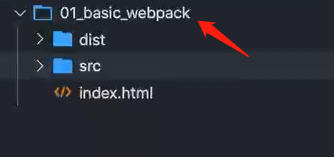

只要全局安装了webpack，进入文件夹之后直接敲命令`webpack`，就可以打包到dist文件夹中（没有打包的话使用ESmodule啥的都会报错，打包之后就不会）

index.html里面引用的是打包过后的js文件

```html
<script src="./dist/bundle.js"></script>
```

### 本地安装webpack

- 初始化 `npm init [-y]`，创建package.json

- 通过`npm i webpack --save-dev`安装开发时依赖webpack

- 打包：如果还是使用`webpack`命令进行打包的时候，使用的还是全局的，这时可以使用`npx webpack`使用局部的，或者在package.json里面配置脚本使用`npm run build`使用局部的

  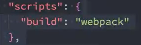

### webpack.config.js

**当使用npx webpack 或者npm run build进行打包的时候会默认去找index.js文件作为入口文件，可以使用命令配置entry和output出入口**，但是一般不这样做，会在项目文件夹下建立webpack.config.js

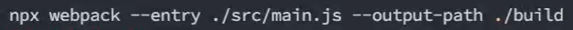

webpack.config.js文件

output里面的path一定要使用**绝对路径**

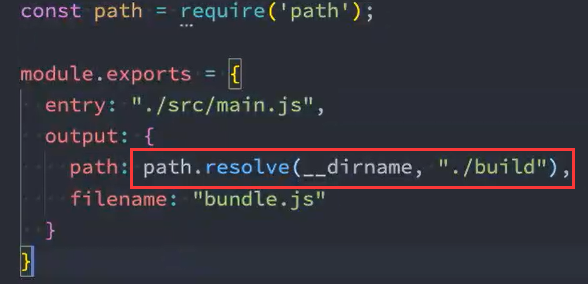

### webpack打包依赖图

入口文件main.js中所有进行依赖加载的文件都会被打包，但是如果有个aaa.js没有和所依赖的文件有依赖关系，就不会打包aaa.js文件，可以在任意一个有依赖关系的文件中注入依赖

```js
import './aaa.js'
```

## 2、打包css文件

先在依赖文件中加载css文件:

import './style/aaa.css'

```shell
npm i css-loader --save-dev
```

css-loader只是会将css进行加载，还要使用style-loader把css插入到页面中

```shell
npm i style-loader --save-dev
```

使用：

webpack.config.js内配置

```js
moudle.exports={
    entry:'',
    output:{},
    module：{
        rules:[
    		//loader配置对象
			{
    			test:/\.css$/,
    			//loader:"css-loader",语法糖，一般使用use数组（一个loader搞不定）
    			use:['style-loader','css-loader']//顺序
			},
        ]
	}
}
```

use里面执行顺序是`从后往前`加载执行，而打包css文件必须先加载css-loader，在加载style-loader

## 3、打包less文件

使用less肯定要安装less模块

想要打包less（或者sass）文件在style-loader和css-loader的基础上还要加上`less-loader`

```shell
npm i less less-loader -D
```

```js
moudle.exports={
    entry:'',
    output:{},
    module：{
        rules:[
		  {
            test: /\.less$/,
            use: [
              "style-loader",
              "css-loader",
              "less-loader"
            ]
      	},
      ]
	}
}
```

## 4、打包图片资源

### webpack5之前

使用`file-loader`,file-loader的作用就是帮助我们处理import/require()方式引入的一个文件资源，并且会将它放到我们输出的文 件夹中

使用div元素的background-image属性时，配置url('../img/aaa.png')

使用在img元素src属性时，要使用import导入文件，

```js
import bgSrc from './img/aaa.png'
img.src=bgSrc
```

配置文件名、扩展名、唯一hash码的时候要使用PlaceHolders来完成

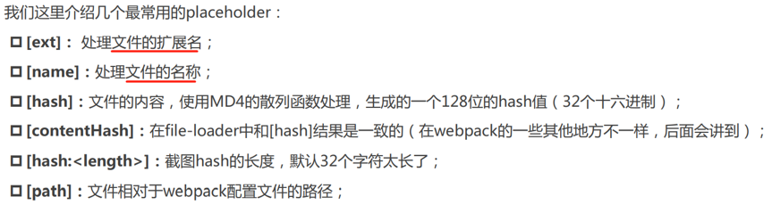 


```js
module:{
    rules:[
        {
            test:/\.(png|jpe?g|svg|gif)$/,
            use:{
                loader:'file-loader',
                options:{
                    name:"img/[name]_[hash:6].[ext]"
                }
            }
        }
    ]
}
```


`url-loader`（可以替代file-loader）

把图片大小**小于limit值**的转化成base64的URI打包到js文件中，

大于limit值的图片还是打包到文件夹中（太大了打包到js中导致js文件加载过慢）

```shell
npm i url-loader -D
```

```js
module:{
    rules:[
        {
        test: /\.(jpe?g|png|gif|svg)$/,//e后面有个问号表示e可有可无（正则），也可以分开写成jpg|jpeg
        use: {
          loader: "url-loader",
          options: {
            // outputPath: "img",//可以使用outputPath指定图片存放的文件夹，也可以在下面name里前面加上“img/”来指定文件夹
            name: "img/[name]_[hash:6].[ext]",//name表示原图片文件的名字，“_”是分隔符，不加也可以，加上便于查看清楚，6位hash码表示唯一，ext是文件后缀名
            limit: 100 * 1024//文件大小，单位字节
          }
        }
      },
    ]
}
```

> 对于gif类型的文件，必须要安装file-loader（安装即可），再安装url-loader进行配置,
>
> 并且，webp格式的文件无法使用这两来打包

### webpack5中asset module type

webpack5中使用的不是上面的loader，而是asset module type（资源模块类型）

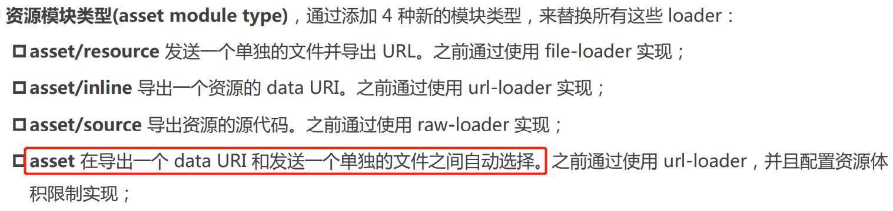 

这种方式不需要安装任何依赖

自定义文件名和输出路径：

- 在output中添加assetModuleFilename属性（用的不多，了解）
- **在rules中添加generator属性，在里面配置filename**

**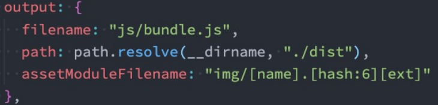**

设置url-loader的limit功能，使用parser

```js
module:{
    rules:[
        {
            test:/\.(jpe?g|png|gif|svg)$/,
            type:'asset',
            generator:{
                //注意：这里[ext]扩展名包括扩展名前面的‘.’，所以不需要额外加上
                filename:'img/[name]_[hash:6][ext]'
            },
            //设置url-loader的limit功能，使用parser
            paser:{
                dataUrlCondition:{
                    maxSize:100*1024
                }
            }
        }
    ]
}
```

>这种方式也不能打包webp格式的图片


## 5、打包字体文件

webpack5之前可以使用file-loader，用法跟打包图片一样

webpack5中使用asset module type

>字体一般都是不会进行base64编码的，不管大小

所以使用asset/resource（之前就是使用file-loader实现的）

```js
module:{
    rules:{
        test:/\.(eot|ttf|woff2?)$/,
        type:'asset/resource',
        generator:{
    		 filename:'font/[name]_[hash:6][ext]'           
        }
    }
}
```


## 6、webpack插件

### CleanWebpackPlugin

清理打包文件夹：再次执行打包的时候，会先删除原来打包的build文件夹在重新生成，不用手动删除

```shell
npm install clean-webpack-plugin -D
```

```js
const {CleanWebpackPlugin}=require('clean-webpack-plugin')//依赖里面有这个属性类
module.exports={
    entry:'',
    output:{
        path,
        filename
    },
    module:{},
    //插件都保存在这个数组里面
    plugins:[
        new CleanWebpackPlugin()
    ]
}
```

### HtmlWebpackPlugin

在此之前，我们打包过后的文件夹下是没有html文件的，在进行项目部署的时候，也是需要对应的index.html入口文件的，所以我们还需要对index.html进行打包

```shell
npm i HtmlWebpackPlugin -D
```

#### 指定html文件模板

这个插件内置了html模板（default_index.ejs模块），所以可以把项目文件下的index.html删掉

但是开发过程中一般不会用内置的ejs模板，会自己定义一个模板，然后打包过后的html文件就和定义的模板一样

把模板放在public文件夹下（假如模板长成下面这样）

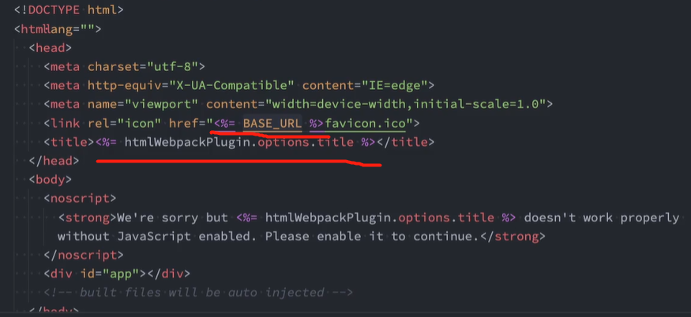 

#### 自定义数据填充

htmlWebpackPlugin.options.title这是自定义数据，需要自己定义才会显示出来

```js
const HtmlWebpackPlugin=require('html-webpack-plugin')//这个类不是插件中的属性

module.exports={
    plugins:[
    	new HtmlWebpackPlugin({
            //指定html模板
            template:'./public/index.html',
            //自定义数据填充
            title:'webpack项目标题哦'
        })
	]	
}
```

### DefinePlugin

这个时候编译还是会报错，因为在我们的模块中还使用到一个`BASE_URL`的常量

DefinePlugin是webpack的**内置插件，不需要安装**，允许在编译时创建配置的全局常量

```js
const HtmlWebpackPlugin=require('html-webpack-plugin')
const {DefinePlugin} = require('webpack')//webpack里面有这个属性类（注意是webpack内置插件）

const aaa='haha'

module.exports={
    plugins:[
    	new HtmlWebpackPlugin({
            //指定html模板
            template:'./public/index.html',
            //自定义数据填充
            title:'webpack项目标题哦'
        }),
        new DefinePlugin({
            //配置这个常量
            //BASE_URL:'aaa',//如果是这样写他寻找上下文名字叫aaa的变量（但是我们的想法是直接在这里定义），要使用单双引号嵌套
            BASE_URL:"'./'"
        })
	]	
}
```

### CopyWebpackPlugin

有的文件我们只需要复制到打包文件夹就可以了，比如说图标文件，这时就需要使用CopyWebpackPlugin

```js
const CopyWebpackPlugin =require('copy-webpack-plugin')//这个类不是插件中的属性

module.exports={
    output:{
        path:path.resolve(__dirname,'./build'),
        filename:'bundle.js'
    }
    
    
    plugins:[
    	new CopyWebpackPlugin({
    	    //patterns是匹配的意思
            patterns:[
                from:'public',//从public文件夹
                to:'./',//复制到这里（这里会拼接上面output里面的path），如果写'./aaa'就会复制到build/aaa文件夹中，所以只需要写'./'；或者不写to属性
    			//忽略的文件
                globOptions:{
    				//忽略的文件数组
                	ignore:[
                		"**/index.html"//**代表的就是上面的from属性文件夹
            		]
                }
            ]
        })
	]	
}
```

> 插件注意事项：
>
> * 类是插件中的属性（clean-webpack-plugin和define-plugin）
> * 类是插件本身（html-webpack-plugin和copy-webpack-plugin）
> * 内置插件（define-plugin）不需要安装，从webpack中取

## 7、Mode配置

- development，开发模式
- production，生产模式（准备打包上线的时候）

正常情况下，打包过后的代码是压缩丑化过的，如果报错就定位不到出错的位置

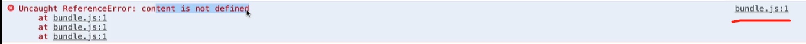

开发阶段，一般会设置`mode:development`模式

`devtool:source-map`，这个值设置为source-map后，就会生成对应的map文件（映射文件，方便调试代码和错误）

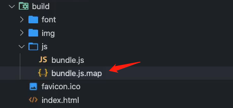 

这时，如果有出错就会定位到出错的位置

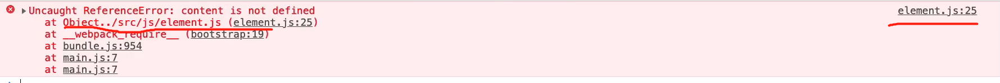

```js
module.exports={
    mode:'development',
    devtool:'source-map',
    entry:'',
    output:{}
}
```

## 8、babel

Babel是一个工具链，主要用于**旧浏览器或者环境中将ECMAScript 2015+代码转换为向后兼容版本的 JavaScript**；包含语法转换、源代码转换等。

### 命令行中使用babel

可以不和webpack等构建工具配置来单独使用，命令行使用的话需要两个库

`@babel/core`：babel的核心代码，必须安装

`@babel/cli`：让我们能在命令行中使用babel

```shell
npm i @babel/core @babel/cli -D
```

使用：

demo.js是需要编译的文件，--out-dir指定输出文件夹为dist

也可以编译源文件目录src

```shell
npx babel demo.js --out-dir dist
npx babel demo.js --out-file res.js
npx babel src --out-dir dist
```

但是仅仅这样还是不行，还需要使用相应的插件，**如果转换箭头函数，就需要安装专门转化箭头函数的插件，转换const/let就需要安装专门转化的相应插件**

```shell
npm i @babel/plugin-transform-arrow-functions @babel/plugin-transform-block-scoping -D
//执行转化
npx babel src --out-dir dist --plugins=@babel/plugin-transform-arrow-functions,@babel/plugin-transform-block-scoping
```

这样转换的过多也不方便，可以使用预设preset`@babel/preset-env`

预设包含转换常用es6+语法的插件

```shell
npm i @babel/preset-env -D
//执行转化

npx babel src --out-dir dist --presets=@babel/preset-env
```

### webpack中babel-loader

webpack中使用babel要安装两个东西

`@babel/core`：必须安装

`babel-loader`

只安装这两个还不行，还是要使用相应语法的插件

```js
module:{
    rules:[
        {
            test:/\.m?js$/,
            use:{
             	loader:'babel-loader',
                options:{
                    //plugins数组，注意要加上s
                    plugins:[
                        @babel/plugin-transform-arrow-functions,
                        @babel/plugin-transform-block-scoping
                    ]
                }
            }
        }
    ]
}
```

当然，手动管理大量插件不方便，可以使用babel-preset加载插件列表

安装`@babel/preset-env`

```js
module:{
    rules:[
        {
            test:/\.m?js$/,
            use:{
             	loader:'babel-loader',
                options:{
                    //presets数组，注意要加上s
                    presets:[
                        ['@babel/preset-env']
                    ]
                }
            }
        }
    ]
}
```

**单独的babel配置文件**

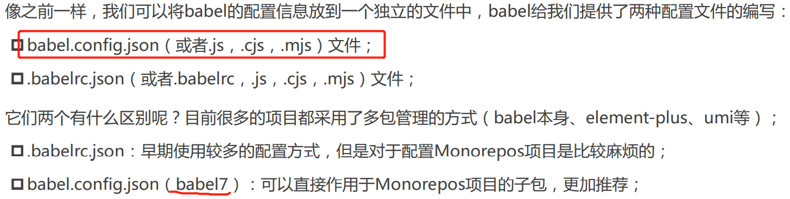


```js
//babel.config.js这样配置
module.exports={
    presets:[
        ["@babel/preset-env"]
    ]
}

//webpack.config.js里面这样配置即可
module:{
    rules:[
        {
            test:/\.m?js$/,
            loader:'babel-loader'
        }
    ]
}
```

## 9、Vue源码打包

### 版本解析

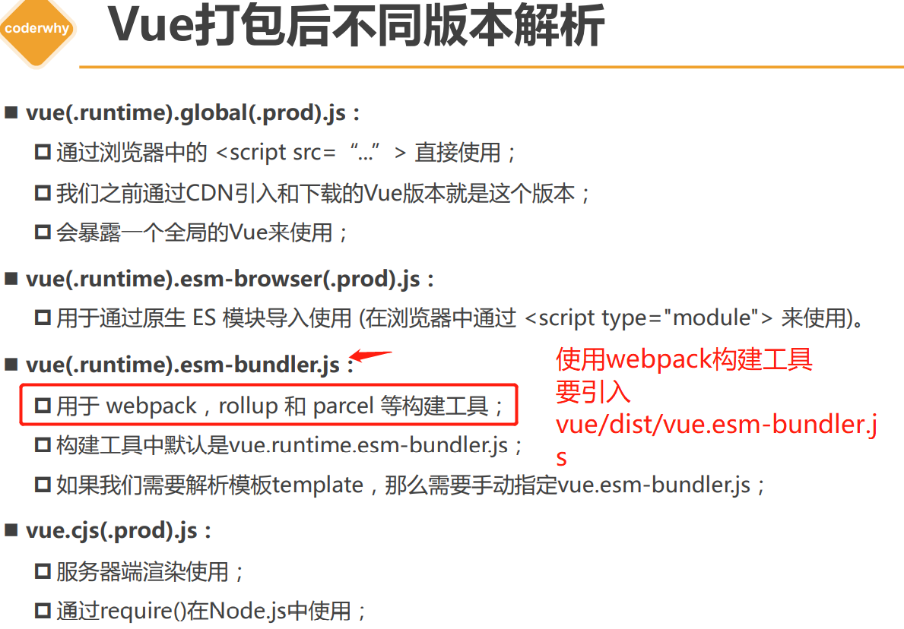


### 编写单文件组件（.vue）及打包vue

安装`vue3`

```shell
npm i vue@next
```

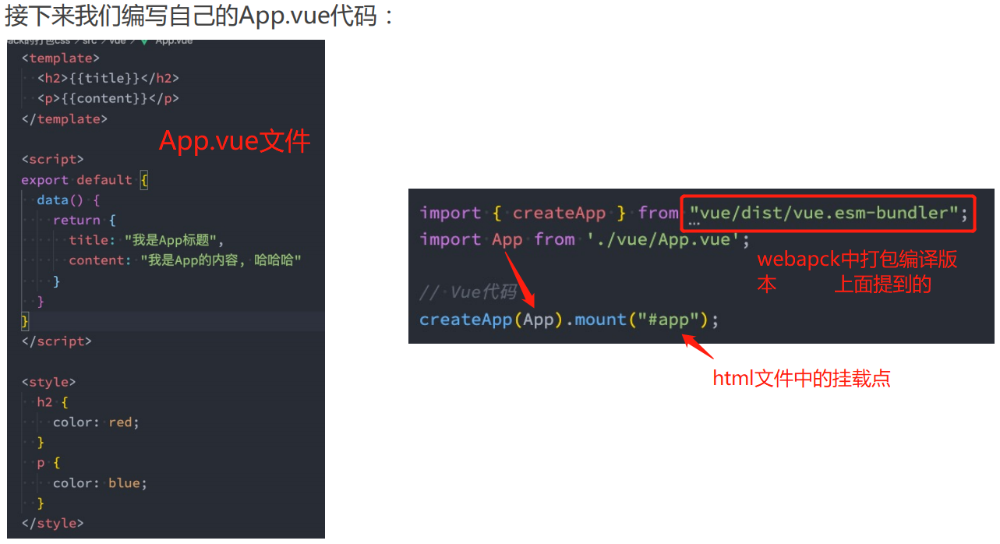  main.js

打包.vue文件需要三个东西

- `vue-loader@next` (默认情况下vue-loader是处理vue2的)
- `@vue/compiler-sfc` (默认情况下vue-template-compiler是处理vue2的)     这个模块是对.vue文件做解析的，安装之后无需配置
- `VueLoaderPlugin`插件  （从vue-loader/dist/index里面取）

```shell
npm i vue-loader@next @vue/compiler-sfc -D
```

webpack.config.js配置

```js
const {VueLoaderPlugin} = require('vue-loader/dist/index')

module.exports={
    module:{
        rules:[
            {
                test:/\.vue$/,
                loader:'vue-loader'
            }
        ]
    },
    plugins:[
        new DefinePlugin({
            __VUE_OPTIONS_API__:true,
            __VUE_PROD_DEVTOOLS__:false
        }),
        new VueLoaderPlugin()
    ]
}
```

# webpack5-进阶

## 1、搭建本地服务

之前想要运行开发的代码我们需要执行npm run build后的代码，或者是使用vscode插件live server，但是这样会影响我们的开发效率，我们希望：文件发生改变就可以自动编译和展示

weebpack提供了三种方式：

- watch mode
- webpack-dev-server（常用）
- webpack-dev-middleware（几乎不用）

### watch模式

**开启watch模式后，执行过npm run build之后每次更改代码不会退出，会继续监听并执行这个命令**，（需要刷新浏览器才有变化）

方式一：package.json里面配置脚本为：

这样配置之后其实是webpack-cli帮我们完成`watch:true`的设置

```js
"scripts": {
    "build": "webpack --watch"
},
```

方式二：webpack.config.js里面

```js
module.exports = {
    entry:'...', 
    watch: true,
}
```

### webpack-dev-server

watch模式是没有自动刷新浏览器的功能的，我们希望在不使用live-server的情况下可以具备**live reloading（实时重新加载）**的功能

安装

```shell
npm i webpack-dev-server -D
```

安装之后添加新的脚本就可以搭建一个本地服务来开启项目了（**这是基于node里面的express框架搭建的本地服务**）

```js
"scripts": {
    "build": "webpack",
    "serve": "webpack serve"//这个serve配置也是webpack-cli解析的
},
```

这样就可以实现编译监听和浏览器刷新

使用npm run serve进行打包但是**是不会输出打包文件夹的（没有build文件夹），而是将打包后的资源放在了内存中，通过express服务器直接访问内存里面的资源显示在浏览器中的（webpack-dev-server使用了一个叫memfs的库来实现这一功能）**


### webpack-dev-server相关配置：

#### contentBase:'./文件夹'

设置目标文件夹，打包之后的文件有一个index.html，这个文件里面通过link、script等引用了很多资源，**如果某个资源没有被打包，但是需要引用，就可以设置资源所在文件夹，让webpack在这个文件夹中查找资源，**比如说public中的favicon.ico图标，开发阶段不使用copy-webpack-plugin的话，这个public文件夹就没有被打包，但是可以设置`contentBase：'./public'`，让index.html在这里查找所需要但没有被打包的资源

> 注意：如果需要复制的文件过大，可能对编辑造成性能影响，可以在开发阶段使用contentBase，但是在项目部署的时候，还是要使用copy-webpack-plugin的，因为打包之后的文件夹才是要发布的，

```js
devServer: {
    contentBase: './public'
},
```

#### hot（`模块热替换`HMR）：'true'

Hot Module Replacement， `应用程序运行过程中，替换、添加、删除模块，而无需重新刷新整个页面；`

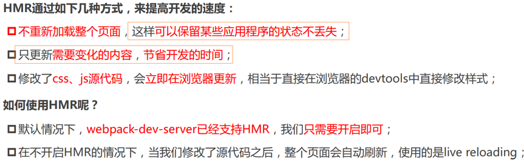 

```js
module.exports = {
    target: 'web', //为web环境还是node环境打包的，一般设置HMR模块热替换hot的时候设置上
    entry: './src/main.js', //打包入口文件
    // webpack-dev-server配置
    devServer: {
        contentBase: './public',
        hot: true
    }
}
```

target设置为web环境，一般是在HMR的时候设置，但是仅这样设置还不可以达到效果，**还需要为每个模块单独设置，设置的模块才有热替换效果**

main.js里面导入模块的时候要这样导入才有效果

```js
import "./js/es6"
//单个模块的模块热替换设置
if (module.hot) {
    module.hot.accept('./js/es6', () => {
        console.log('./js/es6这个模块进行了热替换之后执行的回调');
    })
}
```

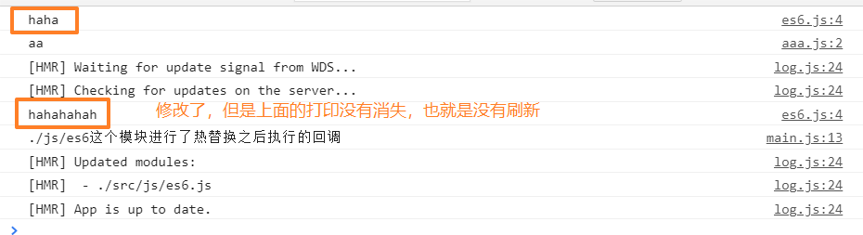 

##### 框架中的模块热替换

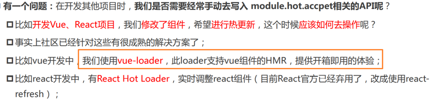 

**vue-loader中已经替你设置了上面的module.hot那样的if语句代码，所以在.vue文件中默认就有模块热替换效果了**

##### HMR原理

在视频课5月31号的1小时11分

#### host：0.0.0.0

> 0.0.0.0在windows系统的电脑里面可能解析不出来，所以可能使用不了0.0.0.0:7777这样来开启项目，但是这样无伤大雅，你可以使用localhost:7777或者自己电脑的ip来访问

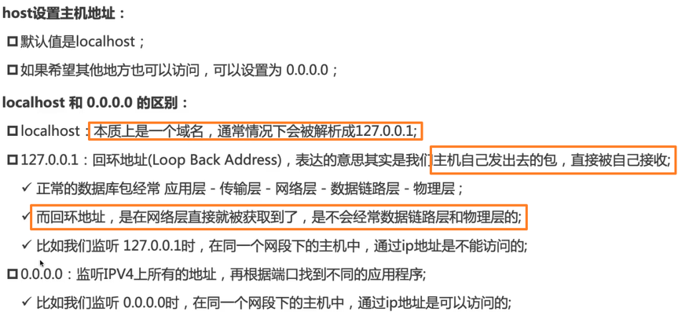 

#### port:7777

重新设置端口号

#### open:true

设置编译成功自动在浏览器打开项目

或者在package.json中serve脚本内加上配置

```js
"serve":'webpack serve --open'  //webpack-cli解析成open：true
```

#### compress：true为静态资源开启gzip模式

默认是false，**加上之后，打包之后资源过大的话浏览器下载就会慢，设置gzip进行压缩，压缩比例会较大，传输更快**

>当浏览器发现资源是gzip格式，会自动对资源进行解压，解压之后加载资源，不需要我们手动解压

会压缩js文件，html文件没有压缩

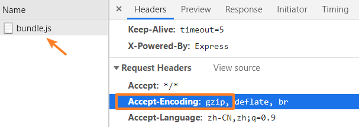 

#### proxy代理：开发时跨域解决

> proxy代理只能解决开发时跨域问题，项目部署之后还是要在后端解决的

如果直接映射的话也是不行的,看下面第一个代码段，想请求http://localhost:3000/users但是找不到资源，要把'/api'重写为 ' '，

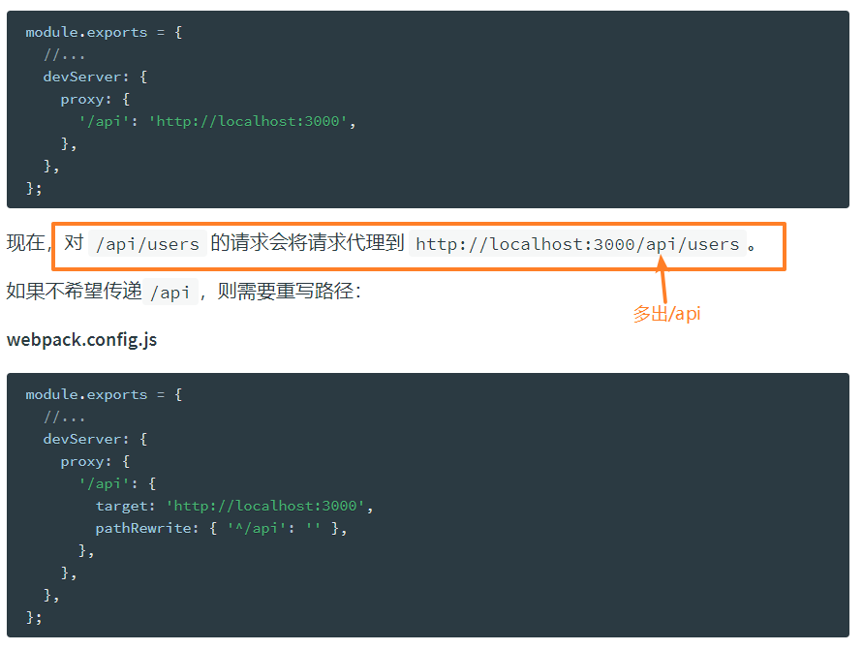 

proxy中‘/api’中的另外两个属性

secure：默认情况下不接收转发到https的服务器上，如果希望支持，可以设置为false；

changeOrigin：它表示是否更新代理后请求的headers中host地址；

> webpack devServer设置完跨域代理后环境变量要改成设置后的
>
> VUE_APP_BASE_URL=/api

## 2、resolve模块解析

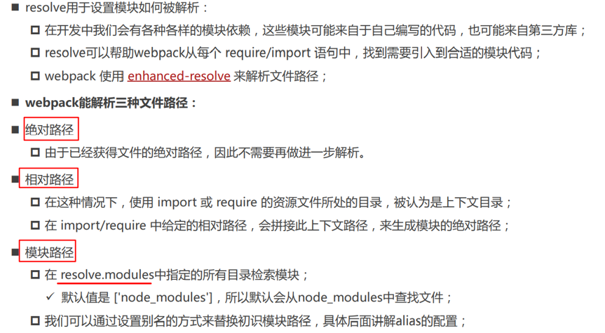  

### modules模块路径

### mainFiles查找文件夹下文件

### extensions文件扩展名省略

默认值是 ['.wasm', '.mjs', '.js', '.json']，会先查找.wasm文件，没有再查找.mjs文件...可以修改

### alias配置文件夹别名

```js
module.exports={
    entry:'',
    devServer:{},
    resolve: {
        modules: ['node_modules'], //默认值，模块路径加载默认加载node_modules文件夹里面的模块，一般不修改
        mainFiles: ["index"], //默认查找文件夹下面的index文件，再根据resolve.extensions来解析扩展名，一般不修改
        extensions: ['.wasm', 'mjs', '.js', 'json', '.vue', '.ts'], //文件扩展名省略
        alias: {
            '@': path.resolve(__dirname, './src'),
            'img': path.resolve(__dirname, './src/img')
        } //配置文件夹路径别名
    },
}
```

## 3、webpack.config.js开发和生产环境分离


某些配置是在开发环境需要使用的，**某些配置是在生成环境需要使用的，当然某些配置是在开发和生成环境都会使用的**，所以最好进行划分，方便维护和管理

项目文件下建立config文件夹，包含这三个文件

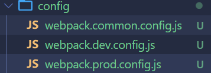然后配置build和serve的脚本分别执行哪一个文件

```json
"scripts": {
    "build": "webpack --config ./config/webpack.prod.config.js",
    "serve": "webpack serve --config ./config/webpack.dev.config.js"
},
```

prod和dev文件中的代码不包含common公共部分的代码，建立联系可以使用一个叫`webpack-merge`的插件

```shell
npm i webpack-merge -D
```

不过也可以使用"..."扩展运算符导入common,插件在这里有点脱裤子放屁

> 注意：配置文件现在执行的是config文件夹下的文件，所以有些配置需要更改路径

common文件：

​	entry不需要改（上下文路径，找的是scripts里面配置的脚本那个路径），HtmlWebpackPlugin插件中的模板不需要改（根目录路径）

​	output输出需要改为" ../ "，alias别名需要改 " ../ "

dev文件：

​	devServer中的contentBase改为" ../ "，

prod文件：

​	不需要改（CopyWebpackPlugin里面的from路径是根目录的路径，不需要改）

## 4、webpack.config.js相关配置总合

```js
const path = require('path')
const { CleanWebpackPlugin } = require('clean-webpack-plugin')
const HtmlWebpackPlugin = require('html-webpack-plugin')
const { DefinePlugin } = require('webpack')
const CopyWebpackPlugin = require('copy-webpack-plugin')
const { VueLoaderPlugin } = require('vue-loader/dist/index')

module.exports = {
    target: 'web', //为web环境还是node环境打包的，一般设置HMR模块热替换hot的时候设置上
    mode: 'development', //开发模式
    // watch: true,//监听npm run build
    devtool: 'source-map', //生成映射文件map
    entry: './src/main.js', //打包入口文件
    //打包出口
    output: {
        path: path.resolve(__dirname, "./build"), //打包到当前文件所在文件夹下的build文件夹
        filename: 'js/bundle.js' //打包生成的js文件
    },
    // webpack-dev-server配置
    devServer: {
        contentBase: './public',
        hot: true,
        // host: "0.0.0.0",
        port: 7777,
        open: true,
        compress: true,
        proxy: {
            '/api': {
                target: 'http://localhost:3000',
                pathRewrite: { '^/api': '' },
                secure: false
            }
        }
    },
    //resolve模块解析
    resolve: {
        modules: ['node_modules'], //默认值，模块路径加载默认加载node_modules文件夹里面的模块，一般不修改
        mainFiles: ["index"], //默认查找文件夹下面的index文件，再根据resolve.extensions来解析扩展名，一般不修改
        extensions: ['.wasm', 'mjs', '.js', 'json', '.vue', '.ts'], //文件扩展名省略
        alias: {
            '@': path.resolve(__dirname, './src'),
            'img': path.resolve(__dirname, './src/img')
        } //配置文件夹路径别名
    },
    module: {
        rules: [
            //打包css：style-loader  css-loader
            {
                test: /\.css$/,
                // 1.loader的写法(语法糖)
                // loader: "css-loader"

                // 2.完整的写法
                use: [
                    "style-loader",
                    "css-loader",
                    "postcss-loader"
                ]
            },
            //打包less: style-loader  css-loader  less(前提)  less-loader
            {
                test: /\.less$/,
                use: [
                    "style-loader",
                    "css-loader",
                    "less-loader"
                ]
            },
            //打包文件资源（图、字体...）：file-loader，打包图片：url-loader
            //webpack5中使用asset module type打包
            {
                test: /\.(jpe?g|png|svg|gif)$/,
                // use: {
                //     loader: 'url-loader',
                //     options: {
                //         limit: 50 * 1024,
                //         // outputPath: "img",
                //         name: 'img/[name]_[hash:6].[ext]'
                //     }
                // }
                type: 'asset',
                //打包输出
                generator: {
                    filename: 'img/[name]_[hash:6][ext]'
                },
                //limit：文件大小大于limit就不会转化成base64的uri放到js文件中
                parser: {
                    dataUrlCondition: {
                        maxSize: 50 * 1024
                    }
                }
            },
            //打包字体： file-loader
            //webpack5中使用asset module type打包
            {
                test: /\.(woff2?|eot|ttf)$/,
                // use: {
                //     loader: 'file-loader',
                //     options: {
                //         name: 'font/[name]_[hash:6].[ext]'
                //     }
                // }
                type: 'asset/resource',
                generator: {
                    filename: 'font/[name]_[hash:6][ext]'
                }
            },
            //转化es6+语法到es5语法
            {
                test: /\.m?js$/,
                use: {
                    loader: 'babel-loader'
                }
            },
            //打包vue文件
            {
                test: /\.vue$/,
                use: {
                    loader: 'vue-loader'
                }
            }
        ]
    },
    //插件数组
    plugins: [
        new CleanWebpackPlugin(),
        new HtmlWebpackPlugin({
            template: './public/index.html', //html文件模板
            title: 'webpack项目'
        }),
        new DefinePlugin({
            BASE_URL: "'./'", //配置全局常量
            __VUE_OPTIONS_API__: true,
            __VUE_PROD_DEVTOOLS__: false
        }),
        // new CopyWebpackPlugin({
        //     patterns: [{
        //         from: 'public',
        //         to: './',
        //         globOptions: {
        //             ignore: [
        //                 '**/index.html'
        //             ]
        //         }
        //     }]
        // }),
        new VueLoaderPlugin()
    ]
}
```


# PostCSS

PostCSS是一个`通过JavaScript来转换样式`的工具，帮助我们进行css转换和适配，比如添加相应的浏览器前缀，

安装postcss postcss-cli -D;

比如说我想要自动添加浏览器前缀，还要依赖`autoprefixer`插件;


真实开发中我们不会直接使用命令行对css进行这样的处理，而是使用构建工具（比如webpack）：

### webpack中的扩展`postcss-loader`

**这是安装了css-loader和style-loader前提下再安装postcss-loader**

```shell
npm i postcss-loader -D
```

再配置webpack.config.js

posecss的loader要配置成一个对象

```js
const path=require('path')
moudle.exports={
    entry:'./src/main.js',
    output:{
        path: path.resolve(__dirname, "./build"),
        filename: 'bundle.js'
    },
    module：{
        rules:[
			{
    			test:/\.css$/,
    			use:[
                    'style-loader',
                    'css-loader'
    				//对象的形式
    				{
    					loader:'postcss-loader',
    					options:{
    						postcssOptions:{
    							plugins:[
    								require('autoprefixer')
    							]
							}
						}
                 	}
                ]//顺序
			},
        ]
	}
}
```

### 单独的postcss配置文件

根目录下创建postcss.config.js

```js
moudle.exports={
    plugins:[
        require('autoprefixer')
    ]
}
```

然后webpack.config.js里面就可以直接这样配置

```js
use: [
    "style-loader",
    "css-loader",
    "postcss-loader"
]
```


### postcss-preset-env插件代替autoprefixer插件

它可以帮助我们将一些现代的CSS特性，转成大多数浏览器认识的CSS，并且会根据目标浏览器或者运行时环境 添加所需的polyfill

也包括会自动帮助我们添加autoprefixer（所以相当于已经**内置了autoprefixer**）

```shell
npm i postcss-preset-env -D
```

postcss.config.js里面直接改掉(在使用某些postcss插件的时候也可以直接传入字符串)

```js
moudle.exports={
    plugins:[
        "postcss-preset-env"
    ]
}
```

## 语法补充

### historyApiFallback

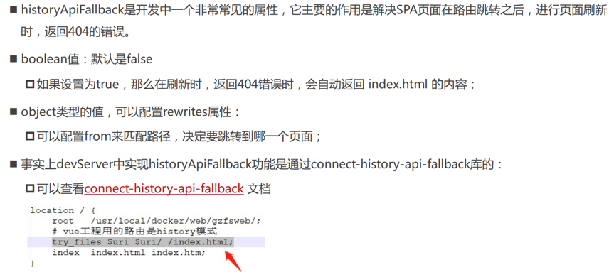 

就是你写的vue项目（spa页面），已经进行路由跳转了，这时你刷新页面其实是会返回404，但是还是可以请求到资源，是因为vue-cli依赖webpack中已经配置`historyApiFallback:true`，如果想在vue-cli项目中修改webpack配置，需要在vue.config.js文件中进行修改

```js
module.exports = {
  configureWebpack: {
    devServer: {
      // historyApiFallback: false
    }
  }
}
```

### require.context()实现工程自动化

如果需要导入某个文件夹中的所有模块，可以使用`require.context()`，他会遍历该文件夹中文件并且自动导入，使你不需要写很多`import` 语法来导入文件

该方法传递三个参数：

* 一个要搜索的目录（相对路径）
* 一个标记表示是否还搜索其子目录（布尔值），深度查找
* 一个匹配文件的正则表达式。

```js
require.context('../main', true, /\.js$/);
//（创建出）一个 context，其中文件来自 main 目录及其子目录，request 以 `.js` 结尾。
```

该语法返回一个函数，此导出函数有三个属性：`resolve`, `keys`, `id`。

- `resolve` 是一个函数，它返回 request 被解析后得到的模块 id。
- `keys` 也是一个函数，它返回一个数组，由所有可能被此 context module 处理的请求组成。
- `id` 是 context module 的模块 id. 它可能在你使用 `module.hot.accept` 时会用到。

```js
const routeFiles = require.context('@/router/main', true, /\.ts$/)
routeFiles.keys().forEach((e) => {
  console.log(e)
})
// ./analysis/dashboard/dashboard.ts
// ./analysis/overview/overview.ts
// ./product/category/category.ts
// ./product/goods/goods.ts
// ./story/chat/chat.ts
// ./story/list/list.ts
// ./system/department/department.ts
// ./system/menu/menu.ts
// ./system/role/role.ts
// ./system/user/user.ts
```

使用key()返回的数组获取的文件路径是相对于`@/router/main`文件夹的，使用时记得做相应的转化

之后加载这些文件使用`commonjs`规范

```js
const arr = []
routeFiles.keys().forEach((e) => {
  const res = require('@/router/main' + e.split('.')[1])
  arr.push(res.default)//这个数组保存的就是所有的模块
})
```

