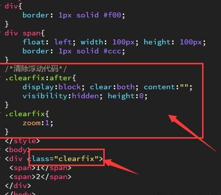
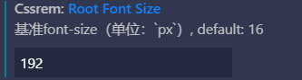

## 笔记

### 单位(em、css3中rem)

相对单位 `em` ：相对于当前元素的字体大小

```html
<html>
<head>
<style>
p {
  font-size: 16px;
  line-height: 2em;/*2*16px=32px*/
}

div {
  font-size: 30px;
  border: 1px solid black;
}

span {
  font-size: 0.5em;/*0.5*30px=15px*/
}
</style>
</head>
<body>

<p>这些段落的 line-height 这样计算：2x16px = 32px。</p>
<p>这些段落的 line-height 这样计算：2x16px = 32px。</p>
<p>这些段落的 line-height 这样计算：2x16px = 32px。</p>
<div>这个 div 元素的 font-size 被设置为 30px。<span>div 元素内部的 span 元素的 font-size 为 0.5em，其等于 0.5x30 = 15px。</span></div>

</body>
</html>
```

相对单位`rem`: 相对于根元素html字体大小

rem 单位设置的 font-size 相对于浏览器的基准字体尺寸，并不从其父元素继承。

```css
html {
  font-size:62.5%;/*基数为10*/
}
```


```html
<html>
<head>
<style>
html {
  font-size:16px;/*只会受html的font-size的影响*/
}

div {
  font-size: 3rem;/*3*16px=48px*/
  border: 1px solid black;
}

#top-div {
  font-size: 2rem;/*2*16px=32px*/
  width: 20rem;
  height: 20rem;
  border: 1px solid red;
}
</style>
</head>
<body>

<p>此文档的 font-size 是 16px。</p>

<div id="top-div">
这个 div 的 font-size 为 2rem，转换为浏览器字体大小的2倍。
<div>这个 div 元素的 font-size 为 3rem。它同时也展示出不会继承其父元素的字体尺寸。</div>
</div>

<p>rem 单位设置的 font-size 相对于浏览器的基准字体尺寸，并不从其父元素继承。</p>

</body>
</html>
```

vscode中的cssrem插件，现在叫px to rem & rpx,把扩展中的基准改为想要的基准，例如16px，就是1rem=16px，如果想设置32px，它会自动帮你换算成2rem

 


### css3原生变量 、`var()`函数

全局变量可以在整个文档中进行访问/使用，而局部变量只能在声明它的选择器内部使用。

如需创建具有全局作用域的变量，请在` :root `选择器中声明它。 :root 选择器匹配文档的根元素。

如需创建具有局部作用域的变量，请在将要使用它的`选择器`中声明它。

```css
/*全局变量声明*/
:root {
  --blue: #1e90ff;
  --white: #ffffff;
}

body { background-color: var(--blue); }/*使用全局变量*/

h2 { border-bottom: 2px solid var(--blue); }

.container {
  /*局部变量*/
  --num: 15px;
  width: var(--num);
 
  color: var(--blue);
  background-color: var(--white);
  padding: 15px;
}

button {
  background-color: var(--white);
  color: var(--blue);
  border: 1px solid var(--blue);
  padding: 5px;
}
```

`覆盖变量`：如果全局定义color变量，局部又重新定义color变量，那么就会使用局部的变量值

### calc()函数

可以实现不同的单位之间的计算，使用时最好中间加上空格

### 边框阴影

text-shadow：offsetX  offsetY blur color；

box-shadow：box-shadow  h-shadow  v-shadow  blur  spread  color  inset;

| 值         | 描述                                     | 测试                                                         |
| :--------- | :--------------------------------------- | :----------------------------------------------------------- |
| *h-shadow* | 必需。水平阴影的位置。允许负值。         | [测试](https://www.w3school.com.cn/tiy/c.asp?f=css_box-shadow) |
| *v-shadow* | 必需。垂直阴影的位置。允许负值。         | [测试](https://www.w3school.com.cn/tiy/c.asp?f=css_box-shadow) |
| *blur*     | 可选。模糊距离。                         | [测试](https://www.w3school.com.cn/tiy/c.asp?f=css_box-shadow&p=3) |
| *spread*   | 可选。阴影的尺寸。                       | [测试](https://www.w3school.com.cn/tiy/c.asp?f=css_box-shadow&p=7) |
| *color*    | 可选。阴影的颜色。请参阅 CSS 颜色值。    | [测试](https://www.w3school.com.cn/tiy/c.asp?f=css_box-shadow&p=10) |
| inset      | 可选。将外部阴影 (outset) 改为内部阴影。 | [测试](https://www.w3school.com.cn/tiy/c.asp?f=css_box-shadow&p=15) |

### 相对于父元素的结构伪类

li：first-child  查找ul下的第一个元素，如果不是li元素，则不匹配

li：last-child

li：first-of-type  查找ul下的第一个li元素，li元素前面有别的也没问题

li：last-of-type 

li：nth-child(n | 关键字 | 表达式)  指定索引的li元素       //n从**1**开始，关键字：**even**偶数，**odd**奇数，表达式：如果想取前五，则**-n+5**

li：nth-last-child（n | 关键字 | 表达式）

li：empty  内容为空的li元素（空格都没有）


li：target   配合锚点使用  可以为锚点元素添加样式，当前目标元素被触发为锚元素是触发样式

 

### 伪元素选择器

**e::before**

**e::after**

必须得设置content：‘’，默认是行级元素（如果想设置宽高要display：block）

其他伪元素

e::first-letter 第一个字或字母

e::first-line   第一行

e::selection   选中的内容的样式 （只能设置显示的样式，不能设置大小）

### 盒模型box-sizing

| 值          | 描述                                                         |
| :---------- | :----------------------------------------------------------- |
| content-box | 这是由 CSS2.1 规定的宽度高度行为。宽度和高度分别应用到元素的内容框。在宽度和高度之外绘制元素的内边距和边框。 |
| border-box  | 为元素设定的宽度和高度决定了元素的边框盒。就是说，为元素指定的任何内边距和边框都将在已设定的宽度和高度内进行绘制。通过从已设定的宽度和高度分别减去边框和内边距才能得到内容的宽度和高度。 |
| inherit     | 规定应从父元素继承 box-sizing 属性的值。                     |

 

 ### 边框圆角

border-radius：2px 2px 2px 2px；  //左上，右上，右下，左下

border-radius：2px 5px 2px；  //左上，右上（左下），右下        设置三个值，则中间那个是右上和左下对称

border-radius：2px 5px；   //左上（右下） 右上（左下）   

border-radius：2px；  //全部

### 线性渐变、镜像渐变

**background : liner-gradient(to left , red , blue)**

方向：to bottom=90deg (默认)


background ： **radial -gradient(circle？，closest-side？，at left top ?, red , blue)**

第一个参数：可选   形状，circle圆形，ellipse椭圆（正方形的容器也是圆）

第二个参数：可选   大小 

- farthest-corner (默认) : 指定径向渐变的半径长度为从圆心到离圆心最远的角
- closest-side ：指定径向渐变的半径长度为从圆心到离圆心最近的边
- closest-corner ： 指定径向渐变的半径长度为从圆心到离圆心最近的角
- farthest-side ：指定径向渐变的半径长度为从圆心到离圆心最远的边

第三个参数：可选  镜像起点，可以是 at 50px,50px (相对于元素左上角)


重复镜像渐变：repeating-radial-gradient()

 

  


重复线性渐变：repeating-liner-gradient()

 


### transform2D

transform 转换  none没有变换（默认值）

​        平移变换  **translate（__px,__px）**   translateX(__PX)  

​                      transform :translateX(20px) translateY(20PX) 麻烦写法

​        缩放变换  **scale（1.5）**  数字（倍数，1为不变）

​        旋转变换  **rotate（-45deg）** 负号为逆时针旋转45度

​        斜切变换  **skew（30deg，40deg）** //水平方向，垂直方向

​                      skewY（30deg） skewX（30deg）


**transform-origin** 属性允许您改变被转换元素的转换位置。  默认是（50%，50%）的位置，不是（0，0）左上角。

定义视图被置于 X 轴的何处。可能的值：

left center right  *length**（**px）*  *%*

定义视图被置于 Y 轴的何处。可能的值：

top  center  bottom  *length**（**px）*  *%*

### transition过渡

**transition：all  _s  linear  _s **

第二个值为几秒钟，可以看到过程。第三个值为缓冲效果时间曲线 ：ease先快到慢  ：linear匀速（常用）...。第四个值为延迟几秒开始

应用过渡的css属性（宽高颜色...）**transition-property:all**(默认为all全部，可不写)

所需时间**transition-duration:5s**

缓冲效果**transition-timing-function:linear**

旋转效果延迟进行**transition-delay:5s**

### transform3D

z轴是和屏幕垂直的一个轴

平移：单是z轴方向移动（看不见）

transform：translate3d（10px，10px ，20px）；      transform :translateX(20px)  translateY(20PX)  translateZ(20px)；

缩放：单是z轴方向变厚（看不见）

transform：scale3d（1.2，1.3，1.5）；       transform：scaleX（1.3） scaleY（1.3） scaleZ（1.3）；

旋转：

transform：rotate3d（1，1，1，30deg）


使子元素保留其3D转换的效果（设置在父元素中）

transform-style  ：flat                   子元素不保留其3D位置（平面效果）

​                         preserve-3d       子元素保留其3D位置（立体效果i）

景深透视

perspective：10px；

perspective-origin：0px  0px；

### 多列布局

将一个div里面的内容分成多列

```html
div{
    column-count:3;    //列数
	column-rule:1px dashed red;    //列与列之间的分隔样式，类似于边框
	column-gap:50px;    //列之间的间隔宽度
	column-width:300px;   //列宽
}
div>h4{
	column-span:all;    //设置div下的某个元素是否要占据全部列，可选值：1/all
}
```


### 弹性盒子布局⭐

设置父元素为盒子，里面子元素为伸缩项 ：

​	**display：flex**    


设置子元素的在主轴方向上的排列方式：

​	**justify-content**：flex-start              父容器起始位置排列，默认

​							   flex-end               父元素结束位置排列

​						  	 center                  父元素中间位置排列

​						  	 space-between      左右位于开始结束，中间平均分布

​							   space-around        多余空间平均分布在子元素两边（导致中间是左右的两倍）


设置子元素在侧轴方向上的排列方式

​	**align-items**：flex-start              父容器顶部位置排列

​					  	flex-end               父元素底部位置排列

​					      center                 父元素中间位置排列

​						  stretch                 子元素在侧轴方向上进行拉伸，充满整个父元素高度（在子元素不设置高度前提下实现），默认

​						  baseline              子元素按照文本基线对齐（就像英文字母按照四条线中的第三条线对齐，用的不多）


align-items是设置在父元素身上，是对所有子元素设置侧轴上的排列方式的，如果想对单独某一子元素设置，则使用**align-self**：flex-start/flex-end/center/stretch/baseline,用的也不多


`子元素宽度总和如果大于父元素，会自动收缩，不会换行`，如果这不是我们想要的，就要使用flex-flow，`flex-flow实际是 flex-wrap 和 flex-direction 的组合`


控制子元素是否换行     **如果想让子元素换行显示，就必须得给子元素宽度，并且子元素宽度的总和要大于父元素的宽度**

**flex-wrap**：nowrap            不换行，默认

​			      wrap               换行

​				   wrap-reserve    翻转换行，布局颠倒（用的不多）


控制子元素的排列方式：  `横向不一定就是主轴`

**flex-direction**：row                  设置横向为主轴，则纵向就是侧轴，默认   //左到右

​						  column             设置纵向为主轴⭐（子元素在纵向可以使用flex属性来进行等分）

​						  row-reserve       横向排列，右到左

​						  column-reserve  纵向排列 ，下到上	

**flex-flow**设置两个属性值，一个是设置是否换行，一个是控制排列方式，如 flex-flow：wrap  column；顺序可颠倒


**flex属性是对子元素进行设置**

`flex属性是flex-grow、flex-shrink、flex-basis三个属性的简写`,默认值0  1  auto，后两个可选


扩展子元素宽度：设置当前子元素`占据剩余空间`的比例  

比例值计算：**当前元素flex-grow / 其他子元素flex-grow总和** 比如：三个div子元素，第一个是1，二三是0，则第一个占比1/0+0=100%

**flex-grow**：0   不占据， 默认值  


定义收缩比例，通过设置的值计算收缩空间

比例值计算：**当前元素flex-shrink / 其他子元素flex-shrink总和** 

**flex-shrink**：1   默认


上面两个属性用的不多，用得多的是对子元素设置flex属性：用于`设置当前子项占据父元素的比例`

设置子元素占比为1：4

```html
div{
	display:flex;
}
div>.left{
	flex:1;
}
div>right{
	flex:4;
}
```

### [滚动条](https://developer.mozilla.org/zh-CN/docs/Web/CSS/::-webkit-scrollbar)：隐藏、样式修改

> `::-webkit-scrollbar` 仅仅在支持[WebKit](https://webkit.org/)的浏览器 (例如, 谷歌Chrome, 苹果Safari)可以使用.

#### 隐藏

```css
/*元素设置auto或者是scroll，保证元素是可以滚动的*/
div{
overflow: auto;
    
&::-webkit-scrollbar {
    display: none; /* Chrome Safari */
}
scrollbar-width: none; /* firefox */
-ms-overflow-style: none; /* IE 10+ */
}


/*该样式直接写在app.vue中的style里面，可以全局使用*/
<style>
::-webkit-scrollbar {
  display: none !important; /* Chrome Safari */
}
</style>
```

#### 样式修改

```css
::-webkit-scrollbar — 整个滚动条.
::-webkit-scrollbar-button — 滚动条上的按钮 (上下箭头).
::-webkit-scrollbar-thumb — 滚动条上的滚动滑块.
::-webkit-scrollbar-track — 滚动条轨道.    背景
::-webkit-scrollbar-track-piece — 滚动条没有滑块的轨道部分.
::-webkit-scrollbar-corner — 当同时有垂直滚动条和水平滚动条时交汇的部分.    右下角交汇处
::-webkit-resizer — 某些元素的corner部分的部分样式(例:textarea的可拖动按钮).

:horizontal 水平方向的滚动条
:vertical 垂直 方向的滚动条
:decrement 应用于按钮和内层轨道(track piece)。它用来指示按钮或者内层轨道是否会减小视窗的位置(比如，垂直滚动条的上面，水平滚动条的左边。)
:increment decrement类似，用来指示按钮或内层轨道是否会增大视窗的位置(比如，垂直滚动条的下面和水平滚动条的右边。)
:start 伪类也应用于按钮和滑块。它用来定义对象是否放到滑块的前面。
:end 类似于start伪类，标识对象是否放到滑块的后面。
:double-button  该伪类以用于按钮和内层轨道。用于判断一个按钮是不是放在滚动条同一端的一对按钮中的一个。对于内层轨道来说，它表示内层轨道是否紧靠一对按钮。
:single-button 类似于double-button伪类。对按钮来说，它用于判断一个按钮是否自己独立的在滚动条的一段。对内层轨道来说，它表示内层轨道是否紧靠一个single-button。
:no-button 用于内层轨道，表示内层轨道是否要滚动到滚动条的终端，比如，滚动条两端没有按钮的时候。
:corner-present  用于所有滚动条轨道，指示滚动条圆角是否显示。
:window-inactive 用于所有的滚动条轨道，指示应用滚动条的某个页面容器(元素)是否当前被激活。(在webkit最近的版本中，该伪类也可以用于::selection伪元素。webkit团队有计划扩展它并推动成为一个标准的伪类)

IE
scrollbar-arrow-color: color; /*三角箭头的颜色*/
scrollbar-face-color: color; /*立体滚动条的颜色（包括箭头部分的背景色）*/
scrollbar-3dlight-color: color; /*立体滚动条亮边的颜色*/
scrollbar-highlight-color: color; /*滚动条的高亮颜色（左阴影？）*/
scrollbar-shadow-color: color; /*立体滚动条阴影的颜色*/
scrollbar-darkshadow-color: color; /*立体滚动条外阴影的颜色*/
scrollbar-track-color: color; /*立体滚动条背景颜色*/
scrollbar-base-color:color; /*滚动条的基色*/


/**滚动条的宽度*/
::-webkit-scrollbar {
  width: 6px; /*竖向*/
  height: 6px; /*横向*/
}
/*滚动条的滑块*/
::-webkit-scrollbar-thumb {
  background-color: rgb(52, 57, 69);
  border-radius: 3px;
  &:horizontal {
    background-color: rgb(141, 141, 141);/*横向条*/
  }
}
/*外层轨道（背景）*/
::-webkit-scrollbar-track {
  background-color: rgb(5, 5, 5);
}
::-webkit-scrollbar-corner {
  background-color: rgb(5, 5, 5);
}
```


### filter、backdrop-filter毛玻璃

```html
    <style>
      img,
      .box {
        position: fixed;
        left: 0;
        top: 0;
        width: 100%;
        height: 100%;
        z-index: -1;
        /* backdrop-filter: blur(90px); */
        /* filter: blur(40px); */
      }

      .box {
        background-color: rgba(0, 0, 0, 0.5);
        backdrop-filter: blur(40px);
      }
    </style>
  </head>
  <body>
    
    <div class="box"></div>
  </body>
```


## 面试

### 设置浮动后，改元素display为多少

自动变成

```
display:block;
```

`absolute`和`float`都会隐式改变display；

### 清除浮动的几种方式

- ⽗级 div 定义 height
- 结尾处加空 div 标签 clear:both
- ⽗级 div 定义伪类` :after 和 zoom`
- ⽗级 div 定义 overflow:hidden
- ⽗级 div 也浮动，需要定义宽度
- 结尾处加 br 标签 clear:both

第三种是推荐使用的：

 

### 块元素垂直方向上的 margin 会折叠。

只有垂直方向的 margin 才会折叠，也就是说，水平方向的 margin 不会发生折叠的现象。

### display:none和visibility:hidden的区别？

**空间占据、回流与渲染、株连性**

1、display:none不占据任何空间，visibility:hidden隐藏的元素空间依旧存在

2、display:none隐藏产生reflow和repaint(**回流与重绘**)，会影响性能，visibility:hidden没有这个影响

3、株连性：祖先元素遭遇某祸害，则其子子孙孙无一例外也要遭殃，display:none有，`visibility:hidden是伪株连性，父级元素设置visibility:hidden，子级元素可以通过visibility:visible来让元素显示`

### link与import的区别

- link 是 HTML ⽅式， @import 是CSS⽅式
- link 最⼤限度⽀持并⾏下载， @import 过多嵌套导致串⾏下载，出现 FOUC (⽂档样式 短暂失效)
- link 可以通过 rel=“alternate stylesheet” 指定候选样式
- 浏览器对 link ⽀持早于 @import ，可以使⽤ @import 对⽼浏览器隐藏样式
- @import 必须在样式规则之前，可以在css⽂件中引⽤其他⽂件
- 总体来说： link 优于 @import

### 元素竖向的百分比设定是相对于容器的高度吗？是宽度

元素竖向的百分比设定是相对于容器的宽度，而不是高度；

对于一些表示竖向距离的属性，

例如 `padding-top` , `padding-bottom` , `margin-top` , `margin-bottom` 等，

当按百分比设定它们时，依据的也是父容器的宽度，而不是高度。

### 为什么说position absolute 跟float 影响性能？

俩都会使元素脱离文档流，引起`页面重绘`

**position属性为absolute或fixed的元素，重排的开销会比较小，因为不用考虑它对其他元素的影响**，所以使用的可以比float多

### 让页面里的字体变清晰，变细用CSS怎么做？

CSS3里面加入了一个`-webkit-font-smoothing`属性。

这个属性可以使页面上的字体抗锯齿,使用后字体看起来会更清晰舒服。

加上之后就顿时感觉页面小清晰了。

为了对比明显先将`-webkit-font-smoothing`设置为none，非常模糊。

将`-webkit-font-smoothing:antialiased`，变得非常平滑，效果非常不错。

一共6个属性，但是看到效果的就是三个属性：`none` | `subpixel-antialiased` | `antialiased`

### 文字显示省略号

```css
单行
h1{
    overflow:hidden;
    text-overflow:ellipsis;
    white-space:nowrap;
}
多行
h2{
    overflow:hidden;
    display:-webkit-box;
    -webkit-box-orient:vertical;
    -webkit-line-clamp:3;
}
```

### 移动端实现rem适配

只要是移动端，都需要设置meta标签

initial-scale为缩放比：为1不进行任何缩放

```html
<meta name="viewport" content="width=device-width, initial-scale=1.0">
```

使用js动态获取html的宽度，再将``根元素的字体大小设置成此宽度``

```javascript
<script>
  window.onresize = setHtmlFontSize
  window.onload = setHtmlFontSize
  function setHtmlFontSize(){
    //实现rem适配的关键点：根元素的字体大小是屏幕的宽
    //获取屏幕的宽
    var width = document.documentElement.offsetWidth || window.innerWidth
    //获取根元素
    var html = document.querySelector('html') || var html = document.documentElement
    html.style.fontSize = width + 'px'
  }
  setHtmlFontSize()
</script>
```

这样，1rem=屏幕的宽度，屏幕的宽度是动态设置的，所以在不同的移动端可以实现适配

### web端实现屏幕适配

如果设计稿是1920*1080机型

* 使用rem进行适配，方法同上，并且搭配vscode插件进行开发

  

基准就是根元素的`font-size`,之后设置`1rem=192px`（或者其他），在css中使用rem作为单位

* css中还是使用`px`作为单位，使用`postcss-px2rem-exclude`(生产时依赖)

```shell
npm i postcss-px2rem-exclude --save
```

`postcss.config.js`

```js
module.exports = {
  plugins: {
    autoprefixer: {},
    "postcss-px2rem-exclude": {
      remUnit: 192,
      exclude: "/node_modules/i",
    },
  },
}
```

设置根元素字体大小（public下的`index.html`或入口文件`main.js`）

```js
      window.onresize = setHtmlFontSize
      window.onload = setHtmlFontSize
      function setHtmlFontSize(){
        const htmlWidth = document.documentElement.clientWidth || document.body.clientWidth
        const htmlDom = document.documentElement
        htmlDom.style.fontSize = htmlWidth / 10 +"px"  (htmlWidth / 10 = 192)
      }
      setHtmlFontSize()
```

> 注意：使用此方式，页面中元素都要设置宽高，字体全部都要设置`font-size`属性，自适应时才不会布局混乱

### 实现移动端1px物理像素

移动端像素比一般不是1，**window.devicePixelRatio是像素比**，**dpr=物理像素/css像素**，

如果css像素=1px，dpr=2，那么对应的物理像素就是2px，

meta标签中的initial-scale是缩放比，实现1px物理像素可以通过缩放比

想要实现1px物理像素，那么**缩放比=1/dpr即可**，这时就可以实现ipx物理像素，但是使用px单位的元素都进行了缩放


不想使用的元素可以使用rem单位，然后再动态**定义html元素的fontsize为屏幕宽度*dpr即可**（反向乘回来）


 

### 移动端兼容问题

- touch事件点透，方案：1、阻止默认行为，2、fastclick.js
- 300ms延迟，方案：1. 禁止双击缩放===》meta:user-scalabel=no，2、fastclick.js
- 键盘遮挡输入框，方案：position定位
- 1px物理像素问题
- fixed定位缺陷，ios4以下不支持position：fixed；ios中软键盘弹出会影响fixed布局，方案：iScroll插件
- input中placeholder位置偏上，方案：line-height：normal