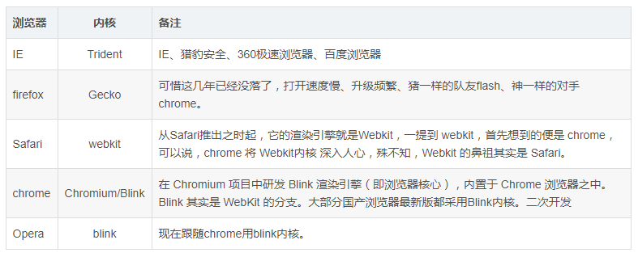
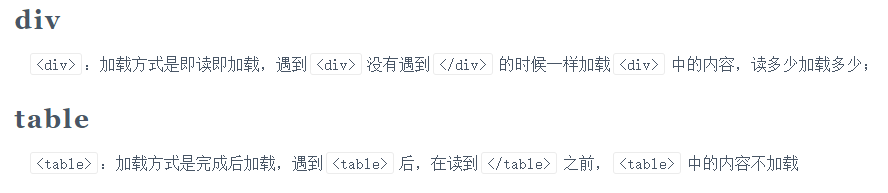
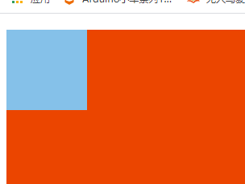

## 笔记

### 直接用id获取dom元素

只要标签有id这个属性，不使用getElementById方法，也可以直接用id获取dom元素。

**如果dom元素的id名称不和js内置属性或全局变量重名的话，该名称自动成为window对象的属性**，所以可以直接用来操作dom。

```html
    <input type="text" id="box">
    <button>dianji</button>
    <script>
        document.querySelector('button').addEventListener('click', function() {
            console.log(box);
            console.log(box.value);
        })
    </script>
```


## 面试

### 1、cookie、localStorage、sessionStorage的区别

#### cookie （不是html5）

cookie机制：如果不在浏览器中设置过期时间，cookie被保存在**内存**中，生命周期随浏览器的关闭而结束，这种cookie简称会话cookie。如果**在浏览器中设置了cookie的过期时间**，cookie被保存在**硬盘**中，关闭浏览器后，cookie数据仍然存在，直到过期时间结束才消失。  4k左右


#### sessionStorage

sessionStorage和localStorage是**window**的对象，容量大概是5mb，本质是存储在当前标签页面当中，页面关闭，数据销毁，不同标签页不能共享数据，更不用说不同浏览器

sessionStorage.setItem(key,value) 以键值对的方式存储

sessionStorage.getItem(key)  取值

sessionStorage.removeItem(key)  移除某个值  //删除的时候key名写错不会报错也不会删除

sessionStorage.clear() 粗暴方式移除所有数据

#### localStorage

存储的数据内容多，**不同浏览器不会共享数据，但是同一浏览器不同窗口可以共享数据，并且浏览器关闭后数据不会丢失（本地持久化）**除非主动删除数据；

localStorage.setItem(key,value)

localStorage.getItem(key)

localStorage.removeItem(key)

localStorage.clear() 

 

区别：

localStorage和sessionStorage是H5提供的，可以放便的在本地保存数据，有了本地存储，就可以``避免数据在浏览器和服务器之间不必要的来回传递，`


-   localStorage在**不同浏览器不会共享数据，但是同一浏览器不同窗口可以共享数据，并且浏览器关闭后数据不会丢失（本地持久化）**除非主动删除数据；sessionStorage本质是存储在**当前标签页面当中**，页面关闭，数据销毁，不同标签页不能共享数据，更不用说不同浏览器

-   cookie 在浏览器和服务器间来回传递；而 sessionStorage 和 localStorage 不会自动把数据发给服务器，仅在本地保存。

-   本地存储（localStorage和sessionStorage）**至少**可以存储5MB的数据，数量无限制；cookie只有4k左右，有个数限制。各浏览器不同

### 2、常见响应状态码

响应分为五类：信息响应(`100`–`199`)，成功响应(`200`–`299`)，重定向(`300`–`399`)，客户端错误(`400`–`499`)和服务器错误 (`500`–`599`)。

200：请求成功


400：bad request 请求参数错误

401：unauthorized 未授权

403：forbidden 客户端错误 ，表示服务端有能力处理请求但是拒绝授权访问

404：not found  请求失败，请求内容未在服务器上发现，没有信息能够告诉用户这个情况是暂时还是永久的，如果服务器知道，应当使用410。广泛用于服务器不想揭示请求到底为何被拒绝 或 没有合适响应可用的情况

405：method not allowed  请求方法不能用于相应资源的请求

408：request timeout  请求超时

409：conflict  被请求资源和当前状态存在冲突，无法完成请求

410：gone  被请求资源在服务器上不再可用，而且没有告知任何转发地址

411：length required 未定义请求Content-Length头，服务器拒绝请求


500：服务端遇到了不知道怎么处理的情况

501：请求方法不被服务器支持，并且无法被处理

502：服务器得到了一个错误的响应

503：服务器暂时无法处理请求，可能是过载和维护

505：服务器不支持请求中所使用的http协议版本

### 3、对浏览器内核的理解

主要分成两个部分：渲染引擎+js引擎

渲染引擎：负责获取网页的内容（html，img图像等），还有整理讯息（css）

js引擎：解析javascript来实现网页的动态效果

### 4、常见浏览器内核

 opera以前是presto内核

### 5、对 WEB 标准以及 W3C 的理解与认识

标签闭合、标签小写、不乱嵌套、使用外 链 css 和 js 脚本、

结构行为表现的分离、文件下载与页面速度更快、内容能被更多的用户所访问、内容能被更广泛的设备所访问、

更少的代码和组件，容易维 护、改版方便，不需要变动页面内容、提供打印版本而不需要复制内容、提高网站易用性；

### 6、table 和 div+css 的区别

 

### 7、iframe 的优缺点

- iframe 会`阻塞主页面的 Onload 事件`；
- 搜索引擎的检索程序无法解析这种页面，不利于seo
- iframe` 和主页面共享连接池`，而浏览器对相同域的连接有限制，所以会`影响页面的并行加载`。
- 使用 iframe 之前需要考虑这两个缺点。如果需要使用 iframe，最好是`通过 javascript 动态给 iframe 添加 src 属性值`，这样可以可以绕开以上两个问题。

### 8、label标签的作用

label 元素不会向用户呈现任何特殊效果。

如果您在 `label 元素内点击文本`，就会触发此控件。

就是说，当用户选择该标签时，浏览器就会`自动将焦点转到和标签相关的表单控件上`。


`<label> 标签的 for 属性应当与相关元素的 id 属性相同。`

```html
<form>
    <label for="male">男</label>
    <input type="radio" name="sex" id="male" />
    <br />
    <label for="female">女</label>
    <input type="radio" name="sex" id="female" />
</form>
```

### 9、title 与 h1 的区别、b 与 strong 的区别、i 与 em 的区别？

h1 标签写在网页的 body 中，控制文字大小

title 标签写在网页的 head 中，控制网页标题


b是为了加粗而加粗，strong是为了`标明重点`而加粗

同样，I 是 Italic（斜体），而 em 是 emphasize（`强调`）。后者更具有语义化

### 10、herf 和 src 的区别

- href 标识超文本引用，用在 link 和 a 等元素上，href 是引用和页面关联，用来建立`当前元素和文档之间的链接。`**会并行下载资源不会停止对当前文档的处理**
- src 表示`引用资源`，将使用src属性的标签替换成引入的资源，在请求 src 资源时会将其`指向的资源下载并应用到文档`中，用在 img，script，iframe 上，src 是页面内容不可缺少的一部分。**浏览器解析到该元素时，会停止其他资源的下载，直到将该资源加载、编译、执行完成**

### 11、怎样处理移动端1px被渲染成2px的问题

##### 局部处理

- mate 标签中的 viewport 属性 ， initial-scale 设置为 1
- rem 按照设计稿标准⾛，外加利⽤ transfrome 的 scale(0.5) 缩⼩⼀倍即可；

##### 全局处理

- mate 标签中的 viewport 属性 ， initial-scale 设置为 0.5
- rem 按照设计稿标准⾛即可

### 12、Doctype是什么东西？严格模式与混杂模式如何区分？

doctype声明于文档最前面，处于标签之间，此标签可以告诉浏览器解析器该文档使用哪种html规范或xhtml规范，进而解析页面

严格模式的排版与js运作模式是该`浏览器支持的最高标准`，

混杂模式`以宽松的、向后兼容的方式显示`，模拟老式浏览器的行为以防止站点无法工作。doctype不存在或者格式不正确都会导致文档以混杂模式呈现

### 13、超链接a的target属性

_blank：新窗口打开

_self：默认，在同一框架或窗口打开

_top：再用到多层框架的时候会在顶级框架窗口打开，用到多层框架的时候注意他两的使用

_parent：在嵌有该链接框架的父页面打开，如果不是嵌套的，作用就和-self一样

### 14、什么是window对象什么是document对象

window对象是浏览器窗口对象，封装了窗口标题，地址栏，状态栏等，

document：每个载入浏览器的html文档都会成为document对象，document是window对象的一部分，可以使我们从脚本中对页面中的元素进行访问

### 15、html是怎么渲染的

渲染模块包括`html解析器`解析html文件，创建dom树

`css解析器`解析样式表文件为dom中的各个元素加上样式信息

`layout布局`将htmlDOM元素和css样式信息结合起来渲染树

`javascript引擎`用于解析js代码并且把代码逻辑和对dom元素和css样式的改动应用到布局中去，进行页面的渲染


这些模块依赖很多其他的基础模块，这其中包括网络，存储，2D/3D图形，音频视频和图片解码器等

### 16、重绘和回流

回流：元素大小或位置发生改变（`页面布局发生改变`的时候）触发了重新布局而导致渲染树重新计算布局和渲染，比如添加删除dom元素、位置尺寸发生变化、页面开始渲染的时候会发生回流（不可避免）

重绘：元素的样式改变，visibility、color、background-color等

**回流一定会导致重绘，但是重绘不一定导致回流**

### 17、获取页面所有的html tagname并去重

window.document.querySelectorAll("*")获取所有元素节点，tagname在每个节点的tagName属性里面

```js
function getAllHTMLTags() {
  const tags = [...window.document.querySelectorAll("*")].map(
    dom => dom.tagName
  );
  return [...new Set(tags)];
}
```

### 18、BFC

常见定位方案：普通流、浮动、绝对定位

`BFC`block formatting context 块级格式上下文，属于普通流定位方案。**具有BFC定位方案的元素可以看作是被隔离了的独立容器，容器里面的元素不会在布局上影响外面的元素**，并且还有者普通容器所没有的特性

满足以下特性即可触发BFC特性：

- 浮动元素：float 除 none 以外的值
- 绝对定位元素：position (absolute、fixed)
- display 为 inline-block、table-cell、flex、inline-flex
- overflow 除了 visible 以外的值 (hidden、auto、scroll)        **overflow:hidden;是形成BFC比较好的方式**

BFC其他作用：

1、可以解决margin的塌陷

 margin塌陷：给子元素绑定margin-top：30px；但是父元素向下移动了30px

```html
<head>   
	<style>
        .wrap {
            width: 300px;
            height: 500px;
            background-color: #eb4500;
            overflow: hidden;//给父元素设置让他形成BFC，不在布局上影响外部布局
        }
        
        .inner {
            width: 100px;
            height: 100px;
            background-color: rgb(133, 193, 233);
            margin-top: 20px;
        }
    </style>


<body>
    <div class="wrap">
        <div class="inner"></div>
    </div>
</body>
```

2、可以解决元素被浮动元素覆盖

 绿色的box3被浮动的box1和box2覆盖了，


```html
    .box1,
    .box2 {
    	width: 100px;	
        height: 100px;
        background-color: rgba(230, 184, 184, 0.596);
        float: left;
    }

    .box3 {
        width: 100px;
        height: 200px;
        background-color: rgb(20, 238, 209);

	    overflow: hidden; //box3成为BFC，让他不在布局上影响外部
    }

    <div class="box1"></div>
    <div class="box2"></div>
    <div class="box3"></div>
```

### 19、解决chrome12px以下字体无效的方法

在中文版谷歌浏览器中使用了12px以下的字体都会被渲染成12px，如果想实现10px，可以设置字体为20px，在使用`transform:scale(0.5)`来完成

### 20、常见布局方式

- 静态布局：元素尺寸使用传统的px作为单位
- 流式布局：元素宽度按照屏幕分辨率进行适配，使用百分比搭配min-和max-使用，整体布局不变
- 自适应布局：在不同屏幕分辨率下使用静态布局，每个静态布局对应一个屏幕分辨率，使用@media媒体查询技术
- 响应式布局：使用的是@media媒体查询和流式布局百分比，在不同屏幕分辨率下创建多个流式布局，每个分辨率下元素位置大小都会改变
- 弹性盒子布局：flex+rem单位布局，做移动端，那么弹性布局（rem+js）是最好的选择，一份css+一份js调节font-size搞定；
