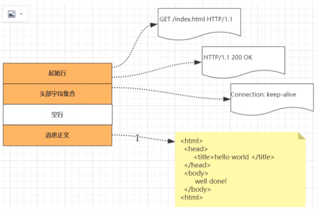
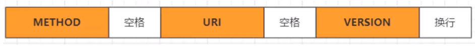
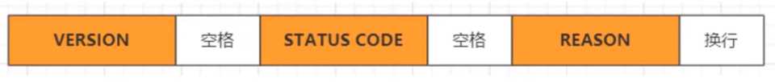
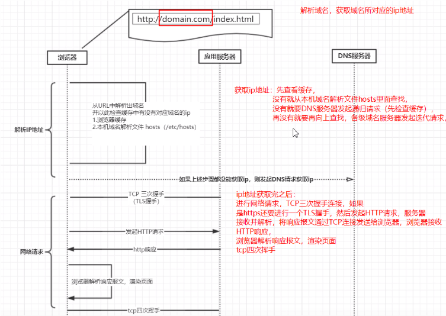
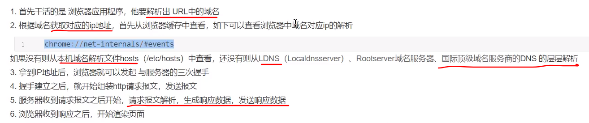

### 什么是http

超文本传输协议，以请求/应答的方式运行的协议

### http报文格式

请求报文和响应报文的结构基本相同，由三大部分组成

- 起始行（start line）：描述请求或响应的基本信息
- 头部字段集合（header）：使用key：value的形式更详细的说明报文
- 消息正文（entity）：实际传输的数据，它不一定是纯文本，可以是图片、视频等二进制数据

 

### 行

#### 请求行报文

- 请求方法method：如GET/POST/PUT/HEAD,表示对资源的操作
- 请求目标：通常是一个uri，标记请求方法要操作的资源
- 版本号：请求报文使用的HTTP协议版本

#### 响应行报文

版本号：响应报文使用的HTTP协议版本

状态码：一个三位数，用代码的形式表示处理的结果，200成功

原因：作为数字状态码补充，是更详细的解释文字，帮助人理解原因

### http头字段

头部字段是由key-value组成，中间用“：”分隔，最后用CRLF换行表示字段结束，

比如前后端分离时经常遇到的要与后端协商传输数据的类型“content-type”:"application/json"，（这样设置了，前端使用json格式的数据传输给后端，后端就知道怎样去解析数据）

http头字段非常灵活，不仅可以使用标准里的Host、Connection等已有头，也可以任意添加自定义头，这就给http协议带来了无限可能。

头字段注意事项：

- 字段名**不区分大小写**，**名里不允许有空格**，**可以使用“-”**，但是不能使用“_”（不得服务器不会解析带有“ _ ”的头字段），**字段名后面必须紧接着”：“，不能含有空格**，而**”：“后面的可以有多个空格**，
- 字段**顺序是没有意义**的，可以任意排序
- 字段**原则上不能重复**，除非这个字段的本身语义允许，例如Set-cookie

常用头字段：

- 请求字段：请求头中的头字段，如Host、Referer
- 响应字段：响应头中的头字段，如Server
- 通用字段：请求头和响应头里面都可以出现，如Content-type，Connection

### http请求的完整过程

 

**获取ip地址后，找到对应的服务器，再进行网络请求，发起TCP连接**

### http和https区别

http：是明文传输，数据是未加密的，安全性较差

https：ssl+http，数据传输过程是加密的，安全性较好；使用https协议需要到CA申请证书；https其实就是建构在SSL/TLS之上的http协议，https要比http跟耗费服务器资源

