# vue面试题汇总

###   1、从url到页面展现中间发生了什么

1、浏览器接收url并开启一个新的网络请求线程，对url进行解析，分析所需要使用的传输协议和请求的资源路径，

2、浏览器判断所请求的资源是否在缓存里面，如果在且没有失效就直接使用，否则向服务器发送新的请求，

3、判断本地是否有该域名和ip地址的缓存，如果有则直接获取，没有则向`本地dns服务器`发起`递归请求`，本地dns服务器也会先检测是否存在缓存，没有则由本地dns服务器向`各级域名服务器`发起`迭代请求`，最终浏览器获取`ip`地址。

5、TCP建立连接三次握手（客户端、服务端、客户端），（如果是https协议，在通信前还存在TLS的一个四次握手的过程）

6、建立连接后发送http请求，服务器接收并解析，将响应报文通过tcp连接发送给浏览器，浏览器接受http响应，浏览器检查响应状态码处理不同的情况，

7、假如资源是html文档，浏览器根据html文件`构建dom树`，遇到css文件构建cssom树，然后会`渲染`树，渲染树构建好后会进行`布局layout和paint绘制`，js引擎解析js文件，html解析过程中逐步显示页面

8、关闭四次握手连接

### 2、vue双向绑定（响应式数据 的理解）

答：`数组和对象类型当值变化时如何劫持到：对象内部通过defineReactive方法，使用Object.defineProperty将数据进行劫持（只会劫持已存在的单层数据），多层对象以及新添加的对象通过递归调用实现劫持，数组则是通过重写数组方法来实现。内部依赖收集：每个属性都有自己的dep类，存放他所依赖的watcher，当属性发生变化时，会通知watcher执行更新（update方法），`

vue2中使用Object.defineProperty实现响应式数据，vue3中使用proxy实现响应式数据

`对象层级过深，性能就会差，使用proxy可以提高性能，但是兼容性不好`

##### 数组的reduce方法

使用reduce函数实现数组的累加操作

```js
const arr=[12,2,5,65,32,45]
arr.reduce((val,item)=>val+item,0) //val:上次操作的返回值
```

使用reduce实现链式获取对象属性的值

```js
const obj={
    man:{
        cons:{
        	age:15
        }
    }
}
const str='man.cons.age'
const value= str.split('.').reduce((newKey,key)=>newKey[key],obj)
console.log(value)//obj.man.cons.age=15
```

##### 发布订阅者模式

1. Dep 类
   - 负责进行**依赖收集**
   - 首先，有个数组，专门来存放所有的订阅信息
   - 其次，还要提供一个向数组中追加订阅信息的方法
   - 然后，还要提供一个循环，循环触发数组中的每个订阅信息
2. Watcher 类
   - 负责**订阅一些事件**

```js
//收集订阅者
class Dep{
    cnstructor(){
        //subs数组用于存放所有订阅者信息
        this.subs=[]
    }
    //添加订阅者示例
    addSub(watcher){
        this.subs.push(watcher)
    }
    //发布通知每个订阅者的方法
    notify(){
        this.subs.forEach(item=>item.update())
    }
}

//订阅者的类
class Watcher{
    constructor(cb){
        this.cb=cb//将回调函数挂载到自己身上
    }
    //触发回调的方法
    update(){
        this.cb()
    }
}

const w1=new Watcher(()=>{
    console.log('我是第一个订阅者')
})
w1.update()//调用才会触发传进去的回调函数

const w2=new Watcher(()=>{
    console.log('我是第二个订阅者')
})
w2.update()
//const w3 ...

const dep=new Dep()
dep.addSub(w1)
dep.addSub(w2)

dep.notify()//只要你重新赋值data数据，就会被vue监听到，vue会把数据的变化，通知到每个订阅者，接下来订阅者（DOM）就要根据最新的数据更新自己的内容

```

面试的时候搞清楚：

`每个dom元素都是一个订阅者，数据在vue那里，当数据发生变化时，会通知每一个订阅者，最后每一个订阅者根据最新的数据渲染dom结构，`

`代码实现：当数据变化，调用dep.notify()通知订阅者，怎么通知？：notify内部循环每一个订阅者，调用每个订阅者的update（）函数进行通知，通知过后订阅者拿到最新的数据渲染dom结构`

##### 使用Object.defineProperty()进行数据劫持

1、通过`get()`劫持取值操作

2、通过`set()`劫持赋值操作

```js
const obj = {
        name: 'haha',
        age: 12
    }
    //取值
    // console.log(obj.name)

//赋值
// obj.name='wangyang'

//劫持
Object.defineProperty(obj, 'name', {
    enumerable: true, //当前属性允许被循环
    configurable: true, //当前属性允许被赋值
    get() {
        console.log('正在获取name属性');
        return 'name属性被劫持了，你获取的是这return 的数据'
    },
    set(newVal) {
        console.log('我不需要你的赋值：' + newVal);
    }
})

// console.log(obj.name);
// obj.name = 'heihei'
```


将一个伪数组转换成真正的数组

```js
Array.from(伪数组)//返回一个数组
```

控制台显示一个对象的所有属性和方法

```js
console.dir()
```

##### 实现双向绑定

```html
<body>
    <div id="app">
        <h1>名字是：{{name}}</h1>
        <h2>年纪是：<span>{{ age }}</span></h2>
        <h2>info.a的值是:{{info.a}}</h2>
        <h2>info.a<input type="text" v-model='info.a' /></h2>
        <h2>info.b<input type="text" v-model='info.b' /></h2>
    </div>
    <script src="./myVue.js"></script>
    <script>
        const vm = new Vue({
            el: '#app',
            data: {
                name: 'wangyang',
                age: 20,
                info: {
                    a: 'aa',
                    b: 'bb'
                }
            }
        })
        console.log(vm.$data);
    </script>
</body>
```

myVue.js

```js
class Vue {
    constructor(options) {
        this.$data = options.data

        //调用数据劫持的方法
        Observe(this.$data)

        //属性代理
        Object.keys(this.$data).forEach(key => {
            //把data里的属性直接加到vm示例上面
            Object.defineProperty(this, key, {
                enumerable: true,
                configurable: true,
                get() {
                    return this.$data[key]
                },
                set(newVal) {
                    this.$data[key] = newVal
                }
            })
        })

        //执行模板编译的方法
        Compile(options.el, this)
    }
}

function Observe(obj) {
    //递归的终止条件
    if (!obj || typeof obj !== 'object') return
    const dep = new Dep()

    Object.keys(obj).forEach(key => { //obj对象的属性

        let value = obj[key]
        Observe(value) //value是子节点，进行递归，目的将内部属性的属性设置getter和setter

        Object.defineProperty(obj, key, {
            enumerable: true,
            configurable: true,
            get() {
                // console.log(`获取到了${key}属性`)
                Dep.target && dep.addSubs(Dep.target) //将订阅者添加到数组中
                return value
            },
            set(newVal) {
                // console.log(`${key}被重新定义`);
                value = newVal

                //新赋值的对象进行递归
                Observe(value)

                //调用notify通知订阅者进行更新
                dep.notify()
            }
        })
    })
}

function Compile(el, vm) {
    //保存要操作的dom节点
    vm.$el = document.querySelector(el)

    //创建文档碎片，提高DOM的操作性能
    //1、将节点中的dom元素全部加到文档碎片中去
    const fragment = document.createDocumentFragment()
    while (childNode = vm.$el.firstChild) { //while循环
        fragment.appendChild(childNode)
    }

    //2、在这里进行模板编译
    replace(fragment)

    //3、将文档碎片再次渲染到页面上
    vm.$el.appendChild(fragment)


    //定义模板编译的方法
    function replace(node) {
        //定义匹配插值表达式的正则
        const reg = /\{\{\s*(\S+)\s*\}\}/ //(\S+)加上括号是提取内容

        //当前节点是一个文本节点时，进行正则替换
        if (node.nodeType === 3) {
            //注意：文本节点也是一个对象，需要通过textContent属性拿到文本内容
            const text = node.textContent
            console.log(text);
            const execResult = reg.exec(text)
            if (execResult) { //空白文本就不存在这个数组
                console.log(execResult); //["{{info.a}}", "info.a", index: 9, input: "info.a的值是{{info.a}}", groups: undefined]
                const value = execResult[1].split('.').reduce((newVal, key) => newVal[key], vm)
                node.textContent = text.replace(reg, value)

                //在这里创建watcher订阅者实例
                new Watcher(vm, execResult[1], (newVal) => {
                    node.textContent = text.replace(reg, newVal)
                })
            }

            //递归终止
            return
        }


        //判断是不是input输入框
        if (node.nodeType === 1 && node.tagName.toUpperCase() === 'INPUT') {
            // console.dir(node);
            //获取input元素的所有属性节点数组
            // console.log(node.attributes);
            const attrs = Array.from(node.attributes)

            // console.dir(attrs)
            const findResult = attrs.find(x => x.name === 'v-model')
            if (findResult) {
                //获取值  v-model="info.a"
                const attrVal = findResult.value
                const value = attrVal.split('.').reduce((newVal, k) => newVal[k], vm)

                //给input输入框赋值
                node.value = value

                //创建watcher实例
                new Watcher(vm, attrVal, (newVal) => {
                    node.value = newVal
                })


                //实现文本框输入事件
                node.oninput = function(e) {
                    const keyArr = attrVal.split('.')
                    const val = keyArr.slice(0, keyArr.length - 1).reduce((newVal, k) => newVal[k], vm)
                    val[keyArr[keyArr.length - 1]] = e.target.value
                }
            }

        }


        //如果该节点下还有dom节点，就往子节点进行递归
        node.childNodes.forEach(item => {
            replace(item)
        })
    }
}

//发布者的类（定义依赖收集/收集订阅者的类）
class Dep {
    constructor() {
        //watcher保存到数组中
        this.subs = []
    }

    //添加到数组中的方法
    addSubs(watcher) {
        this.subs.push(watcher)
    }

    //负责通知watcher的方法
    notify() {
        this.subs.forEach(item => { item.update() })
    }
}

//订阅者的类
class Watcher {
    /**
     * 
     * @param {*} vm 拿到最新的数据（数据都在vm中）
     * @param {*} key 在vm众多的数据中，要知道哪一个数据是当前需要的数据
     * @param {*} cb 回调函数记录着watcher如何更新自己的文本内容
     */
    constructor(vm, key, cb) {
        this.vm = vm
        this.key = key
        this.cb = cb


        //*****关键：下面三行负责把watcher订阅者实例保存到subs数组中****
        Dep.target = this //this就是watcher订阅者实例,保存在自定义属性target中
        key.split('.').reduce((newVal, k) => newVal[k], vm) //表面是在获取key属性，获取的同时实则调用getter，见上
        Dep.target = null //取消指向

    }

    //watcher的实例，需要有update方法，让发布者知道我们再更新内容
    update() {
        const value = this.key.split('.').reduce((newVal, k) => newVal[k], vm)
        this.cb(value)
    }
}
```

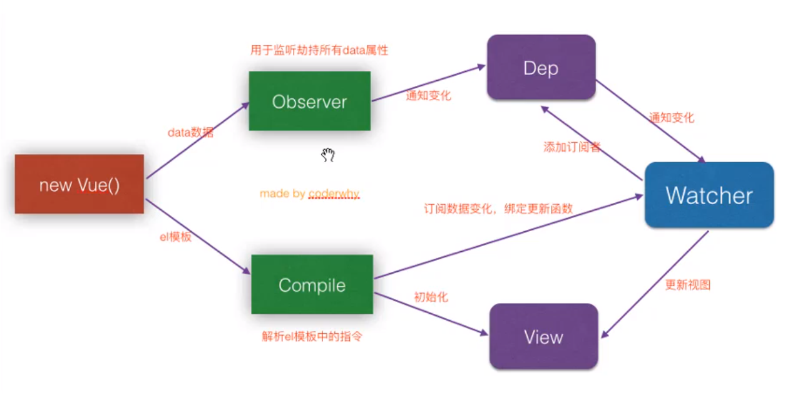

##### 源码

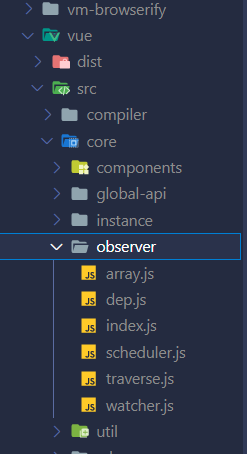


响应式源码在core文件夹/observer文件夹下的index.js里面

```js
export function defineReactive(
    obj: Object,
    key: string,
    val: any,
    customSetter ? : ? Function,
    shallow ? : boolean
) {
    const dep = new Dep()

    const property = Object.getOwnPropertyDescriptor(obj, key)
    if (property && property.configurable === false) {
        return
    }

    // cater for pre-defined getter/setters
    const getter = property && property.get
    const setter = property && property.set
    if ((!getter || setter) && arguments.length === 2) {
        val = obj[key]
    }

    let childOb = !shallow && observe(val)
    Object.defineProperty(obj, key, {
        enumerable: true,
        configurable: true,
        get: function reactiveGetter() {
            const value = getter ? getter.call(obj) : val
            if (Dep.target) {
                dep.depend() //取值时，进行依赖收集
                if (childOb) {
                    childOb.dep.depend()
                    if (Array.isArray(value)) {
                        dependArray(value)
                    }
                }
            }
            return value
        },
        set: function reactiveSetter(newVal) {
            const value = getter ? getter.call(obj) : val
                /* eslint-disable no-self-compare */
            if (newVal === value || (newVal !== newVal && value !== value)) {
                return
            }
            /* eslint-enable no-self-compare */
            if (process.env.NODE_ENV !== 'production' && customSetter) {
                customSetter()
            }
            // #7981: for accessor properties without setter
            if (getter && !setter) return
            if (setter) {
                setter.call(obj, newVal)
            } else {
                val = newVal
            }
            childOb = !shallow && observe(newVal)
            dep.notify()//设置时，进行视图更新
        }
    })
}
```

`defineReactive方法中进行数据劫持，取值时，调用dep.depend()进行依赖收集，设置时，调用dep.notify()通知视图更新`

##### object.defineProperty有什么缺陷，为什么3.0中使用了proxy

object.defineProperty只能劫持`对象属性`的变化，因此需要遍历对象的每个属性，如果属性还是对象，就需要深度遍历，但是proxy可以劫持整个对象并且返回一个新的对象

object.defineProperty本身是可以监控到数组下标的变化的，但是在 Vue 中，从性能/体验的性价比考虑，没有使用该方法，proxy不仅可以代理对象还可以代理数组


### 3、vue怎样监听数组变化

对象改变是使用Object.defineProperty，数组`考虑性能原因`没有使用该方法对数组的每一项进行拦截，而是对数组的( push,shift,pop,splice,unshift,sort,

reverse )方法进行`重写`,重写之后数组发生变化就会监听到变化，`修改数组索引和数组长度是无法监听到变化`的，数组中的值如果是对象数据类型也会进行递归劫持

如果想通过索引修改的话可以使用$set方法（核心内部使用的还是splice方法）

源码在array.js里面

```js
/*
 * not type checking this file because flow doesn't play well with
 * dynamically accessing methods on Array prototype
 */

import { def } from '../util/index'

const arrayProto = Array.prototype//取出原型方法
export const arrayMethods = Object.create(arrayProto)

const methodsToPatch = [
  'push',
  'pop',
  'shift',
  'unshift',
  'splice',
  'sort',
  'reverse'
]

/**
 * Intercept mutating methods and emit events
 */
methodsToPatch.forEach(function (method) {
  // cache original method
  const original = arrayProto[method]
  def(arrayMethods, method, function mutator (...args) {//重写数组方法
    const result = original.apply(this, args)
    const ob = this.__ob__
    let inserted
    switch (method) {
      case 'push':
      case 'unshift':
        inserted = args
        break
      case 'splice':
        inserted = args.slice(2)
        break
    }
    if (inserted) ob.observeArray(inserted)
    // notify change
    ob.dep.notify()
    return result
  })
})

```

依次遍历methodsToPatch中的方法字符串，将七个数组方法加入到arrayMethods对象上，调用数组的这几个方法就会通知其他订阅者（dep.notify）

### 4、谈一谈对MVVM的理解

传统的前端是将数据手动渲染到页面上，MVVM则不需要用户手动操作dom元素，则是将数据绑定到viewmodel层上，会自动将数据渲染到页面，视图变化也会通知viewmodel层更新数据，`viewmodel就是我们MVVM中的桥梁`

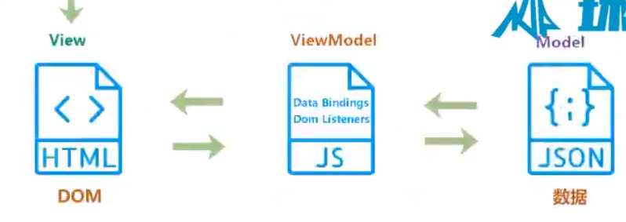

### 5、为何vue采用异步渲染

vue是组件级更新，如果不采用异步渲染，那么`每次更新数据都会对当前组件进行重新渲染`，所以为了`性能`考虑，vue会在本轮视图更新后，再去异步更新视图

原理：

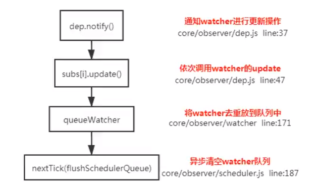

### 6、computed watch methods

##### computed 计算属性和 methods方法的区别

1. computed是**属性访问**，而methods是**函数调用**
2. computed带有**缓存功能**，而methods不是

methods每次调用时会重新执行函数，而computed在依赖的数据没有发生变化，就不会重新求值，后续执行时直接从缓存中获取该computed的结果。

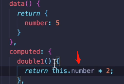 计算属性double1依赖的数据就是number，如果number没有发生变化，double1就不会重新计算


#####computed 计算属性和 watch 侦听器的区别

他俩的原理是相同的new Watcher()

watch 监听到值的变化就会执⾏回调，在回调中可以进⾏⼀些逻辑操作。没有缓存性，就算`页面渲染时值没有变化也会执行`，

所以⼀般来说需要依赖别的属性来动态获得值的时候可以使⽤ computed ，对于监听到值 的变化需要做⼀些复杂业务逻辑的情况可以使⽤ watch 。

侦听器watch使用在代码逻辑中，计算属性computed使用在模板中


computed中的get和set，如果只是获取的话只需要使用get，但是如果计算属性和v-model结合使用，那么就需要写出set函数，手动定义依赖的数据

### 7、watch中的deep：true是如何实现的

```js
 watch: {
    newBean2: {
      handler (newVal, oldVal) {
        console.info('value changed ', newVal)
      },
      deep: true，
      immediate: true
    }
  }
```

答：当用户指定了 watch 中的deep属性为 true 时，如果当前监控的值是数组类型。会对`对象中的每一项进行求值`，此时会将当前 watcher 存入到对应属性的依赖中，这样数组中对象发生变化时也 会通知数据更新。


computed为什么没有deep:true？因为computed是用在`模板`里的，在模板中的数据会调一个方法`JSON.strginify()`，放一个对象，默认会对这个对象里的所有属性求值。

deep设置成true，这时候就会执行**traverse**这个方法,将对象中内层的对象也进行依赖收集，依赖发生变化就会通知视图更新，**traverse就是deep：true实现的核心**，这种对每个属性都进行监听，消耗性能，也可以单独指定监听某一个属性（写成字符串的形式）

immdeicate：true 表示在 watch 里声明了之后，就会立即先去执行里面的 handler 方法，就是说在页面初始化后会立即执行

### 8、vue组件的生命周期

**创建实例：**

beforeCreate : 实例创建前：这个阶段实例的`data、methods是读不到的`
created ：`可以拿到数据，但是拿不到$el`实例创建后：这个阶段已经完成了数据观测(data observer)，属性和方法的运算， watch/event 事件回调。$el 属性目前不可见，`数据并没有在DOM元素上进行渲染`


**DOM挂载：**

beforeMount：在`挂载开始`之前被调用：相关的` render 函数首次被调用`。//用得极少
mounted：el选项的`DOM节点 被新创建的 vm.$el 替换`，并`挂载到实例`上去之后调用此生命周期函数。此时`实例的数据在DOM节点上进行渲染`


**数据更新：**

beforeUpdate：`数据更新时调用，但不进行DOM重新渲染`，在数据更新时DOM没渲染前可以在这个生命函数里进行状态处理
updated：这个状态下`数据更新并且DOM重新渲染`，所以你现在可以执行依赖于 DOM 的操作。`当实例每次进行数据更新时updated都会执行`


**实例销毁：**

beforeDestory：实例销毁之前调用。`这里实例还是可以使用的`
destroyed：Vue 实例销毁后调用。调用后，`Vue 实例指示的所有东西都会解绑定`，所有的事件监听器会被移除，所有的子实例也会被销毁。

##### 掌握各周期可以进行什么业务

created：  实例已经创建完成,因为它是最早触发的原因可以进行一些数据 ,资源的请求。//`ajax请求`

mounted：  实例已经挂载完成,可以进行一些`DOM操作`

beforeUpdate：  可以在这个钩子中进一步地`更改状态,页面不会重新渲染`。

updated：  可以执行依赖于DOM的操作。然而在大多数情况下,你应该`避免在此期间更改状态,因为这可能会导致更新无限循环`。该钩子在服务器端渲染期间不被调用。

**beforeDestroy**：  可以执行一些优化操作,`1、清空定时器 ,2、解除绑定事件，3、如果当前页面使用了事件总线$on事件，就需要在这里解绑，不然会多次触发`

##### vue3.0中的生命周期钩子

3.0中使用beforeUnmount（）和unmouned代替了vue2.x中的beforeDestroy和destroyed
vue3.0中新增了composition API形式的钩子写法（vue2.x的写法叫做optionsAPI），这种写法将钩子全部定义到setup（）方法里面，在这之前必须先引入这些钩子函数

**setup就相当于beforeCreate和created两个钩子**

composition API形式的钩子函数前面需要加上on来访问，composition API形式可以优化代码组织

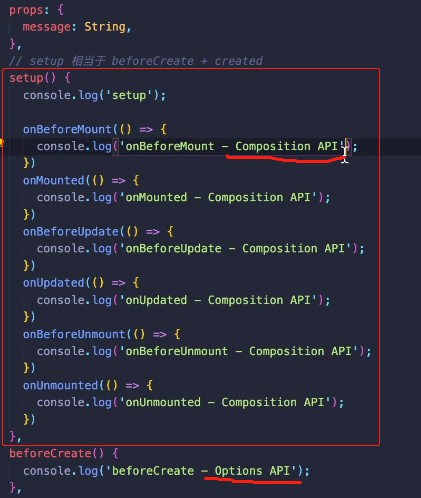 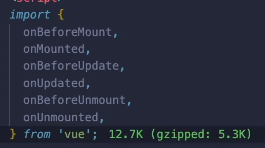


### 9、ajax请求放到哪个生命周期里面

created及之后，都可以进行ajax请求，放在created（DOM没有渲染出来，无法找到相关元素）或mounted（DOM已经渲染，可以直接操作DOM）里面都是可以的，

一般都是放在mounted里面，保证逻辑统一性，`生命周期是同步执行的，ajax请求是异步执行的`（把ajax放在created中不会说等请求完之后再去执行mounted，会同步执行），但是如果是`服务端渲染就不能mounted里面`，（服务端渲染不支持mounted方法，只能放在created里面）

服务端渲染：将组件或页面通过服务器生成html字符串，再发送到浏览器，没有dom挂载

### 10、runtime-compiler和runtime-only版本的区别


runtime-compiler程序运行步骤：`template->ast->render->vdom->ui `
`模板template先解析为抽象语法树ast，在编译成render函数，render函数会把模板翻译成vdom虚拟dom成为虚拟dom树，最后渲染成真实dom，显示在ui界面 `
runtime-only程序运行步骤：`render->vdom->ui `

之前编译vue文件的时候，安装了vue loader和一个vue-template loader，runtime-only中直接从render函数开始就是因为vue-template loader会帮你运行template到render函数的这一步骤 
结论：1、runtime-only性能更高 
		  2、runtime-only编译出的代码量更少（大约轻6kb的compiler代码）

### 11、v-for和v-if为什么不能连用

v-for的优先级比v-if高一点，如果连用的话，会先执行循环，`会把v-if添加给每一个元素`，造成性能问题（v-if放在外面即可）

**vue3.0中v-if的优先级高于v-for**，不要在同一个元素上使用他们，把v-for移到外面


v-for遍历对象： 多拿到一个属性key值

```js
v-for="(value,key,index) in obj" :key="key"
```

v-for还可以遍历数字

```js
v-for="item in 10"  //会渲染10次，item就是1-10 
```

template占位符：功能和小程序中block一样

v-for里面也可以使用of

  


### 12、v-for中为什么要有key

vue组件`高度复用`增加Key可以标识组件的唯一性(`key是唯一标识`)，为了更好地区别各个组件, key的作用主要是为了`高效的更新虚拟DOM`

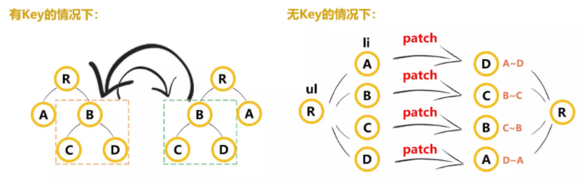  

### 12plus、vue diff算法

#### 虚拟DOM

虚拟DOM就是把真实DOM树的结构和信息抽象出来，以对象的形式模拟树形结构，如下：

真实DOM:

```html
<div>
    <p>Hello World</p>
</div>
```

对应的虚拟DOM就是：

```js
let vnode = {
    tag: 'div',
    children:[ {tag:'p', text:'Hello World'}]
}
```

* 为什么需要虚拟DOM？

渲染真实DOM会有一定的开销，如果每次修改数据都进行真实DOM渲染，都会引起DOM树的`重绘和重排`，性能开销很大。那么有没有可能只修改一小部分数据而不渲染整个DOM呢？虚拟DOM和Diff算法可以实现。

* 怎么实现？

1. 先根据真实DOM生成一颗虚拟DOM树
2. 当某个DOM节点数据发生改变时，生成一个新的Vnode
3. 新的Vnode和旧的oldVnode进行对比
4. `通过patch函数一边比对一边给真实DOM打补丁或者创建Vnode、移除oldVnode等`

* 有什么不一样？

1. 真实DOM操作为一个属性一个属性去修改，开销较大。
2. 虚拟DOM直接修改整个DOM节点再替换真实DOM

* 还有什么好处？

Vue的虚拟DOM数据更新机制是[异步更新队列](https://link.zhihu.com/?target=https%3A//cn.vuejs.org/v2/guide/reactivity.html%23%E5%BC%82%E6%AD%A5%E6%9B%B4%E6%96%B0%E9%98%9F%E5%88%97)，`并不是数据变更马上更新DOM`，而是被推进一个`数据更新异步队列统一更新`。想要马上拿到DOM更新后DOM信息？有个API叫 [Vue.nextTick](https://link.zhihu.com/?target=https%3A//cn.vuejs.org/v2/api/)

#### diff算法

> 遍历两棵树中的每一个节点，每两个节点之间都要做一次比较。
> 比如 a->e 、a->d 、a->b、a->c、a->a

- 遍历完成的时间复杂度达到了O(n^2)
- 对比完差异后还要计算最小转换方式，实现后复杂度来到了O(n^3)

 

Vue优化的Diff算法

> Vue的diff算法只会比较同层级的元素，不进行跨层级比较

 

**diff核心算法updateChildren**

### 13、组件中的data为什么是一个函数

同一个组件多次复用，会创建多个实例，这些实例用的是同一个构造函数，如果data是一个对象的话，那么这些实例都共用同一个对象，

为了`保证组件数据的独立性`，要求每个组件必须`通过data函数返回一个对象`作为组件的状态，这样就不会相互影响

### 14、使用v-html会导致哪些问题

1、可能会导致xss攻击

2、会替换掉标签内部所有的子元素

### 15、vue父子组件的调用顺序

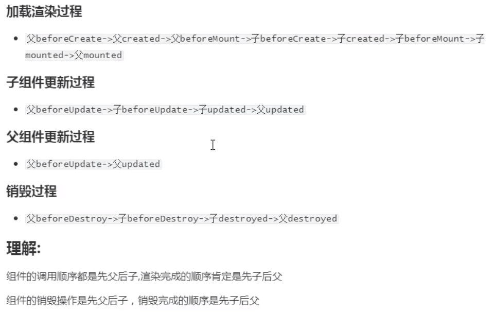 

### 16、组件之间的通信

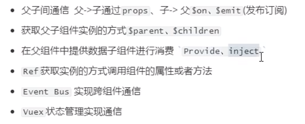 

slot实现`内容分发`：父组件中使用子组件数据

pubsub-js：可以实现任意组件间的通信

 

### 17、vue中相同逻辑如何抽离——mixin

### 18、为什么要使用异步组件

异步组件可以减少打包的结果，会将组件分开打包，可以采用异步的方式来加载组件，主要依赖`import()`这个语法，可以实现`组件的分割加载 `    

核心是把组件定义变成一个函数，import语法是webpack提供的，采用的原理是`jsonp`。

```js
components:{
    Home:()=>import ('../views/home/Home.vue')
}
```

路由懒加载解决的也是打包过后文件过大的问题，事件触发之后才加载对应路由组件中的js，

简单来说，就是启动项目之后下载的index.js中，不包含没有用到的组件的相关js文件，当组件使用之后，就会下载相关的js文件，是分开打包的而不是都放在index.js中，`可以加载优化首屏渲染的时间`，这就是异步组件

### 19、什么是作用域插槽

##### 编译作用域  （题外知识）

当你想在一个插槽中使用数据时，`只可以使用该父组件的数据`，例如：

父组件中：

```html
<navigation-link url="/profile">
  Logged in as {{ user.name }}
</navigation-link>
```

**不能**访问 `<navigation-link>` 的作用域。例如 `url` 是访问不到的：

```html
<navigation-link url="/profile">
  Clicking here will send you to: {{ url }}
  <!--
  这里的 `url` 会是 undefined，因为其 (指该插槽的) 内容是
  _传递给_ <navigation-link> 的而不是
  在 <navigation-link> 组件*内部*定义的。
  -->
</navigation-link>
```

>插槽的作用域是在父组件

作为一条规则，请记住：

> 父级模板里的所有内容都是在父级作用域中编译的；子模板里的所有内容都是在子作用域中编译的。

##### 后备内容（题外知识）

后背内容就是 默认内容，如果父组件使用子组件但是没有指定插槽内容的时候派上用场

```html
<button type="submit">
  <slot>Submit</slot>
</button>
```

父组件：可以不写插槽内容

```html
<submit-button></submit-button>
```

##### 具名插槽 （题外知识）

需要用到多个插槽时

一个不带 `name` 的 `<slot>` 出口会带有隐含的名字“default”。

```html
<div class="container">
  <header>
    <slot name="header"></slot>
  </header>
  <main>
    <slot></slot>
  </main>
  <footer>
    <slot name="footer"></slot>
  </footer>
</div>
```

default插槽内容不用template标签

```html
<base-layout>
  <template v-slot:header>
    <h1>Here might be a page title</h1>
  </template>

  <p>A paragraph for the main content.</p>
  <p>And another one.</p>

  <template v-slot:footer>
    <p>Here's some contact info</p>
  </template>
</base-layout>
```

具名插槽缩写

```html
  <template #footer>
    <p>Here's some contact info</p>
  </template>
```


##### 作用域插槽

目的是为了让`父组件中插槽把内容可以访问到子组件中的数据`，

答：插槽： 创建组件虚拟节点时，会将组件的儿子的虚拟节点保存起来。当初始化组件时,通过插槽属性将儿子进行分类 ， 渲染组件时会拿对应的slot属性的节点进行替换操作。（插槽的作用域为父组件） 

作用域插槽：作用域插槽在解析的时候，`不会作为组件的孩子节点。会解析成函数`，当子组件渲染时，会`调用此函数进行渲染`。（插槽的作用域为子组件）


CurrentUser组件：绑定在 `<slot>` 元素上的 attribute 被称为**插槽 prop**

```vue
<span>
  <slot :user="user" :data="data"></slot>
</span>

<script>
export default ({
    data(){
        return {
            user:{
                name:'dd',
            },
            data:{
                age:12
            }
        }
    }
})
</script>
```

在父级作用域中，使用带值的 `v-slot` 来定义我们提供的插槽 prop 的名字,然后就可以访问到子组件数据

```html
<current-user>
  <template v-slot:default="slotProp">
    {{ slotProp.user.name }}
    {{ slotProp.data.age }}
  </template>
</current-user>
```

默认独占插槽缩写语法

当被提供的内容*只有*默认插槽时，组件的标签才可以被当作插槽的模板来使用,并且可以省略default

```html
<current-user v-slot="slotProp">
    {{ slotProp.user.name }}
</current-user>
```

#### 独占默认插槽缩写

 直接把作用域写在组件上面


### 20、谈谈对keep-alive的了解

保留组件状态，避免重新渲染

keep-alive可以`实现组件的缓存`，组件中信息很多时，频繁的销毁创建非常的消耗性能，当组件切换时不会对当前组件进行销毁,常用的2个属性include / exclude （也可以使用`$route.meta.keepAlive=true`）,2个生命周期activated, deactivated   //用的是LRU算法

### 21、vue中常见的性能优化

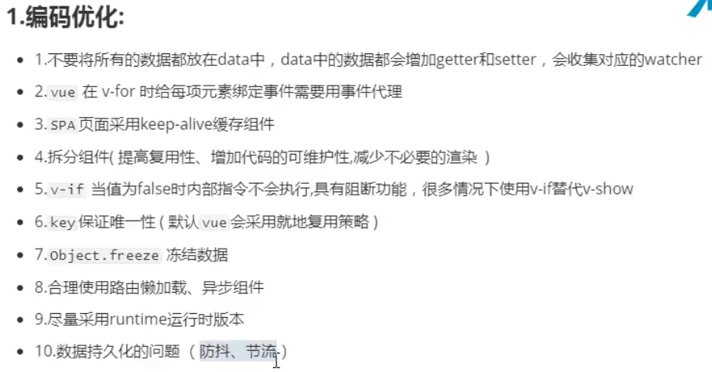 

 

### 22、vue导航守卫有哪些

全局守卫   router.js文件里

- `router.beforeEach` 全局前置守卫（有next参数）

- `router.beforeResolve `全局解析守卫（有next参数）

- `router.afterEach `全局后置钩子

路由独享守卫   单个路由对象里使用

- `beforeEnter`

组件内守卫

- `beforeRouteEnter`（有next参数，next函数的参数传入实例vm）

- `beforeRouteUpdate`
- `beforeRouteLeave`

##### 完整的导航解析流程

1. 导航被触发。
2. 在失活的组件里调用 `beforeRouteLeave` 守卫。
3. 调用全局的 `beforeEach` 守卫。
4. 在重用的组件里调用 `beforeRouteUpdate` 守卫(2.2+)。
5. 在路由配置里调用 `beforeEnter`。
6. 解析异步路由组件。
7. 在被激活的组件里调用 `beforeRouteEnter`。
8. 调用全局的 `beforeResolve` 守卫(2.5+)。
9. 导航被确认。
10. 调用全局的 `afterEach` 钩子。
11. 触发 DOM 更新。
12. 调用 `beforeRouteEnter` 守卫中传给 `next` 的回调函数，创建好的组件实例会作为回调函数的参数传入。

### 23、$nextTick

this.$nextTick(()=>{})里面的回调函数会在vue异步渲染完成之后执行

在数据变化后要执行的某个操作，而这个操作需要使用`随数据改变而改变的DOM结构的时候`，这个操作都应该放进`Vue.nextTick()`的回调函数中。

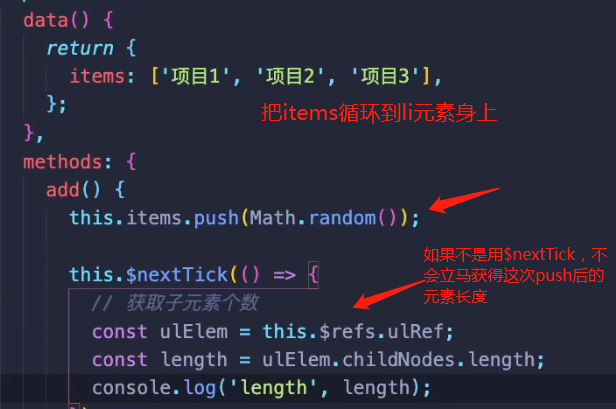 

### 24、子组件为何不可以修改父组件传递过来的prop

prop是`单向数据流`，易于检测数据的流动，如果出错了可以迅速的定位到错误发生的位置

如果修改了，vue是如何监控到属性的修改并给出警告的：

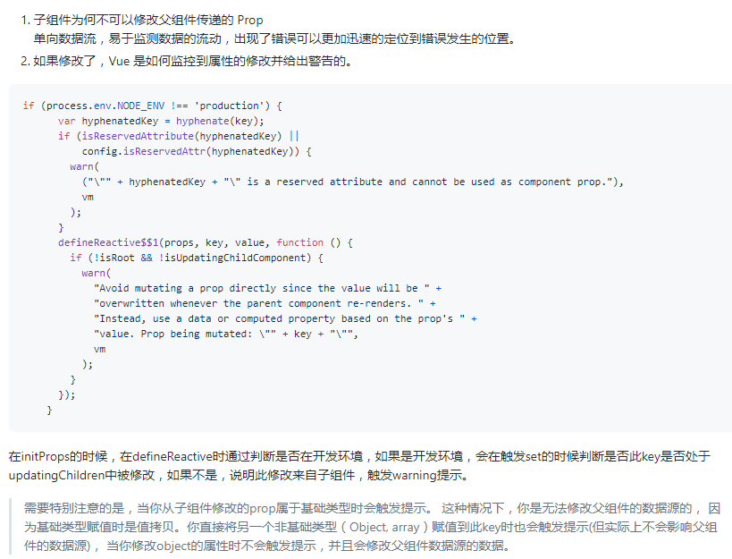 


注：当你通过prop修改的基础类型的数据时，因为他是`值拷贝`会给出警告，此时是无法修改父组件数据源的,但是修改引用类型的数据时，不会给出警告，并且会直接修改数据

### 25、$refs只会在组件渲染完成之后生效,并且不是响应式的

$refs：访问子组件实例、子元素

有时候可能仍然需要通过js直接来访问子组件，为达到这个目的，可以通过 `ref` 这个 attribute 为子组件赋予一个 ID 引用

当 `ref` 和 `v-for` 一起使用的时候，你得到的 ref 将会是一个包含了对应数据源的这些子组件的数组。

> **`$refs` 只会在组件渲染完成之后生效，并且它们不是响应式的。这仅作为一个用于直接操作子组件的“逃生舱”——你应该避免在模板或计算属性中访问 `$refs`。**

### 26、访问子组件实例、访问父组件实例

访问子组件实例：`$refs`

访问父级组件方法：1、`$parent`

> 在绝大多数情况下，触达父级组件会使得你的应用更难调试和理解，尤其是当你变更了父级组件的数据的时候。当我们稍后回看那个组件的时候，很难找出那个变更是从哪里发起的。

​								2、`provide、inject（注入依赖）`

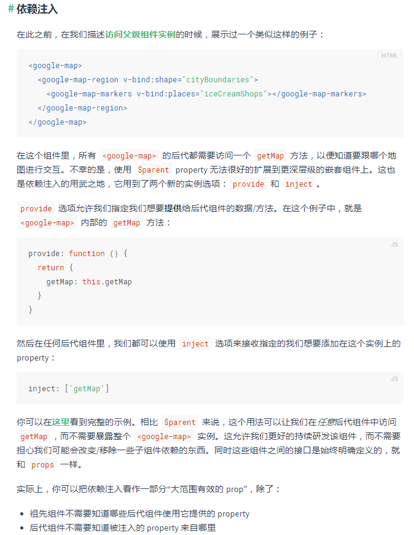 

依赖注入是有负面影响的，将你应用程序中的组件与它们当前的组织方式耦合起来，使重构变得更加困难。并且所提供的property是`非响应式的`


### 27、事件修饰符

`.stop`阻止事件冒泡

```html
<div @click="outerClick">
    外面的
	<div @click.stop="innerClick">里面的</div>
</div>
```

`.capture`元素发生冒泡时，先触发带有该修饰符的元素

放在内部元素就先触发里面的再外面的，放在外部元素就先触发外面的再里面的

```html
<div @click="outerClick">
    外面的
    <div @click.capture="innerClick">里面的</div>
</div>
```

`.self`跳过冒泡事件的捕获事件，元素本身触发事件才执行函数

点击子元素不能冒泡触发父元素事件，而是只有点击父元素才会触发父元素事件

```html
<div @click.self="outerClick">
    外面的
    <div @click="innerClick">里面的</div>
</div>
```

`.prevent`阻止默认行为，比如a标签的跳转

```html
<a @click.prevent="aLinkClick" href="www.jsplusplus.com">点击</a>
阻止默认行为还可以在事件内部执行一个方法
e.preventDefault()
```

`.once`事件只能被触发一次，比如点击事件只能执行一次

`.passive`增加滚动事件性能，使用@scroll事件时加上可以增加滚动性能

> 事件修饰符可以串联使用：.stop.prevent

`.nativate`监听组件根元素的原生事件


`.left`鼠标左键点击

`.right`鼠标右键点击

`.middle`鼠标中键点击

### 28、v-if和v-show

v-if是真正的条件渲染，切换过程中组件销毁和重建，是惰性的，页面刚加载时为假，则不会渲染，直到第一次变为真时才会渲染

v-show不管初始条件是什么都会被渲染，只是进行了css中display的切换

如果切换非常频繁，使用v-show更好，不会频繁的销毁和创建，如果使用不频繁，条件不太可能改变就是用v-if

### 29、vue-loader是什么，有什么用

vue-loader是 .vue文件的加载器，（就和css-loader一样加载css文件）

作用：可以在js中写es6的语法，在css中使用sass、less，template可以加载jade等

### 30、说一说vue的指令

v-if：根据表达式的值的真假条件渲染元素，在切换时元素及它的数据绑定/组件被销毁并重建。
v-show：根据表达式之真假值，切换元素的display CSS 属性。 可以控制元素的显示隐藏通过display none
v-for：循环指令，基于一个数组或对象渲染一个列表，Vue 2.0 以上必须需配合key值使用。绑定一个 标签 循环一个数据源 数组 表格 数字 字符串
v-bind：动态地绑定一个或多个特性，或一个组件prop到表达式。 属性后面跟的是固定字符串 作用：属性绑定可以让属性后面 跟变量或者表达式
v-on：用于监听指定元素的DOM事件，比如点击事件。绑定事件监听器。 事件名=‘事件处理函数’ 事件名和原生JS一样
v-model：实现表单输入和应用状态之间的双向绑定。 相当于事件绑定v-on和属性绑定v-bind的综合（集合体）
v-pre：**跳过这个元素和它的子元素的编译过程**。可以用来显示原始Mustache标签。跳过大量没有指令的节点会加快编译。**提高性能**

 v-pre

v-once：只渲染元素和组件一次，随后的重新渲染，元素/组件及其所有的子节点将**被视为静态内容**并跳过(数据是第一次的数据，不再更新)。这可以用于**优化更新性能**。

v-text：等价于直接使用{{message}}模板

v-html

### 31说一下优化首屏加载慢或白屏的问题

1、使用路由懒加载

2、开启Gzip压缩  production：true；

3、使用服务端渲染ssr

# vue2不支持但是vue3支持

vue2中不允许使用数组下标更改数组元素、以及this.obj.newProp=1这种方式往对象中添加新属性，但是vue3可以

```js
this.arr[0]='aaa'
this.obj.newProp='bbb'
```


# axios底层

createInstance根据默认配置创建一个axios对象，

所有的请求都是调用Axios.prototype.request方法，将Axios.prototype.request的内部this绑定到新建的axios对象上,从而形成一个axios实例 

utils.merge将配置项合并，

adapter适配器，判断是node环境还是浏览器环境

# vue相关原理

### props传值原理

```html
<child-node :data="arr"></child-node>
```

父组件中使用子组件的这个模板会被解析成抽象语法树ast，再编译成模板渲染函数，把模板渲染成虚拟节点vnode，

属性都放在虚拟节点实例对象的propsData中，会把**虚拟节点上的propsData定义到当前实例（vm.$options）里面的propsData中**，当组件初始化的时候，就可以拿到vm.$options.propsData用户传入的数据，而propsOptions里面是接收的对象（就是props:{a:String,...}），遍历propsOptions：将用户在子组件中定义的props和传入的属性进行校验。校验之后拿到key和value使用defineReactive方法定义到vm. _props上，然后把 vm. _props定义到实例上，就可以通过this.aaa来拿到数据了

如果是根元素，属性需要定义成响应式的，其他的：数据从父组件传入子组件本身就是响应式的

src/core/vdom/create-component.js

```js
  // return a placeholder vnode
  const name = Ctor.options.name || tag
  const vnode = new VNode(
    `vue-component-${Ctor.cid}${name ? `-${name}` : ''}`,
    data, undefined, undefined, undefined, context,
    { Ctor, propsData, listeners, tag, children },
    asyncFactory
  )
```

core/instance/state.js

```js
function initProps (vm: Component, propsOptions: Object) {
  const propsData = vm.$options.propsData || {}
  const props = vm._props = {}
  // cache prop keys so that future props updates can iterate using Array
  // instead of dynamic object key enumeration.
  const keys = vm.$options._propKeys = []
  const isRoot = !vm.$parent
  // root instance props should be converted
  if (!isRoot) {
    toggleObserving(false)
  }
    //校验
  for (const key in propsOptions) {
    keys.push(key)
    const value = validateProp(key, propsOptions, propsData, vm)
    /* istanbul ignore else */
    if (process.env.NODE_ENV !== 'production') {
      const hyphenatedKey = hyphenate(key)
      if (isReservedAttribute(hyphenatedKey) ||
          config.isReservedAttr(hyphenatedKey)) {
        warn(
          `"${hyphenatedKey}" is a reserved attribute and cannot be used as component prop.`,
          vm
        )
      }
      defineReactive(props, key, value, () => {
        if (!isRoot && !isUpdatingChildComponent) {
          warn(
            `Avoid mutating a prop directly since the value will be ` +
            `overwritten whenever the parent component re-renders. ` +
            `Instead, use a data or computed property based on the prop's ` +
            `value. Prop being mutated: "${key}"`,
            vm
          )
        }
      })
    } else {
      defineReactive(props, key, value)
    }
    // static props are already proxied on the component's prototype
    // during Vue.extend(). We only need to proxy props defined at
    // instantiation here.
    if (!(key in vm)) {
      proxy(vm, `_props`, key)
    }
  }
  toggleObserving(true)
}
```

